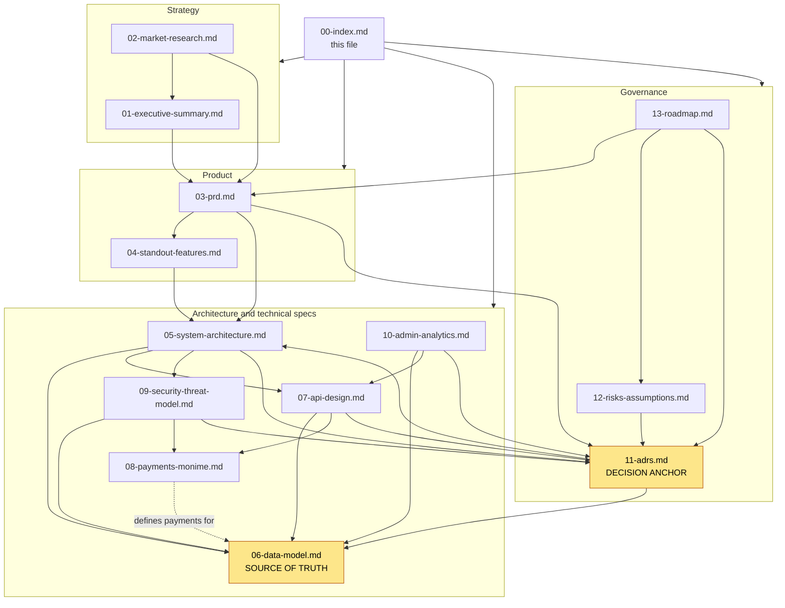

# Borteh Sprays 001 — Planning Set Index & Reading Map

> The front door to the research-and-design package: what each document is, how they depend on each other, the Monime integration unknowns to resolve before the final payment phase, and exactly what we need from the owner to start building.
> Part of the Borteh Sprays 001 planning set. See 00-index.md for the full set.

---

## How to read this set

This is a **research-and-design package only** — no production code. Pseudocode, schema/DDL sketches, interface definitions, and mermaid diagrams are deliverables; full implementations are deliberately out of scope for this phase. Every market or quantitative claim is labeled with a confidence level (High / Medium / Low) and the words "assumption to verify" where it is not a hard, citable fact. Anything dependent on undocumented Monime behaviour is flagged **BLOCKED ON MONIME DOCS**.

Borteh Sprays 001 is a perfume retailer in Sierra Leone selling **both** across a physical counter **and** online with delivery. We are designing a mobile app (React Native + Expo), a Supabase backend, and a Next.js web admin (that doubles as a lightweight in-store POS) so **Mr. Borteh** can run and grow the shop and **Aminata** can browse and buy online for delivery by **Saidu**, the shop's own rider.

**New here?** Read in this order: `01-executive-summary.md` (the bet) → `03-prd.md` (what we build) → `05-system-architecture.md` (how it fits together) → `06-data-model.md` (the source-of-truth schema) → `11-adrs.md` (why each major decision was made). Everything else hangs off those five.

### Locked constraints (treat as non-negotiable; restated here so no document drifts)

| Constraint | What it means in practice |
|---|---|
| **Supabase is the ONLY committed paid service** | Postgres + Auth + Storage + Edge Functions + Realtime + RLS. Everything else (Vercel admin hosting, dashboards, map tiles, etc.) must run on a free tier or be deferred. Cost-frugality is a hard design driver. |
| **Own dispatch riders** | We build an in-house rider role, manual/assisted assignment, and delivery zones with **indicative (guide) fees confirmed per order**. The rider flow is **simple order/delivery status updates — no live GPS tracking**. **Not** third-party couriers. |
| **~3–4 months to a STANDARD v1** | v1 (not a thin MVP) includes delivery, analytics, restock notifications, wishlist, and reviews. A thin-slice MVP proves the core loop first. |
| **Greenfield** | No existing POS, inventory, or website. Supabase Postgres is the single source of truth for **both** in-store and online stock from day one — a **single store** with an **unlimited/scalable catalog**. |

Operating reality we design **defensively** for: intermittent 2G/3G and expensive data (online-first with light read caching per ADR-003, **not** offline-first sync), low-to-mid-range Android, mobile money (Orange/Africell) plus first-class **cash/COD** — all via **Monime**, **phone + password** identity (**no SMS OTP**), **no paid messaging APIs** (in-app notifications + one-tap Call/WhatsApp click-to-chat deep links from the admin; optional in-app chat in v1.5), weak street addressing (landmarks + GPS pins + zones), a developing online-trust environment, and an English-language UI with Leones (SLE) currency formatting.

---

## Table of contents (01 … 13)

| # | Document | What it gives you |
|---|---|---|
| 01 | [01-executive-summary.md](01-executive-summary.md) | The one-page strategic framing — the problem, the four personas, the per-persona value proposition, "the bet", and instrumented 6- and 12-month success signals (every target labeled assumption-to-verify). |
| 02 | [02-market-research.md](02-market-research.md) | Qualitative Sierra Leone e-commerce + mobile-money market brief (no invented statistics): 16 confidence-labeled assumptions, competitor archetypes with patterns to adopt/reject, and a risk + validation plan. |
| 03 | [03-prd.md](03-prd.md) | The Product Requirements Document — expanded personas, 60+ user stories with Gherkin criteria across 13 epics, a MoSCoW MVP/v1/Later split, functional + non-functional requirements, out-of-scope, and the KPI tree. |
| 04 | [04-standout-features.md](04-standout-features.md) | Prioritized stand-out feature set — 12 candidates ranked by SL-fit/effort/risk with an explicit BUILD / BUILD-LATER / SOFT-VERSION / DEFER verdict and phase for each. |
| 05 | [05-system-architecture.md](05-system-architecture.md) | The system architecture — component diagram, the PostgREST-vs-EdgeFunction-vs-client trust boundary, the online-first read-caching model (ADR-003, replacing the earlier offline-first SQLite mirror + sync + outbox), the oversell-prevention model, in-app notification fan-out (no paid SMS/WhatsApp APIs), and the cost/scalability posture. |
| 06 | [06-data-model.md](06-data-model.md) | **The source-of-truth data model.** Master + domain ERDs, state machines, and Postgres DDL-style sketches for all canonical entities. Money is integer minor units in SLE. All other docs MUST use these names. |
| 07 | [07-api-design.md](07-api-design.md) | The API contract — the PostgREST/Edge-Function/RPC split, an endpoint catalog with request/response sketches (phone + password auth, catalog browse, cart, oversell-safe checkout, Monime init, raw-body HMAC webhook), error envelope, idempotency, keyset pagination, and versioning. |
| 08 | [08-payments-monime.md](08-payments-monime.md) | The deep Monime payment design — hosted Checkout Sessions, raw-body HMAC webhook verification, intent matching, and reconciliation. Cross-referenced by every other document. |
| 09 | [09-security-threat-model.md](09-security-threat-model.md) | Security, privacy & threat model — full STRIDE across every surface, password-auth and account-recovery hardening, secrets + two-secret webhook rotation, PII minimization, payment-data handling, RBAC-via-RLS, and SL legal items flagged for counsel. |
| 10 | [10-admin-analytics.md](10-admin-analytics.md) | The Next.js owner admin (catalog/inventory CRUD, POS-lite, order/fulfillment, own-rider dispatch, restock triggers, one-tap Call/WhatsApp click-to-chat customer contact) plus the built-not-bought analytics pipeline (AnalyticsEvent → materialized views → free dashboard) and KPI traceability. |
| 11 | [11-adrs.md](11-adrs.md) | The Architecture Decision Records ADR-001 … ADR-013 — each rendered in full template with genuine option trade-offs (incl. ADR-012 owner-configurable loyalty/promo and ADR-013 delivery fee as a guide; ADR-004 and ADR-007 rewritten). Every major decision elsewhere cites an ADR number instead of re-arguing it. |
| 12 | [12-risks-assumptions.md](12-risks-assumptions.md) | The living risk/assumption/open-question register — 51 IDed items triaged into "MUST RESOLVE BEFORE BUILD" gates vs "RESOLVE DURING BUILD", with consolidated Monime-blocked, assumptions-to-verify, and owner-input lists. |
| 13 | [13-roadmap.md](13-roadmap.md) | The master phased plan — Sprint 0 → thin-slice MVP → v1 → Growth — with milestones M0–M14, gate exit-criteria, a master gantt, and the build-readiness entry gate. The 01 horizon and 04 gantt defer to this schedule. |

---

## Cross-reference map

Every document anchors on two canonical sources — **06-data-model.md** (entity names, schema, money rules) and **11-adrs.md** (the locked decisions). The graph below shows the principal dependency flow by layer rather than all ~80 sibling links; in practice every spec doc also reads back to 06 and 11.

Reading guide for the arrows: `A --> B` means "A is built on / cites B". The two amber nodes (06, 11) are the canonical anchors everything else reads back to. Node 08 (payments) is referenced by all twelve other documents and is now complete on disk.

---

## Consolidated "BLOCKED ON MONIME DOCS" register

Aggregated and de-duplicated from every document. These are the integration unknowns that must be resolved with Monime (docs/support) or by ring-fenced live-mode testing before payments can be trusted in production. **None of these block the earlier build phases** — the browse → order → cash/COD → deliver core loop ships without them; they gate only the **final** online-payment phase (bolted on behind the `PaymentProvider` abstraction, ADR-006). Tracked in `12-risks-assumptions.md` (PAY-01…PAY-09) and detailed in `08-payments-monime.md`.

| ID | Blocked item | Why it matters / current workaround |
|---|---|---|
| M-1 | **No real sandbox** — test tokens 401 on `/v1/*` | Cannot smoke-test checkout/webhook without live mode. Validate in live mode with tiny, ring-fenced real-money transactions under an agreed test + reconciliation protocol. Gates the ≥90% checkout-reconciliation target. |
| M-2 | **No refund API as of 2026-05** | Refunds are done **manually in the Monime dashboard**, then recorded in our `Refund` table. Plan manual reconciliation; the admin "refund" action is a workflow aid, not an API call. |
| M-3 | **No confirmed refund/chargeback/dispute webhook** | We cannot auto-react to refunds/chargebacks; cancellation/refund automation and refund/chargeback analytics depend on manual entry and may lag. |
| M-4 | **Idempotency-Key TTL assumed ~24h** | Confirm. This window sets the dual-secret webhook-rotation drain time and the `payment_intent.idempotency_key` reuse window. |
| M-5 | **Token scopes are per-action** | A token may POST `/v1/checkout-sessions` yet 401 on GET. Confirm the minimal scope set needed for checkout-session create + status read + webhook. |
| M-6 | **Webhooks do not follow redirects** | The registered webhook URL must be the **exact canonical Edge Function URL** — no redirecting wrapper. |
| M-7 | **`checkout_session.completed` signing parity** | Unconfirmed whether it is signed with the same HMAC-SHA256 (underscore-separator) scheme as `payment.*` events. Canon treats it as the same success transition; verify the signature scheme. |
| M-8 | **Which events are signed + secret-rotation cadence** | Confirm the CURRENT/PREVIOUS two-secret rotation procedure and which event types carry a signature. |
| M-9 | **Diaspora / international card acceptance** on hosted Checkout | Needed for the Growth gifting flow; unconfirmed. |
| M-10 | **No confirmed payout/disbursement primitive** | Needed for reseller-agent commission payouts (Growth); unconfirmed. |
| M-11 | **No confirmed installment/recurring primitive** | Needed for layaway / pay-over-time (Growth); unconfirmed. |

Pinned facts we DO rely on (not blocked): `api.monime.io`; `Monime-Version: caph.2025-08-23`; required headers incl. `Idempotency-Key` on POST checkout-sessions; response `result.id` (scs- id) stored as `provider_intent_id` and `result.redirectUrl` opened in an in-app browser; SLE minor units; signature `t=<unix>,v1=<base64>` verified as `HMAC-SHA256(secret, t + "_" + raw_body)` (underscore, **not** Stripe's period) with a +300s/−60s replay window over the **raw** body; act only on `payment.completed` / `payment.processing_completed` (and `checkout_session.completed`); dedup on `event.id`; amount + currency re-checked before a status-guarded flip.

---

## Cross-document inconsistencies (resolved 2026-06-16)

The cross-document inconsistencies spotted during the first consistency pass have all been reconciled. Kept here as a resolution log rather than deleted, so the audit trail survives.

1. **`08-payments-monime.md` written — RESOLVED (2026-06-16).** The document now exists and is complete: the deep Monime payment design (hosted Checkout Sessions, raw-body HMAC webhook, intent matching, reconciliation) lives there and is cross-referenced by the rest of the set. The Monime details are no longer scattered across 06/07/09.
2. **`popularity_score` — RESOLVED (2026-06-16).** Reconciled between 06 and 07 so the catalog-browse keyset sort key and the `product` table / `product_browse` view agree.
3. **`order.status` states — RESOLVED (2026-06-16).** 06 and 07 now agree on the order-status enum (including the explicit `expired` vs `cancelled` distinction) and where failed/returned delivery is tracked at the `delivery_job` level.
4. **Monime event naming — RESOLVED (2026-06-16).** 05/06/07 now use the canonical Monime event names consistently (`payment.processing_started` / `payment.processing_completed`, etc.); the non-canonical `payment.processing` reference is gone.
5. **Realtime availability mechanism — RESOLVED (2026-06-16).** 06 no longer pushes a view over Postgres Changes (which would leak `qty_on_hand` / `qty_reserved`); it adopts a server-authored availability signal so only a `{variant_id, band}` payload is public.
6. **Ledger reconciliation parity — RESOLVED (2026-06-16).** 05 and 06 now share the same ledger end state and confirm-step rows; a single consistency pass confirmed the invariants match.
7. **Cosmetic, doc-set-wide — RESOLVED (2026-06-16).** Mermaid labels use ` ` (no literal `\n`), the stray leading blank line before `11-adrs.md`'s H1 is removed, and 05 §5.2's lock-read pseudocode uses `inventory_item` casing.

---

## What we need from you (the owner)

This is the checklist that unblocks the build. Items marked **CRITICAL PATH** sit on the gate to v1 and have long external lead times — start them in Sprint 0. Full detail and IDs live in `12-risks-assumptions.md` ("MUST RESOLVE BEFORE BUILD") and `13-roadmap.md`.

### A. Decisions and accounts that gate the build

- [ ] **Password-recovery approach** — **CRITICAL PATH** (gates the rewritten ADR-004). Auth is **phone + password (no SMS OTP)**, so confirm the recovery flow: **admin-assisted reset** as the baseline, plus **optional email-based reset** if you want it. Also set login/password attempt rate limits.
- [ ] **In-app messaging scope** — decide whether **in-app customer↔shop chat** ships in **v1** or is **deferred to v1.5**. Either way, comms use **no paid APIs**: in-app notifications plus one-tap Call/WhatsApp click-to-chat deep links from the admin (rewritten ADR-007).
- [ ] **Catalog import** — the initial product/variant export and rough **image volume**, so we can size the online-first read cache and image-loading strategy (ADR-003). The catalog is **unlimited/scalable**, so there is no SKU cap to confirm. Also confirm products have usable **barcodes** or that we mint internal ones.
- [ ] **Legal/counsel contact** — engage Sierra Leone counsel for the data-protection, consumer-protection, and payments/KYC/AML posture. We flag these throughout; we do **not** assert legal specifics as fact.

### B. Delivery, payments, and cash policy

- [ ] **Delivery-zone ESTIMATES + ETAs** — named regions, an **estimated `fee_minor` per zone** (a **guide only, not binding** — the final fee is confirmed per order, ADR-013), **`eta_text`**, and **which zones allow cash/COD**. Seeds `DeliveryZone` and the checkout fee guidance; gates the dispatch board.
- [ ] **Cash/COD policy** — cash is a **first-class payment option (settled via Monime)**; confirm the **maximum cash/COD value per order (and per zone)** for the fraud rule, plus how riders reconcile collected cash (`cod_collected_minor`). Confirm the fraud posture is "raise friction + owner review" rather than hard auto-ban.
- [ ] **Reservation TTL** — confirm the reservation hold window (proposed **15 min** for mobile money; cash/COD must **not** share that TTL).
- [ ] **Revenue-recognition basis** — recognize Monime revenue at **confirmed** and cash/COD at **delivered** (or your preference) for the daily-revenue report.
- [ ] **Rider roster** — riders, schedules, and covered zones, to validate own-rider dispatch viability (simple status updates, no live tracking).
- [ ] **Monime credentials + IDs + secret** — **needed only for the FINAL build phase; not an early blocker.** Monime online payment is the **last** thing we wire up, bolted onto the existing `PaymentProvider` abstraction (ADR-006) after the cash/COD core loop already ships. When we reach that phase, provide the API **token(s)** (note scopes are per-action), the **`Monime-Space-Id`**, the **financial account id(s)**, and the **webhook signing secret(s)** (CURRENT and PREVIOUS for rotation), and set the **test-spend cap** for live-mode validation since there is no sandbox (see M-1). Nothing earlier in the build depends on these.

### C. Catalog, store ops, and growth levers

- [ ] **Branding + assets** — logo, product photography, and any colour/typography preferences.
- [ ] **Low-stock thresholds** — per variant/location (or accept the default of 3); and whether **unit cost** is recorded at goods-receiving to enable a margin view.
- [ ] **POS-lite + admin access** — the **counter device** for in-store sales and reliable **owner desktop access** for the admin; plus in-store **tender labels** and whether in-person mobile money ever routes through Monime (default: no).
- [ ] **Staff roster + roles** — to seed admin RBAC (owner vs staff vs rider privileges, including the split for destructive actions).
- [ ] **Loyalty / promo parameters** — loyalty and promotions are **owner-configurable** (ADR-012): set **spend thresholds**, **discount values**, **points rate / value / expiry**, **card tiers**, referral rewards, and caps. These are configuration, not code, so they can change post-launch.
- [ ] **Returns / cancellation policy** — the customer-facing policy that drives cancellations and the manual-refund flow (since Monime has no refund API).
- [ ] **Baseline numbers to calibrate KPIs** — current **monthly counter sales volume**, top SKUs, and any repeat-customer sense, so the 6- and 12-month targets in `01-executive-summary.md` move from Low-confidence assumptions to real thresholds.
- [ ] **Stand-out feature inputs** (optional, for v1/Growth) — decant program (scents, vial sizes, pricing, willingness to operate decanting); and appetite to pilot reseller agents / layaway before any build.

> Nothing above commits new spend except your explicit choices: the only committed paid service remains **Supabase**. There are **no paid messaging APIs** — comms are in-app notifications plus free one-tap Call/WhatsApp click-to-chat deep links. A paid Supabase tier (and Monime transaction fees) are the expected paid-spend as volume grows.
