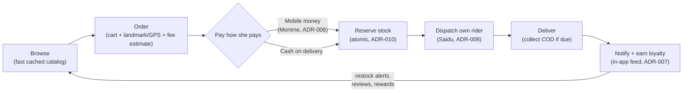
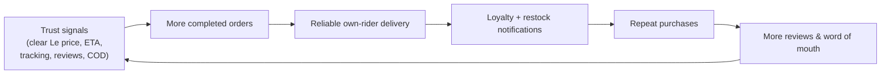
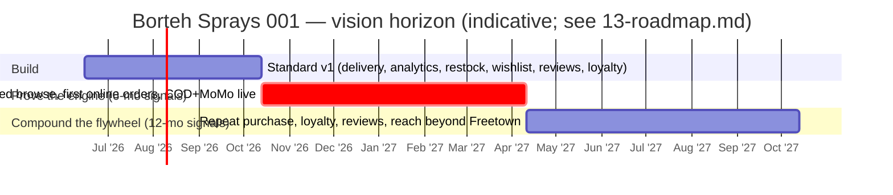

# Borteh Sprays 001 — Executive Summary & Vision

> One-page strategic framing: the problem, who we serve, the value proposition, the core bet, and what success looks like at 6 and 12 months.
> Part of the Borteh Sprays 001 planning set. See 00-index.md for the full set.

---

## The problem

Borteh Sprays is a Freetown perfume retailer that today sells **only** across a physical counter. Growth is capped by who can physically walk in. There is **no greenfield POS, no inventory system, and no online channel** (see Project canon), so:

- **Stock is invisible.** In-store sales are not reconciled against any digital ledger, so the owner cannot see what is selling, what is low, or what is dead — and cannot promise availability to a remote buyer.
- **The market cannot reach the shop.** Customers outside walking distance, or who shop after hours, simply do not buy. Discovery, browsing, and "is it in stock?" all require a physical or phone-call round trip.
- **Selling online in Sierra Leone is genuinely hard.** Connectivity is intermittent and 2G/3G outside Freetown; formal addressing is weak; online-shopping **trust is still developing**; and payment is dominated by mobile money (Orange Money, Africell Money) plus an irreducible need for **cash-on-delivery (COD)**. Off-the-shelf e-commerce assumes none of this. (See `02-market-research.md`.)
- **Delivery is unsolved.** There is no third-party courier we can lean on; the store must dispatch its **own riders** against landmark-and-pin addresses, not street numbers.

The gap is not "build a generic web store." It is "build a **trust-first, data-frugal, mobile-money-and-COD, own-rider** commerce system tuned for Sierra Leone, on a near-zero budget, with inventory truth shared between the counter and the internet from day one."

## Target users

Every requirement in this planning set traces to one of these personas (canonical names; see Personas in canon and `03-prd.md`).

| Persona | Who | What they need from us | Primary surface |
| --- | --- | --- | --- |
| **Aminata** — Shopper | Low/mid Android, prepaid data, mobile-money wallet, prefers simple, clear English | Browse perfumes via a fast cached catalog, trust the price/ETA, pay by Orange/Africell **or COD**, track the order, get notified on restock | Mobile app (React Native + Expo, ADR-001) |
| **Mr. Borteh** — Owner/Admin | Runs the shop, not highly technical | One source of truth for inventory + orders + dispatch + sales analytics; sell in-store via the same system (admin doubles as POS-lite) | Next.js web admin (ADR-002) |
| **Saidu** — Dispatch Rider | Basic Android | A simple assigned-deliveries list: customer landmark/pin + phone, mark picked-up/delivered, **collect COD** | Mobile app, rider role (ADR-008) |
| **Staff / Shop Assistant** *(secondary)* | Counter staff | Record in-store sales and stock adjustments through the admin POS-lite | Next.js web admin |

## Value proposition

**For Aminata:** the easiest, most trustworthy way to buy genuine perfume in Sierra Leone — browse the full catalog even on a weak signal, see honest prices in **Le** and a delivery ETA up front, pay how she actually pays (**mobile money or COD**), and watch her order move from shop to door.

**For Mr. Borteh:** a single, cheap system that runs the **whole** business — counter sales, online orders, live stock that can't oversell, his own riders, and analytics that tell him what to restock — for the cost of **one** paid service (Supabase, ADR-002). The admin **is** his POS, so online and in-store inventory are one truth (ADR-010).

**For Saidu:** a phone screen that just tells him where to go, who to call, and how much cash to collect.

The differentiators we are deliberately leaning on (detailed in `04-standout-features.md`): **fast cached catalog / data-saver mode over an unlimited, scalable single-store catalog** (ADR-003), **cash (COD / pay-at-pickup) as a first-class payment rail** alongside Monime mobile money (ADR-006), **own-rider dispatch with landmark/GPS addressing** (ADR-008), **free in-app notifications (Supabase Realtime) plus one-tap call / WhatsApp click-to-chat** (ADR-007), and a **configurable, owner-editable loyalty programme** (ADR-012) as a retention flywheel. Sign-in is simple **phone-number + password** (no SMS/OTP cost).

### The core loop

## The bet

> **Our core strategic wager:** the winning move in Sierra Leonean retail commerce is **not** a slicker storefront — it is **collapsing trust and friction** for a market that does not yet trust online shopping, on infrastructure that fights us. We bet that an app which (a) stays usable on a weak signal (light read caching), (b) accepts the money people actually hold, (c) is delivered by the shop's **own** accountable riders, and (d) is honest about price and ETA, will convert hesitant first-time buyers into repeat buyers — and that we can build it for **one** committed cost (Supabase) inside 3–4 months.

What we are explicitly betting **against**, and why:

| We are NOT betting on | We ARE betting on | Anchored in |
| --- | --- | --- |
| Card payments / international gateways | Mobile money (Monime) **+ COD** as co-equal rails | ADR-006, ADR-009 |
| Always-on connectivity for browsing | Fast cached catalog browse (data-saver mode); writes require connectivity + retry | ADR-003 |
| Formal street addressing | Landmarks, GPS pins, phone confirmation, delivery-zone fee estimates (confirmed per order) | `06-data-model.md` |
| Third-party logistics | In-house dispatch on Supabase, own riders | ADR-008 |
| Paid SaaS sprawl | One paid service (Supabase); everything else free-tier or deferred | ADR-002 |
| A thin MVP | A **standard v1** incl. delivery, analytics, restock, wishlist, reviews, loyalty | `13-roadmap.md` |

If the bet is right, the **flywheel** compounds:

## What success looks like

All numeric targets below are **assumptions to verify** (Low–Medium confidence at this stage) — they are instrumentation goals to calibrate against real launch data, not promises. Signals are captured via the in-house `AnalyticsEvent` pipeline (ADR-008) and Supabase. See `12-risks-assumptions.md` and `10-admin-analytics.md`.

### 6 months (post-launch — "is the engine running?")

| Signal | Target | Confidence | Why it matters |
| --- | --- | --- | --- |
| Inventory truth | 100% of in-store **and** online sales flow through one Postgres ledger; counter staff use POS-lite daily | Medium — operational, in our control | Validates the single-source-of-truth bet (ADR-010) |
| Catalog usable from cache | ≥ 95% of app sessions can browse the catalog during a brief dropout after first load | Medium *(assumption to verify)* | Validates online-first (with light read caching) bet (ADR-003) |
| Online order share | ≥ 15% of total order **volume** originates online | Low *(assumption to verify)* | Proves the channel exists at all |
| Payment mix | COD and mobile money both in active use; **mobile-money share trending up** month over month | Low *(assumption to verify)* | Trust shifting from cash toward digital |
| Checkout success | ≥ 90% of paid checkouts reconcile cleanly against the Monime webhook (`08-payments-monime.md`) | Low *(assumption to verify; blocked on Monime live-mode validation)* | Payment plumbing is trustworthy |
| Delivery reliability | ≥ 90% of dispatched orders marked delivered within the quoted zone ETA | Low *(assumption to verify)* | Own-rider model actually delivers |
| Cost discipline | Total committed spend = **Supabase only**; all else on free tiers | High — design constraint, in our control | The frugality bet holds (ADR-002) |

### 12 months ("is the flywheel compounding?")

| Signal | Target | Confidence | Why it matters |
| --- | --- | --- | --- |
| Repeat-purchase rate | ≥ 30% of online customers place a 2nd+ order within the year | Low *(assumption to verify)* | Trust → retention; the core wager paid off |
| Online order share | ≥ 30% of order volume online | Low *(assumption to verify)* | Channel is now material to the business |
| Mobile-money share | Mobile money ≥ COD on online orders | Low *(assumption to verify)* | Digital-payment trust has crossed over |
| Loyalty engagement | ≥ 25% of repeat buyers are active in the `LoyaltyAccount` programme | Low *(assumption to verify)* | The retention flywheel is live |
| Restock conversion | ≥ 20% of `RestockSubscription` notifications convert to an order | Low *(assumption to verify)* | Demand capture on out-of-stock items works |
| Review coverage | ≥ 40% of delivered orders leave a verified-purchase `Review` | Low *(assumption to verify)* | Trust content is self-sustaining |
| Reach beyond Freetown | First sustained order flow from ≥ 1 zone outside central Freetown | Low *(assumption to verify)* | Data-frugal cached design unlocked the wider market |
| Performance budgets held | Cold start < 3s and first catalog payload < ~150 KB on 3G sustained on real low-end devices | Low *(assumption to verify; see perf budgets in canon)* | The lightweight bet survived contact with reality |

### Indicative horizon

## Open items that gate this vision

These are surfaced here only because they can move the targets above; they are owned in detail elsewhere.

- **Monime live-mode reality:** no real sandbox, **no refund API as of 2026-05** (manual dashboard refunds recorded in our `Refund` table), and unconfirmed refund/chargeback webhooks — **blocked on Monime docs/support** (see `08-payments-monime.md`).
- **Regulatory:** Sierra Leone data-protection, consumer, and payments/KYC posture — **flag to verify with counsel**, do not assert as fact (`09-security-threat-model.md`, `12-risks-assumptions.md`).
- **Owner inputs needed to set real targets:** current monthly counter volume and SKU count, delivery zones and fees, and acceptable COD-exposure cap per order. *(Owner.)*
