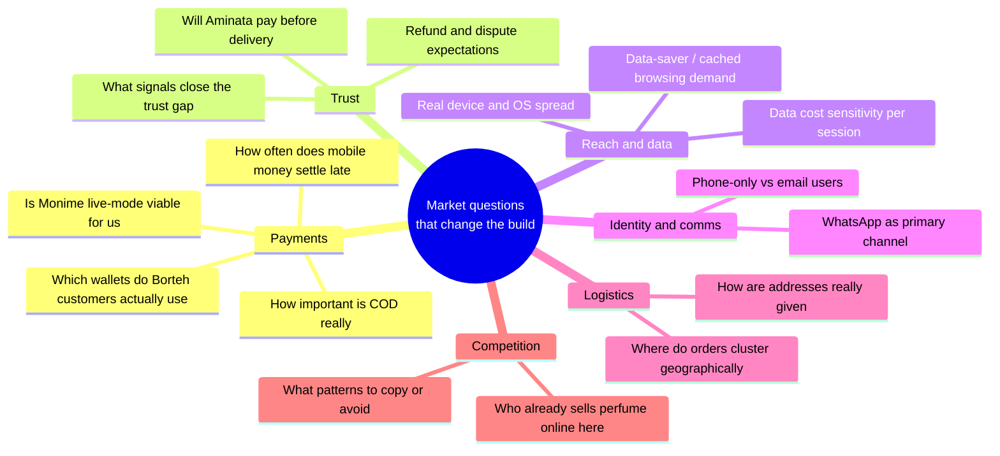
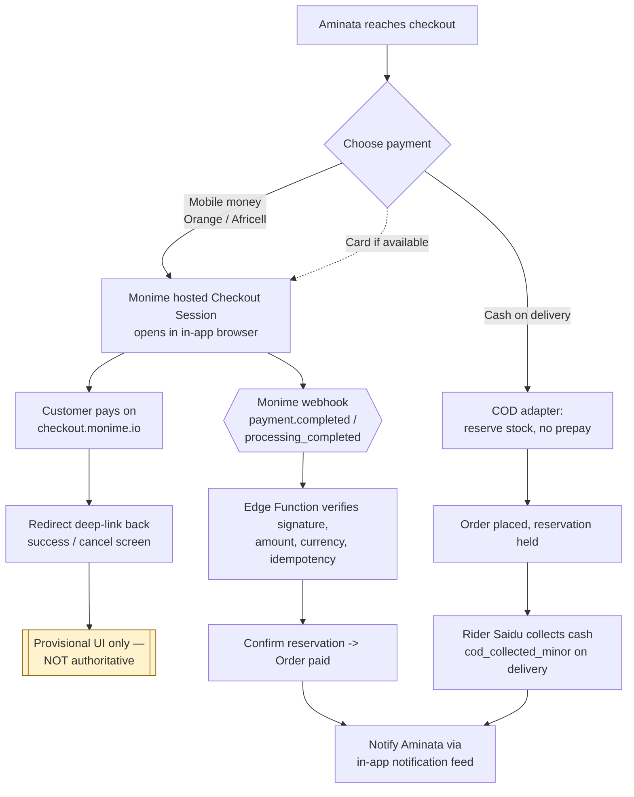
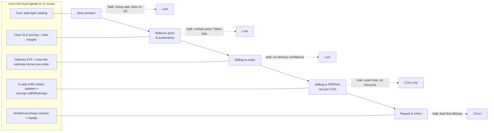
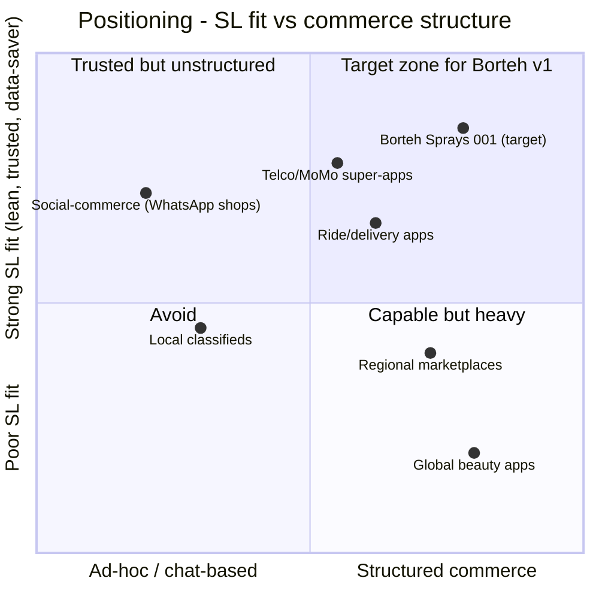
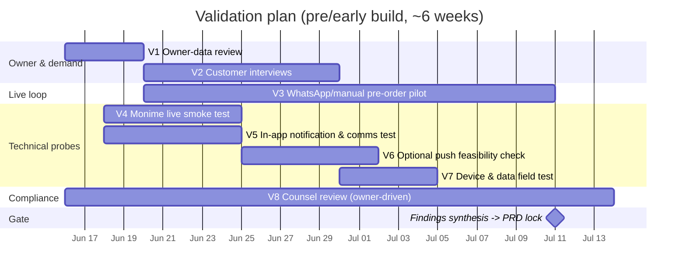
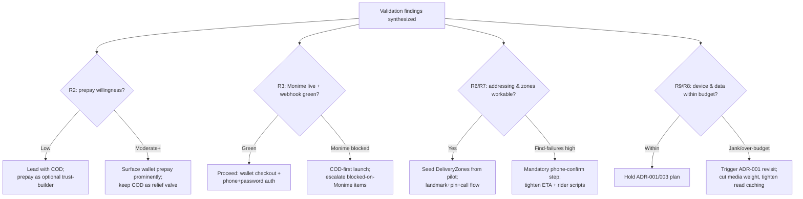

# 02 — Market & Competitive Research Brief

> One-line purpose: Establish the qualitative market reality, competitive patterns, and the concrete validation plan that the Borteh Sprays 001 product must be designed against — every quantitative claim labeled as an assumption to verify.

> Part of the Borteh Sprays 001 planning set. See 00-index.md for the full set.

---

## 0. How to read this document

This brief deliberately contains **no invented statistics**. Sierra Leone has thin, fast-moving, and unevenly-published market data, so fabricating numbers would be worse than useless — it would anchor design and budget decisions on fiction. Instead we describe **qualitative dynamics** (directional, defensible, repeatedly observed in West-African low-bandwidth commerce) and label every claim with a confidence level and, where relevant, the explicit phrase **"assumption to verify."**

Confidence legend (used throughout):

| Label | Meaning | How we treat it in design |
| --- | --- | --- |
| **High** | Hard, citable, or directly confirmed by the owner / by the locked canon constraints. | Design as fact. |
| **Medium** | Strong directional signal consistent with regional patterns and the owner's stated context, but not yet locally measured for Borteh's customers. | Design defensively; flag for the validation plan in §3. |
| **Low** | Plausible but speculative; could materially change the plan if wrong. | Do not build hard dependencies; validate before committing scope/budget. |

Personas referenced (see canon): **Aminata** (Shopper), **Mr. Borteh** (Owner/Admin), **Saidu** (Dispatch Rider), **Staff** (Shop Assistant). Decisions trace to ADRs in `11-adrs.md`. Risks feed `12-risks-assumptions.md`. Payment specifics live in `08-payments-monime.md`.

A note on method: this is a **desk + first-principles** brief. The whole point of §3 is that the Medium/Low items below must be replaced with locally-measured truth before launch. Treat this document as a set of hypotheses with a plan to test them, not as findings.

---

## 1. Scope & framing

We are designing for a **single-owner perfume retailer in Sierra Leone** selling both **in-store** and **online with own-rider delivery**, on a **minimal budget** (only committed paid service: Supabase — ADR-002), targeting a **standard v1 in ~3–4 months** (canon). The market questions that actually move the design are narrow and concrete:



Everything below serves those questions. We are not writing a country macro-report; we are writing the smallest market truth set that de-risks a perfume commerce app for Aminata and a back office for Mr. Borteh.

---

## 2. Section A — Sierra Leone e-commerce & mobile-money landscape

### 2.1 Landscape summary table (qualitative, confidence-labeled)

Each row is a **design driver**, not a citation. Numbers are intentionally absent. "assumption to verify" marks anything we must measure locally in §3.

| # | Dynamic | Qualitative claim (no invented stats) | Confidence | Status | Primary design implication | Traces to |
| --- | --- | --- | --- | --- | --- | --- |
| A1 | **Mobile-money dominance** | Mobile-money wallets (Orange Money, Africell Money) are the dominant non-cash way ordinary people hold and move value; bank-account-first behavior is the exception, not the norm. | Medium | assumption to verify | Payments are mobile-money-first via Monime; card is not a primary rail (ADR-006). | Aminata, ADR-006 |
| A2 | **Low card penetration** | Debit/credit card ownership and online-card-payment habits are thin; a card-first checkout would exclude most buyers. | Medium | assumption to verify | Do not gate checkout on cards; Monime hosted checkout exposes wallet rails; card is opportunistic only. | Aminata, ADR-006 |
| A3 | **Cash-on-delivery is structural, not legacy** | COD remains a primary, trusted method because it collapses the "pay a stranger before I hold the goods" risk; removing it would suppress conversion. | Medium-High | assumption to verify (mix %) | COD is a first-class payment path with a `CashOnDelivery` adapter (ADR-006); riders collect and reconcile `cod_collected_minor` (DeliveryJob). | Aminata, Saidu, ADR-006, ADR-010 |
| A4 | **Expensive, volatile per-MB data** | Mobile data is costly relative to incomes and bought in small bundles; users actively ration MB and notice heavy apps/sites. | High | confirmed (canon) | Data-frugal app: WebP, lazy thumbnails, keyset pagination, <~150 KB first catalog payload, <~1 MB browse session (canon budgets). | Aminata, ADR-001, ADR-003 |
| A5 | **Intermittent connectivity, 2G/3G outside Freetown** | Connectivity drops frequently and degrades to 2G/3G beyond Freetown; brief dropouts are common. | High | confirmed (canon) | Online-first with light read caching: TanStack Query in-memory cache plus a small read-only persisted cache of the last-loaded catalog so a brief dropout is not a blank screen; writes require connectivity with clear Retry UI (never queued), server always authoritative (ADR-003). | Aminata, ADR-003 |
| A6 | **Low-to-mid-range Android majority** | The installed base skews low/mid Android with constrained RAM/storage and older/smaller screens; iOS is a supported minority. | High | confirmed (canon) | Lean bundle (<~25 MB per-ABI APK), Hermes, cold start <3s, memory discipline (canon, ADR-001). | Aminata, ADR-001 |
| A7 | **Phone-number identity, weak email** | Many users have a phone number but no routinely-used email; email-first signup creates friction and fake accounts. | High | confirmed (canon) | Phone + password auth (no SMS OTP); phone is the unique account ID; email optional for recovery (ADR-004). | Aminata, ADR-004 |
| A8 | **WhatsApp as the default channel** | WhatsApp is a primary way people discover, ask, negotiate, and confirm purchases — often the de-facto storefront for small sellers. | Medium-High | assumption to verify | Manual WhatsApp click-to-chat (wa.me) + one-tap call (tel:) from the admin order screen — no WhatsApp/Meta API, no SMS; customer updates via an in-app notification feed (ADR-007). Pilot uses WhatsApp (§3). | Aminata, Mr. Borteh, ADR-007 |
| A9 | **Weak formal street addressing** | Deliveries are located by landmark, descriptive directions, and phone calls rather than reliable street addresses. | High | confirmed (canon) | Order around `DeliveryLocation` (landmark_text, geo pin, contact_phone) + `DeliveryZone` fee estimate/ETA guidance (actual fee confirmed per order) + manual rider assignment (ADR-008). | Aminata, Saidu, ADR-008 |
| A10 | **Online-shopping trust gap** | Trust in paying online before receiving goods is still developing; fear of scams, non-delivery, and wrong/counterfeit items suppresses prepayment. | Medium-High | assumption to verify | Transparency stack: SLE pricing, delivery ETA, in-app order-status updates, easy one-tap call/WhatsApp contact, verified-purchase reviews, COD escape hatch (canon). | Aminata, ADR-006, ADR-007 |
| A11 | **Delayed / ambiguous payment confirmation** | Mobile-money confirmations can lag or arrive via USSD/SMS out-of-band; "instant success at redirect" is unreliable. | High | confirmed (canon + Monime mechanics) | Truth comes from the **webhook**, not the redirect; reconciliation sweep + status-guarded updates (ADR-006, ADR-011, `08-payments-monime.md`). | Aminata, Mr. Borteh, ADR-011 |
| A12 | **Leone redenomination & price legibility** | The Leone exists in old/new forms in living memory; mis-stated prices erode trust instantly. | Medium | assumption to verify (display conventions) | Always show "Le" / SLE clearly; store integer **minor units** (ADR-009); never floats. | Aminata, ADR-009 |
| A13 | **Plain-language legibility** | Dense or jargon-heavy English UX adds cognitive load; many shoppers are better served by simple, clear wording and legible screens. | Medium-High | assumption to verify (copy testing) | Clear simple-English copy + legible / icon-supported UI; market interviews run in plain English (§3). | Aminata, ADR-001 |
| A14 | **SMS is universal but too costly — so we avoid it** | Every phone receives SMS, but per-message cost plus uncertain cross-network deliverability from foreign gateways to SL telcos make it an expensive, unreliable transactional channel — and OTP volumes would only compound the cost. | High (reach) / Low (provider economics) | confirmed (v2 decision) | **No SMS anywhere**: auth is phone + password (no OTP), customer notifications go to an in-app feed (Supabase Realtime), and store-to-customer contact is one-tap call (tel:) / WhatsApp click-to-chat (wa.me) from the admin (ADR-004, ADR-007). | Aminata, ADR-004, ADR-007 |
| A15 | **Thin/fragmented formal e-commerce** | Dedicated perfume e-commerce with reliable delivery is sparse; much "online retail" is social-commerce (chat + manual logistics) rather than apps. | Medium | assumption to verify | Opportunity for a trustworthy, purpose-built experience; but expect to *educate* buyers, not just serve existing app-shopping habits. | Mr. Borteh, ADR-001 |
| A16 | **Regulatory: data / consumer / payments-KYC exist but specifics must be lawyered** | SL has data-protection, consumer, and payments/KYC considerations relevant to storing PII, taking payment, and marketing — but exact obligations are not for us to assert. | Medium (existence) / Low (specifics) | **verify with counsel** | Minimize PII, encrypt at rest (Supabase), consent for marketing, document retention; flag KYC expectations to Monime/counsel. | Mr. Borteh, ADR-002, `09-security-threat-model.md` |

> Authoring honesty: rows marked Medium/Low are **hypotheses**, not findings. They are good enough to design defensively around and are explicitly queued for validation in §3. Do not cite this table as evidence of a fact.

### 2.2 How the payment landscape shapes checkout

The dominant-rail picture (A1–A3, A11) forces a specific checkout posture: **wallet-first, COD-equal, card-optional, webhook-truth.**



Design takeaways (each ties to the landscape rows above):

- **Never treat the redirect as success** (A11) — `08-payments-monime.md` and ADR-011 make the webhook authoritative; the redirect screen is provisional UI only.
- **COD must be as frictionless as wallet pay** (A3, A10) — it is the trust escape hatch that unlocks first-time buyers; the rider/COD reconciliation flow (Saidu, ADR-010) is core, not edge.
- **Card is a quiet fallback, not a headline** (A2) — surfaced only where Monime offers it, never a precondition.

### 2.3 The trust gap as a conversion funnel

Trust (A10) is the single dynamic most likely to cap revenue. We model it as a leaky funnel and map each leak to a concrete, low-cost trust signal already in the canon scope.



**Implication:** the trust-building features are not "nice to have v2" — `04-standout-features.md` (loyalty, reviews) and the in-app status/notification flows are the funnel's load-bearing walls. The plan deliberately keeps COD as the relief valve so a trust failure at the "prepay" stage degrades to a sale, not a loss.

---

## 3. Section B — Comparable & competitor apps (categories & patterns)

> We describe **archetypes and patterns**, not fabricated app metrics. Naming a category and the lesson is defensible; inventing a competitor's download count or conversion rate is not, so we don't.

### 3.1 Competitor archetypes and what to learn

| Archetype | What it is (qualitative) | Pattern worth copying | Anti-pattern to avoid | Relevance to Borteh | Confidence |
| --- | --- | --- | --- | --- | --- |
| **Social-commerce sellers** (WhatsApp/Instagram/Facebook shops) | Individual sellers running storefronts inside chat apps; catalog = photos, checkout = conversation, logistics = manual. | Trust via direct human contact, photos, voice notes, personal negotiation; low-friction discovery. | No inventory truth, no tracking, doesn't scale, oversell, lost orders in chat scrollback. | This is Borteh's **real current competitor and the customers' current habit** (A8, A15). We must feel as personal but add structure. | Medium-High |
| **Regional general marketplaces** (pan-African horizontal retailers / aggregators) | Broad catalogs, app + web, COD-heavy, own or contracted logistics, returns desks. | COD normalization, order-tracking UX, ratings/reviews, clear delivery fees, returns build trust at scale. | Heavy apps, broad-but-shallow catalog, generic UX not tuned for a single brand's story or for 2G. | Borrow their **trust scaffolding** (tracking, reviews, COD) but stay lean and perfume-specialist. | Medium |
| **Ride-hail / on-demand delivery apps** (regional) | Map-based dispatch, driver app, live tracking, cash + wallet. | Driver/rider app simplicity, landmark/pin navigation, cash reconciliation flows (no live GPS tracking for us). | Full third-party logistics stack is overkill/over-budget for one shop's riders. | Directly informs **Saidu's rider app** and DeliveryJob status model (ADR-008) — copy the simplicity, not the platform. | Medium |
| **Mobile-money & telco super-apps** (Orange/Africell ecosystems, agent networks) | Wallets, bills, USSD + app, agent cash-in/out. | Users already trust *these* for money; piggyback by paying **into** them via Monime rather than reinventing a wallet. | Building our own wallet/escrow (cost, KYC, scope creep). | Confirms wallet-first checkout (A1) and that our job is to **accept** these rails cleanly (ADR-006), not compete with them. | Medium-High |
| **Local classifieds / listing apps** | Peer listings, contact-to-buy, no integrated payment. | Lightweight, data-light listing UX; landmark-based meetups. | No fulfillment, no trust layer, no inventory. | Reinforces that the gap is **trustworthy fulfillment + payment**, which is exactly our moat. | Low-Medium |
| **Global beauty/perfume retail apps** (aspirational reference, not local competitor) | Rich product storytelling: scent notes, concentration (EDT/EDP/Parfum), gender, layering, reviews. | Scent-note taxonomy, fragrance discovery/filtering, sampling, gifting — maps to our data model (ScentNote, ProductScentNote, concentration). | Their data-heavy media and always-online assumptions; do not import their weight. | Informs **catalog richness** (the perfume domain model) while we strip the bandwidth. | Medium |

### 3.2 Competitive positioning map

Two axes that matter here: **bandwidth/trust fit for the SL reality** (does it work on Aminata's phone and earn her trust) vs **commerce structure** (real inventory, payment, fulfillment vs ad-hoc chat).



> The map is an **analytical framing, not measured coordinates** (Low confidence on exact placement; Medium on relative ordering). The strategic read is stable regardless of exact dots: **no incumbent occupies "structured + strongly SL-fit" for fragrance.** Borteh's wedge is to be as trusted/personal as a WhatsApp seller (A8, A10) while having real inventory truth (ADR-010), real payment (ADR-006), and real own-rider fulfillment (ADR-008) — all kept lean enough for 2G/low-end Android (A4–A6).

### 3.3 Concrete patterns we adopt vs reject

| Pattern | Decision | Why | Trace |
| --- | --- | --- | --- |
| Conversational, human, personal contact on every order | **Adopt** | Matches the trusted social-commerce habit (A8) and closes the trust gap (A10). | ADR-007 |
| COD + in-app order-status updates + verified reviews as the trust trio | **Adopt** | The proven marketplace scaffolding that earns prepayment over time. | ADR-006, `04-standout-features.md` |
| Simple rider app (assigned list, pin/landmark, mark states, collect cash) | **Adopt** | Borrowed from ride/delivery UX; fits Saidu's basic Android. | ADR-008 |
| Pay into existing mobile-money rails via aggregator | **Adopt** | Leverage existing wallet trust; don't build a wallet. | ADR-006 |
| Building our own wallet / escrow / KYC stack | **Reject** | Cost, regulatory load (A16), out of budget and timeline. | ADR-002, ADR-006 |
| Heavy media-rich storefront ("always online") | **Reject** | Breaks A4–A6 data/device budgets. | ADR-001, ADR-003 |
| Third-party logistics platform | **Reject (build, don't buy)** | Over-budget; we run own riders. | ADR-008 |
| Card-first or email-first onboarding | **Reject** | Excludes the phone-and-wallet majority (A2, A7). | ADR-004 |

---

## 4. Section C — Key risks, unknowns & the validation plan

### 4.1 Risk & unknown register (what must be true)

These are the items where being wrong is expensive. Each gets a validation method in §4.2. Full risk treatment lives in `12-risks-assumptions.md`; this is the **market/demand** slice.

| ID | Unknown / risk | If we are wrong… | Confidence we're right today | Severity | Validation method (see §4.2) |
| --- | --- | --- | --- | --- | --- |
| R1 | **Payment mix** — wallet vs COD vs card split for *Borteh's* buyers (A1–A3). | Mis-prioritized checkout; wrong reconciliation/cash-handling load on Saidu. | Medium | High | V1 owner-data review, V2 interviews, V3 pilot |
| R2 | **Prepayment willingness** — will Aminata pay before delivery, or COD-only at first (A10)? | Over-investment in prepay flow vs under-investment in COD logistics & cash control. | Medium | High | V2 interviews, V3 pilot |
| R3 | **Monime live-mode viability** — no real sandbox; test tokens 401; webhook/signature correctness; settlement timing (canon, `08-payments-monime.md`). | Checkout breaks at launch; money risk during testing. | Medium | High | **V4 Monime live smoke test** |
| R4 | **No-SMS notification reach** — does an in-app feed (Supabase Realtime) reliably surface order-status/restock updates without SMS push (A8, A14)? | Customers miss updates; more inbound calls to the owner. | Medium | Medium | V3 pilot, V5 in-app comms test |
| R5 | **Manual comms sustainability** — can the owner sustain one-tap call + WhatsApp click-to-chat at order volume without any messaging API (A8)? | Comms bottleneck at scale; revisit optional free push. | Medium | Low-Medium | V3 pilot, V6 optional-push check |
| R6 | **Geographic demand clustering** — where do orders concentrate; how many delivery zones, what fees/ETA (A9). | Wrong `DeliveryZone` setup, mispriced delivery, rider routing pain for Saidu. | Low-Medium | High | V1 owner-data review, V3 pilot |
| R7 | **Addressing reality** — can riders reliably find buyers from landmark + pin + call (A9)? | Failed/late deliveries, COD loss, trust damage. | Medium | High | V3 pilot (live deliveries) |
| R8 | **Cached-catalog / data-saver demand** — do users value a fast cached catalog during a brief dropout, and how big is a real session (A4–A5)? | Over/under-sizing the read cache; wasted budget vs missed UX. | Medium | Medium | V2 interviews, V7 device/data test |
| R9 | **Device/OS spread** — true low-end floor we must support (A6). | Jank on the cheapest phones (ADR-001 revisit trigger) or wasted optimization. | Medium | Medium | V1 owner-data review, V7 device test |
| R10 | **Language/UX comfort** — which English terms confuse; how simple the copy must be (A13). | Copy that suppresses conversion among lower-literacy shoppers. | Medium | Medium | V2 interviews |
| R11 | **Trust signals that actually move the needle** (A10, §2.3). | Build trust features that don't convert; miss the ones that do. | Low-Medium | High | V2 interviews, V3 pilot |
| R12 | **Refund/dispute expectations** — Monime has **no refund API** as of 2026-05; refunds are manual in dashboard then recorded in `Refund` (canon). | Buyer expectations mismatch; manual reconciliation burden underestimated. | Medium | Medium | V2 interviews, V4 smoke test, **blocked on Monime docs** |
| R13 | **Regulatory/KYC obligations** for PII, payments, marketing (A16). | Compliance exposure; marketing/consent rework. | Low (specifics) | Medium-High | V8 counsel review (out-of-band) |

### 4.2 The validation plan

Five owner-cheap, free-tier-friendly validation tracks (the four named in the assignment, plus supporting probes). Sequenced so the cheapest, highest-leverage learning happens first and **before** heavy build.

| ID | Validation activity | Question it answers | Method (concrete) | Owner of activity | Cost | Output / artifact | Decision it unblocks |
| --- | --- | --- | --- | --- | --- | --- | --- |
| **V1** | **Owner-data review** | R1, R6, R9 — what does Mr. Borteh already know from the physical shop? | Structured 1–2h session: review till receipts/notebook, top SKUs, repeat customers, where deliveries already go, what phones customers show, payment methods already accepted. Capture as a simple spreadsheet. | Mr. Borteh + us | Free | Baseline demand & geography sheet; seed `DeliveryZone` list; seed catalog priorities. | Catalog seeding, zone/fee config, payment priority. |
| **V2** | **Customer interviews** | R2, R8, R10, R11, R1 — willingness to prepay, language comfort, trust signals, data behavior. | 8–12 short qualitative interviews with real shop customers, conducted **in plain English**, using a fixed guide (see §4.3). Show paper/Figma mock or the live pilot catalog. Record consent; no PII beyond first name. | Us + facilitator | Free / token airtime incentive | Interview notes; ranked trust signals; copy/terminology list; plain-language UX guidance. | Onboarding, copy, COD-vs-prepay emphasis, trust-feature priority. |
| **V3** | **WhatsApp / manual pre-order pilot** | R1, R2, R5, R6, R7, R11 — does the *whole loop* (browse -> order -> pay/COD -> deliver) actually work, with real money and real riders, before we build the app? | Run a **manual storefront**: post a small catalog to WhatsApp/status, take orders by chat, collect a Monime hosted-checkout link OR COD, dispatch with a rider, track outcomes in a spreadsheet. 2–4 weeks, real customers. | Mr. Borteh + Staff + us | Free (uses existing tools) | Funnel log: orders, paid-vs-COD, late confirms, failed deliveries, address misses. Real payment mix (R1). | Delivery-zone model, COD cash controls, checkout copy, ETA messaging, go/no-go on prepay emphasis. |
| **V4** | **Monime live smoke test** | R3, R12 — does our hosted-checkout + webhook chain work end-to-end in **live mode** (no real sandbox exists)? | Minimal Edge Function deploy: create a `POST /v1/checkout-sessions` with `Idempotency-Key`, pay a **tiny real amount** via a wallet, verify the webhook arrives, signature verifies (HMAC-SHA256 over `t` + `_` + raw body), amount/currency/idempotency checks pass, intent matches via metadata/callbackState. Try an expiry. Record settlement timing. | Us | Tiny real-money only | Verified payment runbook; confirmed headers/version `caph.2025-08-23`; list of what's still **blocked on Monime docs** (refunds, sandbox, idempotency TTL). | Payment go-live; `08-payments-monime.md` finalization; reconciliation sweep tuning. |
| **V5** | **In-app notification & comms test** | R4 — do the in-app feed and click-to-chat deep links actually reach customers without SMS? | Deploy a minimal notification table + Supabase Realtime; push a test order-status/restock event to a test device; confirm `wa.me` and `tel:` deep links open correctly on representative low-end Androids. | Us | Free | Comms runbook; notification-feed UX notes. | ADR-007 comms finalization; notification-feed UX. |
| **V6** | **Optional push (Expo/FCM) feasibility check** | R5 — is there a free push path for order-status/restock as a later add-on? | Spike Expo push / FCM token registration on a test device; confirm no per-message API cost. If not worthwhile, confirm the in-app feed + manual call/WhatsApp suffices for v1. | Us | Free | Go/defer decision for free push (post-v1). | ADR-007 comms rollout; post-v1 roadmap. |
| **V7** | **Device & data field test** | R8, R9 — real cold start, data per session, jank on the cheapest target phone. | Install the pilot/build on 2–3 representative low-end Androids; measure cold start, first-catalog payload, 1-session data, scroll jank on throttled 3G. | Us | Free (hardware on hand) | Perf numbers vs canon budgets; ADR-001 revisit signal if jank. | Bundle/optimization scope; read-cache sizing (ADR-003). |
| **V8** | **Counsel / regulatory review** | R13 — data-protection, consumer, payments/KYC obligations. | Brief a local lawyer/advisor; do **not** assert specifics ourselves. Produce a checklist of obligations + consent/retention requirements. | Mr. Borteh + counsel | Variable (owner) | Compliance checklist feeding `09-security-threat-model.md`. | Consent UX, data retention, marketing opt-in. |

### 4.3 Interview & pilot instruments (lightweight, reusable)

**Interview guide — skeleton (V2).** Keep it to ~10 questions; qualitative, non-leading. Pseudocode for the guide structure (not production code):

```text
GUIDE v0.1 (deliver in plain English; record only first name + consent)
  WARMUP:   "How do you buy things like perfume now?" (current habit; capture WhatsApp/shop/agent)
  PAYMENT:  preferred way to pay; comfort paying BEFORE vs AFTER delivery; wallet(s) used
  TRUST:    "What would make you trust paying before you receive the item?"  -> rank: reviews, tracking, contact, return, brand
  DATA:     how they manage data/airtime; whether a cached/data-saver browse matters; app size sensitivity
  DELIVERY: how they would give location (landmark/pin/call); acceptable wait/ETA; fee tolerance
  LANGUAGE: confusing words; how simple the copy needs to be
  CLOSE:    one thing that would make them buy online from Borteh
SCORING:   tally trust-signal ranks; note verbatim terms for copy deck
```

**Pilot funnel log — schema sketch (V3).** Spreadsheet/DDL sketch (illustrative only, not the canonical model — that's `06-data-model.md`):

```sql
-- pilot_orders (manual pilot tracking, throwaway)
pilot_order(
  id, created_at,
  channel,            -- 'whatsapp' | 'shop_walkin' | 'call'
  items_text,         -- free text in pilot
  amount_minor,       -- SLE minor units (ADR-009)
  pay_method,         -- 'momo' | 'cod' | 'card'
  pay_confirmed_at,   -- NULL if never confirmed (measures R11/A11 lag)
  location_landmark, geo_lat, geo_lng,  -- addressing reality (R7/A9)
  delivered_at, delivery_outcome,       -- 'ok' | 'late' | 'failed_find' | 'refused'
  cod_collected_minor,                  -- COD reconciliation (R1)
  notes
);
-- Derived metrics: paid_before_delivery_rate, cod_share, find_failure_rate, confirm_lag_minutes
```

These instruments feed `03-prd.md` (requirements), `06-data-model.md` (validated entity assumptions), and `12-risks-assumptions.md` (risk closure).

### 4.4 Validation timeline



> Dates are **illustrative scheduling, not commitments** (today is 2026-06-15 per context). The hard rule: **V4 (Monime live smoke test)** and **V3 (pilot funnel)** must produce green results before payment/checkout scope is locked, because both touch real money and the trust gap directly.

### 4.5 Decision gate — what each result changes



---

## 5. Synthesis — what the market tells us to build

Pulling §2–§4 together into the load-bearing strategic claims (each is a *direction*, with the confidence that it is the right direction):

1. **Be a trusted, lean fragrance specialist — not a generic marketplace.** The open competitive space is "structured commerce that still feels as personal and SL-fit as a WhatsApp seller." (Confidence: Medium-High that this is the right wedge.)
2. **Checkout is wallet-first, COD-equal, card-optional, webhook-truth.** (High on architecture per canon; Medium on the exact mix until V1/V3.)
3. **COD and the trust-signal stack (in-app order-status updates, reviews, easy one-tap call/WhatsApp contact, clear SLE pricing, configurable loyalty) are core v1, not v2** — they are the funnel's walls (§2.3). (Medium-High.)
4. **No paid messaging: customer updates via an in-app notification feed (Supabase Realtime), store-to-customer contact via one-tap call (tel:) / WhatsApp click-to-chat (wa.me) from the admin, optional free push (Expo/FCM) as a later bonus.** The SMS-cost reality reinforces this choice. (High on strategy.)
5. **Online-first (with light read caching), sub-25MB, sub-3s, data-budgeted app** is non-negotiable given A4–A6. (High.)
6. **Validate before you build the expensive parts:** V4 (Monime live) and V3 (pilot) gate the payment/checkout scope; nothing about real money ships on assumptions. (High as a process commitment.)

---

## 6. Open questions & items needing owner / Monime input

### 6.1 Needs Mr. Borteh (owner) input

- V1 data: real payment methods accepted today, top SKUs, repeat-customer signals, where deliveries already go, customer device types.
- Current WhatsApp/social-selling volume and whether the pilot (V3) can run on the existing shop audience.
- Appetite to run a 2–4 week manual pilot and to fund V8 (counsel) and tiny V4 real-money tests.
- Delivery economics: what fee per zone is acceptable, target ETA promises, number of riders (Saidu and beyond).

### 6.2 Blocked on Monime docs / support (must also appear in `12-risks-assumptions.md` and `08-payments-monime.md`)

- **No real sandbox** — test tokens 401 on `/v1/*`; validation must use live mode / tiny real money (R3, V4).
- **No refund API as of 2026-05** — refunds done manually in the Monime dashboard, then recorded in our `Refund` table; plan manual reconciliation (R12).
- **No confirmed refund/chargeback webhook** — dispute handling design is provisional.
- **Idempotency-Key TTL assumed 24h** — confirm with Monime.
- **Token scopes are per-action** — confirm the exact scopes needed for checkout-session create + webhook.
- **Webhooks do not follow redirects** — registered URL must be the exact canonical Edge Function URL.

### 6.3 Needs counsel (do not assert as fact — A16, R13, V8)

- SL data-protection obligations for storing customer PII (phone, location, order history).
- Consumer-protection expectations (pricing display, returns, delivery promises).
- Payments/KYC expectations relevant to taking mobile-money payments via an aggregator.
- Marketing consent rules for in-app and manual WhatsApp outreach.

---

## 7. Cross-references

- `01-executive-summary.md` — the one-page narrative this brief substantiates.
- `03-prd.md` — requirements that must trace back to validated (not assumed) demand.
- `04-standout-features.md` — loyalty/reviews as the trust-funnel walls (§2.3).
- `05-system-architecture.md` & `06-data-model.md` — DeliveryZone/DeliveryLocation/Order/PaymentIntent shaped by A3/A9/A11.
- `07-api-design.md` & `08-payments-monime.md` — webhook-truth checkout (§2.2, V4).
- `09-security-threat-model.md` — PII minimization, fraud/chargeback resistance (A10, A16, R12–R13).
- `11-adrs.md` — ADR-001/002/003/004/006/007/008/009/010/011/012 referenced throughout.
- `12-risks-assumptions.md` — R1–R13 escalate here for tracking and closure.
- `13-roadmap.md` — validation timeline (§4.4) precedes/overlaps build sequencing.

---

_End of 02-market-research.md. Every Medium/Low row above is a hypothesis with an assigned validation track (§4); treat none of them as proven until that track returns green._
