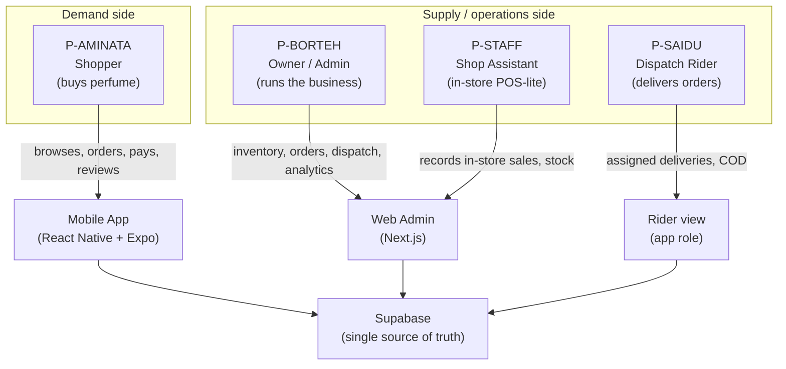
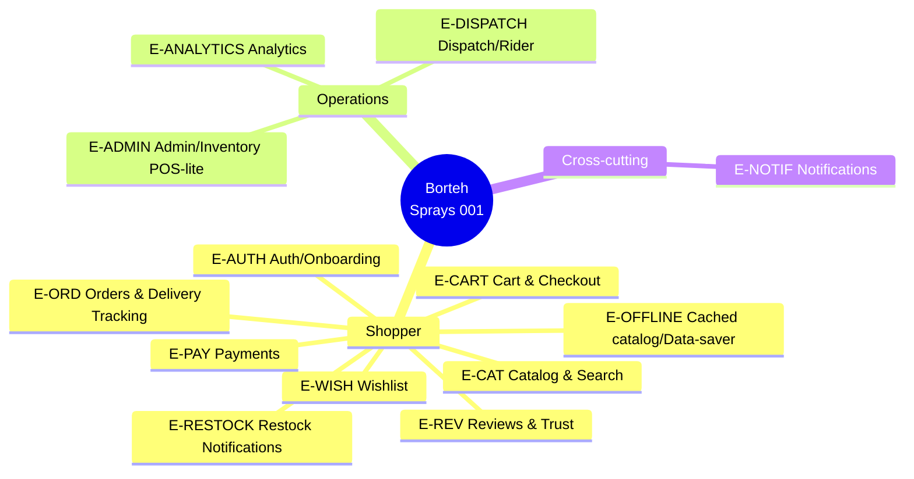
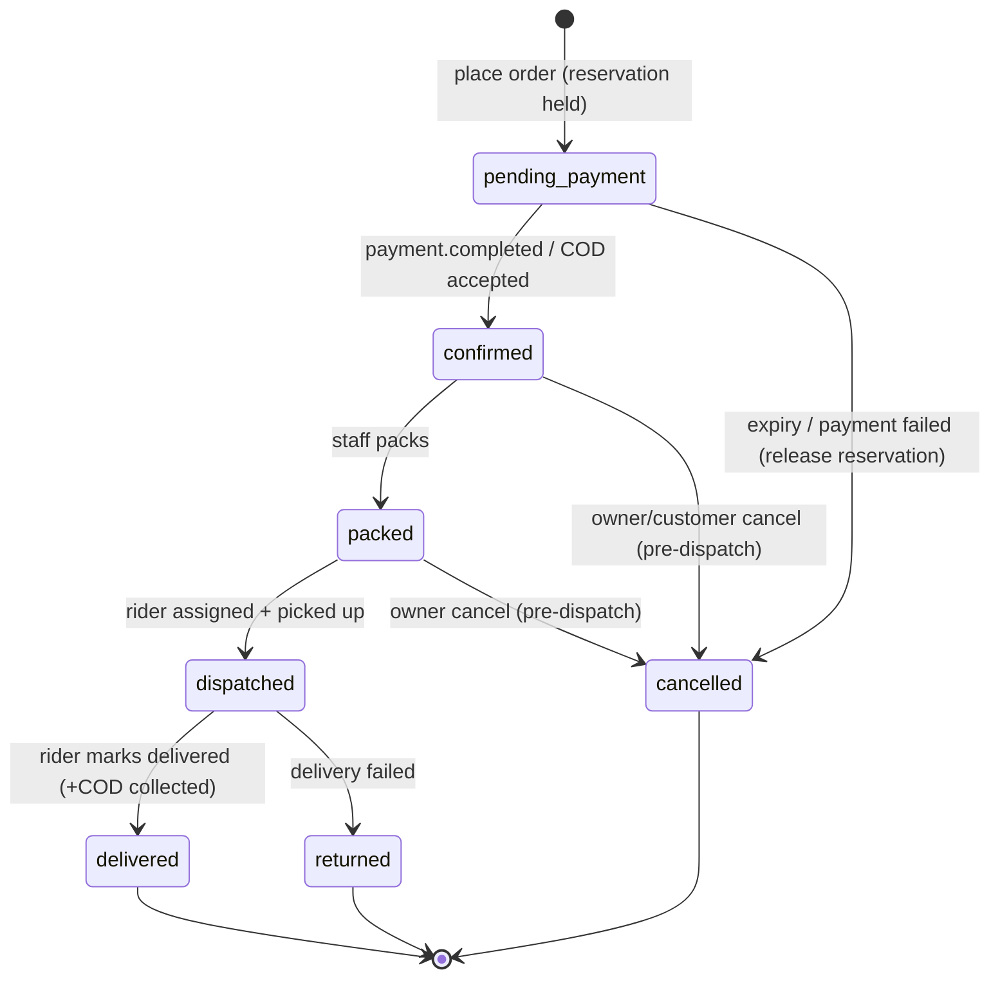
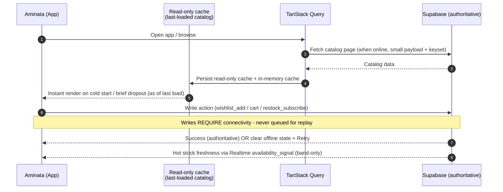
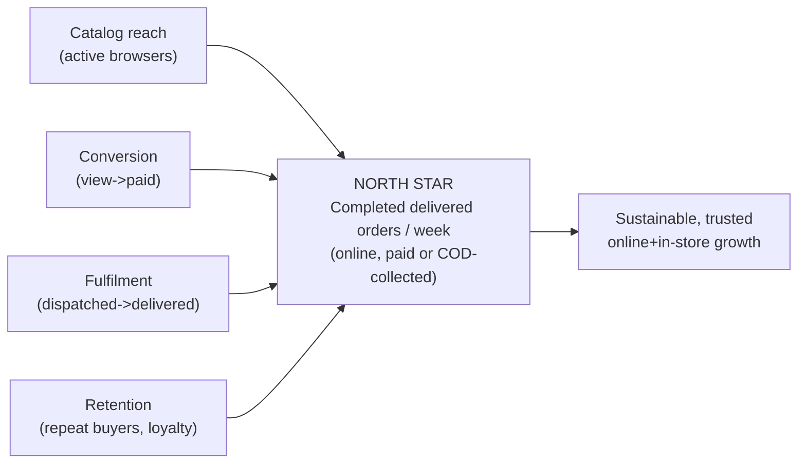
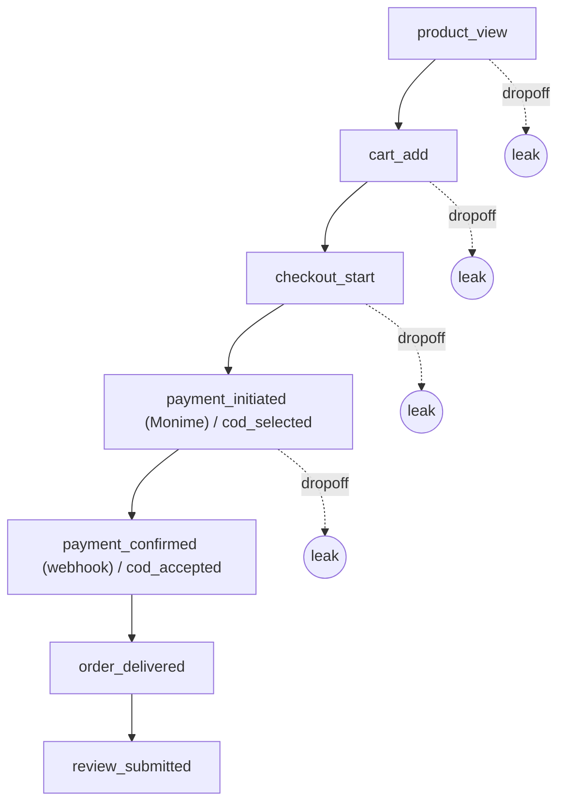

# 03 — Product Requirements Document (PRD)

> What Borteh Sprays 001 must do, for whom, and why — personas, user stories, prioritization, functional + non-functional requirements, scope boundaries, and success metrics.

> Part of the Borteh Sprays 001 planning set. See 00-index.md for the full set.

---

## 0. How to read this document

This PRD is the contract between the business intent (see `01-executive-summary.md`, `02-market-research.md`) and the build (`05-system-architecture.md`, `06-data-model.md`, `07-api-design.md`). It defines *what* and *why*; the *how* lives in the architecture, data-model, and API docs. Every requirement here traces to a persona/goal and, where it embodies a locked decision, to an ADR in `11-adrs.md`.

### 0.1 Confidence & status legend

| Tag | Meaning |
|-----|---------|
| **[Fact]** | Hard, citable, or owner-confirmed constraint. Treat as locked. |
| **[VA]** | Validated assumption — supported by `02-market-research.md` or a battle-tested integration. |
| **[UA-H/M/L]** | Unverified assumption with confidence High / Medium / Low. Each carries the words "assumption to verify". |
| **[BLOCKED-MONIME]** | Cannot finalize until official Monime documentation/support confirms. Tracked in `12-risks-assumptions.md`. |
| **[OWNER]** | Needs a decision or data point from Mr. Borteh before build. |

### 0.2 Priority & phase legend

- **MoSCoW**: M = Must, S = Should, C = Could, W = Won't (this release).
- **Phase**: `MVP` = internal foundation milestone (~weeks 1–8); `v1` = the standard public launch (~3–4 months, the owner's locked launch scope including delivery, analytics, restock notifications, wishlist, reviews); `v1.5` = deferrable near-term enhancement (e.g. optional in-app messaging); `Later` = post-launch backlog.
- **Reminder [Fact]**: v1 is *not* a thin MVP. The MVP column is an internal sequencing aid; the committed external deliverable is **v1**.

### 0.3 Identifier scheme

- Personas: `P-AMINATA`, `P-BORTEH`, `P-SAIDU`, `P-STAFF`.
- Epics: `E-AUTH`, `E-CAT`, `E-WISH`, `E-CART`, `E-PAY`, `E-ORD`, `E-RESTOCK`, `E-REV`, `E-ADMIN`, `E-DISPATCH`, `E-ANALYTICS`, `E-NOTIF`, `E-OFFLINE`.
- Stories: `<EPIC>-<n>` (e.g. `CART-3`). Functional requirements: `FR-<area>-<n>`. Non-functional: `NFR-<n>`. KPIs: `KPI-<n>`.

---

## 1. Personas

The four canon personas, expanded with goals, pains, context, devices, and the "job to be done." Names are canonical and used consistently across the document set.

### 1.1 Persona at-a-glance



### 1.2 P-AMINATA — Shopper (primary)

| Attribute | Detail |
|-----------|--------|
| Role | `customer` |
| Context | Lives in/around Freetown and beyond; prepaid mobile data she tops up in small amounts; uses a mobile-money wallet (Orange Money / Africell Money). **[VA]** |
| Device | Low-to-mid-range Android, limited RAM/storage, small/older screen, sometimes 2G/3G. **[Fact]** |
| Language | Prefers simple, clear English. **[Fact]** |
| Primary goals | Find a perfume she likes quickly; trust that it's genuine; know the real price in Le and delivery fee up front; pay the way she already pays (mobile money) **or** keep cash control via COD; get it delivered to a landmark she can describe. |
| Jobs-to-be-done | "Help me discover a scent I'll love and get it to me without wasting data or risking my money." |
| Pains | Data cost; fear of paying online and getting nothing (trust); confusing addresses; out-of-stock disappointment; apps that are heavy/slow or crash on her phone. |
| Success looks like | Browses a fast cached catalog (data-saver) even on a brief dropout; sees stock + price clearly; orders in <2 min; follows her order status; gets in-app notifications; can rate the product. |
| Drives requirements in | `E-CAT`, `E-WISH`, `E-CART`, `E-PAY`, `E-ORD`, `E-RESTOCK`, `E-REV`, `E-OFFLINE`, `E-NOTIF`, `E-AUTH`. |

### 1.3 P-BORTEH — Store Owner / Admin (primary)

| Attribute | Detail |
|-----------|--------|
| Role | `owner` |
| Context | Runs the shop day-to-day; not highly technical; uses the Next.js web admin and occasionally the app. Greenfield — no prior POS/inventory/website. **[Fact]** |
| Device | Mid-range Android phone + likely a shared laptop/desktop for the admin. **[UA-M]** assumption to verify he has reliable desktop access. |
| Primary goals | One source of truth for stock across in-store + online; never oversell; see what's selling; fulfil online orders reliably; assign riders; get paid; grow repeat custom. |
| Jobs-to-be-done | "Let me run the whole shop — stock, orders, money, delivery, and customers — from one place I can actually understand." |
| Pains | Manual stock counts; overselling a tester/last bottle; not knowing best-sellers or dead stock; chasing payment confirmations; lost/late deliveries; no customer comms channel. |
| Success looks like | Adds/edits products fast; scans/records an in-store sale that instantly decrements the same stock the app reads; sees a live order queue; assigns Saidu in two taps; reads a simple sales dashboard; triggers restock fan-out. |
| Drives requirements in | `E-ADMIN`, `E-DISPATCH`, `E-ANALYTICS`, `E-ORD`, `E-RESTOCK`, `E-PAY`, `E-NOTIF`. |

### 1.4 P-SAIDU — Dispatch Rider (primary)

| Attribute | Detail |
|-----------|--------|
| Role | `rider` |
| Context | One of Mr. Borteh's own dispatch riders (the store runs its own riders — **[Fact]**, not third-party couriers). On the move, intermittent data. |
| Device | Basic Android, small screen, limited data. **[Fact]** |
| Primary goals | See only his assigned deliveries; reach the customer (landmark text + GPS pin + phone); mark picked-up/delivered; collect and record COD accurately. |
| Jobs-to-be-done | "Show me where to go, who to call, and let me confirm delivery and the cash I took — even on a bad signal." |
| Pains | Vague addresses; no customer phone; uncertainty whether an order is COD and how much to collect; losing track of which cash belongs to which order; actions failing on poor signal. |
| Success looks like | A simple assigned-jobs list; tap-to-call and tap-to-navigate; status updates with clear offline/retry states (requires connectivity); clear COD-to-collect amount; end-of-run cash reconciliation. |
| Drives requirements in | `E-DISPATCH`, `E-ORD`, `E-OFFLINE`, `E-NOTIF`. |

### 1.5 P-STAFF — Shop Assistant (secondary)

| Attribute | Detail |
|-----------|--------|
| Role | `staff` |
| Context | Works the physical counter; records in-store sales through the admin's POS-lite; adjusts stock. **[Fact]** |
| Device | Shared device / counter device running the web admin. **[UA-M]** assumption to verify the counter device. |
| Primary goals | Ring up an in-store sale quickly; the same inventory the app shows must decrement atomically; do simple stock adjustments (damage, return, count correction). |
| Jobs-to-be-done | "Let me sell at the counter fast and keep stock honest without overselling the online shop." |
| Pains | Double-keying; race with online orders for the last unit; clumsy interfaces under a queue of customers. |
| Success looks like | Barcode/SKU lookup, add to a sale, take payment (cash/mobile money/COD-not-applicable), commit — stock ledger updates atomically (ADR-010). |
| Drives requirements in | `E-ADMIN` (POS-lite), inventory FRs. |

> **Persona-to-surface mapping [Fact]:** Aminata → mobile app (customer role). Mr. Borteh → web admin (owner), sometimes app. Saidu → app (rider role/view). Staff → web admin (POS-lite). This split drives RLS role design in `09-security-threat-model.md` and `06-data-model.md` (`User.role` ∈ customer/staff/owner/rider).

---

## 2. Scope overview & epic map

### 2.1 Product in one paragraph

A **data-frugal, online-first (with light read caching) mobile app** (ADR-001 React Native + Expo) lets Aminata browse a perfume catalog, wishlist, add to cart, and check out with **Monime mobile-money** (ADR-006) or **cash (on delivery / at pickup)**, then follow her order status to delivery. A **Next.js web admin** (ADR-002) lets Mr. Borteh and staff manage catalog/inventory as a **POS-lite that shares one Postgres source of truth** (ADR-003, ADR-010), fulfil and dispatch orders to his **own riders** (ADR-008), and read **in-house analytics** (ADR-008). **Supabase** (ADR-002) is the backend: Auth (phone + password, no SMS/OTP, ADR-004), PostgREST + Edge Functions (ADR-005), Realtime, Storage, RLS.

### 2.2 Epic map



### 2.3 Epic → persona → ADR traceability

| Epic | Primary persona(s) | Key ADRs | Cross-ref docs |
|------|--------------------|----------|----------------|
| E-AUTH | P-AMINATA, P-SAIDU, P-BORTEH | ADR-004 | 07, 09 |
| E-CAT | P-AMINATA | ADR-003 | 06, 07 |
| E-WISH | P-AMINATA | ADR-003 | 06, 07 |
| E-CART | P-AMINATA | ADR-003, ADR-010 | 06, 07 |
| E-PAY | P-AMINATA, P-BORTEH | ADR-006, ADR-009 | 08, 09 |
| E-ORD | P-AMINATA, P-BORTEH, P-SAIDU | ADR-010, ADR-011 | 06, 07 |
| E-RESTOCK | P-AMINATA, P-BORTEH | ADR-007, ADR-011 | 06, 07 |
| E-REV | P-AMINATA | — | 06 |
| E-ADMIN | P-BORTEH, P-STAFF | ADR-010 | 06, 10 |
| E-DISPATCH | P-BORTEH, P-SAIDU | ADR-008 | 06, 10 |
| E-ANALYTICS | P-BORTEH | ADR-008 | 06, 10 |
| E-NOTIF | all | ADR-007, ADR-011 | 07, 08 |
| E-OFFLINE | P-AMINATA, P-SAIDU | ADR-003 | 05, 06 |

---

## 3. User stories by epic (with acceptance criteria)

Format: each story carries an ID, persona, MoSCoW, Phase, ADR trace, and Gherkin-style acceptance criteria (AC). Stories are intentionally testable. Where a behaviour is unverified it is tagged inline.

### 3.1 E-AUTH — Authentication & Onboarding (ADR-004)

| ID | As… | I want… | so that… | MoSCoW | Phase |
|----|-----|---------|----------|--------|-------|
| AUTH-1 | P-AMINATA | to register and sign in with my phone number + a password | I don't need an email I may not have, and no SMS code is ever required | M | MVP |
| AUTH-2 | P-AMINATA | to browse the full catalog without an account | I can evaluate before committing | M | MVP |
| AUTH-3 | P-AMINATA | to add an optional display name | the app feels personal | S | v1 |
| AUTH-4 | P-BORTEH/P-STAFF/P-SAIDU | to sign in to my role (owner/staff/rider) with phone + password | I see only my tools | M | MVP |
| AUTH-5 | P-AMINATA | login attempts to be rate-limited with lockout after repeated failures | I'm protected from brute-force / credential-stuffing | M | v1 |
| AUTH-6 | P-AMINATA | admin-assisted password recovery (owner verifies me by phone and resets/issues a password) | I can regain access without any SMS | M | v1 |
| AUTH-7 | P-AMINATA | to add an optional email for self-service recovery / receipts | I can recover access myself | C | v1 |
| AUTH-8 | P-AMINATA | optional in-app PIN / biometric unlock | quick, secure re-entry on my own device | C | Later |

**Acceptance criteria**

- **AUTH-1**
  - **Given** a valid SL phone number (local format normalized to E.164) and a password, **when** I register, **then** a Supabase Auth account is created with **phone-confirmation DISABLED (no OTP/SMS is ever sent)**, the password is hashed by Supabase, and a `User` row exists with `role=customer`, `phone` set. **[Fact]** ADR-004.
  - **Given** the phone number is already registered, **then** registration is rejected — **phone is the UNIQUE account identifier** (uniqueness enforced). Email is **optional** (recovery/receipts only).
  - **Given** correct phone + password, **when** I sign in, **then** a Supabase Auth session is created.
- **AUTH-2**
  - **Given** I am unauthenticated, **then** I can open the app, load the catalog, browse, search, and view product detail with **no** sign-in wall.
  - **Given** I attempt a write action (wishlist, cart-to-checkout, restock-subscribe), **then** I am prompted to authenticate at that moment (just-in-time), not before.
- **AUTH-4**
  - **Given** my number is provisioned as `owner`/`staff`/`rider`, **when** I sign in with phone + password, **then** RLS + role gating expose only the correct surface (admin vs rider view). Cross-ref `09-security-threat-model.md`.
- **AUTH-5**
  - **Given** N failed login attempts within a window, **then** further attempts are throttled and the account is temporarily locked (Edge Function rate-limiting + lockout, ADR-005) and the UI shows a cooldown. Thresholds: **[OWNER]** to confirm; default proposal in `07-api-design.md`.
- **AUTH-6**
  - **Given** I forget my password, **then** the **default recovery path is admin-assisted**: the owner verifies me by phone and resets/issues a password from the admin — **no SMS OTP is used**. **Optionally**, if I added an email (AUTH-7), I can use email self-service reset. **[Fact]** ADR-004.

### 3.2 E-CAT — Catalog & Search (ADR-003)

| ID | As… | I want… | so that… | MoSCoW | Phase |
|----|-----|---------|----------|--------|-------|
| CAT-1 | P-AMINATA | to browse products by brand, category, gender, scent note | I can find what suits me | M | MVP |
| CAT-2 | P-AMINATA | to see each product's variants (size_ml, concentration, price in Le) and live stock state | I know what I can actually buy and for how much | M | MVP |
| CAT-3 | P-AMINATA | to search by name/brand/note with data-light results | I find things fast without burning data | M | v1 |
| CAT-4 | P-AMINATA | thumbnails to load lazily and crisply (WebP) | the catalog is light on my data | M | MVP |
| CAT-5 | P-AMINATA | the catalog to load fast from a read-only cache (data-saver) | a brief dropout doesn't show a blank screen | M | v1 |
| CAT-6 | P-AMINATA | to filter/sort (price, popularity, new) | I can narrow choices | S | v1 |
| CAT-7 | P-AMINATA | a scent-note pyramid (top/heart/base) on product detail | I understand how it smells | S | v1 |

**Acceptance criteria**

- **CAT-2**
  - **Given** a product with variants, **then** each variant shows `size_ml`, `concentration` (EDT/EDP/Parfum), and `price_minor` formatted as `Le X.XX` (ADR-009 integer minor units; never floats).
  - **Given** stock state, **then** the UI shows one of: In stock / Low stock / Out of stock, derived from `InventoryItem.qty_on_hand − qty_reserved` (single store; simple per-variant balance). **[Fact]** ADR-010.
  - Stock badges reflect hot changes via Realtime when online (ADR-003) and the last-loaded cached value during a brief dropout, clearly labelled "as of last load."
- **CAT-4 / CAT-1**
  - First catalog screen payload **< ~150 KB on 3G**; thumbnails lazy + WebP; keyset (cursor) pagination — not offset. (NFR budget, §6.) **[Fact target]** ADR-003.
- **CAT-5**
  - **Given** the catalog has been loaded at least once into the read-only cache, **when** I hit a brief dropout, **then** I can still see the last-loaded products/variants/images-from-cache and view detail (as of last load), refreshed when online. Write actions (wishlist/cart) require connectivity — see `E-OFFLINE`. ADR-003 (read-only catalog cache; refreshed online, never queues writes).
- **CAT-3**
  - Search runs against PostgREST/RPC when online, backed by **Postgres GIN trigram / full-text indexes on product/brand/notes** so it scales to an **unlimited catalog**; results cached in-memory (TanStack Query) for fast revisit; it requires connectivity with a clear retry state; **p95 read < ~800 ms on 3G** (NFR). Result rows are text-first, images deferred.

### 3.3 E-WISH — Wishlist (ADR-003)

| ID | As… | I want… | so that… | MoSCoW | Phase |
|----|-----|---------|----------|--------|-------|
| WISH-1 | P-AMINATA | to save products to a wishlist | I can decide later | M | v1 |
| WISH-2 | P-AMINATA | clear offline/retry states when adding to wishlist without signal | a bad signal never silently loses my pick | M | v1 |
| WISH-3 | P-AMINATA | to move a wishlist item to cart | I can buy when ready | S | v1 |
| WISH-4 | P-AMINATA | to subscribe to restock from a wishlisted out-of-stock item | I'm told when it returns | S | v1 |

**Acceptance criteria**

- **WISH-1**: Authenticated add creates `WishlistItem` under the user's `Wishlist`; idempotent (re-adding same variant is a no-op, not a duplicate).
- **WISH-2**: Wishlist add requires connectivity; when offline the action is **not** queued — the UI shows a clear offline state with **Retry** (ADR-003). On success the server is authoritative and the item shows "saved."
- **WISH-4**: Tapping "Notify me" on an out-of-stock wishlisted variant creates a `RestockSubscription` (see `E-RESTOCK`).

### 3.4 E-CART — Cart & Checkout (ADR-003, ADR-010)

| ID | As… | I want… | so that… | MoSCoW | Phase |
|----|-----|---------|----------|--------|-------|
| CART-1 | P-AMINATA | to add variants to a cart with quantities | I can buy several items | M | MVP |
| CART-2 | P-AMINATA | the cart (a local draft) to survive app restarts | I don't lose my basket | M | v1 |
| CART-3 | P-AMINATA | to choose a delivery location (landmark + GPS pin + phone) | the rider can find me | M | v1 |
| CART-4 | P-AMINATA | to see an estimated delivery fee and ETA before paying | there are no surprises (trust) | M | v1 |
| CART-5 | P-AMINATA | to pick payment: Monime mobile money or cash (on delivery / at pickup) | I pay how I trust | M | v1 |
| CART-6 | P-AMINATA | to apply a promo code | I get my discount | S | v1 |
| CART-7 | P-AMINATA | a clear order summary in Le (items, estimated delivery fee, total) before confirming | I know exactly what I'll pay | M | v1 |
| CART-8 | P-AMINATA | stock to be reserved when I start checkout | the last bottle isn't sold from under me | M | v1 |

**Acceptance criteria**

- **CART-1 / CART-2**: Cart and items persist locally as a read-only draft (not a synced/queued write, ADR-003); restored on relaunch; quantities validated against last-loaded stock with a **required** server re-check at checkout (checkout requires connectivity).
- **CART-3**: Delivery location captured as `DeliveryLocation` (`label`, `landmark_text`, `geo_lat`, `geo_lng`, `contact_phone`, `notes`). GPS pin optional but encouraged; landmark text required. **[Fact]** (weak formal addressing).
- **CART-4**: An **estimated** fee + ETA derived from the matched `DeliveryZone` (`estimated_fee_minor` / `fee_estimate_text`, `eta_text`), shown as a **guide only — not a binding auto-charge**. The **actual** delivery fee is confirmed **per order** by the owner (or agreed on the call) and written to `order.delivery_fee_minor` at order confirmation (**nullable until then**); checkout shows the estimate but does **not** hard-charge a computed zone fee. **Given** the address falls outside known zones, **then** the UI flags "We'll confirm delivery by phone" and routes to manual handling (no silent failure). **[UA-M]** zone-matching by pin/region; assumption to verify exact zone polygons with owner — see `06-data-model.md`.
- **CART-7**: Totals computed in integer minor units (ADR-009); displayed as `Le`. The delivery fee is shown as an **estimate/guide** and is **not** hard-charged at checkout (it is confirmed per order — CART-4); the **goods total displayed equals the amount sent to Monime exactly**.
- **CART-8 (oversell prevention)**:
  - **Given** I confirm checkout, **then** an atomic RPC places a **time-boxed reservation** that increments `InventoryItem.qty_reserved` and writes a `StockLedger` `reservation` row inside a Postgres transaction using row locking / conditional update. **[Fact]** ADR-010.
  - **Given** insufficient available stock at that instant, **then** the RPC fails cleanly and the UI shows what changed (e.g., "Only 1 left") — no partial/oversold order.
  - Reservation is **confirmed** on payment success / COD acceptance and **released** on expiry/failure (sweep job, ADR-011). Reservation TTL: **[OWNER]/[UA-M]** propose 15 min, assumption to verify against payment latency.

### 3.5 E-PAY — Payments (ADR-006, ADR-009; Monime mechanics)

| ID | As… | I want… | so that… | MoSCoW | Phase |
|----|-----|---------|----------|--------|-------|
| PAY-1 | P-AMINATA | to pay with mobile money via Monime hosted checkout | I use the wallet I already have | M | v1 |
| PAY-2 | P-AMINATA | to choose Cash on Delivery | I can pay only when I hold the goods (trust) | M | v1 |
| PAY-3 | P-AMINATA | a reliable result even if the redirect is flaky | I'm not charged-but-orderless or order-but-unpaid | M | v1 |
| PAY-4 | P-BORTEH | payments to be confirmed by webhook, not the redirect | the shop's money truth is reliable | M | v1 |
| PAY-5 | P-BORTEH | COD orders to be marked paid when the rider collects cash | books reconcile | M | v1 |
| PAY-6 | P-BORTEH | manual refunds recorded in the system | I can reconcile dashboard refunds | S | v1 |
| PAY-7 | P-AMINATA | a clear pending/failed/paid state with retry | I know what happened to my money | M | v1 |

**Acceptance criteria** (authoritative payment detail lives in `08-payments-monime.md`)

- **PAY-1 (Monime hosted checkout)**:
  - **Given** I confirm a Monime payment, **then** an Edge Function `POST https://api.monime.io/v1/checkout-sessions` with headers `Authorization: Bearer`, `Monime-Space-Id`, `Monime-Version: caph.2025-08-23`, `Content-Type`, and a required `Idempotency-Key` (≤64 chars). **[Fact]**
  - Amount is SLE **minor units** (ADR-009; 100 = Le 1.00). Our `intent_id` is round-tripped through **both** `callbackState` **and** `metadata.intent_id`. **[Fact]**
  - We store `result.id` (`scs-…`) as `PaymentIntent.provider_intent_id` and open `result.redirectUrl` (`checkout.monime.io/scs-…`) in an in-app browser (Expo WebBrowser); return via deep link to success/cancel. **[Fact]**
- **PAY-3 / PAY-4 (webhook is truth)**:
  - **Given** the redirect is lost/cancelled, **then** the order's payment truth still resolves from the webhook. **[Fact]** Redirect is advisory only.
  - **Given** a `Monime-Signature: t=<unix>,v1=<base64>` header, **then** verify HMAC-SHA256 over `t + "_" + raw_body` (UNDERSCORE, not period — the #1 gotcha), base64, timing-safe; read RAW body before JSON parse; reject if `(now−t) > 300s` or `(t−now) > 60s`; support two-secret rotation (CURRENT + PREVIOUS). **[Fact]**
  - Act **only** on `payment.completed` and `payment.processing_completed` (treat both as success); `checkout_session.completed` = same transition, different shape; `checkout_session.expired` = abandoned; `payment.created` / `processing_started` / `financial_transaction.created` informational. **[Fact]**
  - Intent matching order: (1) `data.metadata.intent_id` or `data.channel.metadata.intent_id`; (2) for checkout_session events, object id == `provider_intent_id`; (3) walk `data.ownershipGraph.owner` up to depth 5. **[Fact]**
  - Dedup on `event.id` (UNIQUE); verify amount + currency match the stored intent **before** flipping status; status-guarded `UPDATE ... WHERE status IN (created, processing)` to avoid races with the expiry sweep. **[Fact]**
- **PAY-2 / PAY-5 (COD)**:
  - COD selectable per delivery zone (owner may restrict COD by zone — **[OWNER]**). On selection, order is placed with `PaymentIntent` via the CashOnDelivery adapter (ADR-006); stock reservation is **confirmed on COD acceptance** (ADR-010).
  - **Given** Saidu marks the `DeliveryJob` delivered and records `cod_collected_minor`, **then** the order's payment transitions to paid and a reconciliation entry is produced (`E-DISPATCH`, `E-PAY`).
- **PAY-6 (refunds)**:
  - **[BLOCKED-MONIME]** There is **no Monime refund API as of 2026-05**; refunds are performed manually in the Monime dashboard, then recorded in our `Refund` table for reconciliation. No confirmed refund/chargeback webhook. These are open items in `12-risks-assumptions.md`.
- **PAY-7**: UI shows `pending` (awaiting webhook), `paid`, or `failed/expired`, each with the correct next action (wait/retry/contact). Pending never blocks the app; the order list reflects the authoritative state when the webhook lands.

### 3.6 E-ORD — Orders & Delivery Tracking (ADR-010, ADR-011)

| ID | As… | I want… | so that… | MoSCoW | Phase |
|----|-----|---------|----------|--------|-------|
| ORD-1 | P-AMINATA | to see my order with a clear status timeline | I know where my order is | M | v1 |
| ORD-2 | P-AMINATA | an estimated delivery ETA and assigned-rider contact | I can plan / reach the rider | S | v1 |
| ORD-3 | P-AMINATA | order + status updates in an in-app notification feed | I'm informed inside the app, free of SMS cost | M | v1 |
| ORD-4 | P-BORTEH | a live incoming-orders queue | I fulfil promptly | M | v1 |
| ORD-5 | P-BORTEH | to transition order status (confirm, packed, dispatched, delivered, cancelled) | the customer + rider stay in sync | M | v1 |
| ORD-6 | P-AMINATA | to cancel before dispatch (rules apply) | I'm not stuck with a mistake | S | v1 |
| ORD-7 | P-AMINATA | to reorder a past order | repeat buying is effortless | C | Later |

**Order lifecycle (state machine)**



**Acceptance criteria**

- **ORD-1/ORD-5**: Every status change appends to `OrderStatusHistory` (immutable trail); the app renders it as a timeline. Status enum aligns with the state machine above and `06-data-model.md`.
- **ORD-3**: Each status transition that matters to the customer writes a row to the **in-app notification feed** (`notification` table) delivered via **Supabase Realtime** (ADR-007); **no SMS is sent**. The owner may additionally reach the customer **one-tap** via **Call (`tel:`)** or **WhatsApp click-to-chat (`https://wa.me/<number>?text=...`)** from the order screen. Optional free push (Expo/FCM) is a later enhancement. **[Fact]**
- **ORD-6**: Cancellation allowed only in `pending_payment | confirmed | packed`; cancelling releases the reservation (`StockLedger` `release`) and, for prepaid, flags a manual refund (PAY-6, **[BLOCKED-MONIME]** for the Monime side).
- **ORD-2**: ETA from `DeliveryZone.eta_text`; rider contact shown once assigned (`E-DISPATCH`). Customer phone exposure to rider and vice-versa governed by privacy rules in `09-security-threat-model.md`.

### 3.7 E-RESTOCK — Restock Notifications (ADR-007, ADR-011)

| ID | As… | I want… | so that… | MoSCoW | Phase |
|----|-----|---------|----------|--------|-------|
| RST-1 | P-AMINATA | to subscribe to "notify me when back in stock" on an out-of-stock variant | I don't keep checking | M | v1 |
| RST-2 | P-AMINATA | to be notified (in-app) when it returns | I can buy before it sells out again | M | v1 |
| RST-3 | P-BORTEH | restock fan-out to fire automatically when stock crosses 0→positive | I don't manage it manually | M | v1 |
| RST-4 | P-AMINATA | to manage/cancel my restock subscriptions | I control the messages I get | S | v1 |
| RST-5 | P-BORTEH | low-stock alerts | I reorder before stock-outs | S | v1 |

**Acceptance criteria**

- **RST-1**: Creates `RestockSubscription(user, variant, status=active)` (single store); requires connectivity — when offline the UI shows a clear offline state with **Retry** (the action is not queued, ADR-003).
- **RST-2/RST-3**: A scheduled Edge Function (cron, ADR-011) detects `qty_on_hand − qty_reserved` crossing from 0 to positive (driven by `StockLedger` movements) and fans out to active subscribers via the **in-app notification feed (Supabase Realtime + `notification` table)** (ADR-007), respecting `NotificationPreference`. Each send writes a `Notification` row; subscription marked `notified` to prevent repeat spam. Idempotent per (subscription, restock event).
- **RST-5**: Low-stock threshold per variant (**[OWNER]** default threshold); cron alerts the owner in the admin (in-app).

### 3.8 E-REV — Reviews & Trust

| ID | As… | I want… | so that… | MoSCoW | Phase |
|----|-----|---------|----------|--------|-------|
| REV-1 | P-AMINATA | to read product ratings + reviews | I trust before buying | M | v1 |
| REV-2 | P-AMINATA | to leave a rating + text after a delivered order | I help others / share experience | M | v1 |
| REV-3 | P-AMINATA | to see a "verified purchase" badge | reviews feel trustworthy | M | v1 |
| REV-4 | P-BORTEH | to moderate/hide abusive reviews | the storefront stays clean | S | v1 |
| REV-5 | P-AMINATA | trust signals: clear Le pricing, ETA, tracking, easy contact | I feel safe shopping online | M | v1 |

**Acceptance criteria**

- **REV-2/REV-3**: `Review(product, rating 1–5, text, verified_purchase)`; `verified_purchase=true` only when the reviewer has a `delivered` order containing that product. One review per (user, product) — editable, not duplicable.
- **REV-4**: Owner can hide a review (soft-delete/flag); hidden reviews excluded from product aggregates.
- **REV-5 (trust as a feature)**: Pricing always in Le; delivery fee + ETA shown pre-payment; live order tracking; one-tap contact (call/WhatsApp); reviews visible — these are explicit, testable trust requirements per `02-market-research.md`. Anti-fraud/chargeback resistance detailed in `09-security-threat-model.md`.

### 3.9 E-ADMIN — Admin & Inventory / POS-lite (ADR-010)

| ID | As… | I want… | so that… | MoSCoW | Phase |
|----|-----|---------|----------|--------|-------|
| ADM-1 | P-BORTEH | to create/edit Brand, Category, ScentNote, Product, ProductVariant, ProductImage | I manage my catalog | M | MVP |
| ADM-2 | P-BORTEH | to set price (Le minor units), size, concentration, gender, scent-note pyramid | products are accurate | M | MVP |
| ADM-3 | P-BORTEH/P-STAFF | to record an in-store sale (POS-lite) that atomically decrements the same stock the app reads | online + in-store never oversell | M | MVP |
| ADM-4 | P-BORTEH/P-STAFF | to receive stock (purchase) and make adjustments (damage/return/count) | stock stays honest | M | MVP |
| ADM-5 | P-BORTEH | barcode/SKU lookup at the counter | fast in-store ringing | S | v1 |
| ADM-6 | P-BORTEH | to revisit multi-store only later (single store, simple per-variant balance at launch) | I can expand if I open a second branch | W | Later |
| ADM-7 | P-BORTEH | to manage delivery zones with an estimated fee + ETA guide | I give customers guidance and confirm the real fee per order | M | v1 |
| ADM-8 | P-BORTEH | to configure loyalty & promotions (points, tiers/cards, promo rules) with no code change (see 04, ADR-012) | I run promotions / retain customers and tune them myself | S | v1 |
| ADM-9 | P-BORTEH | to manage users/roles (staff, rider) | I control access | M | v1 |

**Acceptance criteria**

- **ADM-3 (single source of truth, no oversell)**:
  - **Given** an in-store sale committed at the counter, **then** an atomic RPC writes a `StockLedger` `sale_instore` movement and decrements `InventoryItem` inside a transaction with row locking / conditional update (ADR-010) — the **same** mechanism online orders use; **the app's stock badge reflects the change via Realtime**. **[Fact]** ADR-003, ADR-010.
  - **Given** the last unit is contended between an in-store sale and an online reservation, **then** exactly one succeeds; the other gets a clean "out of stock" — never a negative balance.
- **ADM-4**: Movement types align to canon `StockLedger` enum: purchase / sale_online / sale_instore / adjustment / reservation / release (single store — no inter-location transfer). Ledger is **append-only**; corrections are new compensating rows, never edits.
- **ADM-1/ADM-2**: Images uploaded to Supabase Storage; stored as WebP-friendly assets; admin enforces required fields; price entered/displayed as Le, stored as integer minor units (ADR-009).
- **ADM-7**: Zones editable as named region and/or polygon with an **estimated** fee (`estimated_fee_minor` / `fee_estimate_text`) + `eta_text` used as a **guide**; the actual per-order delivery fee is confirmed by the owner (`CART-4`).
- **ADM-8 (configurable loyalty & promotions, ADR-012)**: The owner edits, with **no code change**: `loyalty_config` (owner-editable singleton — `points_per_currency_unit`, `point_value_minor`, `points_expiry_days`, feature flags); `promo_rule`(s) (`rule_type`, `threshold_minor`, `discount_type` percent|fixed, `discount_value`, `scope` all|category|brand|product, `active_from`/`active_to`, usage caps); and `loyalty_tier`/`loyalty_card` (`cumulative_spend_threshold_minor` -> ongoing configurable `discount_percent`). Applied at checkout by evaluating active `promo_rule`(s) + the user's tier/card discount per config. Defined in `04-standout-features.md`.

### 3.10 E-DISPATCH — Dispatch & Rider (ADR-008)

| ID | As… | I want… | so that… | MoSCoW | Phase |
|----|-----|---------|----------|--------|-------|
| DSP-1 | P-BORTEH | to assign an order to one of my riders (manual/assisted) | the delivery gets a rider | M | v1 |
| DSP-2 | P-SAIDU | a simple list of only my assigned deliveries | I know my runs | M | v1 |
| DSP-3 | P-SAIDU | customer landmark + GPS pin + phone, tap-to-call, tap-to-navigate | I can find and reach the customer | M | v1 |
| DSP-4 | P-SAIDU | to mark picked-up and delivered | status stays current | M | v1 |
| DSP-5 | P-SAIDU | to record COD collected (amount) | cash reconciles to the order | M | v1 |
| DSP-6 | P-SAIDU | clear offline/retry states on status updates | poor signal is handled, not silently lost | M | v1 |
| DSP-7 | P-BORTEH | a dispatch board (unassigned / assigned / in-transit / delivered) | I run delivery at a glance | S | v1 |
| DSP-8 | P-BORTEH | end-of-day rider COD reconciliation | I know who owes what cash | S | v1 |
| DSP-9 | P-BORTEH | assisted assignment suggestions (by zone / load) | assignment is faster | C | Later |

**Dispatch / delivery flow**

```mermaid
sequenceDiagram
  autonumber
  participant O as Mr. Borteh (Admin)
  participant DB as Supabase
  participant R as Saidu (Rider app)
  participant C as Aminata (Shopper)
  O->>DB: Assign Order -> create DeliveryJob(order, rider=Saidu)
  Note over O,C: Owner can one-tap Call (tel:) / WhatsApp (wa.me) the customer from the order screen
  DB-->>R: Realtime: new assigned job
  DB-->>C: In-app notification: "Rider assigned"
  R->>DB: Mark picked_up (requires connectivity; retry if offline)
  DB-->>C: In-app notification: "Out for delivery"
  R->>C: Tap-to-call / navigate to landmark+pin
  R->>DB: Mark delivered + cod_collected_minor
  DB->>DB: Confirm payment (COD) / reconcile
  DB-->>C: In-app notification: "Delivered" + review prompt
  DB-->>O: Dispatch board + COD ledger update
```

**Acceptance criteria**

- **DSP-1**: Owner assigns from the order/dispatch view; creates `DeliveryJob(order, rider, status)`. Manual is the committed path (ADR-008); assisted suggestions are `Later` (DSP-9).
- **DSP-2/DSP-3**: Rider sees only jobs where `rider = self` (RLS). Each job shows `DeliveryLocation` landmark_text, geo pin (maps deep-link), and `contact_phone` (tap-to-call); WhatsApp deep-link if available.
- **DSP-4/DSP-5/DSP-6**: Status changes and `cod_collected_minor` require connectivity; the server is authoritative; when offline the UI shows a clear offline state with **Retry** (actions are not queued, ADR-003). COD amount recorded against the order; mismatch vs order total is flagged for owner.
- **DSP-8**: Per-rider, per-day sum of `cod_collected_minor` vs delivered-order totals; surfaces shortfalls/overages for reconciliation (cross-ref `10-admin-analytics.md`).

### 3.11 E-ANALYTICS — Analytics (ADR-008)

| ID | As… | I want… | so that… | MoSCoW | Phase |
|----|-----|---------|----------|--------|-------|
| ANL-1 | P-BORTEH | a sales dashboard (revenue, orders, AOV over time) | I see business health | M | v1 |
| ANL-2 | P-BORTEH | best-sellers and dead-stock views | I buy/promote smartly | M | v1 |
| ANL-3 | P-BORTEH | conversion funnel (view → cart → checkout → paid) | I find where I lose customers | S | v1 |
| ANL-4 | P-BORTEH | low-stock / restock-demand views | I prioritize reorders | S | v1 |
| ANL-5 | P-BORTEH | channel split (online vs in-store) and payment mix (Monime vs COD) | I understand my business | S | v1 |
| ANL-6 | P-BORTEH | delivery performance (on-time, returns, per-rider) | I improve fulfilment | C | Later |

**Acceptance criteria**

- **ANL-1/2/3/5**: Built **in-house** (ADR-008) from an `AnalyticsEvent` table + SQL materialized views, visualized via a free dashboard (Metabase OSS or Supabase dashboards). No paid analytics SaaS. **[Fact]** Definitions live in `10-admin-analytics.md`; event taxonomy ties to `06-data-model.md` `AnalyticsEvent`.
- Every funnel stage maps to a named `AnalyticsEvent` (see §8 KPI instrumentation). Materialized views refreshed on a schedule (cron, ADR-011); refresh cadence **[UA-M]** assumption to verify against load.

### 3.12 E-NOTIF — Notifications (ADR-007, ADR-011)

| ID | As… | I want… | so that… | MoSCoW | Phase |
|----|-----|---------|----------|--------|-------|
| NTF-1 | P-AMINATA | an in-app notification feed (order status, restock-available) | I'm reliably informed inside the app, free of SMS cost | M | v1 |
| NTF-2 | P-BORTEH | one-tap Call (`tel:`) and WhatsApp click-to-chat (`wa.me`) from the order screen | I can reach the customer instantly with no API or cost | M | v1 |
| NTF-3 | P-AMINATA | optional free push (Expo/FCM) when I'm on data in-app | I get instant updates cheaply | C | Later |
| NTF-4 | P-AMINATA | to set notification preferences/opt-outs | I control messages | S | v1 |
| NTF-5 | P-BORTEH | operational alerts in the admin (new order, low stock, COD shortfall) | I act quickly | S | v1 |
| NTF-6 | P-AMINATA/P-BORTEH | optional in-app messaging (customer<->store chat) | we can chat without a paid API | C | v1.5 |

**Acceptance criteria**

- **NTF-1**: The **in-app notification feed** (a `notification` table delivered via **Supabase Realtime**) is the customer-facing channel for order-status and restock-available (ADR-007). **No SMS, no WhatsApp/Meta API** — this is free and needs no provider/verification. **[Fact]**
- **NTF-2**: The admin order screen provides **one-tap Call (`tel:<phone>`)** and **WhatsApp click-to-chat (`https://wa.me/<number>?text=...`)** deep links to the customer phone — **no API, no cost, no Meta/Business verification**. This is the store->customer comms strategy (the owner already messages/calls customers manually). **[Fact]**
- **NTF-3**: Optional **free push (Expo/FCM)** may be added later as an opportunistic enhancement for app users on data; it never replaces the in-app feed.
- **NTF-4**: `NotificationPreference` per category (in-app feed / optional push); opt-outs honored; transactional/legal-minimum messages may be non-opt-out (verify with counsel — `12-risks-assumptions.md`). Every send recorded as a `Notification` row.
- **NTF-6 (optional in-app messaging — deferrable v1.5)**: customer<->store chat built on Supabase (`conversation` + `message` tables + Realtime); scoped as a deferrable v1.5 enhancement, **not required for v1**.

### 3.13 E-OFFLINE — Cached Catalog & Data-saver (ADR-003)

| ID | As… | I want… | so that… | MoSCoW | Phase |
|----|-----|---------|----------|--------|-------|
| OFF-1 | P-AMINATA | the catalog to load fast from a read-only cache (data-saver) | a brief dropout doesn't show a blank screen | M | v1 |
| OFF-2 | P-AMINATA | clear offline/retry states when I try a write without signal (wishlist, cart, restock-subscribe) | I'm prompted to retry; nothing fails silently | M | v1 |
| OFF-3 | P-AMINATA | a visible online / offline / retry status | I trust what's saved | M | v1 |
| OFF-4 | P-AMINATA | a data-saver mode (defer/avoid images, smaller payloads) | I control my data spend | S | v1 |
| OFF-5 | P-SAIDU | rider status updates with clear offline/retry states | poor signal is handled, not silently lost | M | v1 |
| OFF-6 | P-AMINATA | the cached catalog refreshed efficiently (cache-hit on revisit, small payloads) | I don't waste data re-downloading | M | v1 |

**Online-first caching + write-requires-connectivity flow**



**Acceptance criteria**

- **OFF-1/OFF-6**: Once the catalog has loaded at least once, a read-only cache renders variants/images-from-cache instantly on cold start or a brief dropout (as of last load); the cache is refreshed when online using small payloads + keyset pagination + HTTP/image caching (no delta-sync); hot stock changes arrive via Realtime availability_signal when online (ADR-003). **[Fact]**
- **OFF-2/OFF-3/OFF-5**: Writes (wishlist, cart, restock-subscribe, rider status) **require connectivity** and are never queued for replay; the UI always shows a clear online / offline / retry state; **server is authoritative** for inventory (ADR-003). **[Fact]**
- **OFF-4**: Data-saver toggle suppresses non-essential image loads and prefers text payloads; respects NFR data budgets (§6).

---

## 4. MoSCoW prioritization (MVP vs v1 vs Later) — every capability

**[Fact] anchor:** v1 (the ~3–4 month launch) **must include** delivery, analytics, restock notifications, wishlist, and reviews. The MVP column is an internal sequencing milestone, not the external deliverable.

| # | Capability | MoSCoW | Phase | Primary persona | ADR | Stories |
|---|-----------|--------|-------|-----------------|-----|---------|
| 1 | Phone + password auth (no SMS/OTP) | Must | MVP | P-AMINATA/all | ADR-004 | AUTH-1,4 |
| 2 | Guest catalog browse (no wall) | Must | MVP | P-AMINATA | ADR-003 | AUTH-2, CAT-1 |
| 3 | Catalog: brands/categories/variants/price/stock | Must | MVP | P-AMINATA | ADR-003,010 | CAT-1,2,4 |
| 4 | Admin catalog CRUD + images | Must | MVP | P-BORTEH | — | ADM-1,2 |
| 5 | Inventory: StockLedger + InventoryItem (single SoT) | Must | MVP | P-BORTEH/P-STAFF | ADR-010 | ADM-3,4 |
| 6 | POS-lite in-store sale (atomic, no oversell) | Must | MVP | P-STAFF | ADR-010 | ADM-3 |
| 7 | Cart (local draft, persists across restarts) | Must | MVP→v1 | P-AMINATA | ADR-003 | CART-1,2 |
| 8 | Search | Must | v1 | P-AMINATA | ADR-003 | CAT-3 |
| 9 | Cached catalog (read-only) + efficient refresh | Must | v1 | P-AMINATA | ADR-003 | OFF-1,6, CAT-5 |
| 10 | Writes require connectivity + clear retry (wishlist/cart/restock) | Must | v1 | P-AMINATA | ADR-003 | OFF-2,3 |
| 11 | Wishlist | Must | v1 | P-AMINATA | ADR-003 | WISH-1..4 |
| 12 | Delivery locations (landmark + GPS + phone) | Must | v1 | P-AMINATA | — | CART-3 |
| 13 | Delivery zones (estimated fee + ETA guide) | Must | v1 | P-BORTEH | ADR-008 | ADM-7, CART-4 |
| 14 | Stock reservation (time-boxed, atomic) | Must | v1 | P-AMINATA | ADR-010 | CART-8 |
| 15 | Monime hosted checkout | Must | v1 | P-AMINATA | ADR-006,009 | PAY-1,3,4 |
| 16 | Cash (on delivery / at pickup) | Must | v1 | P-AMINATA | ADR-006 | PAY-2,5 |
| 17 | Webhook verification + reconciliation | Must | v1 | P-BORTEH | ADR-006,011 | PAY-3,4 |
| 18 | Orders + status history + tracking | Must | v1 | P-AMINATA/P-BORTEH | ADR-010 | ORD-1,4,5 |
| 19 | Dispatch: assign rider + DeliveryJob | Must | v1 | P-BORTEH | ADR-008 | DSP-1 |
| 20 | Rider app view (jobs, navigate, mark, COD) | Must | v1 | P-SAIDU | ADR-008 | DSP-2..6 |
| 21 | Restock subscribe + fan-out (in-app feed) | Must | v1 | P-AMINATA | ADR-007,011 | RST-1,2,3 |
| 22 | Reviews + verified purchase | Must | v1 | P-AMINATA | — | REV-1,2,3 |
| 23 | Trust signals (price/ETA/track/contact) | Must | v1 | P-AMINATA | — | REV-5 |
| 24 | In-app notification feed (order status, restock) | Must | v1 | all | ADR-007 | NTF-1, ORD-3 |
| 25 | In-house analytics (sales, best-sellers) | Must | v1 | P-BORTEH | ADR-008 | ANL-1,2 |
| 26 | AnalyticsEvent instrumentation | Must | v1 | P-BORTEH | ADR-008 | ANL-3,5 |
| 27 | Configurable promotions (promo_rule, owner-editable) + promo codes | Should | v1 | P-BORTEH | ADR-012 | CART-6, ADM-8 |
| 28 | Configurable loyalty (points/tiers/cards, owner-editable — see 04) | Should | v1 | P-AMINATA/P-BORTEH | ADR-012 | ADM-8 |
| 30 | Filters/sort, scent pyramid | Should | v1 | P-AMINATA | — | CAT-6,7 |
| 31 | Dispatch board + COD reconciliation | Should | v1 | P-BORTEH | ADR-008 | DSP-7,8 |
| 32 | Conversion funnel / channel & payment mix | Should | v1 | P-BORTEH | ADR-008 | ANL-3,5 |
| 33 | Low-stock alerts | Should | v1 | P-BORTEH | ADR-011 | RST-5, ANL-4 |
| 34 | Owner one-tap Call/WhatsApp from order screen | Must | v1 | P-BORTEH | ADR-007 | NTF-2 |
| 35 | Notification preferences | Should | v1 | P-AMINATA | ADR-007 | NTF-4 |
| 36 | Optional free push (Expo/FCM) | Could | Later | P-AMINATA | ADR-007 | NTF-3 |
| 37 | Data-saver mode | Should | v1 | P-AMINATA | ADR-003 | OFF-4 |
| 38 | Multi-store / multi-location inventory | Won't | Later | P-BORTEH | — | ADM-6 |
| 39 | Order cancellation (pre-dispatch) | Should | v1 | P-AMINATA | ADR-010 | ORD-6 |
| 40 | Refund recording (manual; Monime API absent) | Should | v1 | P-BORTEH | ADR-006 | PAY-6 |
| 41 | Review moderation | Should | v1 | P-BORTEH | — | REV-4 |
| 42 | Reorder past order | Could | Later | P-AMINATA | — | ORD-7 |
| 43 | Assisted assignment suggestions | Could | Later | P-BORTEH | ADR-008 | DSP-9 |
| 44 | Delivery performance analytics | Could | Later | P-BORTEH | ADR-008 | ANL-6 |
| 45 | Optional email (self-service recovery / receipts) | Could | v1 | P-AMINATA | ADR-004 | AUTH-7 |
| 47 | Third-party courier integrations | Won't | — | — | ADR-008 | — |
| 48 | Automated card-network refunds/chargebacks | Won't | — | — | ADR-006 | §7 |
| 49 | Subscriptions / recurring perfume boxes | Won't | — | — | — | §7 |
| 50 | Optional in-app messaging (customer<->store chat) | Could | v1.5 | P-AMINATA/P-BORTEH | — | NTF-6 |
| 51 | Admin-assisted password recovery | Must | v1 | P-AMINATA/P-BORTEH | ADR-004 | AUTH-6 |
| 52 | Login rate-limiting + lockout (anti brute-force) | Must | v1 | all | ADR-004,005 | AUTH-5 |
| 53 | Scalable catalog (keyset pagination, GIN/full-text search, CDN images) | Must | v1 | P-AMINATA | ADR-003 | CAT-1,3,4 |
| 54 | Optional in-app PIN / biometric unlock | Could | Later | P-AMINATA | ADR-004 | AUTH-8 |

---

## 5. Functional requirements

Numbered, testable, persona- and ADR-traced. The data-model names (`06`) and APIs (`07`) are the implementation detail; these state the *must-do* behaviour.

### 5.1 Catalog (FR-CAT)

| ID | Requirement | Persona | ADR |
|----|-------------|---------|-----|
| FR-CAT-1 | The system shall model `Brand`, `Category`, `ScentNote`, `Product` (with `gender` male/female/unisex), `ProductVariant` (`size_ml`, `concentration`, `sku`, `barcode`, `price_minor`), `ProductImage`, and `ProductScentNote` (top/heart/base). | P-AMINATA | ADR-003 |
| FR-CAT-2 | Browsing shall not require authentication; write actions trigger just-in-time auth. | P-AMINATA | ADR-004 |
| FR-CAT-3 | Prices shall be stored as integer SLE minor units and displayed as `Le`; never floats. | P-AMINATA | ADR-009 |
| FR-CAT-4 | Catalog lists shall use keyset pagination and lazy WebP thumbnails to meet the 150 KB first-screen budget. | P-AMINATA | ADR-003 |
| FR-CAT-5 | Each variant shall show a derived availability state from `qty_on_hand − qty_reserved`. | P-AMINATA | ADR-010 |
| FR-CAT-6 | Search shall run against PostgREST/RPC when online, backed by Postgres GIN trigram / full-text indexes on product/brand/notes to scale to an unlimited catalog, with results cached in-memory (TanStack Query) for fast revisit; it requires connectivity. | P-AMINATA | ADR-003 |

### 5.2 Inventory & online+in-store sync (FR-INV)

| ID | Requirement | Persona | ADR |
|----|-------------|---------|-----|
| FR-INV-1 | Postgres (Supabase) shall be the single source of truth for stock for both in-store and online. | P-BORTEH | ADR-003 |
| FR-INV-2 | All stock changes shall be append-only `StockLedger` movements (purchase/sale_online/sale_instore/adjustment/reservation/release) with a derived per-variant balance (`qty_on_hand` / `qty_reserved`); single store, no inter-location transfer. | P-BORTEH/P-STAFF | ADR-010 |
| FR-INV-3 | Stock decrements and reservations shall execute inside a Postgres transaction via an RPC using row locking (`SELECT … FOR UPDATE`) or an atomic conditional `UPDATE`, preventing oversell under concurrent online + in-store sales. | P-STAFF | ADR-010 |
| FR-INV-4 | Online orders shall place a time-boxed reservation; confirmed on payment success / COD acceptance; released on expiry/failure by a scheduled sweep. | P-AMINATA | ADR-010, ADR-011 |
| FR-INV-5 | The app shall reflect hot stock changes via Supabase Realtime availability_signal when online and the last-loaded cached value during a brief dropout (clearly labelled "as of last load"). | P-AMINATA | ADR-003 |
| FR-INV-6 | v1 shall model a single store with a simple per-variant balance (no location dimension); multi-store is DEFERRED and revisited only on an explicit growth trigger. | P-BORTEH | — |

### 5.3 Wishlist (FR-WISH)

| ID | Requirement | Persona | ADR |
|----|-------------|---------|-----|
| FR-WISH-1 | Authenticated users shall add/remove variants to a `Wishlist`/`WishlistItem`; adds are idempotent. | P-AMINATA | ADR-003 |
| FR-WISH-2 | Wishlist adds shall require connectivity; when offline the UI shall show a clear offline state with Retry (adds are not queued for later replay). | P-AMINATA | ADR-003 |
| FR-WISH-3 | Out-of-stock wishlist items shall offer restock subscription. | P-AMINATA | ADR-007 |

### 5.4 Availability + restock notifications (FR-RST)

| ID | Requirement | Persona | ADR |
|----|-------------|---------|-----|
| FR-RST-1 | Users shall subscribe to restock per variant, creating a `RestockSubscription` (single store). | P-AMINATA | ADR-007 |
| FR-RST-2 | A scheduled Edge Function shall detect 0→positive availability transitions and fan out in-app notifications (Supabase Realtime + `notification` table) to active subscribers, idempotently, writing `Notification` rows and respecting `NotificationPreference`. | P-AMINATA | ADR-007, ADR-011 |
| FR-RST-3 | A scheduled job shall raise low-stock alerts (in admin) at a configurable per-variant threshold. | P-BORTEH | ADR-011 |

### 5.5 Online ordering + delivery (FR-ORD)

| ID | Requirement | Persona | ADR |
|----|-------------|---------|-----|
| FR-ORD-1 | Checkout shall capture a `DeliveryLocation` (landmark_text required, GPS pin optional, contact_phone required) and match a `DeliveryZone` for an ESTIMATED fee (`estimated_fee_minor` / `fee_estimate_text`) + `eta_text` shown as a guide. | P-AMINATA | — |
| FR-ORD-2 | Addresses outside known zones shall route to manual phone confirmation, never silent failure. | P-AMINATA | — |
| FR-ORD-3 | An order shall create `Order` + `OrderItem`s, hold a stock reservation, and record every transition in `OrderStatusHistory`. | P-AMINATA/P-BORTEH | ADR-010 |
| FR-ORD-4 | Owner shall assign a `DeliveryJob(order, rider, status)`; rider sees only own jobs (RLS). | P-BORTEH/P-SAIDU | ADR-008 |
| FR-ORD-5 | Rider shall mark picked-up/delivered/returned and record `cod_collected_minor`; these writes require connectivity and show clear offline/retry states (not queued for later replay). | P-SAIDU | ADR-003, ADR-008 |
| FR-ORD-6 | Customer-facing status changes shall emit in-app notifications (feed via Realtime); no SMS. The admin order screen offers one-tap Call/WhatsApp to the customer. | P-AMINATA | ADR-007 |
| FR-ORD-7 | Cancellation shall be allowed only pre-dispatch and shall release the reservation. | P-AMINATA | ADR-010 |
| FR-ORD-8 | `order.delivery_fee_minor` shall be nullable until the owner confirms the actual delivery fee at order confirmation; checkout shall show the zone estimate only and shall not hard-charge a computed zone fee. | P-BORTEH | — |

### 5.6 Payments: Monime + COD (FR-PAY)

| ID | Requirement | Persona | ADR |
|----|-------------|---------|-----|
| FR-PAY-1 | A `PaymentProvider` interface (`createCheckout`, `verifyWebhookSignature`, `parseEvent`, `matchIntent`, `getStatus`) shall back a Monime adapter (hosted Checkout Sessions) and a CashOnDelivery adapter. | P-AMINATA | ADR-006 |
| FR-PAY-2 | Monime checkout shall POST `/v1/checkout-sessions` with required headers incl. `Monime-Version: caph.2025-08-23` and a required `Idempotency-Key (≤64)`; store `result.id` as `provider_intent_id`; open `result.redirectUrl` in an in-app browser. | P-AMINATA | ADR-006, ADR-009 |
| FR-PAY-3 | Our intent id shall round-trip through both `callbackState` and `metadata.intent_id`; webhook is the source of payment truth, not the redirect. | P-AMINATA | ADR-006 |
| FR-PAY-4 | Webhook handling shall read the RAW body, verify `Monime-Signature` as HMAC-SHA256 over `t + "_" + raw_body` (underscore), timing-safe, with replay window (now−t ≤ 300s, t−now ≤ 60s) and two-secret rotation. | P-BORTEH | ADR-006 |
| FR-PAY-5 | Processing shall act only on `payment.completed` / `payment.processing_completed` (and `checkout_session.completed`), dedup on `event.id`, verify amount+currency, and use a status-guarded UPDATE. | P-BORTEH | ADR-006 |
| FR-PAY-6 | COD orders shall be confirmed on COD acceptance and marked paid when the rider records collected cash. | P-AMINATA/P-SAIDU | ADR-006 |
| FR-PAY-7 | Refunds shall be recorded in a `Refund` table; **[BLOCKED-MONIME]** there is no Monime refund API as of 2026-05 (manual dashboard refund + manual reconciliation); no confirmed refund/chargeback webhook. | P-BORTEH | ADR-006 |
| FR-PAY-8 | A reconciliation sweep (cron) shall resolve stuck/pending intents against Monime status. | P-BORTEH | ADR-011 |

### 5.7 Sales analytics (FR-ANL)

| ID | Requirement | Persona | ADR |
|----|-------------|---------|-----|
| FR-ANL-1 | The system shall record `AnalyticsEvent`s for key funnel and operational events (see §8). | P-BORTEH | ADR-008 |
| FR-ANL-2 | Analytics shall be computed in-house via SQL materialized views over `AnalyticsEvent` + order/inventory tables, visualized in a free dashboard (Metabase OSS / Supabase). | P-BORTEH | ADR-008 |
| FR-ANL-3 | Dashboards shall cover revenue/orders/AOV, best-sellers/dead-stock, conversion funnel, channel split (online/in-store), and payment mix (Monime/COD). | P-BORTEH | ADR-008 |

### 5.8 Notifications (FR-NTF)

| ID | Requirement | Persona | ADR |
|----|-------------|---------|-----|
| FR-NTF-1 | Customer-facing messages (order status, restock-available) shall be delivered via an in-app notification feed (Supabase Realtime + `notification` table); no SMS/OTP. | all | ADR-007 |
| FR-NTF-2 | The admin order screen shall provide one-tap Call (`tel:`) and WhatsApp click-to-chat (`wa.me`) deep links to the customer phone — no paid API, no Meta/Business verification. | P-BORTEH | ADR-007 |
| FR-NTF-3 | Optional free push (Expo/FCM) may be added later as an opportunistic enhancement; it never replaces the in-app feed. | P-AMINATA | ADR-007 |
| FR-NTF-4 | `NotificationPreference` shall govern category opt-outs (in-app feed / optional push); every send writes a `Notification` row. | P-AMINATA | ADR-007 |
| FR-NTF-5 | Optional in-app customer<->store messaging (`conversation` + `message` tables + Realtime) is a deferrable v1.5 capability, not required for v1. | P-AMINATA/P-BORTEH | ADR-007 |

### 5.9 Standout features (FR-STO) — by reference to `04-standout-features.md`

| ID | Requirement | Persona | Ref |
|----|-------------|---------|-----|
| FR-STO-1 | The system shall provide a CONFIGURABLE loyalty capability — owner-editable `loyalty_config` (points_per_currency_unit, point_value_minor, points_expiry_days, flags), `loyalty_tier`/`loyalty_card` (cumulative_spend_threshold_minor -> ongoing discount_percent), per-user `loyalty_account` (points_balance, lifetime_spend_minor, current tier/card), and append-only `loyalty_ledger` — tunable with no code change. | P-AMINATA/P-BORTEH | 04, ADR-012 |
| FR-STO-2 | Owner-editable `promo_rule`(s) (rule_type, threshold_minor, discount_type/value, scope, active window, usage caps) and promo codes shall be evaluated at checkout — applying active promo rules + the user's tier/card discount per `loyalty_config` — with analytics attribution. | P-AMINATA/P-BORTEH | 04, ADR-012 |
| FR-STO-3 | Standout items shall follow the definitions in `04-standout-features.md` (single source of truth for standout scope). | P-AMINATA | 04 |

> Standout features are **defined** in `04-standout-features.md`; this PRD references them and fixes their priority (configurable loyalty + promotions = Should/v1, ADR-012; see §4 rows 27–28). It does not redefine them.

---

## 6. Non-functional requirements (targets to validate)

All figures below are **performance/non-functional TARGETS to validate**, drawn from the canon budgets — not measured results. Each is a hypothesis to confirm by profiling on real target devices/networks.

| ID | Category | Target (to validate) | Rationale / persona | ADR |
|----|----------|----------------------|---------------------|-----|
| NFR-1 | Startup | Cold start **< 3s** on a mid-range Android | Low-end devices (P-AMINATA) | ADR-001 |
| NFR-2 | Data — first screen | First catalog screen payload **< ~150 KB on 3G** | Data cost (P-AMINATA) | ADR-003 |
| NFR-3 | Data — session | Typical browse session **< ~1 MB** | Data cost | ADR-003 |
| NFR-4 | App size | Per-ABI APK **< ~25 MB** | Storage-limited devices | ADR-001 |
| NFR-5 | Latency | **p95 read API < ~800 ms on 3G** | Intermittent connectivity | ADR-002 |
| NFR-6 | Caching | Catalog **renders from a read-only cache** on cold start / brief dropout (as of last load) | 2G/3G reality | ADR-003 |
| NFR-7 | Availability | **99.5%** target (small scale) | Trust/operations | ADR-002 |
| NFR-8 | Memory | Smooth on limited-RAM devices (no OOM/jank in browse); Hermes engine | Low-end Android | ADR-001 |
| NFR-9 | Cache efficiency | Cache-hit on revisit; refresh via small payloads + keyset pagination + HTTP/image caching (no delta-sync) | Data frugality | ADR-003 |
| NFR-10 | Consistency | Zero oversell under concurrent online + in-store load (atomic RPC) | Inventory integrity | ADR-010 |
| NFR-11 | Payment integrity | No "charged-but-orderless" / "ordered-but-unpaid": webhook-authoritative, idempotent, reconciled | Money safety | ADR-006 |
| NFR-12 | Security/privacy | Phone + password auth (hashed by Supabase; no OTP/SMS), login rate-limiting + lockout, RLS per role, raw-body signature verification, SL data-protection considerations | All; flag legal to counsel | ADR-004, ADR-005 |
| NFR-13 | Localization | English strings; SL phone formats; `Le` currency formatting | P-AMINATA | — |
| NFR-14 | Resilience | Customer notifications via the in-app feed (no SMS dependency); writes require connectivity with clear offline/retry states (never queued) | P-AMINATA/P-SAIDU | ADR-007, ADR-003 |
| NFR-15 | Cost | No committed paid service beyond Supabase; everything else on free tiers/deferred | P-BORTEH (budget) | ADR-002, ADR-008 |
| NFR-16 | OTA agility | JS fixes shippable via Expo EAS Update without store review | Poor connectivity | ADR-001 |
| NFR-17 | Accessibility | Legible on small/old screens; large tap targets; low-literacy-friendly | P-AMINATA/P-SAIDU | — |
| NFR-18 | Catalog scale | Unlimited products via keyset pagination + Postgres GIN trigram / full-text search indexes + Supabase Storage CDN images + lazy thumbnails + small payloads | Catalog growth (P-AMINATA/P-BORTEH) | ADR-003 |

> **[Fact]** These budgets are the canon non-functional budgets. **[UA-H]** Each remains an *assumption to verify* via profiling on representative SL devices/networks before launch sign-off; record results in `12-risks-assumptions.md` and `13-roadmap.md` validation gates.

---

## 7. Out of scope (explicit)

The following are **out of scope** for MVP and v1 (some are deliberate Won't, some are deferred to Later). Stating this prevents scope creep and clarifies the contract.

| Out-of-scope item | Why | Status |
|-------------------|-----|--------|
| Third-party courier/logistics integrations | Store runs its **own** riders (ADR-008). | Won't (v1) |
| Automated Monime refunds / chargeback automation | No Monime refund API as of 2026-05; **[BLOCKED-MONIME]** — manual dashboard + `Refund` recording only. | Won't (v1) |
| Card-acquiring outside Monime / additional gateways | Monime is the chosen aggregator (ADR-006); abstraction allows future providers but none committed. | Later |
| Subscriptions / recurring perfume boxes | Not in launch scope; revisit post-launch. | Later |
| Optional in-app messaging (deferrable v1.5); full support console | Store->customer contact at launch is one-tap Call (`tel:`) + WhatsApp click-to-chat (`wa.me`) + the in-app notification feed (no SMS). | v1.5 / Later |
| Web storefront for shoppers (customer-facing) | Shoppers use the mobile app; web is **admin-only** (ADR-002). | Later |
| Advanced ML recommendations / personalization engine | Cost + data maturity; basic popularity sorting only at launch. | Later |
| Full ERP/accounting integration | Out of scope; analytics + COD reconciliation only. | Later |
| Multi-currency | SLE only (ADR-009). | Won't |
| Vendor/marketplace multi-seller | Single retailer (Borteh). | Won't |
| Real-money payment automated test suite via Monime sandbox | **[BLOCKED-MONIME]** no real sandbox; test tokens 401 on `/v1/*`. | Blocked |
| SMS gateway / WhatsApp Cloud (Meta) API integration | Too costly; customer comms via in-app feed + owner one-tap Call/WhatsApp click-to-chat. | Won't (v1) |
| Rider live GPS tracking | Not needed; rider sees a static drop-off pin + landmark + phone. | Won't (v1) |
| Multi-store / multi-location inventory | Single store; simple per-variant balance; revisit on growth trigger. | Later |

---

## 8. Success metrics / KPIs

Every metric ties to an `AnalyticsEvent` (canon entity; defined in `06-data-model.md`, computed in `10-admin-analytics.md`). Targets are **[UA-M] assumptions to verify** with the owner — there is no historical baseline (greenfield). We instrument first, then set thresholds after launch.

### 8.1 North Star



**North Star — `KPI-0`: Weekly completed delivered orders (online).** It captures the whole value chain Borteh cares about: a shopper discovered a product, trusted us enough to order, paid (Monime or COD), and the rider actually delivered. It resists vanity (an order only counts when delivered + settled) and aligns every persona.

### 8.2 Supporting KPI tree

| KPI | Metric | Definition | North-Star link | Owner target |
|-----|--------|-----------|-----------------|--------------|
| KPI-0 | North Star: weekly delivered online orders | Orders reaching `delivered` with payment settled, per week | — | **[OWNER]** |
| KPI-1 | Activation | First-registered users (phone+password) / installs | Reach | **[OWNER]** |
| KPI-2 | Catalog engagement | Weekly active browsers; product views/session | Reach | **[OWNER]** |
| KPI-3 | View→Cart rate | carts started / product views | Conversion | **[OWNER]** |
| KPI-4 | Cart→Checkout rate | checkouts started / carts | Conversion | **[OWNER]** |
| KPI-5 | Checkout→Paid rate | paid (or COD-accepted) / checkouts started | Conversion | **[OWNER]** |
| KPI-6 | Payment success (Monime) | webhook-confirmed / Monime initiations | Conversion | **[OWNER]** |
| KPI-7 | COD share & success | COD orders / total; COD delivered-collected / COD placed | Conversion/Fulfil | **[OWNER]** |
| KPI-8 | Fulfilment rate | delivered / confirmed orders | Fulfilment | **[OWNER]** |
| KPI-9 | On-time delivery | delivered within `eta_text` window | Fulfilment | **[OWNER]** |
| KPI-10 | Oversell incidents | count of negative-availability or oversell errors | Integrity (target 0) | 0 |
| KPI-11 | Restock conversion | purchases by restock-notified users / restock sends | Retention | **[OWNER]** |
| KPI-12 | Repeat purchase rate | users with ≥2 delivered orders / buyers | Retention | **[OWNER]** |
| KPI-13 | Review coverage | reviews / delivered orders; avg rating | Trust | **[OWNER]** |
| KPI-14 | Channel & payment mix | online vs in-store revenue; Monime vs COD | Business health | **[OWNER]** |
| KPI-15 | Data/perf health | % sessions meeting NFR-2 (150 KB) / NFR-5 (p95) | Quality (proxy) | per §6 |

### 8.3 Conversion funnel (instrumented)



### 8.4 Instrumentation — KPI → AnalyticsEvent mapping

Each event is an `AnalyticsEvent` row (`event_type`, `user_id?`, `entity_ref`, `props jsonb`, `occurred_at`). Authoritative taxonomy in `06-data-model.md`/`10-admin-analytics.md`; this table fixes the *minimum* event set the PRD requires.

| AnalyticsEvent `event_type` | Emitted when | Feeds KPI |
|-----------------------------|-------------|-----------|
| `app_open` / `session_start` | App launched / session begins | KPI-2 |
| `user_registered` | Registration (phone+password) succeeds | KPI-1 |
| `product_view` | Product detail opened | KPI-2, KPI-3 |
| `search_performed` | Search executed (online) | KPI-2 |
| `wishlist_add` | Wishlist add committed | KPI-12 (retention proxy) |
| `restock_subscribe` | RestockSubscription created | KPI-11 |
| `restock_notified` | Restock fan-out send | KPI-11 |
| `cart_add` | Item added to cart | KPI-3 |
| `checkout_start` | Checkout begun (reservation placed) | KPI-4, KPI-5, KPI-10 |
| `payment_initiated` | Monime checkout-session created | KPI-5, KPI-6 |
| `cod_selected` | COD chosen | KPI-7 |
| `payment_confirmed` | Webhook completion processed | KPI-5, KPI-6 |
| `payment_failed_expired` | Failed/expired/abandoned | KPI-6 |
| `order_placed` | Order created | KPI-0 (denominator) |
| `order_status_changed` | Any `OrderStatusHistory` transition | KPI-8 |
| `delivery_assigned` | DeliveryJob created | KPI-8 |
| `order_delivered` | Marked delivered (+COD recorded) | KPI-0, KPI-8, KPI-9, KPI-7 |
| `oversell_blocked` | Atomic RPC prevented an oversell | KPI-10 |
| `review_submitted` | Review created | KPI-13 |
| `loyalty_earned` / `loyalty_redeemed` | `loyalty_ledger` movement | KPI-12 (see 04) |
| `perf_sample` | Periodic client perf sample (payload size, p95) | KPI-15 |

> **[VA]** This event set is sufficient to compute the full funnel and North Star. **[UA-M]** Exact `props` schemas and sampling rates (esp. `perf_sample`) are assumptions to verify in `10-admin-analytics.md`. Analytics writes must be **data-frugal** (batched, sent when online — not queued for offline replay) to respect NFR-3.

---

## 9. Open questions, owner inputs, and Monime blockers

Consolidated here and mirrored into `12-risks-assumptions.md`.

### 9.1 Needs the owner (Mr. Borteh) — [OWNER]

| # | Decision needed |
|---|-----------------|
| O-1 | KPI targets/thresholds (KPI-0…KPI-14) — set after a baseline period. |
| O-2 | Delivery zone ESTIMATES: named regions and/or polygons, `estimated_fee_minor` / `fee_estimate_text`, `eta_text` (guide only); which zones allow cash/COD. The actual delivery fee is confirmed per order. |
| O-3 | Reservation TTL (proposed 15 min) and login rate-limit / lockout thresholds. |
| O-4 | Low-stock thresholds per variant. |
| O-5 | Owner WhatsApp number for one-tap click-to-chat (`wa.me`) from the admin order screen. |
| O-6 | Counter device for POS-lite + owner desktop access for admin. |
| O-7 | Initial loyalty/promo config values (points_per_currency_unit, point_value_minor, tier thresholds + discount_percent, promo_rule rates/caps) — owner-editable in admin (ADR-012); feeds `04-standout-features.md`. |
| O-8 | Returns/cancellation policy customers will see (drives ORD-6 + manual refunds). |

### 9.2 Blocked on Monime docs/support — [BLOCKED-MONIME]

| # | Item |
|---|------|
| M-1 | No real sandbox; test tokens 401 on `/v1/*` — how to safely test without live money. |
| M-2 | No refund API as of 2026-05 — manual dashboard refunds + `Refund` recording; reconciliation plan. |
| M-3 | No confirmed refund/chargeback webhook — affects ORD-6 + PAY-6 automation. |
| M-4 | Idempotency-Key TTL assumed 24h — confirm. |
| M-5 | Token scopes are per-action — confirm required scope set for checkout + status. |
| M-6 | Webhooks do not follow redirects — registered URL must be the exact canonical Edge Function URL. |

### 9.3 Unverified assumptions to validate — [UA]

| # | Assumption | Confidence |
|---|-----------|-----------|
| A-1 | Customers will adopt phone+password sign-in (no SMS code) and the admin-assisted recovery flow is operable for the owner — ADR-004. | UA-M |
| A-2 | NFR performance budgets (§6) achievable on representative low-end SL devices/3G. | UA-H |
| A-3 | Zone-by-pin/region matching is sufficient given weak addressing. | UA-M |
| A-4 | Materialized-view refresh cadence sustainable on Supabase free/low tier. | UA-M |
| A-5 | SL data-protection / consumer / payments-KYC specifics — **verify with counsel**, do not assert. | UA-L |

---

## 10. Traceability summary

- **Personas → Epics:** §1.1, §2.3.
- **Epics → Stories → ACs:** §3.
- **Capabilities → MoSCoW/Phase/ADR:** §4.
- **Requirements → ADRs:** §5 (FR tables) + §6 (NFR table) carry ADR columns.
- **KPIs → AnalyticsEvent:** §8.4.
- **Siblings:** `01` (vision), `02` (market evidence behind personas/trust), `04` (standout features — loyalty/promo), `05` (architecture for online-first caching/Realtime), `06` (data model — all entity names), `07` (REST + RPC contracts), `08` (Monime mechanics — authoritative), `09` (RLS/threat model/anti-fraud), `10` (analytics views), `11` (ADRs — every locked decision), `12` (risks/assumptions/Monime blockers), `13` (roadmap/validation gates).

> This PRD intentionally states *what and why*. For *how*, follow the cross-references. No production code appears here by design (research-and-design phase).
