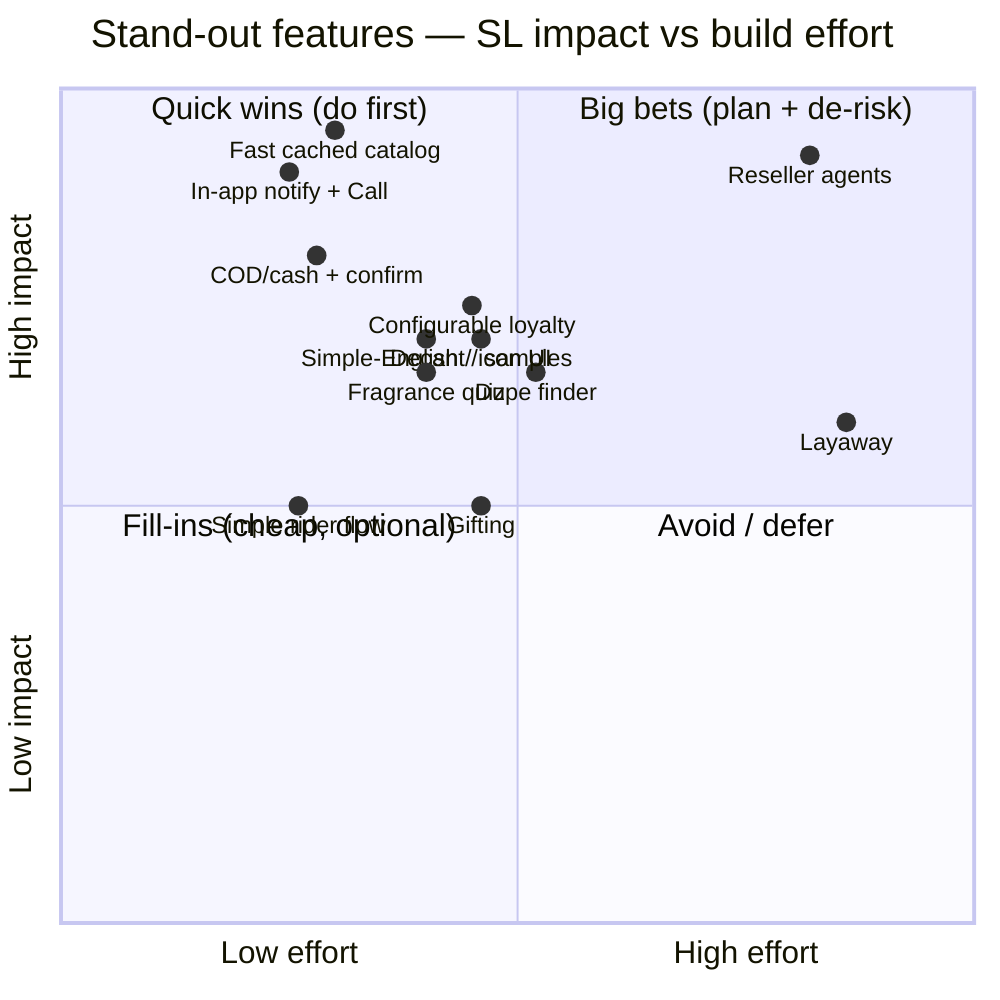
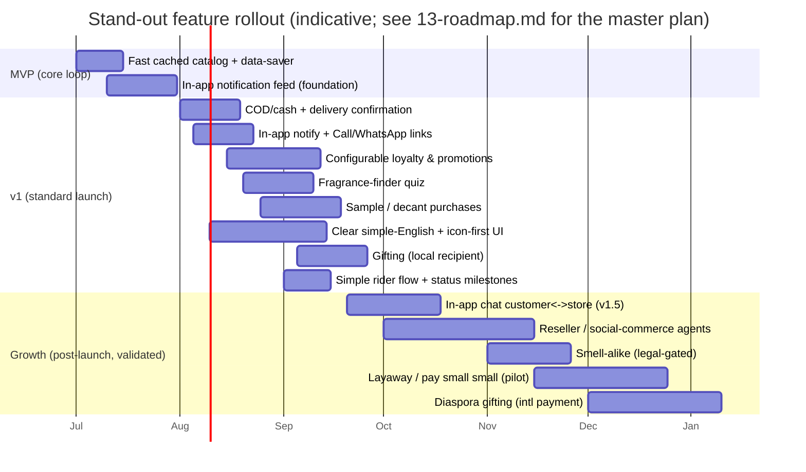
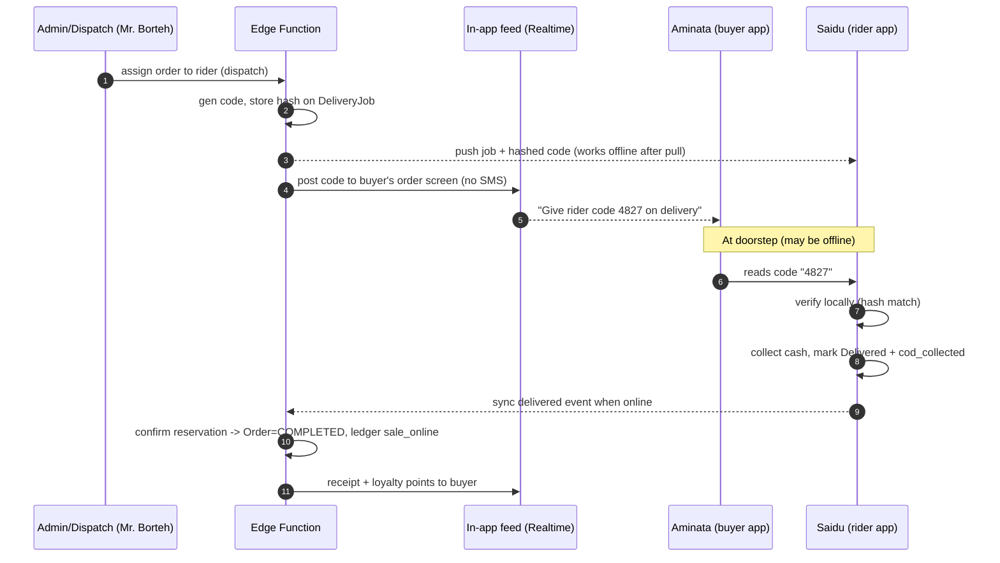
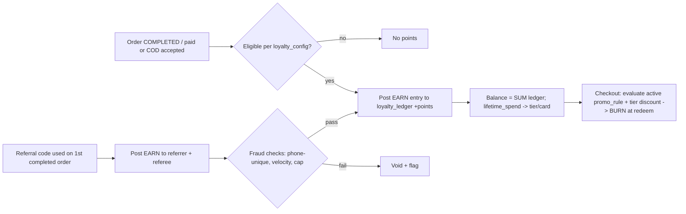
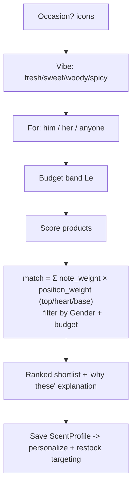
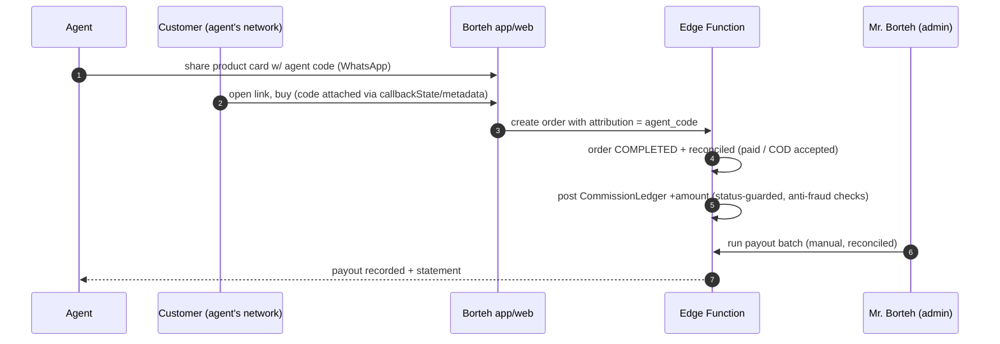
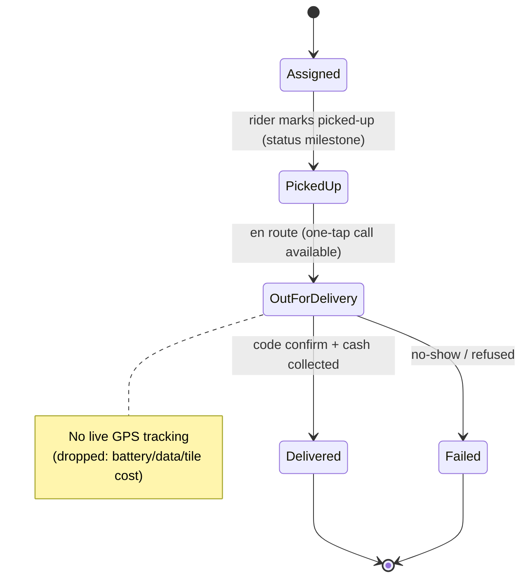
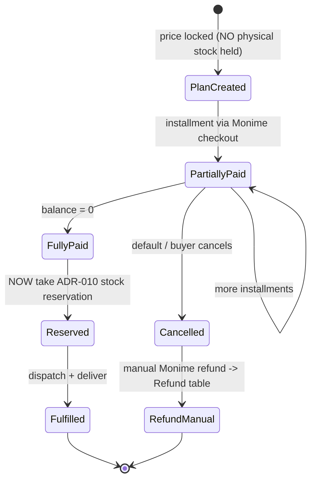

# 04 — Proposed Stand-Out Feature Set

> A research-backed, prioritized set of differentiated features that make Borteh Sprays 001 win in the Sierra Leone market — with value, effort, risk, dependencies, and a recommended launch phase for each.

> Part of the Borteh Sprays 001 planning set. See 00-index.md for the full set.

---

## 1. Purpose & how to read this document

This document answers one question for Mr. Borteh: **of all the things we *could* build, which features will actually move sales, trust, and repeat-buying in Sierra Leone — and in what order?**

It is a *recommendations* document, not a menu. Every feature below has an explicit verdict (**BUILD / BUILD-LATER / DEFER / SOFT-VERSION ONLY**) and a phase. The lead artifact is the **prioritized summary table (§3)**. The per-feature deep dives (§6) justify each call.

Conventions used here, per the canon's global authoring rules:

- **Confidence labels** on every market/quantitative claim: `[High]`, `[Medium]`, `[Low]`. Anything not a hard, citable fact is also tagged **(assumption to verify)**. Hard sourced statistics are deliberately *not* invented here — they live in `02-market-research.md`; this doc reasons qualitatively from the locked market context in the canon and flags what must be validated.
- **BLOCKED ON MONIME DOCS** marks anything we cannot finalize until official Monime documentation/support confirms it.
- **OWNER DECISION** marks a business call only Mr. Borteh can make.
- Decisions trace to ADRs (`11-adrs.md`); requirements trace to personas (Aminata / Mr. Borteh / Saidu / Shop Assistant).

Phase definitions (aligned with `13-roadmap.md`):

| Phase | Meaning | Rough window |
|---|---|---|
| **MVP** | The first shippable slice we dogfood internally + with a pilot group. Proves the core loop (browse → buy → pay → deliver). | ~Month 1–1.5 |
| **v1** | The **standard public launch** (the canon's committed target). Includes delivery, analytics, restock, wishlist, reviews — and the stand-out features that differentiate launch. | ~Month 3–4 |
| **Growth** | Post-launch, demand-validated, higher-risk or higher-ops features rolled out behind feedback. | Month 4+ |

Effort T-shirt sizing (one engineer-equivalent, *incremental* over already-committed architecture):

| Size | Rough scope |
|---|---|
| **S** | ~days to ~2 weeks; mostly config/UI on existing primitives. |
| **M** | ~2–4 weeks; new tables + edge function + UI + a process. |
| **L** | ~1–2 months+; new subsystem, ops policy, reconciliation, multi-surface. |

---

## 2. Prioritization method

Each candidate is scored on four axes, then placed on an impact/effort map and assigned a phase.

| Axis | Scale | What it captures |
|---|---|---|
| **SL-Value** | 1–5 | Fit to the *Sierra Leone reality* (connectivity, payments, trust, language, devices) and persona impact — not generic e-commerce value. |
| **Effort** | S / M / L | Incremental build cost on top of the committed stack (ADR-001…012). |
| **Risk** | L / M / H | Worst of {technical, legal/regulatory, operational, fraud}. |
| **Confidence** | High / Med / Low | Our confidence in the *value* claim given available evidence. |

The priority rank weights **high SL-Value × low Effort × low Risk × launch-differentiation**. A high-value feature can still be deferred if its risk or ops burden is unproven (e.g. layaway, reseller payouts) — we ship the *primitives* early and the *full feature* once demand is real.

---

## 3. Prioritized summary table (lead artifact)

Ranked by recommended build order. "Why it wins in SL" is the one-line thesis; full argument in §6.

| # | Feature | Primary persona | Why it wins in SL (thesis) | SL-Value | Effort | Risk | Confidence | Phase | Verdict |
|---|---|---|---|:--:|:--:|:--:|:--:|:--:|---|
| 1 | **Fast cached catalog / data-saver mode** | Aminata | Fast cold start and brief-dropout resilience (never a blank screen) plus frugal MB use; turns a market constraint into a moat | 5 | S | L | High | **MVP** | **BUILD** |
| 2 | **COD / cash + delivery confirmation (no SMS)** | Aminata / Saidu / Mr. Borteh | Makes the trusted cash path fraud-resistant with an in-app delivery code (no SMS); proof-of-delivery in a weak-addressing market | 4 | S | L | High | **v1** | **BUILD** |
| 3 | **In-app notifications + one-tap Call/WhatsApp** | Aminata / Mr. Borteh | Free in-app order updates (Realtime) plus one-tap Call (tel:) and WhatsApp click-to-chat (wa.me) from admin — no paid API | 5 | S | L | High | **v1** | **BUILD** |
| 4 | **Configurable loyalty & promotions** | Aminata / Mr. Borteh | Owner-tunable points, promo rules & loyalty cards (no code change) + referral; cheap repeat-purchase + word-of-mouth growth | 4 | M | M | Med-High | **v1** | **BUILD** |
| 5 | **Fragrance-finder quiz** | Aminata | Guides choice for online perfume buying (can't smell first); image-led, low-literacy friendly | 4 | M | L | Medium | **v1** | **BUILD** |
| 6 | **Sample / decant purchases** | Aminata | "Try before a full bottle" lowers price *and* trust barriers — the #1 objection to buying scent online | 4 | M | M | Medium | **v1** | **BUILD** |
| 7 | **Clear simple-English + legible / icon-supported UI** | Aminata | Clear simple English, icon-led, legible UI widens the reachable market and lowers first-purchase friction | 4 | S | L | Med-High | **v1** | **BUILD** |
| 8 | **Gifting / send-to-someone** | Aminata | Perfume is a gift category; diaspora-to-family sending is a real demand pocket | 3 | M | M | Medium | **v1** (local) / Growth (diaspora) | **BUILD (phased)** |
| 9 | **Reseller / social-commerce agent program** | Mr. Borteh / Aminata | Informal WhatsApp resale is how goods *already* move in SL — turn it into a zero-ad-spend distribution network | 5 | L | H | Medium | Growth (primitives in v1) | **BUILD-LATER** |
| 10 | **Simple rider delivery flow** | Saidu / Mr. Borteh | Assigned-orders list + drop-off details + one-tap call + mark picked-up/delivered + cash collected; no costly live GPS | 3 | S | L | High | **v1** | **BUILD** |
| 11 | **Designer "smell-alike" / dupe finder** | Aminata | Price-sensitive buyers shop by "smells like ___"; strong conversion — but trademark risk is real | 4 | M | **H (legal)** | Medium | Growth (legal-gated); soft "scent twin" in v1 | **SOFT-VERSION ONLY (pending counsel)** |
| 12 | **Layaway / "pay small small" installments** | Aminata | Susu-style paying over time fits cash-flow reality for big bottles — but credit/ops/regulatory risk is high | 4 | L | **H** | Medium | Growth (manual pilot first) | **DEFER** |

---

## 4. Impact vs effort map



Reading: the **quick-wins** cluster (top-left) is the v1 standout backbone — and several got *cheaper* under the v2 decisions (no SMS, no paid messaging API, no live GPS). **Reseller agents** is the one genuine *big bet* — highest growth ceiling, highest effort/risk — hence "build the primitives in v1, ship the program in Growth." **Layaway** sits toward "high effort, moderate impact" → defer.

---

## 5. Phasing overview



**Sequencing logic:** the cached catalog is foundational (everything else assumes a usable catalog over bad networks). Trust + reach features (COD/cash + delivery confirmation, in-app notifications + one-tap Call/WhatsApp, configurable loyalty, quiz, decants, accessible simple-English UI, simple rider flow) cluster into v1 because they directly attack the *online-shopping-trust* problem the canon flags as the core market barrier — and most got cheaper under v2 (no SMS, no paid messaging API, no live GPS). The highest-ceiling but highest-risk levers (reseller payouts, layaway credit, dupe legal) are deliberately pushed to Growth where we can validate demand and de-risk ops first; optional in-app customer↔store chat is a deferrable v1.5.

---

## 6. Per-feature deep dives (recommended, in build order)

Each entry follows the same shape: **what · value (SL) · effort · risk · dependencies · phase + recommendation**.

---

### 6.1 Fast cached catalog / data-saver mode — **BUILD (MVP)** · #1

**What.** The last-loaded product catalog is kept in a small **read-only cache** so cold start and a brief connectivity dropout never show a blank screen; the cache is refreshed whenever the device is online and never queues writes. An explicit **Data-Saver** toggle minimizes bytes (defer/skip images, lower-res WebP, text-only mode, "load image" tap-to-reveal).

**Value (SL).** This is the single feature most aligned with the locked market reality. Connectivity is intermittent and often 2G/3G, and data is expensive per-MB `[High — from canon]`. An app that re-fetches everything on every open is unusable on a bush-taxi or in a low-signal neighborhood; ours stays readable from its cached catalog and is frugal with MB. It directly protects the performance budgets in the canon (first catalog payload < ~150 KB on 3G; instant cached browse on cold start and during brief dropouts). It also *reduces cost-to-shop* for Aminata, which is itself a trust and conversion signal. **Verdict: not optional — it is the moat.** `[High]`

**Effort: S.** Online-first with light read caching (**ADR-003**): Postgres remains the single source of truth; the client uses **TanStack Query** for in-memory response caching plus HTTP/image caching, and keeps a small **read-only persisted cache** of the last-loaded catalog (refreshed when online, never reconciled, never queues writes). The *incremental* work is: the data-saver UX layer, image lazy/deferred loading policy, and a "last updated 2h ago" freshness label. The server is always authoritative; writes (cart, wishlist-add, restock-subscribe) **require connectivity** and surface clear offline / Retry states — they are never queued for later replay. Because there is **one store but an unlimited catalog** (v2), the same layer scales reads cheaply: keyset (cursor) pagination, Postgres **GIN trigram / full-text** search indexes on product/brand/notes, **Supabase Storage CDN** image delivery, and lazy thumbnails keep payloads small regardless of catalog size.

**Risk: L.** Because the cache is **read-only** and refreshed whenever online, the only hazard is a shopper briefly seeing stale stock from the last cached load — a shopper could tap an item that just sold out. Mitigations: live stock freshness via Supabase Realtime `availability_signal` (band-only) while online; final availability is confirmed server-side at checkout via the **ADR-010** reservation RPC (`SELECT … FOR UPDATE` / atomic conditional update). Secondary risk: cache bloat on low-storage devices → cap cache size, store thumbnails by URL not blob, evict cold images.

**Dependencies.** ADR-003, ADR-010; entities `Product`, `ProductVariant`, `ProductImage`, per-variant stock balance (`qty_on_hand`/`qty_reserved`); siblings `05-system-architecture.md`, `06-data-model.md`, `07-api-design.md`.

**Caching sketch (pseudocode, not implementation):**

```
on app_foreground / connectivity_restored:
    if online:
        page = GET /catalog?cursor=<keyset>&limit=N     # keyset paginated, WebP, no full-res
        render(page) and refresh read-only cache (products, variants, images-meta)
    else:
        render(last read-only cache)                    # no blank screen; show "last updated 2h ago"
# Writes (cart, wishlist-add, restock-subscribe) REQUIRE connectivity:
#   if offline -> show offline / Retry state; never queue for later replay
# Supabase Realtime "availability_signal" patches the stock band for visible items while online
```

---

### 6.2 COD / cash + delivery confirmation (no SMS) — **BUILD (v1)** · #2

**What.** **Cash is a first-class payment option** — Cash-on-Delivery and cash-at-pickup, alongside Monime (a must in SL `[High — canon]`). Harden it without any SMS: when an order is dispatched, generate a short **delivery confirmation code** shown to the buyer **in their in-app order screen** (Supabase Realtime — free, no SMS). Saidu marks the order delivered only by entering the code the customer reads to him at handover, then records cash collected. The code is proof-of-delivery and proof the right person received it. For phone-in orders the owner reads the code to the buyer on the call.

**Value (SL).** Online-shopping trust is still developing and formal addressing is weak (landmarks/GPS pins). Cash/COD is the trust bridge — but cash without confirmation invites disputes ("I never received it"), rider skimming, and fake-address fraud. The in-app confirmation code gives **transparent, verifiable handover** for all sides: the customer feels safe paying cash; Mr. Borteh gets an auditable delivery + cash-collected record (`DeliveryJob.cod_collected_minor`); Saidu gets protection against false "not delivered" claims. This is fraud resistance the canon explicitly asks us to design for — at **zero messaging cost**. `[High]`

**Effort: S.** Code generation on dispatch, secure storage (hashed), display in the buyer's in-app order screen via Realtime, rider-app entry screen, binding to `DeliveryJob` + `Order` + `OrderStatusHistory`, and cash reconciliation. No SMS/OTP gateway, no paid messaging — it rides the free in-app notification + Realtime layer (ADR-007, ADR-011).

**Risk: L.** No SMS means no deliverability/cost dependency. (1) Riders are offline in low-signal areas — the code check must work **offline**: pre-issue the hashed code to the assigned rider's device at pickup so verification is local; sync the "delivered + cash collected" event when back online. (2) Buyer can't reach the in-app code (rare) → rider confirms via a signed "delivered + cash collected" action that requires later owner reconciliation, or the owner reads the code on a call. (3) UX friction for low-literacy users → large digits and clear, simple-English instructions. (4) Cash handling/skim risk is mitigated by the per-order cash-collected record + reconciliation, not by messaging.

**Dependencies.** ADR-007 (in-app notification + Realtime), ADR-011 (cron sweeps), ADR-010 (reservation→confirm on cash acceptance); entities `Order`, `OrderItem`, `OrderStatusHistory`, `DeliveryJob`, `Rider`, `Notification`; siblings `07-api-design.md`, `09-security-threat-model.md`.



---

### 6.3 In-app notifications + one-tap Call/WhatsApp — **BUILD (v1)** · #3

**What.** Customer-facing order lifecycle updates (confirmed → packed → dispatched → out-for-delivery → delivered) and restock-available alerts flow to a free **in-app notification feed** (Supabase Realtime + a `Notification` table). Store→customer contact is **one-tap Call (`tel:`)** and **WhatsApp click-to-chat (`https://wa.me/<number>?text=...`)** deep links from the admin order screen, using the customer's phone number — **no SMS, no WhatsApp/Meta API, zero cost**. Optional **free Expo/FCM push** can wake users later (Could). An in-app customer↔store chat is a deferrable **v1.5** (see §8).

**Value (SL).** WhatsApp is a key comms channel in SL `[High — canon]` and is where buyers already are — and the owner *already* messages and calls customers manually. We lean into that: the buyer gets free, real-time order/restock updates in the app, and the owner reaches any customer in one tap (Call or WhatsApp click-to-chat, pre-filled with the order context) straight from the admin order screen. This delivers the *transparency/trust* mandate **without** paid messaging, Meta Business verification, or per-conversation pricing. It also seeds the reseller channel (§6.9). `[High]`

**Effort: S.** A `Notification` table + Supabase Realtime subscription + an in-app feed UI, plus `tel:`/`wa.me` deep-link buttons on the admin order screen (with a pre-filled message template string). No Cloud API, no Meta template approval, no webhooks, no SMS routing. Notification preferences per `NotificationPreference`.

**Risk: L.** No API to approve, no Meta verification, no per-conversation pricing, no SMS bill. The main residual risk is **reach when the app is closed** — the in-app feed is only seen on next open. Mitigations: the owner's one-tap Call/WhatsApp covers anything urgent today (free), and optional free Expo/FCM push can be added later (Could) for background wake. Deep links open the user's own WhatsApp/dialer, so there is no platform dependency to manage.

**Dependencies.** ADR-007 (in-app notifications), ADR-011 (fan-out jobs); entities `Notification`, `NotificationPreference`, `Order`, `OrderStatusHistory` (plus proposed `Conversation`/`Message` for the v1.5 chat); siblings `07-api-design.md`, `12-risks-assumptions.md`.

**OWNER DECISION.** Confirm the store WhatsApp number + dialer number used for the admin one-tap Call/WhatsApp click-to-chat links (no Meta verification or API needed).

---

### 6.4 Configurable loyalty & promotions — **BUILD (v1)** · #4

**What.** An **owner-editable** loyalty & promotions engine — tuned entirely in the admin, **no code change** (new **ADR-012**). It comprises: `loyalty_config` (singleton: `points_per_currency_unit`, `point_value_minor`, `points_expiry_days`, feature on/off flags); `promo_rule` (many: `rule_type` e.g. order-spend-threshold discount / points-earn / loyalty-card grant, `threshold_minor`, `discount_type` percent|fixed, `discount_value`, `scope` all|category|brand|product, `active_from`/`active_to`, usage caps); `loyalty_tier`/`loyalty_card` (`cumulative_spend_threshold_minor` → grants a card/tier with an ongoing configurable `discount_percent`); `loyalty_account` (per user: `points_balance`, `lifetime_spend_minor`, current tier/card); and an append-only `loyalty_ledger`. Plus a **referral** mechanic where a share-code rewards both referrer and new buyer on the new buyer's first completed order. Discounts/thresholds/rates/points are all evaluated at checkout against the active rules + the user's tier/card.

**Value (SL).** Three compounding wins. (1) **Retention** — perfume is repeat-purchase; points and loyalty-card discounts nudge the next bottle. (2) **Referral growth at ~zero ad spend**, which is decisive under the minimal-budget constraint and fits SL's strong word-of-mouth + WhatsApp-sharing behavior `[Medium — assumption to verify; word-of-mouth strength is qualitative]`. (3) **Owner can tune economics live** — earn rate, point value, spend thresholds, promo windows, and tier discounts are all edited in the admin, so Mr. Borteh can run promotions and adjust margins without a release. Points also reward **reviews** (which feed the trust loop) and **cash/COD reliability** (e.g. bonus for not refusing COD). `[Med-High]`

**Effort: M.** The config + rule tables above (`loyalty_config`, `promo_rule`, `loyalty_tier`/`loyalty_card`, `loyalty_account`), an append-only `loyalty_ledger` (mirror the stock_ledger discipline — never mutate balances, post entries), a referral attribution table, an **admin editing UI** for the rules, and a checkout evaluator + earn/burn rules in an Edge Function fired on `Order=COMPLETED`. Keep it **rules-based and integer-minor-unit** (ADR-009) — no floats, no ML.

**Risk: M.** Referral/loyalty fraud (self-referral, fake accounts, COD-refusal farming). Mitigations: reward only on **completed + paid/accepted** orders (not on order creation), cap referrals per account, **phone-uniqueness** (one account per phone number — phone + password identity, ADR-004), velocity checks (`09-security-threat-model.md`), plus owner-set usage caps on each `promo_rule`. Accounting risk handled by the append-only ledger + reconciliation.

**Dependencies.** ADR-009 (money/minor units), ADR-011 (award/expiry jobs), **ADR-012** (configurable loyalty & promotions); entities `loyalty_config`, `promo_rule`, `loyalty_tier`/`loyalty_card`, `loyalty_account`, `loyalty_ledger`, `Order`, `User`, `Review`; siblings `06-data-model.md`, `09-security-threat-model.md`, `10-admin-analytics.md`.



**Ledger sketch (schema, not implementation):**

```
loyalty_ledger(
  id, account_id, order_id?, type ENUM(earn_purchase, earn_review,
  earn_referral, burn_redeem, expire, adjust), points INT,        -- signed
  reason TEXT, created_at )                                         -- append-only
balance(account) = SUM(points) WHERE account_id = ?                -- never stored mutably
-- discounts/thresholds/rates are read from loyalty_config + promo_rule (owner-editable)
```

---

### 6.5 Fragrance-finder quiz — **BUILD (v1)** · #5

**What.** A short, image-led quiz (occasion, vibe, sweet/fresh/woody/spicy, gender preference, budget band) that maps to a ranked shortlist of products using the existing `ScentNote` / `ProductScentNote` graph and the `Gender` attribute.

**Value (SL).** Buying perfume online means you **can't smell it first** — the core objection. A guided quiz substitutes for the in-store "what do you like?" conversation, reduces choice paralysis, and is **low-literacy friendly** when built image-/icon-first (pairs with §6.7). It increases conversion and average basket relevance, captures a reusable **scent profile** for personalization + restock targeting, and generates `AnalyticsEvent` signal for Mr. Borteh's merchandising. `[Medium]` — value is well-established in perfume e-commerce generally **(assumption to verify for SL specifically)**.

**Effort: M.** A rules/weights engine (no ML — frugal), question UI, and a scoring pass over `ProductScentNote` positions (top/heart/base). Works against the read-only cached catalog during a brief dropout (results are deterministic from cached data); the chosen profile is saved server-side when online.

**Risk: L.** Main risk is mediocre recommendations damaging trust → keep it transparent ("we picked these because you like *sweet + warm*"), let users tweak, and curate weights with Mr. Borteh's domain knowledge. Cold-start is mild because the catalog is small/curated.

**Dependencies.** Entities `ScentNote`, `ProductScentNote`, `Product` (Gender), `ProductVariant` (price band), `AnalyticsEvent`; new lightweight `ScentProfile` on `User` (proposed addition to `06-data-model.md`). Siblings `03-prd.md`, `10-admin-analytics.md`.



---

### 6.6 Sample / decant purchases — **BUILD (v1)** · #6

**What.** Sell small **decants** (e.g. 2 ml / 5 ml) of popular scents as low-price `ProductVariant`s so buyers can try before committing to a full bottle, optionally with a **"sample credit"** that refunds the decant price against a later full-bottle purchase.

**Value (SL).** Attacks both barriers at once: **price** (a Le X decant vs an expensive full bottle in a cash-constrained market) and **trust** ("can't smell it online"). It is arguably the strongest *conversion-and-trust* lever after the cached catalog + in-app comms, and it's a natural fit for the reseller channel (agents carry decant kits). Decants also **de-risk inventory** — a bottle that's slow to sell whole can move as samples. `[Medium]`

**Effort: M.** The data model already supports it: decants are just `ProductVariant`s with small `size_ml` and their own `sku`/`price_minor`. The real work is **operational + inventory accounting**: decanting one source bottle into many samples must post `stock_ledger` movements that reduce the parent bottle's tracked volume and create decant stock — model as an `adjustment` ledger event ("1 × 100 ml bottle → N × 5 ml decants, with spillage loss") against the per-variant balance. Sample-credit is a `promo_rule`/loyalty entry.

**Risk: M.** Operational: decanting labor, hygiene, leakage in delivery, and **authenticity perception** (buyers must trust a decant is the real juice) — mitigate with sealed, labelled, branded decant vials and a "verified decant" note. Accounting: partial-bottle volume tracking is fiddly; keep it as a periodic **manual adjustment** rather than per-spray precision. **OWNER DECISION:** which scents to offer as decants, vial sizes, and pricing.

**Dependencies.** ADR-010 (stock_ledger + per-variant balance), ADR-009 (pricing minor units); entities `ProductVariant`, `stock_ledger`, per-variant balance (`qty_on_hand`/`qty_reserved`), `promo_rule`/`loyalty_ledger` (sample credit); siblings `06-data-model.md`, `10-admin-analytics.md`.

**Decant ledger sketch:**

```
-- Decanting run: split a 100ml parent into 18×5ml (10ml spillage/loss)
stock_ledger += { variant: parent_100ml, type: 'adjustment', qty: -1, reason:'decant_run #R' }
stock_ledger += { variant: decant_5ml,   type: 'adjustment', qty: +18, reason:'decant_run #R' }
-- loss is implicit (90ml usable / 100ml); track yield assumption per scent, verify over time
```

---

### 6.7 Clear simple-English + legible / icon-supported UI — **BUILD (v1)** · #7

**What.** **Clear, simple-English** copy throughout, **icon-first** navigation, and legible, large-touch-target layouts at high-friction points (login, checkout, the delivery confirmation code) so first-time and low-literacy users can complete a purchase with confidence.

**Value (SL).** Many target users are low-literacy and on small/old screens. A clear, simple-English, icon-led, legible UI widens the addressable market and lowers the comfort barrier to a *first* online purchase — directly serving Aminata's "prefers simple, clear English" profile. Accessibility here is market expansion, not a nicety. `[Med-High]`

**Effort: S.** Clear-English microcopy + an icon system + legible, large-touch-target layouts are UI/content work on the already-committed RN/Expo build — no new subsystem.

**Risk: L.** Main risk is icon ambiguity (an icon that isn't self-evident) → pair every icon with a short, clear-English label and validate with users; nothing else new to carry.

**Dependencies.** ADR-001 (RN/Expo UI); content/microcopy guidelines; siblings `03-prd.md`, `05-system-architecture.md`.

---

### 6.8 Gifting / send-to-someone — **BUILD phased: local (v1), diaspora (Growth)** · #8

**What.** Buy for someone else: a **recipient** `DeliveryLocation` distinct from the buyer, an optional gift message, a "hide prices on the delivery slip" flag, and recipient phone confirmation. Later: a **diaspora** flow (someone abroad buys, recipient in SL receives).

**Value (SL).** Perfume is a classic **gift** category (occasions, courtship, family). The standout sub-case is **diaspora-to-family**: Sierra Leoneans abroad sending a tangible, premium gift home — a real, emotionally-charged demand pocket adjacent to remittances `[Medium — assumption to verify market size]`. Even the local version lifts basket size and acquisition (the recipient becomes a new customer). `[Medium]`

**Effort: M (local) / +M (diaspora).** Local: recipient delivery location + gift message + price-hidden slip + recipient notification (in-app + owner one-tap call). Diaspora adds the hard part — **payment from abroad**: Monime is **SLE-only** (ADR-009), so a foreign buyer cannot pay via SL mobile money. Diaspora gifting needs an international card path (does Monime hosted Checkout accept international cards? **BLOCKED ON MONIME DOCS**) or an alternative rail — hence Growth.

**Risk: M.** Recipient address quality (lean on landmark/GPS pins + phone confirm), gift-fraud (stolen-card "gifts" to a third party — fraud controls in `09-security-threat-model.md`), and the diaspora payment-rail uncertainty above.

**Dependencies.** Entities `Order` (gift flag + message), `DeliveryLocation` (recipient), `DeliveryZone`, `Notification`, `PaymentIntent`/Monime (ADR-006); siblings `08-payments-monime.md`, `09-security-threat-model.md`.

---

### 6.9 Reseller / social-commerce agent program — **BUILD-LATER (Growth; primitives in v1)** · #9

**What.** A formal **agent** role: trusted people resell Borteh's catalog to their own WhatsApp/social network using shareable product cards + a personal referral/agent code; orders attributed to an agent earn **commission** tracked in an append-only ledger and paid out periodically. An agent dashboard shows their sales and earnings.

**Value (SL).** This is the **highest growth ceiling** on the list. Informal resale ("I sell things on WhatsApp") is *already* a dominant way goods move in SL `[Medium — assumption to verify]`, and it converts on **personal trust** — the exact thing online-first commerce lacks. It turns Borteh's catalog into a distributed salesforce at **near-zero ad spend** (decisive under the minimal-budget constraint), extends reach beyond Freetown, and pairs perfectly with decants (§6.6) as agent sample kits and the free in-app notifications + WhatsApp click-to-chat (§6.3). `[Medium]`

**Effort: L.** Agent role + onboarding, order **attribution** (referral code / agent-specific shareable links → which order belongs to which agent), an append-only **commission ledger** (loyalty_ledger-style discipline), **payout** processing + reconciliation, agent dashboard, and shareable web product pages (works without the app, for WhatsApp recipients). Reuses the v1 referral primitives (§6.4) — which is why we **build those primitives in v1** and the full program in Growth.

**Risk: H.** Commission **fraud** (agents gaming attribution, self-dealing, fake orders for commission then COD-refusal), **payout operations** (manual payouts, no Monime payout/disbursement primitive confirmed — **BLOCKED ON MONIME DOCS**), **price control / channel conflict** (agents undercutting or over-promising), and **tax/regulatory** treatment of commissions (**flag to counsel — assumption to verify**). Mitigations: pay commission only on **completed + reconciled** orders, agent KYC-lite, caps + velocity checks, clear agent policy, and manual payout reconciliation initially.

**Dependencies.** Builds on §6.3 (in-app notifications + WhatsApp click-to-chat), §6.4 (referral primitives), §6.6 (decant kits); entities — extend `User.role` with `agent`, plus **proposed additions** to `06-data-model.md`: `AgentProfile`, `OrderAttribution`, `CommissionLedger`, `Payout`. Siblings `09-security-threat-model.md`, `10-admin-analytics.md`, `12-risks-assumptions.md`. **OWNER DECISION:** commission rates, payout cadence, agent vetting.



---

### 6.10 Simple rider delivery flow — **BUILD (v1)** · #10

**What.** The rider opens an **assigned-orders list**, each showing the order items + drop-off details (`landmark_text`, GPS pin, contact phone) with **one-tap call**, and can **mark picked-up / delivered** and **record cash collected** (ties into §6.2's confirmation code). The customer sees plain **status milestones** in the in-app feed ("packed → dispatched → out for delivery → delivered"). **No live GPS tracking** — continuous rider-location streaming is dropped (far-future at best); see §8.

**Value (SL).** Clear status milestones + a one-tap call build delivery trust and cut "where is my order?" support load — and capture almost all of the trust value of live tracking at a fraction of the cost. The *incremental* value of continuous live GPS over good milestones is **moderate**, while its battery/data/map-tile costs cut against the frugality driver — so we don't build it. `[Medium]`

**Effort: S.** The rider list, drop-off detail screen, one-tap call, and picked-up/delivered + cash-collected actions reuse `DeliveryJob`/`OrderStatusHistory` + Realtime/in-app notifications — cheap, and they share the §6.2 confirmation-code plumbing. No location streaming, no map-tile provider, no continuous GPS to drain Saidu's **basic Android** (persona).

**Risk: L.** Without live GPS there is no location-streaming cost, battery drain, map-tile bill, or rider/customer location-privacy exposure. Residual risk is only the usual delivery ops (no-show, refused) — handled by the `Failed` status path and owner follow-up via one-tap call.

**Dependencies.** ADR-008 (in-house dispatch), Realtime; entities `DeliveryJob`, `Rider`, `DeliveryLocation`, `DeliveryZone`; siblings `05-system-architecture.md`, `13-roadmap.md`.



---

### 6.11 Designer "smell-alike" / dupe finder — **SOFT-VERSION ONLY in v1; full feature legal-gated (Growth)** · #11

**What.** Help price-sensitive buyers find affordable scents similar to expensive designer fragrances. **Hard recommendation: do NOT ship an explicit "smells like *Brand X*" dupe matcher at launch.** Instead ship a **soft "scent twin / similar scent"** finder that recommends *within Borteh's own catalog* by shared `ScentNote` profile, without naming third-party trademarks.

**Value (SL).** Commercially strong — price-sensitive buyers genuinely shop by "smells like ___", so this converts `[Medium]`. But the value is realizable through the *soft* version (scent-family similarity, reuses §6.5's engine) **without** taking on the legal exposure of explicit brand-comparison claims.

**Effort: M.** Soft version is nearly free — it's the quiz/recommendation engine (§6.5) applied as "more like this." The full named-dupe version additionally needs a **curated dupe mapping** (a self-referential `ProductSimilarity` / `InspiredBy` relation) and careful editorial framing.

**Risk: H (legal).** Explicit "dupe of *Brand X*" or "smells exactly like *Brand X*" claims invite **trademark / passing-off / comparative-advertising** disputes and damage brand relationships. This must be reviewed with counsel before any named comparison ships — **flag, do not assert legal specifics** (consistent with the canon's regulatory stance). `[Low confidence on legal outcome — assumption to verify with counsel]`

**Dependencies.** §6.5 engine; entities `ScentNote`, `ProductScentNote`; **proposed** `ProductSimilarity(product_a, product_b, similarity, basis)` for the soft version (no third-party names). Siblings `09-security-threat-model.md`, `12-risks-assumptions.md`. **OWNER + LEGAL DECISION** before any named-brand comparison.

---

### 6.12 Layaway / "pay small small" installments — **DEFER (Growth; manual pilot first)** · #12

**What.** Let a buyer reserve a higher-priced bottle and pay it off in several smaller mobile-money payments ("pay small small"), receiving the item once fully paid (or after a deposit, per policy).

**Value (SL).** Culturally and economically resonant — informal **susu/osusu** rotating-savings behavior is common in West Africa `[Medium — assumption to verify for SL]`, and paying over time fits cash-flow reality for premium bottles. Genuine differentiation. `[Medium]`

**Effort: L.** Payment **scheduling**, multiple `PaymentIntent`s over time, partial-payment accounting, default/cancellation handling + refunds-of-deposits, and reconciliation. Monime has **no installment/recurring primitive** confirmed (BLOCKED ON MONIME DOCS) and **no refund API** as of 2026-05 (refunds are manual in the Monime dashboard, recorded in our `Refund` table) — so layaway means a **sequence of independent hosted Checkout Sessions** plus heavy manual reconciliation.

**Risk: H.** (1) **Inventory** — do **not** hold physical stock against a long-running layaway (ADR-010 reservations are deliberately *time-boxed*; an indefinite hold starves in-store/online sale). Model layaway as a **price-locked claim fulfilled at payoff**, not a stock reservation. (2) **Default / refund** ops (manual refunds, no refund API). (3) **Regulatory** — paying over time can resemble consumer **credit / installment finance**, with KYC/consumer-protection implications — **flag to counsel, do not assert** `[Low — assumption to verify]`. (4) Fraud/abandonment.

**Recommendation.** **Defer to Growth and pilot manually first** (Mr. Borteh handles a handful of layaways by hand via the admin, recording payments against an order) before building any automated subsystem. Only automate once demand and default behavior are observed.

**Dependencies.** ADR-006 (PaymentProvider), ADR-009 (minor units), ADR-010 (do-not-reserve-stock nuance), `Refund`; **proposed** `LayawayPlan` + `LayawayInstallment`. Siblings `08-payments-monime.md`, `09-security-threat-model.md`, `12-risks-assumptions.md`.



---

## 7. Cross-cutting dependencies & data-model touchpoints

Several features share primitives — building them in the right order avoids rework. Proposed *new* entities are flagged for adoption in `06-data-model.md` (the data-model doc remains the source of truth).

| Shared primitive | Feeds features | Status |
|---|---|---|
| Read-only catalog cache + data-saver (ADR-003) | 6.1, and cached-read behavior of 6.5/6.6 | Committed (ADR-003) |
| In-app notifications + Realtime fan-out (ADR-007/011) | 6.2, 6.3, parts of 6.4/6.8 | Committed (ADRs); no SMS/WhatsApp API |
| Append-only ledger pattern (ADR-009/010/012) | 6.4 (loyalty_ledger), 6.6 (stock_ledger decants), 6.9 (CommissionLedger) | Pattern committed; new ledgers proposed |
| Referral attribution | 6.4 (referral) → reused by 6.9 (agent attribution) | **Build in v1**, reuse in Growth |
| Recommendation/scent engine | 6.5 (quiz) → reused by 6.11 soft "scent twin" | Build once in v1 |
| Reservation RPC (ADR-010) | 6.2 (confirm on cash acceptance), 6.6 (decant stock), 6.12 (payoff→reserve nuance) | Committed (ADR-010) |

**Proposed new entities for `06-data-model.md`:** the configurable loyalty/promotions set (`loyalty_config`, `promo_rule`, `loyalty_tier`/`loyalty_card`, `loyalty_account`, `loyalty_ledger` — per ADR-012), plus `ScentProfile` (on/for User), `OrderAttribution`, `AgentProfile`, `CommissionLedger`, `Payout`, `ProductSimilarity` (soft, no third-party names), `LayawayPlan`, `LayawayInstallment`, and (for the v1.5 chat) `Conversation`/`Message`. All reuse existing patterns (append-only ledgers, minor units, status-guarded updates).

---

## 8. What we explicitly DEFER or down-scope — and why

Being decisive includes saying "not now":

| Feature | Decision | Why |
|---|---|---|
| Live GPS rider tracking | Removed / far-future | Battery/data/map-tile cost vs the frugality driver; the simple rider flow (status milestones + one-tap call) delivers the trust value for far less. |
| Paid messaging (SMS, WhatsApp/Meta API) | Not integrated | Too costly/heavy; replaced by the free in-app feed + one-tap Call/WhatsApp click-to-chat. |
| In-app customer↔store chat | Deferrable v1.5 (Should/Could) | Nice-to-have on top of the free in-app feed; not required for v1. |
| Named designer dupe matcher | Ship soft "scent twin" only; full version legal-gated | Trademark / comparative-advertising exposure; need counsel before naming brands. |
| Layaway "pay small small" | Defer; manual pilot first | High ops/credit/regulatory risk; no Monime installment/refund primitives; don't tie up stock. |
| Diaspora gifting payments | Local gifting only in v1 | Monime is SLE-only; international card path unconfirmed (BLOCKED ON MONIME DOCS). |
| Reseller payouts (automated) | Manual reconciliation initially | No confirmed Monime disbursement/payout primitive; fraud surface needs observation. |

---

## 9. Decisions needed from Mr. Borteh (owner inputs)

1. **Decant program (6.6):** which scents, vial sizes (2 ml/5 ml?), pricing, and willingness to operate decanting.
2. **Loyalty & promotions economics (6.4):** initial `loyalty_config` values (earn rate, point value, expiry), promo rules, and tier/card thresholds + discounts — all editable later in admin (must be sustainable on integer minor units).
3. **Store contact number (6.3):** the WhatsApp + dialer number used for the admin one-tap Call/WhatsApp click-to-chat links (no Meta verification or API needed).
4. **Reseller program (6.9):** commission rates, payout cadence, and agent vetting standards.
5. **Smell-alike (6.11):** appetite for named-brand comparison *only after* legal sign-off.
6. **Layaway (6.12):** willingness to run a small manual pilot before any build.

---

## 10. Open questions / BLOCKED ON MONIME DOCS

- **Customer comms need no paid API or SMS** (v2): order/restock updates use the free in-app feed (Realtime) and the owner reaches customers via one-tap Call/WhatsApp click-to-chat. Optional free Expo/FCM push (Could) is the only later add — no Meta verification or SMS aggregator to procure.
- **Diaspora / international card acceptance** on Monime hosted Checkout (6.8) — **BLOCKED ON MONIME DOCS**.
- **Monime payout / disbursement** primitive for agent commissions (6.9) — **BLOCKED ON MONIME DOCS**; assume manual payouts.
- **Monime installment / recurring** support and **refund API** (6.12) — **BLOCKED ON MONIME DOCS**; refunds are manual in the dashboard, recorded in `Refund` (per canon, as of 2026-05).

---

## 11. Assumptions to verify (confidence register)

| Claim | Confidence | Verify via |
|---|---|---|
| Connectivity is intermittent/2G-3G and data is costly per-MB | High (canon) | 02-market-research.md |
| WhatsApp is the dominant rich comms channel in SL | High (canon) | 02-market-research.md |
| Mobile money (Orange/Africell) dominates; cash/COD still important | High (canon) | 02-market-research.md |
| Many target users are low-literacy / new to online shopping | High (canon) | 02-market-research.md |
| Word-of-mouth / informal WhatsApp resale is a primary distribution mode | Medium | Field interviews; 02-market-research.md |
| Susu/osusu pay-over-time behavior makes layaway resonate | Medium | Field interviews; 02-market-research.md |
| "Try-before-buy" decants materially lift perfume conversion in SL | Medium | Pilot A/B; 10-admin-analytics.md |
| Diaspora-to-family gifting is a sizable demand pocket | Medium | Market interviews |
| Named-dupe marketing is legally safe in SL | Low | **Counsel review** |

*No hard statistics are asserted in this document; quantitative market sizing is owned by `02-market-research.md`.*

---

## 12. Traceability (feature → persona/goal → ADR)

| Feature | Persona served | Goal | ADR anchor |
|---|---|---|---|
| 6.1 Fast cached catalog + data-saver | Aminata | Browse cheaply over bad networks | ADR-001, ADR-003, ADR-010 |
| 6.2 COD/cash + delivery confirmation | Aminata / Saidu / Mr. Borteh | Trusted, fraud-resistant cash delivery (no SMS) | ADR-007, ADR-010, ADR-011 |
| 6.3 In-app notify + Call/WhatsApp | Aminata / Mr. Borteh | Transparent order tracking (no paid API) | ADR-007, ADR-011 |
| 6.4 Configurable loyalty & promotions | Aminata / Mr. Borteh | Owner-tunable retention + low-cost growth | ADR-009, ADR-011, ADR-012 |
| 6.5 Fragrance quiz | Aminata | Confident choice without smelling | ADR-005 (REST), ADR-008 (analytics) |
| 6.6 Decants / samples | Aminata | Lower price + trust barrier | ADR-009, ADR-010 |
| 6.7 Clear simple-English + legible UI | Aminata | Inclusion / first-purchase comfort | ADR-001 |
| 6.8 Gifting | Aminata | Gift + diaspora demand | ADR-006, ADR-009 |
| 6.9 Reseller agents | Mr. Borteh / Aminata | Zero-ad-spend distribution | ADR-006, ADR-007, ADR-009 |
| 6.10 Simple rider delivery flow | Saidu / Mr. Borteh | Delivery transparency, low cost | ADR-008 |
| 6.11 Smell-alike (soft) | Aminata | Price-led discovery (safely) | ADR-005, ADR-008 |
| 6.12 Layaway | Aminata | Pay over time for big bottles | ADR-006, ADR-009, ADR-010 |

---

*End of 04-standout-features.md. Next: see `03-prd.md` for requirements detail, `06-data-model.md` for entity definitions (including proposed additions above), `08-payments-monime.md` for payment mechanics, and `13-roadmap.md` for the master phasing.*
