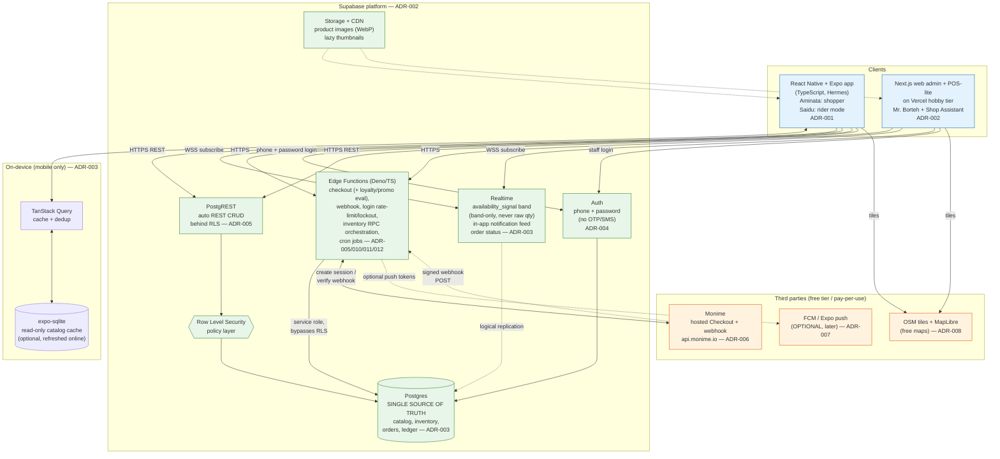
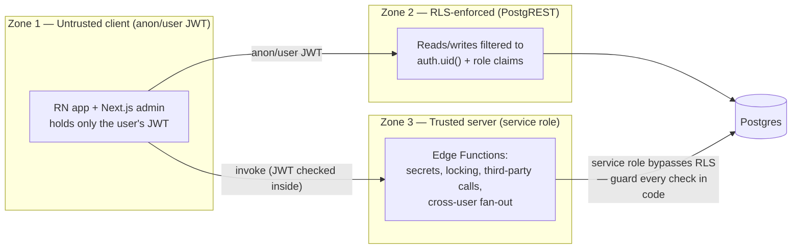
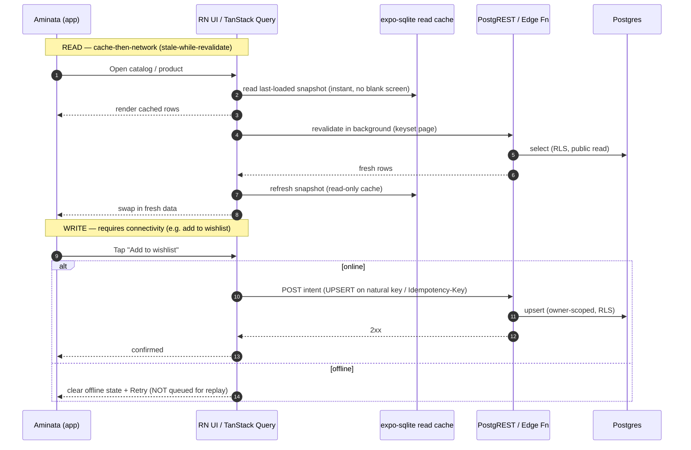
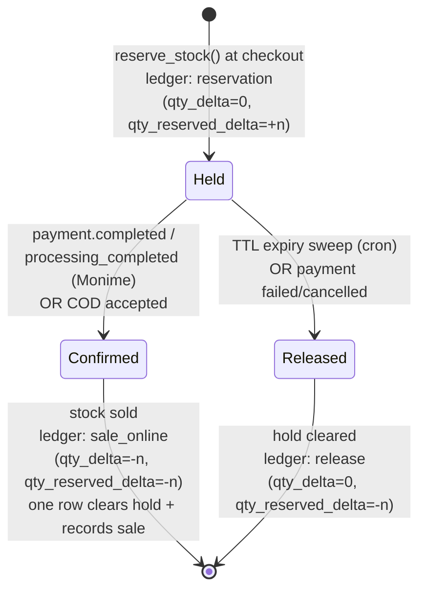
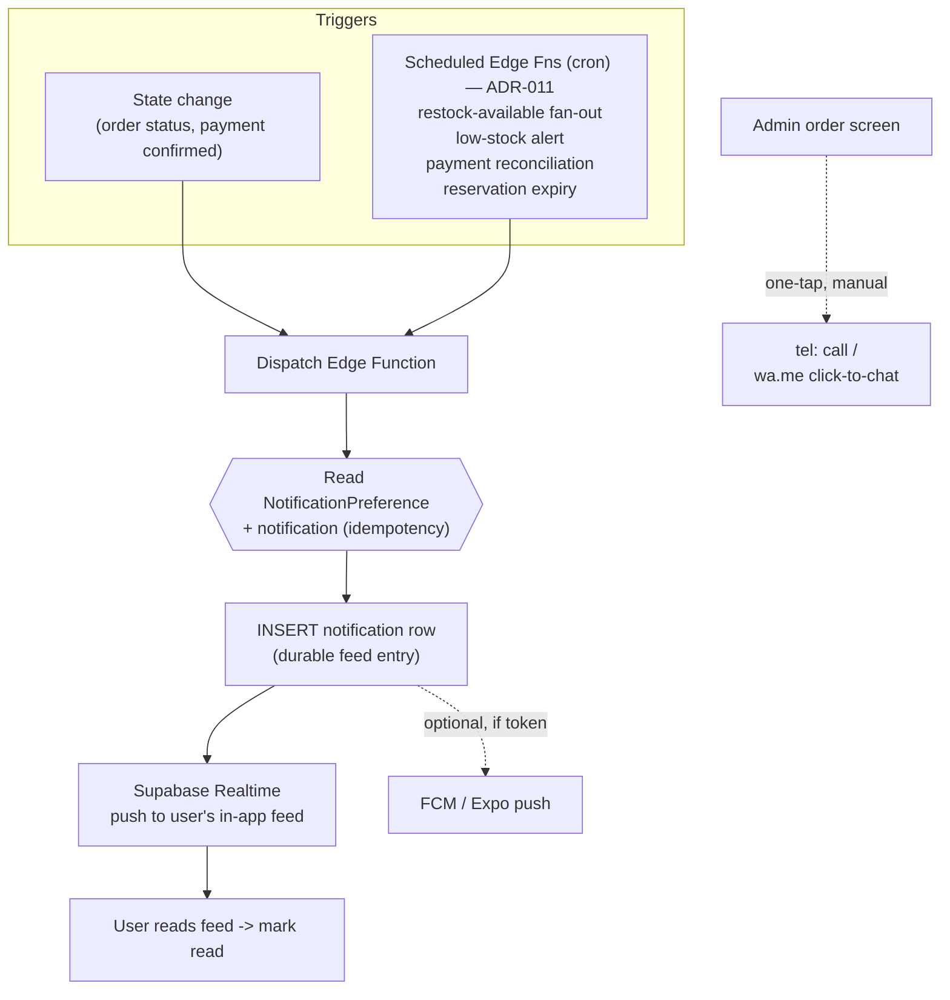
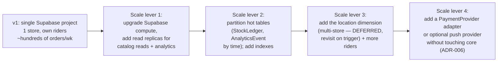

# 05 — System Architecture

> Single-source technical blueprint: how the clients, Supabase, and third parties fit together, and how the hard problems (fast cached catalog / data-saver mode, oversell prevention, notification fan-out) are solved cheaply and reliably for Sierra Leone conditions.

> Part of the Borteh Sprays 001 planning set. See 00-index.md for the full set.

---

## 0. How to read this document

This file is the architectural "map." It does not redefine the data model (see `06-data-model.md`), the REST surface (see `07-api-design.md`), the Monime payment mechanics (see `08-payments-monime.md`), the threat model (see `09-security-threat-model.md`), or the analytics design (see `10-admin-analytics.md`). It shows how those pieces connect and why, tracing every major decision back to an ADR in `11-adrs.md`.

Labelling convention used throughout (per the canon authoring rules):

- **Fact** — hard, citable, or directly derived from a locked constraint / ADR / the battle-tested Monime integration.
- **Validated assumption** — reasonable and supported by experience, but should be confirmed during build.
- **Unverified assumption (confidence: High/Medium/Low)** — a guess we are designing around; the words "assumption to verify" appear.
- **BLOCKED ON MONIME DOCS** — cannot be finalised until official Monime documentation/support answers.
- **OWNER INPUT NEEDED** — Mr. Borteh must decide a business rule.

Every requirement traces to a persona (Aminata the shopper, Mr. Borteh the owner, Saidu the rider, or the Shop Assistant) and to an ADR.

---

## 1. Architectural goals and the forces that shape them

The architecture is driven by the locked constraints in the canon. Each force below is non-negotiable and every later decision is justified against it.

| # | Force (from canon) | Architectural consequence | ADR |
|---|--------------------|---------------------------|-----|
| F1 | **Minimal budget; Supabase is the only committed paid service** | One backend platform. No Kafka, no Redis, no separate logistics SaaS, no analytics SaaS. Everything is Postgres, Storage, Auth, Edge Functions, Realtime, or a free tier. | ADR-002, ADR-008 |
| F2 | **Intermittent 2G/3G, expensive per-MB** | Online-first (with light read caching), data-frugal payloads, writes require connectivity + retry, OTA JS updates instead of store downloads. | ADR-001, ADR-003 |
| F3 | **Low-to-mid Android, low RAM/storage** | Lean Hermes bundle, optional read-only persisted catalog cache (not a sync engine), small per-ABI APK. | ADR-001, ADR-003 |
| F4 | **Mobile money (Monime) + cash (COD / at pickup), delayed confirmations** | Webhook is the source of payment truth; reservations are time-boxed; **cash is a first-class payment adapter** alongside Monime. | ADR-006, ADR-009, ADR-010 |
| F5 | **Phone-first identity, weak email** | Supabase Auth **phone + password** (no OTP/SMS; phone-confirmation disabled); phone is the unique account id, email optional (recovery only); customer notifications via the **in-app feed**. | ADR-004, ADR-007 |
| F6 | **Weak street addressing** | Landmark text + GPS pin + delivery zones + manual rider assignment; OSM/MapLibre (free) not Google Maps Platform (billed). | ADR-008 |
| F7 | **Own dispatch riders** | In-house DeliveryJob/Rider model, not third-party courier APIs. | ADR-008 |
| F8 | **Single store; one source of truth for in-store + online stock** | Postgres inventory is authoritative as a **simple per-variant balance** (`qty_on_hand`/`qty_reserved`); admin doubles as POS-lite; concurrent online + in-store sales must not oversell. Multi-store is **deferred**. | ADR-010 |
| F9 | **Standard v1 in 3–4 months** | Build only what Supabase gives us cheaply; defer anything needing new infrastructure. | ADR-008, ADR-011 |
| F10 | **Single store, but an UNLIMITED product catalog** | Catalog must scale: keyset pagination, Postgres search indexes (GIN trigram / full-text on product/brand/notes), Supabase Storage CDN for images, lazy thumbnails, small payloads. | ADR-002, ADR-003 |

**Design tenet that ties them together:** *the server is authoritative; the client is an online-first, optimistic cache that submits intents over the network.* This single sentence (ADR-003, ADR-010) explains the light read cache, the reservation model, and the webhook-as-truth payment flow.

---

## 2. High-level architecture (clients ↔ Supabase ↔ third parties)

The system has three client surfaces, one backend platform (Supabase), and three external services (Monime, optional push, and map tiles). All clients speak HTTPS/REST (ADR-005); the mobile app additionally holds a WebSocket to Realtime and an optional read-only persisted catalog cache (ADR-003).



**Reading the diagram (facts):**

- The **mobile app never writes inventory directly.** It reads catalog over REST (cached in SQLite), subscribes to Realtime for hot stock, and submits checkout/cart intents to Edge Functions. This is the "client = intents" tenet (ADR-003, ADR-010).
- **PostgREST is reachable only through RLS** (ADR-005, ADR-002). Anything that must bypass a user's row permissions (decrement stock, write the StockLedger, flip payment status) runs in an **Edge Function with the service role**, which is the only component allowed to bypass RLS.
- **Monime's webhook arrives at exactly one canonical Edge Function URL** — Monime webhooks do not follow redirects, so the registered URL must be the exact final URL (Fact, from the battle-tested integration; see `08-payments-monime.md`).
- **Customer notifications are an in-app feed, not SMS.** Order-status and restock-available events are written to a `notification` table and pushed over **Supabase Realtime** to the user's feed (free; no SMS/WhatsApp API). For direct contact, the **admin order screen opens one-tap `tel:` and `https://wa.me/<number>?text=...` deep links** to the customer's phone — device-native, no API, $0 (ADR-007).
- **Maps are OSM/MapLibre, not Google Maps Platform**, because Google Maps billing violates F1 (ADR-008). MapLibre GL renders OSM/raster tiles; the only thing we store is a `geo_lat`/`geo_lng` pin on `DeliveryLocation` (`06-data-model.md`). **Caveat (hidden-cost / ToS):** the public OSM *demo* tile servers forbid production-scale use, so v1 needs a free-tier tile host with an API key (e.g. MapTiler / Stadia Maps free tier) or self-hosted tiles — still $0 at small scale, but not simply "free OSM tiles." Logged in §10. *(Unverified assumption, confidence: Medium — assumption to verify.)*

### 2.1 Why a single backend platform (and what we deliberately do NOT run)

| Capability | Conventional stack | Our choice | Why (ADR) |
|------------|--------------------|-----------|-----------|
| Relational store | Postgres + read replicas | Supabase Postgres (single node at v1) | ADR-002/003; replicas are a *growth* lever, not v1 |
| Cache / queue | Redis / SQS / Kafka | Postgres tables + scheduled Edge Functions (cron); client read-only catalog cache | ADR-003/011; avoids a second paid service (F1) |
| Background jobs | Celery / a worker fleet | Scheduled Edge Functions (cron) | ADR-011 |
| Realtime fan-out | Pusher / Ably | Supabase Realtime (included) | ADR-002/003 |
| Object storage | S3 + CloudFront | Supabase Storage + its CDN | ADR-002 |
| Auth | Auth0 / Cognito | Supabase Auth **phone + password** (no OTP/SMS) | ADR-004 |
| Logistics | Third-party courier API | In-house DeliveryJob/Rider | ADR-008 |
| Analytics | Segment / Mixpanel | AnalyticsEvent table + SQL materialized views + Metabase OSS | ADR-008 |
| Payments | Stripe-style | Monime hosted checkout + **cash (COD / at-pickup)** adapter behind a PaymentProvider interface | ADR-006 |

**Consequence (Fact):** the only committed recurring cost at v1 is one Supabase project. Everything else is free-tier (Vercel hobby, optional FCM/Expo push, OSM tiles, Metabase self-host) or strictly pay-per-event with no floor (Monime per transaction). Customer notifications are the **free in-app feed** (no SMS/WhatsApp spend). This directly satisfies F1.

---

## 3. Component responsibilities and boundaries

The hardest architectural question in a Supabase app is *"does this operation belong in PostgREST-behind-RLS, in an Edge Function, or on the client?"* Getting this boundary wrong is the most common source of security holes and oversell bugs. The rule:

> **Decision rule (ADR-005, ADR-010):**
> 1. If the operation is a **simple read or a write that touches only the caller's own rows and is safe to express as an RLS policy**, it is **PostgREST behind RLS** (cheapest, no code to maintain).
> 2. If the operation needs a **secret**, **multi-row atomicity / locking**, **a third-party call**, **trust we cannot give the client**, or **cross-user fan-out**, it is an **Edge Function** (service role).
> 3. If the operation is **presentation, optimistic UI, or read caching**, it lives on the **client**, and is treated as a non-authoritative intent.

### 3.1 Responsibility matrix

| Operation | Layer | Why this layer (ADR) |
|-----------|-------|----------------------|
| Browse catalog, product detail, search, scent notes | **PostgREST + RLS** (public read) → read-cached on device; search via **Postgres GIN trigram / full-text index** on product/brand/notes (unlimited catalog, F10) | Read-only, no secret, data-frugal; read-only catalog cache (ADR-003/005) |
| Read own wishlist / cart / orders / delivery locations | **PostgREST + RLS** (`user_id = auth.uid()`) | Owner-scoped reads, perfect RLS fit (ADR-005) |
| Add to wishlist / cart, save delivery location, set notification prefs | **PostgREST + RLS** write, **requires connectivity + retry** | Owner-scoped writes; online-only intent with retry UI (ADR-003) |
| Submit a product review | **PostgREST + RLS** write, with `verified_purchase` flag set by a **DB trigger/Edge check** against the user's delivered orders | Write is owner-scoped, but the *verified* badge must not be client-settable (ADR-005, see `09-security-threat-model.md`) |
| Login (phone + password); admin-assisted password reset | **Auth** (phone + password) with an **Edge Function** for login rate-limit + lockout; reset is owner-issued from admin (+ optional email self-service) | Anti brute-force / credential-stuffing; **no SMS/OTP** (ADR-004/005) |
| **Place order / reserve stock** | **Edge Function → inventory RPC (SQL function, row-locked)** | Multi-row atomicity, oversell prevention, must bypass RLS to write ledger (ADR-010) |
| **Initiate Monime checkout** | **Edge Function** | Holds the bearer token + space id + idempotency key; signs nothing the client should see (ADR-006) |
| **Evaluate loyalty + promotions at checkout** | **Edge Function → loyalty/promo RPC** reads `loyalty_config` + active `promo_rule` + the user's `loyalty_account` tier/card | Owner-editable config; server-authoritative discount/points; no code change to tune (ADR-012) |
| **Monime webhook intake** | **Edge Function** (canonical URL, raw-body HMAC verify) | Secret verification, status-guarded UPDATE, idempotency on `event.id` (ADR-006, `08-payments-monime.md`) |
| In-store sale (POS-lite) | **Admin → Edge Function → same inventory RPC** | Same atomic decrement path as online; single source of truth (ADR-010) |
| Stock adjustment / receive purchase | **Admin → Edge Function → ledger RPC** (role-gated) | Writes append-only StockLedger; owner/staff only (ADR-010, RLS role check) |
| Assign delivery to a rider | **Admin → PostgREST+RLS** (owner/staff role) writing DeliveryJob; or Edge Function if it also notifies | Owner-scoped admin write; notification side-effect may push it to an Edge Function (ADR-008) |
| Rider: view assigned orders + drop-off (landmark, GPS pin, contact phone), mark picked-up / delivered, record cash collected | **PostgREST + RLS** scoped to `rider_id = auth.uid()` on assigned jobs | Rider can only touch their own jobs; **no live GPS tracking** (ADR-008, `09-security-threat-model.md`) |
| Restock fan-out, reservation expiry, payment reconciliation, low-stock alert | **Scheduled Edge Functions (cron)** | Background, cross-user, needs service role (ADR-011) |
| Publish order-status / restock notification to the **in-app feed** | **Edge Function / RPC** writes a `notification` row → **Realtime** pushes it to the user; optional FCM/Expo push | In-app feed (free); store contacts customer via `tel:`/`wa.me` deep links; **no SMS/WhatsApp API** (ADR-007) |
| Optimistic UI, image lazy-load, read-only catalog cache | **Client** | Presentation + resilience; never authoritative (ADR-003) |

### 3.2 The three trust zones



**Critical boundary rule (Fact, ADR-005 + `09-security-threat-model.md`):** because Zone 3 bypasses RLS, every Edge Function must *re-authenticate and re-authorize inside the function* (verify the caller's JWT and role, never trust client-supplied `user_id`, amounts, or prices). The client may *propose* a cart; the Edge Function *re-prices from the DB* — applying the owner-configured `promo_rule`(s) and the user's loyalty tier/card discount (ADR-012) — before creating a Monime session, so a tampered client cannot pay Le 1 for a Le 1,000 bottle (ADR-006, ADR-009).

---

## 4. Online-first catalog with light read caching (ADR-003)

**Persona/goal:** Aminata browses on intermittent 2G/3G with expensive data; the catalog must load fast and cheaply, and a brief dropout or cold start must not show a blank screen. Writes (wishlist, cart, restock-subscribe) require connectivity and show clear offline / Retry states (F2, F3).

### 4.1 The two on-device caches

| Cache | Holds | Lifecycle |
|-------|-------|-----------|
| **expo-sqlite read cache (optional)** | Read-only snapshot of the last-loaded catalog: Brand, Category, ScentNote, Product, ProductVariant, ProductImage refs, ProductScentNote, and a *cached* availability snapshot per variant | Written from successful online reads; refreshed when online; never queues writes, never reconciles; safe to wipe |
| **TanStack Query cache** | In-memory + persisted query results for the current session; dedupes and coalesces requests | Ephemeral; backed by the read cache for cold start |

> **Why a light read cache and not a sync engine (e.g. PowerSync)?** A sync engine was evaluated and **REJECTED** (ADR-003, F1): the owner explicitly does not want the complication of syncing. The catalog is *read-mostly on the client* and *authoritative on the server*, so an ordinary cache-then-network read (TanStack Query in memory + an optional read-only persisted catalog snapshot) is sufficient, cheaper, and adds no sync machinery. Writes always require connectivity (see §4.4).

### 4.2 Catalog reads — cache-then-network (stale-while-revalidate)

Catalog *metadata* changes rarely, so reads are cheap and cache-friendly. The client uses an ordinary **cache-then-network** read (ADR-003): TanStack Query serves any cached result instantly, then revalidates from the server in the background and swaps in fresh rows (**stale-while-revalidate**). This is plain caching — there is **no** delta sync, **no** `updated_at` high-water-mark cursor, and **no** reconciliation.

```
GET /rest/v1/products?select=...&order=id.asc&limit=24    -- keyset page (after = last id)
  -> serve from the TanStack cache first; fetch fresh in the background; replace on success;
     persist the last-loaded catalog into the OPTIONAL read-only SQLite snapshot
```

Design rules (Fact / ADR-003):

- **Keyset pagination** (ordered + `limit`, cursor on the last row), never `OFFSET` — keeps each page small and cheap on 3G, and is the same keyset discipline the catalog browse screens use to hit the < ~150 KB first-payload budget (canon performance targets).
- **HTTP + image caching, WebP, lazy thumbnails** so repeat views and scrolls cost little or no data (data-saver reality, F2).
- **Unlimited catalog scales server-side (F10).** Search runs on **Postgres GIN trigram / full-text indexes** over product/brand/scent-note fields (not client scans); images are served from **Supabase Storage's CDN** as WebP with lazy thumbnails. Combined with keyset paging this keeps each request small no matter how large the catalog grows.
- **Optional read-only persisted cache.** The last-loaded catalog is written to expo-sqlite purely so a cold start or a brief 2G dropout renders the previous screen instead of a blank one. It is refreshed whenever online and is advisory only — it never queues writes and never reconciles.
- **Freshness is always re-checked server-side at checkout** (ADR-010); the client cache never decides availability.

### 4.3 Hot stock: Realtime, not polling

Catalog *metadata* changes rarely; *stock availability* changes constantly (every in-store and online sale). Polling that on 3G would burn data and battery. Instead (ADR-003):

- The client subscribes to **Supabase Realtime** on the **`availability_signal`** base table (`06-data-model.md` §4): a coarse, customer-safe `(variant_id, band)` row where `band ∈ {in_stock, low, out}` — **never** raw `qty_on_hand`/`qty_reserved`/`qty_available`, which would leak exact stock counts to anyone holding a Realtime subscription (see `09-security-threat-model.md`). Admin/owner clients still read **exact** numbers, but via **authenticated PostgREST** against `inventory_item`, never over Realtime.
- Realtime pushes only deltas for the variants the user is currently viewing / has wishlisted, keeping the WebSocket payload tiny.
- On a brief dropout or cold start, the read-only cache shows the **last-known availability with an "as of <time>" caveat in the UI** (trust/transparency, F2). Final availability is always re-checked server-side at checkout (ADR-010) — the cached signal is advisory.
- **Concrete mechanism (a real Supabase constraint, not hand-waving):** Realtime *Postgres Changes* streams whole **base-table** rows filtered by RLS — it **cannot** column-project through a view, so subscribing to `inventory_item` would push `qty_on_hand`/`qty_reserved` to every subscriber. `06-data-model.md` §4 resolves this with a dedicated **`availability_signal(variant_id, band, updated_at)` base table** (band-only), written inside the **same transaction/RPC that mutates `inventory_item`**, with a public-read RLS policy and its own Realtime publication. Customer clients subscribe to **that** table; the raw quantities never leave the server. (An equivalent Realtime **Broadcast** of a server-authored `{variant_id, band}` payload is a valid alternative; `06` standardises on the base table so the band is also queryable for cold-start reads.) **Aligned with `06` §4** — no view is used as a Realtime *Changes* source.

### 4.4 Writes require connectivity (no outbox, no replay)

Writes are an **online-first** concern. **Wishlist add/remove, cart add/update, restock-subscribe, save delivery location, set notification prefs** — and of course checkout and payment — all **require connectivity** and are **never** queued for later replay. Each is still expressed as an *intent* the server validates, but the client submits it over the network now and shows a clear **offline / Retry** state when there is no connection (F2). Payment needs a network anyway (F4).



Rules that keep writes safe and simple (Fact / ADR-003):

- **No outbox, no deferred replay.** A write happens now or not at all; the user gets an explicit **Retry** rather than a silent queue. This is the owner's locked decision: online-first, no sync machinery.
- **Idempotency on retry.** A user-tapped Retry must not double-add. Wishlist/cart upserts are naturally idempotent on `(user_id, variant_id)`; restock-subscribe likewise. PostgREST does **not** process an `Idempotency-Key` header, so owner-scoped intents get their idempotency from `UPSERT ... ON CONFLICT (natural key)` (e.g. `(user_id, variant_id)`); intents that route through an **Edge Function** carry an `Idempotency-Key` (mirrors the server-side idempotency used for Monime; see `08-payments-monime.md`).
- **Cart is an intent, not a hold.** Adding to cart does **not** reserve stock. Stock is only reserved at checkout via the inventory RPC (§5). This keeps the oversell model simple (ADR-010).

> **OWNER INPUT NEEDED:** how long should a saved cart persist before it's considered stale (e.g. prices may have changed)? Proposed default: re-price cart against the DB at checkout and warn on any change. Confirm the messaging with Mr. Borteh.

---

## 5. Inventory consistency model — preventing oversell (ADR-010)

**Persona/goal:** Mr. Borteh (and the Shop Assistant) sell the *same* bottle in-store via POS-lite at the same moment Aminata is checking out online. The Postgres inventory is the single source of truth (F8); the system must **never sell the last unit twice**.

### 5.1 The two tables + the time-boxed hold (per ADR-010 / `06-data-model.md`)

`06-data-model.md` is the source of truth for these shapes; the names below mirror it exactly (snake_case columns, `movement_type` not "kind").

| Table | Shape (sketch — authoritative defn in `06`) | Role |
|-------|---------------------------------------------|------|
| **InventoryItem** (`inventory_item`) | `(variant_id) UNIQUE, qty_on_hand, qty_reserved, qty_available GENERATED ALWAYS AS (qty_on_hand - qty_reserved) STORED, reorder_point, updated_at` | The fast *balance* row (one per variant — single store). `qty_available` is a **generated column** — never recompute "available" client-side as authoritative. |
| **StockLedger** (`stock_ledger`) | append-only `(id, variant_id, movement_type, qty_delta signed (on_hand), qty_reserved_delta signed (reserved), balance_after (on_hand), reserved_after (reserved), reference_type, reference_id, reason, created_by, created_at)` | Immutable audit of every movement: `purchase / sale_online / sale_instore / adjustment / reservation / release / return`. **Two signed dimensions** so the ledger reconstructs *both* balances (see §5.1 table). |

> **The time-boxed hold lives on `payment_intent`, NOT a separate table.** Per `06-data-model.md` the reservation TTL is `payment_intent.reservation_expires_at`, and `inventory_item.qty_reserved` carries the held units; there is **no** standalone `Reservation` entity in the canonical model. This file uses that mechanism throughout. *(An earlier draft of this section referenced a `Reservation` table with `held/confirmed/released` status — corrected here to match the source of truth; the lifecycle is now driven by `payment_intent.status` + `qty_reserved`.)*

**Invariant (Fact, ADR-010):** `InventoryItem` is a materialised running balance; `StockLedger` is the journal. Every change to a balance is accompanied by a ledger row **in the same transaction**.

**Two signed dimensions, reconstructed per dimension.** Each `stock_ledger` row carries **both** a signed `qty_delta` (change to `qty_on_hand`) **and** a signed `qty_reserved_delta` (change to `qty_reserved`); a movement books its change into the dimension(s) it actually moves (matching `06-data-model.md` §4 exactly):

| `movement_type` | `qty_delta` (on_hand) | `qty_reserved_delta` (reserved) | Meaning |
|-----------------|-----------------------|----------------------------------|---------|
| `purchase`, `return` | `+n` | `0` | goods received; raises on-hand |
| `adjustment` | `±n` | `0` | manual correction to on-hand |
| `reservation` | `0` | `+n` | hold created; unit leaves `qty_available` |
| `sale_online`, `sale_instore` (confirm) | `−n` | `−n` | hold consumed into a sale, in **one** row |
| `release` | `0` | `−n` | unconsumed hold cleared (expiry / failure) |

Because each row books into the correct dimension, reconstruction is a **per-dimension blanket sum** (no movement-type exclusions, no double-counting):

```
qty_on_hand   = Σ qty_delta            -- over ALL ledger rows for the variant
qty_reserved  = Σ qty_reserved_delta   -- over ALL ledger rows for the variant
qty_available = qty_on_hand - qty_reserved
```

**Invariants (must hold on every `inventory_item` row, matching `06`):** `qty_reserved <= qty_on_hand` (enforced by `ck_reserved_le_onhand`) and `qty_available = qty_on_hand - qty_reserved` (the `STORED` generated column). The confirm step is a **single** `sale_online`/`sale_instore` row carrying `(qty_delta = −n, qty_reserved_delta = −n)` — it records the sale *and* clears the hold in the same row, so there is no separate `release` on a normal confirm.

> **ALIGNED WITH `06-data-model.md` §4.1 (Fact):** both files now use the **two-dimension** ledger. The reconstruction invariants are `SUM(qty_delta) = qty_on_hand` **and** `SUM(qty_reserved_delta) = qty_reserved` per variant — each summed across *all* rows, because `reservation`/`release`/confirm now book into the correct dimension instead of overloading a single `qty_delta`. The nightly reconciliation cron (ADR-011) asserts **both** sums and alerts on drift.

### 5.2 The atomic reservation RPC

All stock-affecting operations go through one of a small set of **SQL functions (RPCs) invoked from Edge Functions**, never through raw PostgREST UPDATEs (ADR-010). The reservation RPC is the heart of oversell prevention.

Pseudocode (sketch only — no production code):

```
function reserve_stock(variant_id, qty, order_id, ttl_seconds) returns reservation_result:
  BEGIN  -- single Postgres transaction
    -- (A) lock the exact balance row so concurrent callers serialize here
    row := SELECT qty_on_hand, qty_reserved
             FROM inventory_item
            WHERE variant_id = :variant_id
            FOR UPDATE;            -- row lock: the race-critical line

    available := row.qty_on_hand - row.qty_reserved;
    IF available < qty THEN
        ROLLBACK; RETURN { ok:false, reason:'insufficient', available };
    END IF;

    -- (B) reserve: bump qty_reserved, append ledger, set the hold TTL on payment_intent
    UPDATE inventory_item
       SET qty_reserved = qty_reserved + qty, updated_at = now()
     WHERE variant_id = :variant_id;

    INSERT INTO stock_ledger(movement_type, qty_delta, qty_reserved_delta,
                             reserved_after, reference_type, reference_id, ...)
         VALUES ('reservation', 0, +qty,
                 row.qty_reserved + qty, 'order', :order_id, ...);  -- a hold moves qty_RESERVED, not on_hand (see §5.1)

    -- same tx: refresh the customer-safe band so Realtime subscribers learn the
    -- change WITHOUT seeing raw numbers (see §4.3 and 06 §4 availability_signal)
    UPSERT availability_signal(variant_id, band, updated_at)
         VALUES (:variant_id,
                 recompute_band(row.qty_on_hand, row.qty_reserved + qty), now());

    -- the hold TTL lives on payment_intent (06), NOT a separate Reservation table
    UPDATE payment_intent
       SET reservation_expires_at = now() + (:ttl_seconds || ' seconds')::interval
     WHERE order_id = :order_id AND status = 'created';
    COMMIT;
    RETURN { ok:true };
  END
```

Equivalent **lock-free alternative** (also allowed by ADR-010) is a single guarded conditional UPDATE:

```
UPDATE inventory_item
   SET qty_reserved = qty_reserved + :qty
 WHERE variant_id = :v
   AND (qty_on_hand - qty_reserved) >= :qty;   -- atomic check-and-set
-- if 0 rows affected -> insufficient stock, no reservation made
```

Both are correct. Note that either path is only the guard: it must run inside the same transaction as the `stock_ledger` reservation row and the `payment_intent.reservation_expires_at` set. The **`FOR UPDATE` version is preferred when a single transaction must touch several variants** (a multi-line order) and we want consistent ordering of locks (lock variants in a deterministic order, e.g. ascending variant_id, to avoid deadlocks — validated assumption). The conditional-UPDATE version is ideal for single-line decrements and is the simplest path for the POS-lite in-store sale.

### 5.3 Reservation lifecycle (time-boxed; ADR-010 + ADR-011)



- **Held** increments `qty_reserved` (not `qty_on_hand`) via a `reservation` ledger row (`qty_delta = 0`, `qty_reserved_delta = +n`), so the unit is unavailable to others but not yet sold; the same transaction refreshes `availability_signal.band` (§4.3).
- **Confirmed** (on Monime success per `08-payments-monime.md`, or COD acceptance) converts the reservation into a real `sale_online`: `qty_on_hand -= qty`, `qty_reserved -= qty`, appending **one** ledger row — a `sale_online` carrying **both** deltas (`qty_delta = −n`, `qty_reserved_delta = −n`) — which records the sale *and* clears the hold in the same row, so both balances stay ledger-reconstructable (§5.1). The same transaction refreshes `availability_signal.band` (§4.3).
- **Released** happens via the **reservation expiry sweep** (a scheduled Edge Function, ADR-011) when the TTL passes without payment, or immediately on a failed/cancelled payment: `qty_reserved -= qty`, ledger `release` (`qty_delta = 0`, `qty_reserved_delta = −n`).
- **Race guard (Fact):** the confirm step uses a **status-guarded UPDATE** (`WHERE payment_intent.status IN ('created','processing')`) so it cannot collide with the expiry sweep releasing the same hold — the same status-guard discipline used on the payment intent (`WHERE status IN ('created','processing')`, see `08-payments-monime.md`).

> **OWNER INPUT NEEDED:** the reservation TTL. Proposed default **15 minutes** for mobile-money (USSD round-trips are slow; F4) — long enough to finish an Orange/Africell Money flow, short enough to free stock quickly. Mark as *unverified assumption (confidence: Medium) — assumption to verify* with real Monime confirmation latencies.
>
> **COD must NOT share the mobile-money TTL.** The reservation-expiry sweep keys on `payment_intent.reservation_expires_at`; a COD order has no Monime round-trip, so a 15-min TTL would wrongly release an accepted COD hold. COD intents either skip the expiry sweep (confirmed at order acceptance/dispatch) or carry a separate, owner-set window. **OWNER INPUT NEEDED** on the COD hold policy.

### 5.4 Concurrent-sale race — the proof it can't oversell

Scenario: **one unit left.** Aminata checks out online while the Shop Assistant rings up the same variant in-store at the same instant.

```mermaid
sequenceDiagram
    autonumber
    participant A as Aminata (online checkout)
    participant EFA as Edge Fn (checkout)
    participant DB as Postgres (InventoryItem row)
    participant EFB as Edge Fn (POS sale)
    participant S as Shop Assistant (POS-lite)

    Note over DB: InventoryItem: qty_on_hand=1, qty_reserved=0 -> available=1
    par Online and in-store fire together
        A->>EFA: place order (qty 1)
        EFA->>DB: reserve_stock(): SELECT ... FOR UPDATE
        Note over DB: Aminata's tx acquires the ROW LOCK
    and
        S->>EFB: in-store sale (qty 1)
        EFB->>DB: reserve/decrement: SELECT ... FOR UPDATE
        Note over DB: In-store tx BLOCKS, waiting for the lock
    end

    DB-->>EFA: locked; available=1 >= 1 -> reserve
    EFA->>DB: qty_reserved=1; ledger:reservation (qty_delta=0, qty_reserved_delta=+1); COMMIT (lock released)
    EFA-->>A: reserved, proceed to pay

    Note over DB: now qty_on_hand=1, qty_reserved=1 -> available=0
    DB-->>EFB: lock acquired; available = 1-1 = 0 < 1
    EFB->>DB: ROLLBACK (no decrement)
    EFB-->>S: "Out of stock — last unit just sold online"
    Note over S: Assistant sees it instantly; no oversell
```

**Why it is correct (Fact, ADR-010):**

- The `SELECT ... FOR UPDATE` (or the atomic conditional UPDATE) **serialises the two transactions on the same balance row.** Only one can read `available=1` and act; the other reads `available=0`.
- Online and in-store sales **share the exact same RPC and the exact same `InventoryItem`/`StockLedger`**, because Postgres is the single source of truth for both channels (F8). There is no separate "online stock" vs "store stock" to drift.
- **Single store at v1:** the balance is keyed by `variant_id` (one row per variant). Multi-store — re-introducing a `location_id` dimension and inter-store transfers — is **deferred** (revisit trigger only), not built into v1 (ADR-010).

### 5.5 Reconciliation and drift control

- **Append-only ledger = audit + recovery.** If a balance is ever suspect, it can be rebuilt with the **two-dimension** sums of §5.1: `qty_on_hand = Σ qty_delta` and `qty_reserved = Σ qty_reserved_delta` across *all* ledger rows for that variant. Because every row books its change into the correct dimension, each per-dimension blanket sum is exact (no movement-type exclusions, no double-counting). A nightly scheduled Edge Function (ADR-011) recomputes **both** sums vs `inventory_item` and raises a discrepancy alert for Mr. Borteh.
- **Low-stock alerting** is another cron sweep (ADR-011): when `available` crosses a per-variant threshold, notify the owner (and gate the *restock-available* fan-out off the *next* purchase event).

---

## 6. Notification architecture — in-app feed (Realtime) + store-initiated deep links, cron fan-out (ADR-007, ADR-011)

**Persona/goals:** Aminata wants to know her order shipped and that a sold-out scent is back; Saidu needs his assigned-deliveries to reach him; Mr. Borteh wants low-stock and reconciliation alerts, and wants to reach customers directly. Customer-facing notifications are delivered **in-app** (free), and the owner contacts customers **manually** via one-tap call / WhatsApp from the admin (F1, F5).

### 6.1 Channel strategy (ADR-007)

| Channel | Role | Cost posture | Notes |
|---------|------|--------------|-------|
| **In-app notification feed** (Supabase Realtime + `notification` table) | **Primary for every customer-facing message** (order status, restock-available, cash/COD confirmations) | **Free** (included in Supabase) | Durable rows + Realtime push; the dependable default (F1) |
| **Store-initiated contact** (`tel:` call + `https://wa.me/<number>?text=...` click-to-chat from the admin order screen) | Owner/assistant reaches the customer **manually** for anything conversational | **Free** (device-native deep links, no API) | The owner already calls / WhatsApps customers; no SMS/Meta API, no verification (F1, F5) |
| **FCM / Expo push** | OPTIONAL, later — opportunistic nudge to active app users | Free | Best-effort only; never the sole channel |

> **Hard rule (Fact, ADR-007): every customer-facing notification is durably written to the `notification` table and pushed to the in-app feed over Realtime.** Optional FCM/Expo push is an enhancement layered on top; for anything conversational the owner reaches the customer directly via the one-tap `tel:` / `wa.me` deep links on the admin order screen. **There is no SMS or WhatsApp/Meta API dependency.**

### 6.2 The notification pipeline

Notifications are produced by **two triggers** — a *state change* (order moved to "out for delivery") or a *scheduled sweep* (restock fan-out). Both funnel into one **dispatch Edge Function** that records a `notification` row (respecting `NotificationPreference`); **Supabase Realtime** then pushes the row to the user's in-app feed, with an optional FCM/Expo push on top.



### 6.3 Restock fan-out (the canonical cron job, ADR-011)

When a `purchase` ledger movement raises a variant from 0 to available, the **restock-available fan-out** sweep runs:

```
restock_fanout (scheduled Edge Function):
  for each variant that transitioned 0 -> available since last run:
     for each RestockSubscription on that variant (status = active):
        if Notification for (user, variant, 'restock') not already sent (idempotency):
            enqueue dispatch -> write notification row (in-app feed) + optional push
            mark subscription fulfilled
  -- batched to avoid DB / Realtime spikes (in-app feed has no per-message cost)
```

Design rules (Fact / ADR-007, ADR-011):

- **Idempotent fan-out**: a `Notification` row keyed on `(user, ref, kind)` prevents double-sends if the sweep overlaps or retries (same idempotency discipline as the webhook and client write retries).
- **Batched**: a sudden restock of a popular scent could mean hundreds of feed writes + Realtime pushes at once; the sweep paces them to avoid DB / Realtime spikes (the in-app feed itself has no per-message cost, F1).
- **Runs as cron, not inline**: fan-out is decoupled from the purchase transaction so notification work never blocks Mr. Borteh receiving stock (ADR-011).

> **Note (Fact):** there is **no SMS/WhatsApp-API dependency to procure or verify** — customer notifications use the free in-app feed, and direct contact uses device-native `tel:` / `wa.me` links. Optional FCM/Expo push can be added **later** behind the same dispatch Edge Function as a config change, not a rearchitecture (mirrors the PaymentProvider abstraction of ADR-006).

### 6.4 Why cron-on-Edge-Functions and not a worker queue

A traditional system would use Redis/SQS + a worker fleet. We deliberately use **scheduled Edge Functions** (ADR-011) because: (a) it adds no paid infrastructure (F1); (b) the workloads (reconciliation, expiry, fan-out, low-stock) are periodic and idempotent, which fits cron perfectly; (c) Postgres tables (`Notification`, `PaymentIntent` + `inventory_item.qty_reserved`) already serve as the durable "queue," so we get persistence and audit for free. The trade-off — latency is bounded by the cron interval, not instantaneous — is acceptable for these jobs and is documented as a risk in `12-risks-assumptions.md`.

### 6.5 Optional in-app messaging — customer ↔ store chat (DEFERRABLE, v1.5)

A two-way **in-app chat** between the customer and the store is a *Should/Could*, **not required for v1**. When built, it reuses the same Supabase primitives — a `conversation` table + `message` table with RLS (each party sees only their own threads) and **Supabase Realtime** for live delivery — so it adds **no new paid service**. Until then, store→customer conversation is handled by the one-tap `tel:` / `wa.me` deep links on the admin order screen (§6.1). *(Scope: v1.5; deferrable.)*

---

## 7. End-to-end checkout flow (ties §3–§6 together)

This sequence shows how the boundaries, reservation model, and payment truth interact for a mobile-money order. It is the integration test of the whole architecture. Full Monime mechanics live in `08-payments-monime.md`; here we show the *architectural* path.

```mermaid
sequenceDiagram
    autonumber
    participant A as Aminata (RN app)
    participant EF as Edge Fn: checkout
    participant PG as Postgres (RPC + tables)
    participant M as Monime (hosted checkout)
    participant WH as Edge Fn: webhook (canonical URL)
    participant N as Dispatch (in-app feed)

    A->>EF: createCheckout(cart, delivery_zone [estimate], payment=mobile_money|cash)
    Note over EF: re-price cart from DB + apply loyalty/promo (ADR-012);<br/>never trust client amounts (ADR-006/009)
    EF->>PG: INSERT PaymentIntent (status='created', amount_minor SLE, intent_id)
    EF->>PG: reserve_stock() RPC (FOR UPDATE) ADR-010
    PG-->>EF: ok (qty_reserved bumped; reservation_expires_at set on payment_intent)
    EF->>M: POST /v1/checkout-sessions (Idempotency-Key, Monime-Version,<br/>Space-Id; intent_id in callbackState + metadata)
    M-->>EF: result.id (scs-...) , result.redirectUrl
    EF->>PG: store provider_intent_id = scs-...
    EF-->>A: redirectUrl
    A->>M: open redirectUrl in Expo WebBrowser; pay via Orange/Africell USSD
    M-->>A: deep-link back to success/cancel screen (NOT trusted as truth)

    Note over M,WH: Source of truth = webhook, not the redirect
    M->>WH: POST signed webhook (Monime-Signature: t=..,v1=..)
    Note over WH: read RAW body; HMAC-SHA256(secret, t + "_" + rawBody);<br/>base64, timing-safe; replay window check ADR-006
    WH->>PG: dedup on event.id; verify amount+currency vs intent
    alt event = payment.completed / processing_completed / checkout_session.completed
        WH->>PG: status-guarded UPDATE intent -> 'paid';<br/>confirm hold -> sale (one sale_online row:<br/>qty_delta=-n, qty_reserved_delta=-n) ADR-010
        WH->>N: write order-confirmed notification (in-app feed) ADR-007
    else checkout_session.expired
        WH->>PG: mark intent abandoned (expiry sweep releases reservation)
    end
```

Key architectural facts visible here:

- **The redirect is never trusted.** Stock is confirmed and the order is marked paid only by the **webhook** at the canonical Edge Function URL, with raw-body HMAC verification using the **`t + "_" + rawBody`** underscore-separated signed payload (Fact, the #1 Monime gotcha — see `08-payments-monime.md`).
- **Reservation bridges payment latency.** Because mobile-money confirmations are delayed (F4), the reservation holds the stock for the TTL while Aminata completes the USSD flow; the reservation-expiry sweep (ADR-011) reclaims it if she abandons.
- **Cash path (COD / at-pickup)** uses the same reservation RPC; "confirm" happens on cash-order acceptance/dispatch instead of a Monime webhook (PaymentProvider abstraction, ADR-006), and Saidu records `cod_collected_minor` (cash collected) on the DeliveryJob. Cash is a first-class payment method alongside Monime.
- **Delivery fee is a guide at checkout, confirmed per order.** `delivery_zone` carries only an **estimate** (for guidance); checkout *shows* it but does not hard-charge a computed zone fee. The binding `order.delivery_fee_minor` is set by the owner at order confirmation (or agreed on the call) and is nullable until then.

---

## 8. Scalability and cost posture (F1, ADR-002)

### 8.1 v1 cost posture — "cheap to run at small scale"

| Component | v1 tier | Recurring floor cost |
|-----------|---------|----------------------|
| Supabase (Postgres, Auth, Storage, Edge Fns, Realtime, RLS) | Single project (paid plan only as load requires) | The **one committed cost** (F1, ADR-002) |
| Next.js admin | Vercel hobby/free | $0 (no committed cost, ADR-002) |
| Maps | MapLibre GL + tiles (free-tier provider key or self-host) | $0 at small scale¹ (ADR-008) |
| Analytics | AnalyticsEvent table + SQL materialized views + Metabase OSS / Supabase dashboards | $0² (ADR-008) |
| FCM push | Google free tier | $0 (ADR-007) |
| Monime | Per-transaction fee | No floor — scales with sales (ADR-006) |
| In-app notifications | Supabase Realtime + `notification` table | $0 (free; no SMS/WhatsApp spend) (ADR-007) |

> ¹ Public OSM *demo* tiles forbid production use; use a free-tier provider (MapTiler / Stadia) API key or self-host. Still $0 at small scale but not unconditionally free. *(assumption to verify)*
> ² Metabase OSS is free software but needs a **compute host** — Vercel hobby cannot run it (it is a long-running JVM service), and free hosts (Fly.io / Render) sleep or cap usage. The genuinely-$0 path at v1 is Supabase's built-in SQL editor + dashboards; Metabase is a "when we can host it" upgrade, not a $0 given. *(assumption to verify)*

**Net (Fact):** at launch the architecture's fixed monthly cost is essentially *one Supabase project*; everything else is free or pay-as-you-sell. This is the direct dividend of the "single backend platform + free tiers" decisions (F1).

### 8.2 Where cost scales with usage (and how we damp it)

| Cost driver | Damper built into the architecture | ADR |
|-------------|------------------------------------|-----|
| Egress / data transfer | Read-only catalog cache + cache-then-network reads + WebP + keyset pagination + `availability_signal` band (not raw stock) over Realtime | ADR-003 |
| Customer notifications | In-app feed via Realtime (no per-message cost); store-initiated `tel:`/`wa.me` for direct contact; fan-out batched | ADR-007, ADR-011 |
| Edge Function invocations | Cron sweeps batch work; reads go through cached PostgREST, not functions | ADR-005, ADR-011 |
| Storage | WebP, lazy thumbnails, single CDN | ADR-001 |
| DB CPU | Materialized views for analytics (precomputed, not live aggregates over the OLTP tables) | ADR-008 |

### 8.3 Growth path (no rearchitecture required)

The v1 design has clean seams so growth is *vertical/config*, not a rewrite:



- **Multi-store is DEFERRED, not built into v1** — v1 is a single store with a **per-variant** balance (no `location_id`). Re-introducing the location dimension (and inter-store transfers) is the documented revisit trigger, not a v1 feature (ADR-010, F8).
- **Read scaling** is a Supabase read-replica toggle; catalog reads and Metabase analytics move off the primary first (ADR-002, ADR-008).
- **Hot append-only tables** (`StockLedger`, `AnalyticsEvent`) are time-partition candidates — design them partition-ready now (validated assumption; detailed in `06-data-model.md`).
- **Provider swaps** (a second payment rail, an optional FCM/Expo push provider) plug into the existing `PaymentProvider` interface / dispatch isolation without core changes (ADR-006).
- **OTA updates** (Expo EAS Update, ADR-001) mean JS fixes ship without a Play Store review — critical when connectivity is poor and we need to push a hotfix fast.

### 8.4 Availability and degradation (target 99.5%, canon NFR — *assumption to verify*)

The architecture degrades gracefully under the SL reality rather than failing hard:

| If this is down… | …the app still… | Mechanism |
|------------------|-----------------|-----------|
| Network (Aminata offline) | Browses the last-loaded catalog from cache; writes show offline / Retry (not queued) | Read-only catalog cache (ADR-003) |
| Realtime (feed push) | The `notification` row is still durably written; the user sees it on next fetch / reconnect; the owner can call / WhatsApp directly | Durable `notification` table + store-initiated deep links (ADR-007) |
| Monime | Lets **cash (COD / at-pickup)** orders proceed; reconciliation sweep catches stragglers | PaymentProvider abstraction + reconciliation cron (ADR-006/011) |
| FCM / Expo push (optional) | Loses only the optional opportunistic nudge; the in-app feed still delivers | In-app feed is the default channel (ADR-007) |
| A cron sweep misses a run | Next run reconciles (idempotent, status-guarded) | ADR-011 |

> **Single-point-of-failure to disclose (Fact):** at v1, **Supabase itself is the platform dependency.** If the Supabase project is unavailable, online ordering and POS-lite both pause; the cached catalog still browses but checkout cannot complete. This concentration is the deliberate cost of F1 (one platform) and is logged as a top risk in `12-risks-assumptions.md`. The growth levers above (replicas, partitioning) reduce — but do not eliminate — this until/unless a multi-region or multi-provider posture is justified by scale.

---

## 9. Cross-cutting concerns summary

| Concern | Where it lives | Reference |
|---------|----------------|-----------|
| AuthZ / RLS policies | Postgres RLS + in-function re-checks | `09-security-threat-model.md`, ADR-005 |
| Auth / identity | Supabase Auth phone + password (no OTP); login rate-limit + lockout; admin-assisted reset | `09-security-threat-model.md`, ADR-004 |
| Money as integer minor units (SLE) | DB columns `*_minor`, Edge Fn re-pricing | ADR-009, `06-data-model.md` |
| Monime signature / idempotency / matching | Webhook Edge Function | `08-payments-monime.md`, ADR-006 |
| Localization (English), Le formatting, SL phone formats | Client | `03-prd.md`, ADR-004 |
| Analytics events | AnalyticsEvent table -> materialized views -> Metabase | `10-admin-analytics.md`, ADR-008 |
| Configurable loyalty & promotions | Edge Fn / RPC reads `loyalty_config` + `promo_rule` + `loyalty_account` at checkout | `06-data-model.md`, ADR-012 |
| Observability | Supabase logs + Edge Fn structured logs + reconciliation discrepancy alerts | `09`, `10`, ADR-011 |
| Regulatory (SL data-protection / KYC) | **Flag to verify with counsel — not asserted here** | `09-security-threat-model.md`, `12-risks-assumptions.md` |

---

## 10. Open questions and assumptions raised by the architecture

These feed `12-risks-assumptions.md` and the ADR open items in `11-adrs.md`.

| Item | Type | Owner |
|------|------|-------|
| Loyalty & promo default rules (rates, thresholds, tiers/cards, points) — owner-editable via admin (ADR-012) | **OWNER INPUT NEEDED** | Mr. Borteh |
| Password recovery policy: admin-assisted reset (default) + optional email self-service; login rate-limit/lockout thresholds | **OWNER INPUT NEEDED — ADR-004** | Eng + owner |
| Optional in-app messaging (customer ↔ store chat) — deferrable to v1.5 | Should/Could (deferred) | Eng + owner |
| Reservation TTL (proposed 15 min) | **OWNER INPUT NEEDED** — *unverified, confidence Medium* | Mr. Borteh |
| Saved cart staleness window + re-price messaging | **OWNER INPUT NEEDED** | Mr. Borteh |
| Realtime fan-out load at scale (how many concurrent subscribers before cost/limits bite) | Unverified assumption (confidence: Medium) — *assumption to verify* | Eng |
| Monime: no sandbox, no refund API (manual refunds -> Refund table), Idempotency-Key TTL, refund/chargeback webhook | **BLOCKED ON MONIME DOCS** | Eng — see `08-payments-monime.md` |
| Coarse availability signal granularity (low-stock band vs boolean) — trade-off between trust UX and stock-leak | Validated assumption | Eng + owner; `09-security-threat-model.md` |
| 99.5% availability target realism on a single Supabase project | Unverified assumption (confidence: Low) — *assumption to verify* | Eng |
| Map tile source: free-tier provider key (MapTiler/Stadia) vs self-host; public OSM demo-tile ToS forbids production use | **Hidden-cost / ToS to verify** — *confidence Medium* | Eng + owner |
| Metabase OSS needs a compute host (Vercel hobby can't run it); the $0 path is Supabase SQL/dashboards | **Hidden-cost to verify** | Eng |
| Ledger reconciliation uses the **two-dimension** sums (`Σ qty_delta = qty_on_hand`, `Σ qty_reserved_delta = qty_reserved`); confirm is a single `sale_online` row carrying both deltas — **05 and `06` §4.1 now aligned** | **Resolved** (both files use the two-dimension ledger) | Eng |
| Coarse-availability over Realtime: customer clients subscribe to the dedicated **`availability_signal`** base table (band-only); admin reads exact `inventory_item` via authenticated PostgREST — **`06` §4 defines this table; 05 aligned** | **Resolved** (no view used as a Realtime *Changes* source) | Eng; `09` |
| COD reservation hold policy — must NOT share the mobile-money TTL/expiry sweep | **OWNER INPUT NEEDED** | Mr. Borteh |

---

*End of 05 — System Architecture. Next: `06-data-model.md` (canonical entities), `07-api-design.md` (REST surface), `08-payments-monime.md` (payment mechanics).*
