# 06 — Data Model & Schema

> Single source of truth for entity names, fields, relationships, and Postgres schema sketches for Borteh Sprays 001.

> Part of the Borteh Sprays 001 planning set. See 00-index.md for the full set.

---

## 0. How to read this document

This file is the **canonical naming authority**. Every other deliverable (07-api-design.md, 08-payments-monime.md, 09-security-threat-model.md, 10-admin-analytics.md) MUST use the entity and column names defined here. If a sibling doc disagrees, this file wins.

What is in scope here:

- A **master ERD** plus **per-domain ERDs** (all backtick-fenced mermaid).
- **DDL-style sketches** (Postgres) for every core entity — types, keys, relationships, important indexes, and `CHECK` constraints. These are *sketches for design review*, **not** runnable migrations (no `BEGIN`/`COMMIT`, no `GRANT`, trigger bodies elided). Per the canon, this phase produces design artifacts only.
- **Rationale** for the load-bearing modeling choices, each traced to an ADR.
- **Row Level Security (RLS) policy intentions** per role.
- **State machines** for the status-bearing entities (Order, PaymentIntent, DeliveryJob, StockLedger lifecycle).

Labelling convention used throughout:

| Tag | Meaning |
|---|---|
| **(Fact)** | Hard, citable, or canon-locked truth (e.g., Monime mechanics, ADR decisions). |
| **(Assumption — High/Med/Low)** | Design assumption with a confidence level; "assumption to verify". |
| **BLOCKED ON MONIME DOCS** | Cannot be finalized until official Monime documentation/support confirms. |
| **OWNER INPUT** | Needs a decision or data point from Mr. Borteh before build. |

Traceability: each domain notes the **persona/goal** it serves and the **ADR** it derives from.

---

## 1. Master ERD (all canonical entities)

This overview shows every canonical entity and its relationships without attribute blocks, for legibility on a low-end screen. Per-domain ERDs below carry the full attributes.

```mermaid
erDiagram
    BRAND ||--o{ PRODUCT : "makes"
    CATEGORY ||--o{ PRODUCT : "classifies"
    CATEGORY ||--o{ CATEGORY : "parent of"
    PRODUCT ||--o{ PRODUCT_VARIANT : "has"
    PRODUCT ||--o{ PRODUCT_IMAGE : "has"
    PRODUCT_VARIANT ||--o{ PRODUCT_IMAGE : "may have"
    PRODUCT ||--o{ PRODUCT_SCENT_NOTE : "composed of"
    SCENT_NOTE ||--o{ PRODUCT_SCENT_NOTE : "appears in"

    PRODUCT_VARIANT ||--o| INVENTORY_ITEM : "balance (single store)"
    PRODUCT_VARIANT ||--o{ STOCK_LEDGER : "movements"
    PRODUCT_VARIANT ||--o| AVAILABILITY_SIGNAL : "stock band"

    APP_USER ||--o| WISHLIST : "owns"
    WISHLIST ||--o{ WISHLIST_ITEM : "contains"
    PRODUCT ||--o{ WISHLIST_ITEM : "wished"
    APP_USER ||--o| CART : "owns active"
    CART ||--o{ CART_ITEM : "contains"
    PRODUCT_VARIANT ||--o{ CART_ITEM : "in"

    APP_USER ||--o{ ORDER : "places"
    ORDER ||--o{ ORDER_ITEM : "lines"
    PRODUCT_VARIANT ||--o{ ORDER_ITEM : "sold as"
    ORDER ||--o{ ORDER_STATUS_HISTORY : "audit"
    STORE_LOCATION ||--o{ ORDER : "fulfilled by"
    PROMO_CODE ||--o{ ORDER : "discounts"

    ORDER ||--o{ PAYMENT_INTENT : "paid via"
    PAYMENT_INTENT ||--o{ PAYMENT_WEBHOOK : "events"
    ORDER ||--o{ REFUND : "refunded by"
    PAYMENT_INTENT ||--o{ REFUND : "reverses"

    APP_USER ||--o{ DELIVERY_LOCATION : "saves"
    DELIVERY_ZONE ||--o{ DELIVERY_LOCATION : "resolves to"
    DELIVERY_ZONE ||--o{ ORDER : "fee estimate for"
    DELIVERY_LOCATION ||--o{ ORDER : "ships to"
    ORDER ||--o| DELIVERY_JOB : "dispatched as"
    APP_USER ||--o| RIDER : "is"
    RIDER ||--o{ DELIVERY_JOB : "carries"

    APP_USER ||--o{ RESTOCK_SUBSCRIPTION : "subscribes"
    PRODUCT_VARIANT ||--o{ RESTOCK_SUBSCRIPTION : "watched"
    APP_USER ||--o{ NOTIFICATION : "receives"
    APP_USER ||--o| NOTIFICATION_PREFERENCE : "sets"
    APP_USER ||--o{ REVIEW : "writes"
    PRODUCT ||--o{ REVIEW : "reviewed"
    ORDER ||--o{ REVIEW : "verifies"
    APP_USER ||--o| LOYALTY_ACCOUNT : "earns into"
    LOYALTY_ACCOUNT ||--o{ LOYALTY_LEDGER : "entries"
    ORDER ||--o{ LOYALTY_LEDGER : "drives"
    LOYALTY_TIER ||--o{ LOYALTY_ACCOUNT : "grants card"
    PROMO_RULE ||--o{ ORDER : "auto-discounts"
    APP_USER ||--o{ CONVERSATION : "opens (v1.5)"
    CONVERSATION ||--o{ MESSAGE : "contains (v1.5)"
    APP_USER ||--o{ ANALYTICS_EVENT : "generates"
```

> Note on `APP_USER`: the **entity name is `User`** (per canon). The physical Postgres table is named **`app_user`** because `user` is a reserved word and Supabase already owns `auth.users`. `app_user.id` is a 1:1 FK to `auth.users.id`. Throughout this doc, "User" (entity) ≡ `app_user` (table).

---

## 2. Modeling conventions (apply to every table)

| Concern | Convention | Why / ADR |
|---|---|---|
| Primary keys | `uuid` default `gen_random_uuid()` | Stable, non-guessable keys; no sequence leakage of order counts; aligns with `auth.users.id`. ADR-003. |
| Money | `*_minor bigint` integer **minor units**, plus `currency char(3)` default `'SLE'`. Never float/decimal for money. | ADR-009. `100 = Le 1.00`. Monime amounts are SLE minor units. |
| Time | `created_at timestamptz default now()`; `updated_at timestamptz default now()` maintained by a shared `set_updated_at()` trigger. | Auditing + cache-freshness signal; surfaces "recently updated" in admin. ADR-003. |
| Soft delete | Catalog tables carry `deleted_at timestamptz` (soft delete) so removed rows are hidden from the catalog and dropped from the read-only cache on its next refresh, instead of silently keeping stale data. | ADR-003. |
| Enums | Modeled as `text` + `CHECK (col IN (...))` rather than Postgres `ENUM` types. | Adding a value is a one-line `CHECK` change, not an `ALTER TYPE` with lock/ordering pain. Documented in §15. |
| Append-only tables | `stock_ledger`, `order_status_history`, `loyalty_ledger`, `payment_webhook`, `analytics_event`: insert-only. No `updated_at`; `UPDATE`/`DELETE` revoked from all app roles and blocked by RLS. | Auditability + ADR-010 stock integrity. |
| Phone | `phone text` stored **E.164** (`+232...`). Validation/normalization at the edge function and client. | Phone is the **unique** account key; auth is **phone + password** via Supabase Auth (no SMS/OTP). ADR-004. |
| Geo | `geo_lat double precision`, `geo_lng double precision` as a **GPS pin**. PostGIS geometry/polygons are **deferred** (cost/complexity). | Weak street addressing → landmark + pin. ADR-008. |
| Search | `tsvector` generated column on `product` (name/brand/scent) **plus** a `pg_trgm` GIN index on `name` for fuzzy/substring matches. | Scales the **unlimited** catalog (keyset pagination, small payloads). |

**Shared trigger sketch (referenced by many tables):**

```sql
-- Sketch only. Applied to every table that has updated_at.
CREATE OR REPLACE FUNCTION set_updated_at() RETURNS trigger AS $$
BEGIN
  NEW.updated_at := now();
  RETURN NEW;
END;
$$ LANGUAGE plpgsql;
-- CREATE TRIGGER trg_<table>_updated BEFORE UPDATE ON <table>
--   FOR EACH ROW EXECUTE FUNCTION set_updated_at();
```

---

## 3. Catalog domain

**Serves:** Aminata (browse/search/scent discovery), Mr. Borteh (merchandising). **ADRs:** ADR-003 (fast cached catalog / data-saver mode).

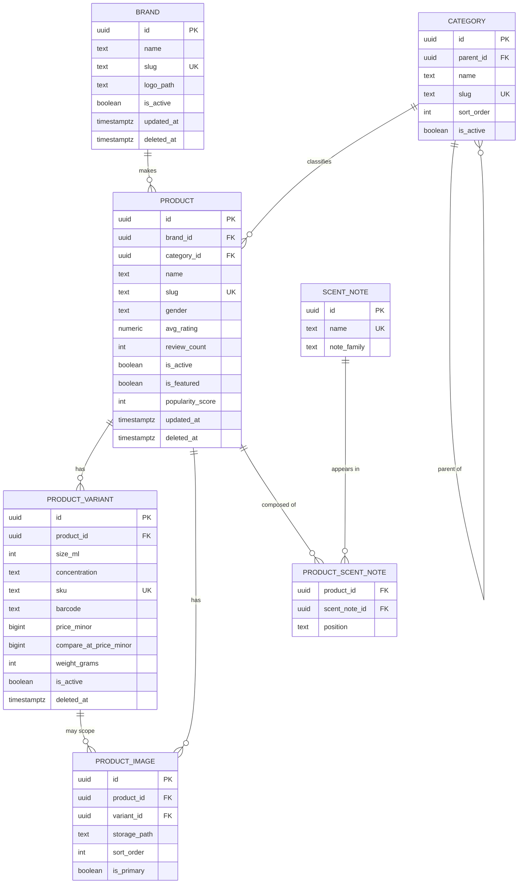

```sql
CREATE TABLE brand (
  id          uuid PRIMARY KEY DEFAULT gen_random_uuid(),
  name        text NOT NULL,
  slug        text NOT NULL UNIQUE,
  description text,
  logo_path   text,                       -- Supabase Storage object path
  is_active   boolean NOT NULL DEFAULT true,
  created_at  timestamptz NOT NULL DEFAULT now(),
  updated_at  timestamptz NOT NULL DEFAULT now(),
  deleted_at  timestamptz                  -- soft delete
);

CREATE TABLE category (
  id          uuid PRIMARY KEY DEFAULT gen_random_uuid(),
  parent_id   uuid REFERENCES category(id) ON DELETE SET NULL, -- self-hierarchy
  name        text NOT NULL,
  slug        text NOT NULL UNIQUE,
  sort_order  int NOT NULL DEFAULT 0,
  is_active   boolean NOT NULL DEFAULT true,
  created_at  timestamptz NOT NULL DEFAULT now(),
  updated_at  timestamptz NOT NULL DEFAULT now(),
  deleted_at  timestamptz
);
CREATE INDEX idx_category_parent ON category (parent_id);

CREATE TABLE product (
  id           uuid PRIMARY KEY DEFAULT gen_random_uuid(),
  brand_id     uuid NOT NULL REFERENCES brand(id) ON DELETE RESTRICT,
  category_id  uuid REFERENCES category(id) ON DELETE SET NULL,
  name         text NOT NULL,
  slug         text NOT NULL UNIQUE,
  description  text,
  gender       text NOT NULL DEFAULT 'unisex'
               CHECK (gender IN ('male','female','unisex')),
  avg_rating   numeric(2,1) NOT NULL DEFAULT 0,  -- denormalized cache from review
  review_count int NOT NULL DEFAULT 0,           -- denormalized cache
  is_active    boolean NOT NULL DEFAULT true,
  is_featured  boolean NOT NULL DEFAULT false,
  popularity_score int NOT NULL DEFAULT 0,        -- denormalized; refreshed by cron (ADR-011); keyset sort key for 07
  search_tsv   tsvector,                          -- generated; optional, see §2
  created_at   timestamptz NOT NULL DEFAULT now(),
  updated_at   timestamptz NOT NULL DEFAULT now(),
  deleted_at   timestamptz
);
CREATE INDEX idx_product_brand    ON product (brand_id);
CREATE INDEX idx_product_category ON product (category_id);
CREATE INDEX idx_product_gender   ON product (gender);
CREATE INDEX idx_product_search   ON product USING gin (search_tsv);
-- Fuzzy / substring (typo-tolerant) search across the unlimited catalog (pg_trgm):
--   CREATE EXTENSION IF NOT EXISTS pg_trgm;
CREATE INDEX idx_product_name_trgm ON product USING gin (name gin_trgm_ops);
-- Deterministic keyset sort used by the catalog API (07): ORDER BY popularity_score DESC, id DESC.
CREATE INDEX idx_product_popularity ON product (popularity_score DESC, id DESC) WHERE is_active;

CREATE TABLE product_variant (
  id                     uuid PRIMARY KEY DEFAULT gen_random_uuid(),
  product_id             uuid NOT NULL REFERENCES product(id) ON DELETE CASCADE,
  size_ml                int  NOT NULL CHECK (size_ml > 0),
  concentration          text NOT NULL
                         CHECK (concentration IN ('EDC','EDT','EDP','Parfum','Extrait')),
  sku                    text NOT NULL UNIQUE,
  barcode                text UNIQUE,            -- nullable; scanned by POS-lite
  price_minor            bigint NOT NULL CHECK (price_minor >= 0),  -- SLE minor units
  compare_at_price_minor bigint CHECK (compare_at_price_minor >= 0), -- strike-through
  currency               char(3) NOT NULL DEFAULT 'SLE',
  weight_grams           int,                    -- informs delivery handling
  is_active              boolean NOT NULL DEFAULT true,
  created_at             timestamptz NOT NULL DEFAULT now(),
  updated_at             timestamptz NOT NULL DEFAULT now(),
  deleted_at             timestamptz
);
CREATE INDEX idx_variant_product ON product_variant (product_id);
CREATE INDEX idx_variant_barcode ON product_variant (barcode);

CREATE TABLE product_image (
  id           uuid PRIMARY KEY DEFAULT gen_random_uuid(),
  product_id   uuid NOT NULL REFERENCES product(id) ON DELETE CASCADE,
  variant_id   uuid REFERENCES product_variant(id) ON DELETE CASCADE, -- nullable
  storage_path text NOT NULL,               -- WebP in Supabase Storage
  alt_text     text,
  width        int,
  height       int,
  sort_order   int NOT NULL DEFAULT 0,
  is_primary   boolean NOT NULL DEFAULT false,
  created_at   timestamptz NOT NULL DEFAULT now(),
  updated_at   timestamptz NOT NULL DEFAULT now()
);
CREATE INDEX idx_image_product ON product_image (product_id, sort_order);
-- One primary image per product (partial unique).
CREATE UNIQUE INDEX uq_image_primary ON product_image (product_id) WHERE is_primary;

CREATE TABLE scent_note (
  id          uuid PRIMARY KEY DEFAULT gen_random_uuid(),
  name        text NOT NULL UNIQUE,
  note_family text,                          -- citrus / woody / floral / oriental ...
  created_at  timestamptz NOT NULL DEFAULT now(),
  updated_at  timestamptz NOT NULL DEFAULT now()
);

CREATE TABLE product_scent_note (
  product_id    uuid NOT NULL REFERENCES product(id) ON DELETE CASCADE,
  scent_note_id uuid NOT NULL REFERENCES scent_note(id) ON DELETE CASCADE,
  position      text NOT NULL CHECK (position IN ('top','heart','base')),
  PRIMARY KEY (product_id, scent_note_id, position)
);
CREATE INDEX idx_psn_note ON product_scent_note (scent_note_id);
```

**Notes**
- `gender` is an attribute on `product` (per canon), not a separate table.
- `concentration` accepts `EDC`/`EDT`/`EDP`/`Parfum`/`Extrait`. The canon names only `EDT/EDP/Parfum`; `EDC` and `Extrait` are added to cover real perfume strengths. **(Assumption — High; OWNER INPUT** to confirm the concentration set actually stocked.)
- `avg_rating`/`review_count` are **denormalized caches** updated by a trigger/RPC on `review` publish — keeps the catalog payload small (no aggregate query per card). (Assumption — High that this is worth the write cost at this scale.)
- `popularity_score` is a **denormalized integer (default 0)** and the **deterministic keyset sort key** the catalog API (07) uses: `ORDER BY popularity_score DESC, id DESC` (tie-broken on `id` so pagination is stable). It is **recomputed by the popularity-refresh scheduled Edge Function (ADR-011)** from recent **confirmed sales** — i.e. it aggregates `order_item` joined to `"order"` whose status has reached `confirmed` (or later) over a **trailing window** (e.g. last 30/60 days; window length is **OWNER INPUT**). Because it is refreshed on a schedule rather than per-sale, it is **eventually consistent** (stale by at most one cron interval) — acceptable for a sort key, never used for money or stock decisions. **(Design note.)**
- Images reference variant optionally so a 100ml bottle photo can differ from 50ml, while sharing the product gallery.
- **Catalog scale (unlimited products):** search is served by `search_tsv` (full-text) **and** a `pg_trgm` GIN index on `name` for typo-tolerant/substring matches across product **name, brand and scent**; listing uses **keyset pagination** on `(popularity_score DESC, id DESC)`; images are WebP in **Supabase Storage (CDN)** with lazy thumbnails so payloads stay small on low-end devices. The catalog scales by **products, not locations** (single store).

---

## 4. Inventory domain — StockLedger + InventoryItem (oversell prevention)

**Serves:** Mr. Borteh + Staff (single source of truth for in-store POS-lite AND online), Aminata (accurate availability). **Single physical store in v1; per-variant balance — multi-store deferred.** **ADR:** ADR-010 (consistency), ADR-008 (build in-house), ADR-003 (Realtime stock pushes).

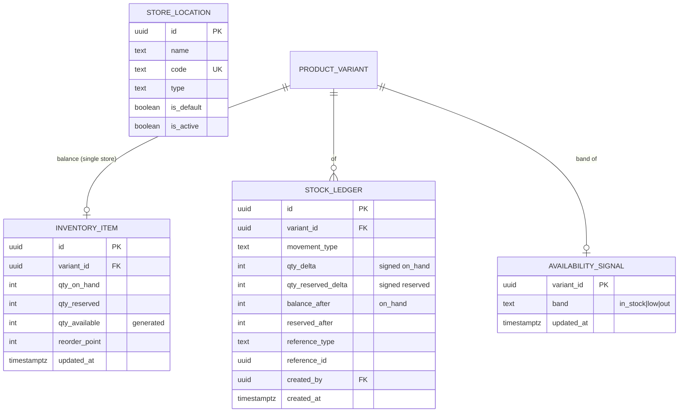

```sql
-- SINGLE physical store in v1 (expect exactly one active row). Multi-store is DEFERRED:
-- the location dimension was removed from inventory_item / stock_ledger / availability_signal.
CREATE TABLE store_location (
  id          uuid PRIMARY KEY DEFAULT gen_random_uuid(),
  name        text NOT NULL,
  code        text NOT NULL UNIQUE,        -- e.g. 'FT-MAIN'
  type        text NOT NULL DEFAULT 'retail_store'
              CHECK (type IN ('retail_store','warehouse')),
  address_text text,
  geo_lat     double precision,
  geo_lng     double precision,
  is_default  boolean NOT NULL DEFAULT false,  -- default fulfilling store
  is_active   boolean NOT NULL DEFAULT true,
  created_at  timestamptz NOT NULL DEFAULT now(),
  updated_at  timestamptz NOT NULL DEFAULT now()
);
CREATE UNIQUE INDEX uq_store_default ON store_location (is_default) WHERE is_default;

CREATE TABLE inventory_item (
  id            uuid PRIMARY KEY DEFAULT gen_random_uuid(),
  variant_id    uuid NOT NULL UNIQUE REFERENCES product_variant(id) ON DELETE CASCADE,
  qty_on_hand   int  NOT NULL DEFAULT 0 CHECK (qty_on_hand >= 0),
  qty_reserved  int  NOT NULL DEFAULT 0 CHECK (qty_reserved >= 0),
  qty_available int  GENERATED ALWAYS AS (qty_on_hand - qty_reserved) STORED,
  reorder_point int  NOT NULL DEFAULT 0,
  reorder_qty   int  NOT NULL DEFAULT 0,
  updated_at    timestamptz NOT NULL DEFAULT now(),
  -- Single physical store (v1): exactly ONE balance row per variant (UNIQUE variant_id).
  -- Multi-store is DEFERRED; re-add location_id + a composite key when a 2nd location opens.
  CONSTRAINT ck_reserved_le_onhand CHECK (qty_reserved <= qty_on_hand)
);
CREATE INDEX idx_inventory_lowstock  ON inventory_item (variant_id)
  WHERE qty_available <= reorder_point;   -- feeds low-stock cron (ADR-011)

CREATE TABLE stock_ledger (
  id             uuid PRIMARY KEY DEFAULT gen_random_uuid(),
  variant_id     uuid NOT NULL REFERENCES product_variant(id) ON DELETE RESTRICT,
  -- single store (v1): no location dimension; multi-store deferred.
  movement_type  text NOT NULL CHECK (movement_type IN
                   ('purchase','sale_online','sale_instore','adjustment',
                    'transfer_in','transfer_out','reservation','release','return')),
  -- TWO independent signed dimensions so the ledger reconstructs BOTH balances.
  -- A hold moves qty_reserved only (qty_delta = 0); a confirmed online sale moves
  -- qty_on_hand DOWN and clears the hold (qty_delta = -n, qty_reserved_delta = -n);
  -- a release reverses an unconsumed hold (qty_delta = 0, qty_reserved_delta = -n).
  qty_delta          int NOT NULL DEFAULT 0,  -- signed change to qty_ON_HAND
  qty_reserved_delta int NOT NULL DEFAULT 0,  -- signed change to qty_RESERVED
  balance_after      int,                     -- qty_on_hand snapshot AFTER applying (audit)
  reserved_after     int,                     -- qty_reserved snapshot AFTER applying (audit)
  reference_type text,                       -- 'order' | 'order_item' | 'manual' | 'transfer'
  reference_id   uuid,                       -- e.g. order.id (no hard FK: polymorphic)
  reason         text,
  created_by     uuid REFERENCES app_user(id),
  created_at     timestamptz NOT NULL DEFAULT now(),
  -- every movement must touch at least one dimension:
  CONSTRAINT ck_ledger_nonzero CHECK (qty_delta <> 0 OR qty_reserved_delta <> 0)
  -- intentionally NO updated_at: append-only
);
CREATE INDEX idx_ledger_variant     ON stock_ledger (variant_id, created_at);
CREATE INDEX idx_ledger_reference   ON stock_ledger (reference_type, reference_id);
CREATE INDEX idx_ledger_type        ON stock_ledger (movement_type, created_at);

-- Coarse, customer-safe availability. The ONLY stock-related table customer clients
-- subscribe to via Supabase Realtime. Written by the SAME RPC/trigger that mutates
-- inventory_item, inside the same transaction, so the band never drifts from balance.
-- Raw qty_on_hand / qty_reserved / qty_available are NEVER sent to customer clients.
CREATE TABLE availability_signal (
  variant_id  uuid PRIMARY KEY REFERENCES product_variant(id) ON DELETE CASCADE,
  band        text NOT NULL DEFAULT 'out'
              CHECK (band IN ('in_stock','low','out')),  -- bucketed from qty_available
  updated_at  timestamptz NOT NULL DEFAULT now()
);
-- Band derivation (server-side, in the inventory RPC/trigger):
--   qty_available := qty_on_hand - qty_reserved
--   band := CASE WHEN qty_available <= 0                       THEN 'out'
--                WHEN qty_available <= inventory_item.reorder_point THEN 'low'
--                ELSE 'in_stock' END
```

### 4.1 Why ledger + balance (rationale)

- **`inventory_item` is the fast read** ("can I sell 1 right now?"). `stock_ledger` is the **slow, immutable truth** (the full movement history). Keeping both means we get O(1) availability checks *and* a fully auditable, reconstructable history. **Two-dimension ledger parity** — every `stock_ledger` row carries **both** a signed `qty_delta` (on-hand) and a signed `qty_reserved_delta` (reserved), so the four canonical movements are:
  - **reservation** → `(qty_delta = 0, qty_reserved_delta = +n)`
  - **confirm / sale** (`sale_online` / `sale_instore`) → `(qty_delta = -n, qty_reserved_delta = -n)`
  - **release** (unconsumed hold) → `(qty_delta = 0, qty_reserved_delta = -n)`
  - **goods receipt** (`purchase` / `transfer_in`) → `(qty_delta = +n, qty_reserved_delta = 0)`

  **Reconstruction invariants** hold per `variant`: `SUM(qty_delta) = inventory_item.qty_on_hand` **and** `SUM(qty_reserved_delta) = inventory_item.qty_reserved`. **Balance invariants** hold on every `inventory_item` row at all times: `qty_reserved <= qty_on_hand` (enforced by `ck_reserved_le_onhand`) and `qty_available = qty_on_hand - qty_reserved` (the `STORED` generated column). A nightly reconciliation cron (ADR-011) asserts both reconstruction sums and alerts on drift. (05-system-architecture.md is aligned to these.) **(Fact / design invariant.)**
- **`availability_signal` keeps raw quantities off customer devices (ADR-003 Realtime).** Customer clients must learn that stock changed without learning *how much* stock there is — exposing `qty_on_hand`/`qty_reserved`/`qty_available` over Postgres Changes would leak exact counts to anyone with a Realtime subscription. So the one and only stock-related table customers subscribe to is `availability_signal`, holding a coarse `band` (`in_stock` / `low` / `out`) per `(variant, location)`. `qty_available = qty_on_hand - qty_reserved` is computed **server-side** and bucketed into the band by the **same RPC/trigger that mutates `inventory_item`** (same transaction, so band and balance can't diverge). Staff/owner admin still read **exact** numbers — but via authenticated **PostgREST** against `inventory_item`, never via Realtime. **(Design note, ADR-003.)**
- **Per-variant** balance (single physical store) lets the same Postgres serve in-store POS-lite *and* online from one source of truth (greenfield constraint). **Multi-store is DEFERRED** — re-add a `location_id` + composite key on `inventory_item` / `stock_ledger` / `availability_signal` only when a second location is opened (revisit trigger).
- **Oversell prevention (ADR-010):** all decrements/reservations go through a single RPC inside one Postgres transaction that either `SELECT ... FOR UPDATE`s the `inventory_item` row or does an **atomic conditional update**:

```sql
-- Reservation RPC sketch (pseudocode-level; real body lives in an Edge-Function-invoked RPC).
-- Returns TRUE only if stock was actually held — caller treats FALSE as "out of stock".
UPDATE inventory_item
   SET qty_reserved = qty_reserved + :qty,
       updated_at   = now()
 WHERE variant_id = :variant_id
   AND (qty_on_hand - qty_reserved) >= :qty   -- guard: cannot oversell
RETURNING id;
-- If a row is returned: also INSERT a stock_ledger row
--   (movement_type='reservation', qty_delta = 0, qty_reserved_delta = +:qty)
--   -- a hold moves RESERVED, not ON_HAND (see the two-dimension ledger above);
-- and UPSERT availability_signal (variant_id, band) with the recomputed
--   band so customer Realtime subscribers see in_stock/low/out -- never the raw numbers.
-- Online + in-store sales serialize on the same row, so concurrent buyers cannot both win.
```

- **Reservation lifecycle:** an online order places a **time-boxed reservation** (`payment_intent.reservation_expires_at`). On payment success / COD acceptance the reservation is **confirmed** → converts `qty_reserved` into an actual `qty_on_hand` decrement via `movement_type='sale_online'`. On expiry/failure a `movement_type='release'` reverses `qty_reserved`. Both transitions are driven by the **reservation-expiry sweep** and **payment reconciliation** crons (ADR-011).
- **`movement_type` naming:** `transfer_in`/`transfer_out` are **reserved for the deferred multi-store model** (a transfer would be two ledger rows across locations) and are unused while there is a single store; `return` (post-delivery returns restoring on-hand) and `adjustment` (stock corrections) are the active correction movements. These are canon-compatible refinements, not new movement concepts. **(Design note.)**

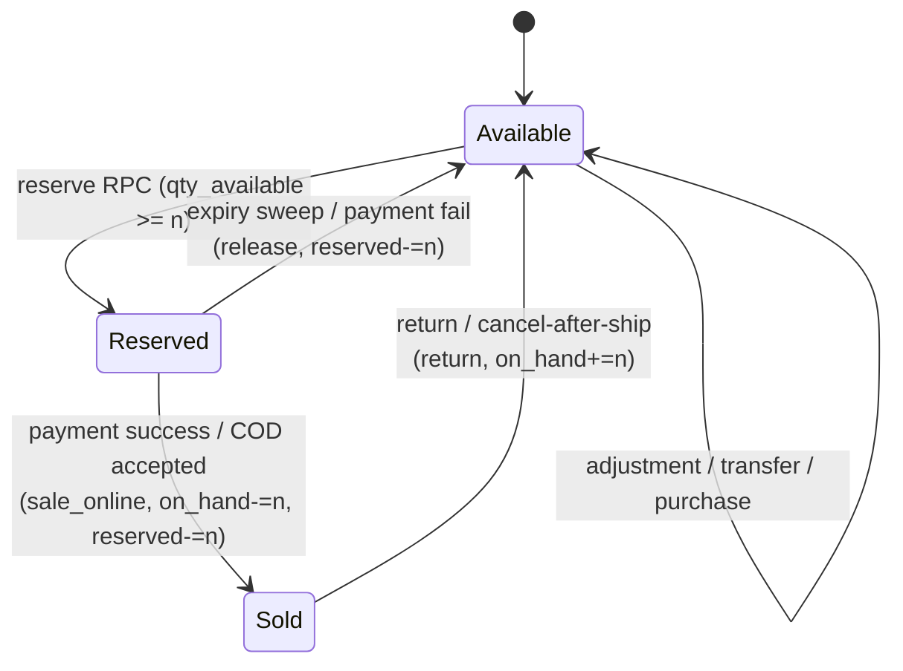

---

## 5. Users, addressing & delivery zones

**Serves:** Aminata (phone identity, landmark-based delivery), Saidu (rider profile), Mr. Borteh (zones/fees). **ADRs:** ADR-004 (phone + password, no SMS/OTP), ADR-008 (own riders, manual assignment).

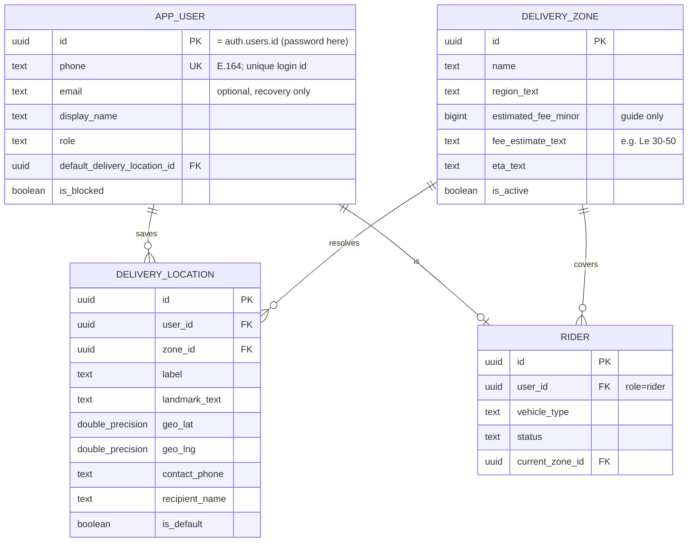

```sql
CREATE TABLE app_user (
  id            uuid PRIMARY KEY REFERENCES auth.users(id) ON DELETE CASCADE,
  -- AUTH = phone + PASSWORD via Supabase Auth (phone-confirmation/OTP DISABLED, no SMS).
  -- Password hash lives in auth.users (Supabase), never here. ADR-004.
  phone         text NOT NULL UNIQUE,      -- E.164; UNIQUE login identifier (ADR-004)
  email         text UNIQUE,               -- OPTIONAL; recovery only (most users have none)
  display_name  text,
  role          text NOT NULL DEFAULT 'customer'
                CHECK (role IN ('customer','staff','owner','rider')),
  default_delivery_location_id uuid,        -- FK added after delivery_location (circular)
  avatar_path   text,
  is_blocked    boolean NOT NULL DEFAULT false,  -- fraud/abuse control
  created_at    timestamptz NOT NULL DEFAULT now(),
  updated_at    timestamptz NOT NULL DEFAULT now()
);
CREATE INDEX idx_user_role ON app_user (role);

CREATE TABLE delivery_zone (
  id          uuid PRIMARY KEY DEFAULT gen_random_uuid(),
  name        text NOT NULL,               -- 'Central Freetown', 'Lumley', ...
  region_text text,                         -- named region (polygon deferred, see §2)
  -- Fee here is a GUIDE/ESTIMATE shown at checkout, NOT a binding auto-charge. The ACTUAL
  -- fee is confirmed per order by the owner (order.delivery_fee_minor, §7). ADR-008.
  estimated_fee_minor bigint CHECK (estimated_fee_minor >= 0), -- estimate only, SLE minor (nullable)
  fee_estimate_text   text,                 -- human range, e.g. 'Le 30-50 depending on distance'
  currency    char(3) NOT NULL DEFAULT 'SLE',
  eta_text    text,                         -- 'Same day', '1-2 days' (trust signal)
  is_active   boolean NOT NULL DEFAULT true,
  sort_order  int NOT NULL DEFAULT 0,
  created_at  timestamptz NOT NULL DEFAULT now(),
  updated_at  timestamptz NOT NULL DEFAULT now()
);

CREATE TABLE delivery_location (
  id            uuid PRIMARY KEY DEFAULT gen_random_uuid(),
  user_id       uuid NOT NULL REFERENCES app_user(id) ON DELETE CASCADE,
  zone_id       uuid REFERENCES delivery_zone(id) ON DELETE SET NULL,  -- resolved zone
  label         text,                       -- 'Home', 'Work', 'Mum'
  landmark_text text NOT NULL,              -- REQUIRED: weak street addressing
  geo_lat       double precision,           -- GPS pin (optional but encouraged)
  geo_lng       double precision,
  contact_phone text NOT NULL,              -- who the rider calls
  recipient_name text,
  notes         text,                       -- gate colour, call on arrival, etc.
  is_default    boolean NOT NULL DEFAULT false,
  created_at    timestamptz NOT NULL DEFAULT now(),
  updated_at    timestamptz NOT NULL DEFAULT now(),
  deleted_at    timestamptz
);
CREATE INDEX idx_delivery_location_user ON delivery_location (user_id);
-- One default per user.
CREATE UNIQUE INDEX uq_deliveryloc_default ON delivery_location (user_id) WHERE is_default;
-- deferred FK closing the circular ref:
ALTER TABLE app_user
  ADD CONSTRAINT fk_user_default_loc
  FOREIGN KEY (default_delivery_location_id)
  REFERENCES delivery_location(id) ON DELETE SET NULL;

CREATE TABLE rider (
  id              uuid PRIMARY KEY DEFAULT gen_random_uuid(),
  user_id         uuid NOT NULL UNIQUE REFERENCES app_user(id) ON DELETE CASCADE, -- role=rider
  vehicle_type    text NOT NULL DEFAULT 'motorbike'
                  CHECK (vehicle_type IN ('motorbike','car','bicycle','foot')),
  vehicle_plate   text,
  status          text NOT NULL DEFAULT 'offline'
                  CHECK (status IN ('available','busy','offline')),
  current_zone_id uuid REFERENCES delivery_zone(id) ON DELETE SET NULL,
  -- NO live GPS tracking (removed v2): the rider works an assigned-orders list only.
  is_active       boolean NOT NULL DEFAULT true,
  created_at      timestamptz NOT NULL DEFAULT now(),
  updated_at      timestamptz NOT NULL DEFAULT now()
);
CREATE INDEX idx_rider_status ON rider (status, current_zone_id);
```

**Notes**
- **`rider` is a 1:1 profile extension** of an `app_user` whose `role='rider'` (not a duplicate identity). Keeps auth in one place while holding dispatch-specific fields. **(Assumption — High.)**
- `delivery_zone.polygon` is intentionally **omitted**; zones are **named regions** with manual/assisted assignment (ADR-008, minimal budget). PostGIS can be added later without breaking this schema — **OWNER INPUT:** confirm the initial zone list + fees for Freetown.
- `delivery_location.landmark_text` is `NOT NULL` by design — it is the *primary* locator given weak street addressing; the GPS pin is a strong assist, not a substitute.
- **Auth & account security (ADR-004):** login is **phone + password** via Supabase Auth with **phone-confirmation disabled** (no OTP is ever sent — SMS is too costly). `phone` is the **unique** account key; `email` is optional, used only for self-service recovery. Default **password recovery = admin-assisted reset** (owner verifies the customer by phone and issues/resets a password from the admin) **plus** optional email self-service. Owner-approved hardening to add: **login rate-limiting + lockout** (anti brute-force / credential-stuffing) and an **optional in-app PIN / biometric unlock**. No SMS-based OTP or recovery anywhere.
- **Delivery zones are estimates only:** `delivery_zone.estimated_fee_minor` / `fee_estimate_text` are shown at checkout for guidance; the binding fee is set per order on `order.delivery_fee_minor` at confirmation (§7).
- **Rider is simple (ADR-008):** assigned-orders list with items + drop-off (landmark/pin/contact phone from the order snapshot), mark picked-up/delivered, record cash collected — **no live GPS tracking**.

---

## 6. Cart & Wishlist

**Serves:** Aminata (shopping). **ADR:** ADR-003 (cart/wishlist edits **require connectivity** — on failure show a clear offline / Retry state and never queue for later replay; these are client intents, not authoritative writes — the server re-prices at checkout).

```sql
CREATE TABLE wishlist (
  id         uuid PRIMARY KEY DEFAULT gen_random_uuid(),
  user_id    uuid NOT NULL UNIQUE REFERENCES app_user(id) ON DELETE CASCADE,
  created_at timestamptz NOT NULL DEFAULT now(),
  updated_at timestamptz NOT NULL DEFAULT now()
);

CREATE TABLE wishlist_item (
  id          uuid PRIMARY KEY DEFAULT gen_random_uuid(),
  wishlist_id uuid NOT NULL REFERENCES wishlist(id) ON DELETE CASCADE,
  product_id  uuid NOT NULL REFERENCES product(id) ON DELETE CASCADE,
  variant_id  uuid REFERENCES product_variant(id) ON DELETE CASCADE, -- optional
  created_at  timestamptz NOT NULL DEFAULT now(),
  CONSTRAINT uq_wishlist_item UNIQUE (wishlist_id, product_id, variant_id)
);
CREATE INDEX idx_wishlist_item_wl ON wishlist_item (wishlist_id);

CREATE TABLE cart (
  id         uuid PRIMARY KEY DEFAULT gen_random_uuid(),
  user_id    uuid NOT NULL REFERENCES app_user(id) ON DELETE CASCADE,
  status     text NOT NULL DEFAULT 'active'
             CHECK (status IN ('active','converted','abandoned')),
  created_at timestamptz NOT NULL DEFAULT now(),
  updated_at timestamptz NOT NULL DEFAULT now()
);
-- One active cart per user.
CREATE UNIQUE INDEX uq_cart_active ON cart (user_id) WHERE status = 'active';

CREATE TABLE cart_item (
  id               uuid PRIMARY KEY DEFAULT gen_random_uuid(),
  cart_id          uuid NOT NULL REFERENCES cart(id) ON DELETE CASCADE,
  variant_id       uuid NOT NULL REFERENCES product_variant(id) ON DELETE CASCADE,
  qty              int NOT NULL CHECK (qty > 0),
  unit_price_minor bigint NOT NULL,   -- price snapshot at add-time (display only)
  added_at         timestamptz NOT NULL DEFAULT now(),
  updated_at       timestamptz NOT NULL DEFAULT now(),
  CONSTRAINT uq_cart_item UNIQUE (cart_id, variant_id)
);
CREATE INDEX idx_cart_item_cart ON cart_item (cart_id);
```

> **Pricing authority:** `cart_item.unit_price_minor` is a *snapshot for display continuity*. The checkout Edge Function **re-reads `product_variant.price_minor` server-side** and ignores client prices, defeating tampered-price attacks (see 09-security-threat-model.md).

---

## 7. Orders

**Serves:** Aminata (place/track), Mr. Borteh + Staff (manage/fulfil). **ADRs:** ADR-009 (money), ADR-010 (reservation), ADR-005 (checkout via Edge Function).

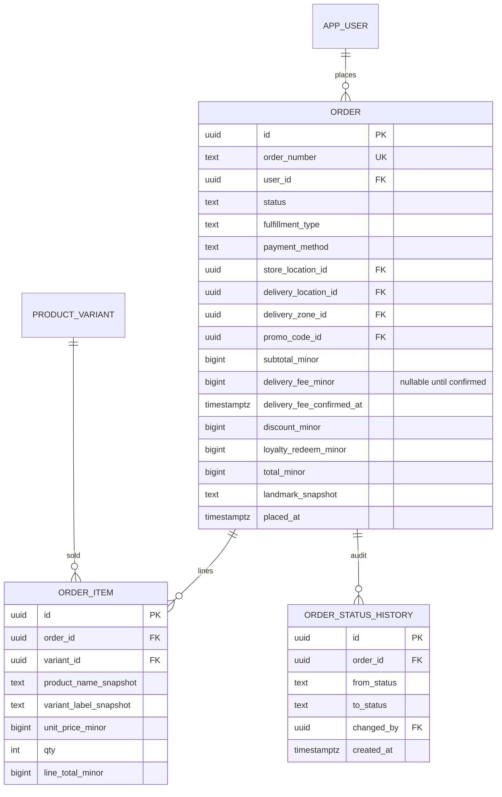

```sql
CREATE TABLE "order" (
  id                  uuid PRIMARY KEY DEFAULT gen_random_uuid(),
  order_number        text NOT NULL UNIQUE,   -- human friendly: 'BS-2026-000123'
  user_id             uuid NOT NULL REFERENCES app_user(id) ON DELETE RESTRICT,
  -- Explicit, complete order lifecycle. Payment sub-states live on payment_intent (§8);
  -- delivery sub-states live on delivery_job (§10). See §7.1 for the mapping.
  status              text NOT NULL DEFAULT 'pending_payment' CHECK (status IN (
                        'pending_payment','confirmed','preparing','out_for_delivery',
                        'delivered','cancelled','returned')),
  fulfillment_type    text NOT NULL DEFAULT 'delivery'
                      CHECK (fulfillment_type IN ('delivery','pickup')),
  -- CASH is a first-class payment option (cash on delivery / pay at pickup) alongside Monime.
  payment_method      text NOT NULL CHECK (payment_method IN ('monime','cash_on_delivery')),
  store_location_id   uuid NOT NULL REFERENCES store_location(id), -- fulfilling store
  delivery_location_id uuid REFERENCES delivery_location(id),       -- nullable for pickup
  delivery_zone_id    uuid REFERENCES delivery_zone(id),
  promo_code_id       uuid REFERENCES promo_code(id),
  -- delivery snapshot (immutable copy; source row may later change/delete):
  landmark_snapshot   text,
  geo_lat_snapshot    double precision,
  geo_lng_snapshot    double precision,
  contact_phone_snapshot text,
  recipient_name_snapshot text,
  -- money (all SLE minor units, ADR-009):
  subtotal_minor      bigint NOT NULL CHECK (subtotal_minor >= 0),
  -- delivery_zone gives only an ESTIMATE; the ACTUAL fee is confirmed per order by the owner
  -- (or agreed on the call). NULL until confirmed; total is recomputed when it is set. ADR-008.
  delivery_fee_minor  bigint CHECK (delivery_fee_minor >= 0),                  -- nullable until confirmed
  delivery_fee_confirmed_at timestamptz,                                       -- when owner fixes the fee
  discount_minor      bigint NOT NULL DEFAULT 0 CHECK (discount_minor >= 0),   -- promo_code + promo_rule + tier/card
  loyalty_redeem_minor bigint NOT NULL DEFAULT 0 CHECK (loyalty_redeem_minor >= 0), -- SLE value of points redeemed
  total_minor         bigint NOT NULL CHECK (total_minor >= 0),
  currency            char(3) NOT NULL DEFAULT 'SLE',
  loyalty_points_earned   int NOT NULL DEFAULT 0,
  loyalty_points_redeemed int NOT NULL DEFAULT 0,  -- POINTS count (monetary value = loyalty_redeem_minor)
  notes               text,
  -- set whenever status -> 'cancelled'. Documented values (open set):
  --   'payment_expired' | 'payment_failed' | 'customer_cancelled' | 'staff_cancelled'
  cancel_reason       text,
  placed_at           timestamptz,
  confirmed_at        timestamptz,
  delivered_at        timestamptz,
  cancelled_at        timestamptz,
  returned_at         timestamptz,
  created_at          timestamptz NOT NULL DEFAULT now(),
  updated_at          timestamptz NOT NULL DEFAULT now(),
  -- money integrity: the total is fully derived from its parts (ADR-009)
  -- delivery_fee_minor is NULL until the owner confirms it; treat as 0 in the running total
  -- and recompute total_minor when the fee is set (delivery_fee_confirmed_at).
  CONSTRAINT ck_order_total CHECK (
    total_minor = subtotal_minor + COALESCE(delivery_fee_minor,0) - discount_minor - loyalty_redeem_minor),
  -- a delivery order must have a destination; pickup need not
  CONSTRAINT ck_order_delivery_target CHECK (
    fulfillment_type = 'pickup' OR delivery_location_id IS NOT NULL)
);
CREATE INDEX idx_order_user        ON "order" (user_id, created_at DESC);
CREATE INDEX idx_order_status      ON "order" (status, created_at);
CREATE INDEX idx_order_store       ON "order" (store_location_id, status);

CREATE TABLE order_item (
  id                     uuid PRIMARY KEY DEFAULT gen_random_uuid(),
  order_id               uuid NOT NULL REFERENCES "order"(id) ON DELETE CASCADE,
  variant_id             uuid REFERENCES product_variant(id) ON DELETE SET NULL,
  -- snapshots so history is immutable even if catalog changes/deletes:
  product_name_snapshot  text NOT NULL,
  variant_label_snapshot text NOT NULL,     -- '100ml EDP'
  sku_snapshot           text NOT NULL,
  unit_price_minor       bigint NOT NULL CHECK (unit_price_minor >= 0),
  qty                    int NOT NULL CHECK (qty > 0),
  line_total_minor       bigint NOT NULL CHECK (line_total_minor >= 0),
  created_at             timestamptz NOT NULL DEFAULT now()
);
CREATE INDEX idx_order_item_order ON order_item (order_id);

CREATE TABLE order_status_history (
  id          uuid PRIMARY KEY DEFAULT gen_random_uuid(),
  order_id    uuid NOT NULL REFERENCES "order"(id) ON DELETE CASCADE,
  from_status text,
  to_status   text NOT NULL,
  changed_by  uuid REFERENCES app_user(id),  -- null = system/cron
  note        text,
  created_at  timestamptz NOT NULL DEFAULT now()
  -- append-only
);
CREATE INDEX idx_osh_order ON order_status_history (order_id, created_at);
```

> Table is named `"order"` (reserved word, quoted). Entity name remains **`Order`**.

> **Delivery fee = estimate -> confirmed.** Checkout SHOWS the `delivery_zone` estimate (`estimated_fee_minor` / `fee_estimate_text`) but never hard-charges a computed zone fee. `order.delivery_fee_minor` stays **NULL** until the owner confirms the real fee per order (sets `delivery_fee_confirmed_at`), at which point `total_minor` is recomputed. `discount_minor` aggregates any `promo_code` (§11.4) + automatic `promo_rule` + the user's loyalty card/tier discount (§11.5, ADR-012).

### 7.1 Order state machine

`order.status` is the **high-level lifecycle**: `pending_payment` → `confirmed` → `preparing` → `out_for_delivery` → `delivered`, plus the two off-ramps `cancelled` and `returned`. Fine-grained payment progress lives on `payment_intent.status` (§8.2); fine-grained delivery progress lives on `delivery_job.status` (§10).

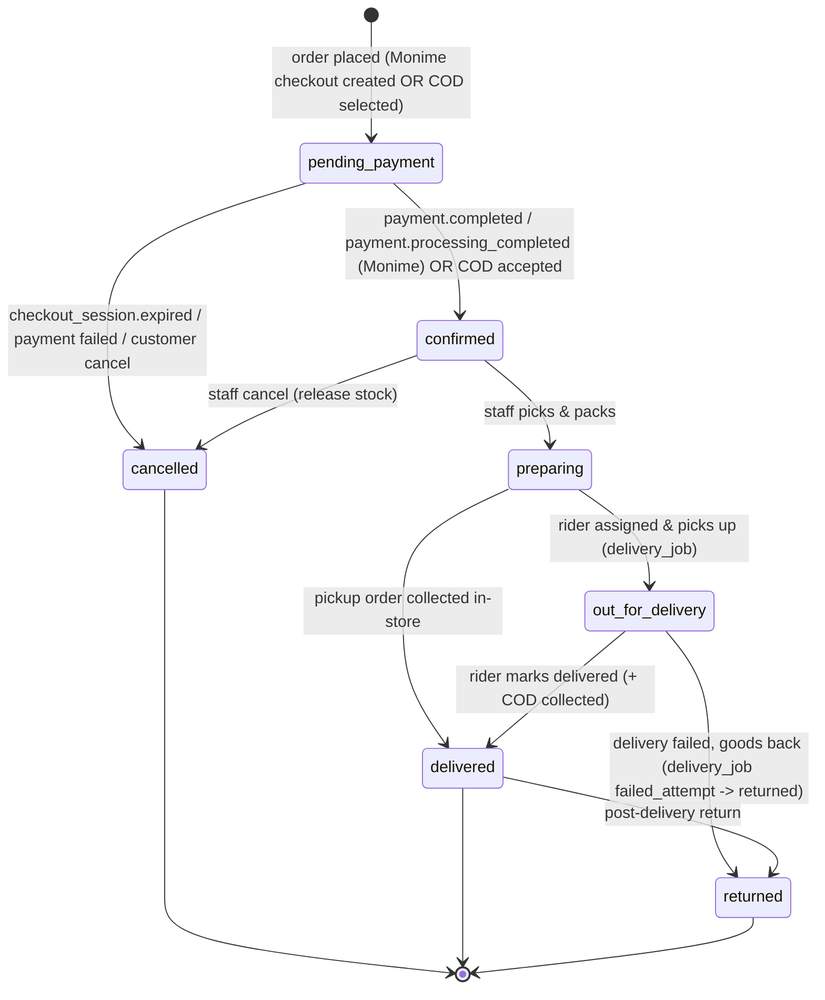

**Mapping rules (so 07-api-design.md and 05-system-architecture.md align):**
- **Payment failure/expiry → `cancelled`.** A Monime `checkout_session.expired`, a payment failure, or a customer/staff cancel transitions the order to `cancelled` and **sets `cancel_reason`**: `payment_expired` (expiry sweep / `checkout_session.expired`), `payment_failed` (failed rail), `customer_cancelled` (user abandons), or `staff_cancelled` (manual). Cancelling **releases the stock reservation** (`movement_type='release'`, §4).
- **Failed/returned delivery → tracked on `delivery_job.status`.** A delivery that cannot be completed is recorded on `delivery_job.status` (`assigned, picked_up, delivered, failed_attempt, returned`, §10), **not** on `order.status`. When the goods come back to the store (`delivery_job.status='returned'`), the order **may** move to `order.status='returned'` (restock via `movement_type='return'`, §4). A post-delivery customer return moves `delivered → returned` the same way.
- **No `refunded` order status.** Money reversal lives in the `refund` table (§9), decoupled from the fulfillment lifecycle: an order can be `delivered`, `cancelled`, or `returned` while a `refund` row independently tracks the dashboard reconciliation.

---

## 8. Payments — Monime (PaymentIntent + PaymentWebhook)

**Serves:** Aminata (pay by mobile money or COD), Mr. Borteh (reconcile revenue). **ADRs:** ADR-006 (PaymentProvider abstraction), ADR-009 (minor units), ADR-005 (Edge Functions), ADR-011 (reconciliation cron). All Monime mechanics below are **(Fact)** from the canon's battle-tested integration.

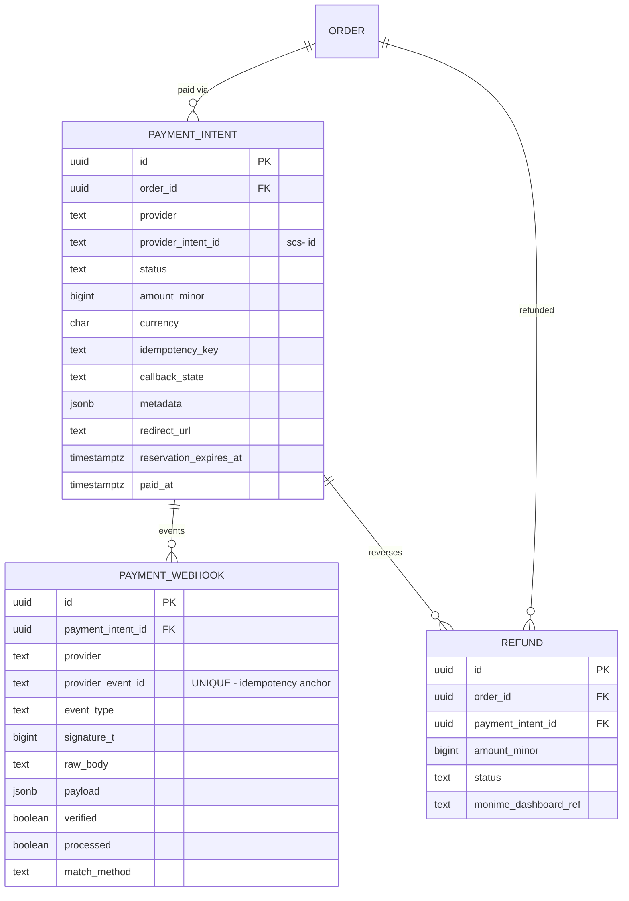

```sql
CREATE TABLE payment_intent (
  id                  uuid PRIMARY KEY DEFAULT gen_random_uuid(),
  order_id            uuid NOT NULL REFERENCES "order"(id) ON DELETE RESTRICT,
  provider            text NOT NULL CHECK (provider IN ('monime','cash_on_delivery')),
  provider_intent_id  text,                  -- Monime result.id = 'scs-...'; null for COD pre-accept
  status              text NOT NULL DEFAULT 'created' CHECK (status IN
                        ('created','processing','succeeded','failed','cancelled','expired')),
  amount_minor        bigint NOT NULL CHECK (amount_minor >= 0),  -- SLE minor units
  currency            char(3) NOT NULL DEFAULT 'SLE',             -- Monime: SLE only
  idempotency_key     text NOT NULL,         -- Idempotency-Key we sent (<=64 chars)
  callback_state      text,                  -- round-tripped via Monime callbackState
  metadata            jsonb NOT NULL DEFAULT '{}'::jsonb, -- {"intent_id": <this.id>} round-trip
  redirect_url        text,                  -- checkout.monime.io/scs-...
  checkout_session_raw jsonb,                -- full creation response (audit)
  reservation_expires_at timestamptz,        -- time-boxed stock hold (ADR-010)
  paid_at             timestamptz,
  failure_reason      text,
  created_at          timestamptz NOT NULL DEFAULT now(),
  updated_at          timestamptz NOT NULL DEFAULT now(),
  -- provider_intent_id is unique per provider when present:
  CONSTRAINT uq_intent_provider_id UNIQUE (provider, provider_intent_id),
  CONSTRAINT uq_intent_idem UNIQUE (provider, idempotency_key)
);
CREATE INDEX idx_intent_order  ON payment_intent (order_id);
CREATE INDEX idx_intent_status ON payment_intent (status, reservation_expires_at); -- expiry sweep

CREATE TABLE payment_webhook (
  id                 uuid PRIMARY KEY DEFAULT gen_random_uuid(),
  payment_intent_id  uuid REFERENCES payment_intent(id) ON DELETE SET NULL, -- null until matched
  provider           text NOT NULL DEFAULT 'monime',
  provider_event_id  text NOT NULL,         -- event.id; THE idempotency anchor
  event_type         text NOT NULL,         -- payment.completed | checkout_session.expired | ...
  signature_t        bigint,                -- the t=<unix-seconds> from Monime-Signature
  raw_body           text NOT NULL,         -- RAW bytes, read BEFORE JSON parse (signature!)
  payload            jsonb,                 -- parsed copy for querying (NOT used for verify)
  verified           boolean NOT NULL DEFAULT false,  -- HMAC-SHA256 passed
  processed          boolean NOT NULL DEFAULT false,  -- side-effects applied
  match_method       text,                  -- 'metadata' | 'object_id' | 'ownership_graph'
  error              text,
  received_at        timestamptz NOT NULL DEFAULT now(),
  processed_at       timestamptz,
  created_at         timestamptz NOT NULL DEFAULT now(),
  -- UNIQUE is the dedup guarantee against duplicate webhook deliveries:
  CONSTRAINT uq_webhook_event UNIQUE (provider, provider_event_id)
);
CREATE INDEX idx_webhook_intent ON payment_webhook (payment_intent_id);
CREATE INDEX idx_webhook_unproc ON payment_webhook (processed, event_type) WHERE NOT processed;
```

### 8.1 Why these tables look like this (rationale, all **Fact** unless noted)

- **`provider_intent_id` = the `scs-` id.** Monime `POST /v1/checkout-sessions` returns `result.id` (`scs-...`); we persist it as `provider_intent_id` and the hosted `result.redirectUrl` (`checkout.monime.io/scs-...`) as `redirect_url`. The RN app opens `redirect_url` in an Expo WebBrowser and returns via deep link — **but the redirect is NOT trusted**; the webhook is the source of truth.
- **Status set `created/processing/succeeded/failed/cancelled` (+`expired`).** Maps the Monime lifecycle into our PaymentProvider abstraction (ADR-006). We **move money/stock only on `payment.completed` and `payment.processing_completed`** (treat both as success → `succeeded`); `checkout_session.completed` is the same transition in a different shape; `checkout_session.expired` → `expired`/abandoned. `payment.created`/`processing_started`/`financial_transaction.created` are **informational**: they may advance the intent to the non-authoritative `processing` display state (see §8.2) but never confirm stock, flip an order to `confirmed`, or otherwise move money — only the two completion events do that.
- **`callback_state` + `metadata.intent_id` round-trip.** We send our own `payment_intent.id` through **both** Monime `callbackState` **and** `metadata.intent_id` (and the channel path `data.channel.metadata.intent_id`, which survives most cleanly). On webhook receipt we **match in order**: (1) `data.metadata.intent_id` / `data.channel.metadata.intent_id`; (2) for `checkout_session.*`, object `id == provider_intent_id`; (3) walk `data.ownershipGraph.owner` up to depth 5 to find the `checkout_session` id. The chosen path is recorded in `payment_webhook.match_method` for debugging.
- **`UNIQUE (provider, provider_event_id)` is the idempotency anchor.** Monime can deliver an event more than once; the unique constraint makes a duplicate insert fail fast, so processing is exactly-once. Before flipping status we **re-verify `amount_minor` + `currency`** against the stored intent, then apply a **status-guarded update** so we never race the expiry sweep:

```sql
-- Webhook → success transition (sketch). Guard prevents double-apply / sweep race.
UPDATE payment_intent
   SET status = 'succeeded', paid_at = now(), updated_at = now()
 WHERE id = :matched_intent_id
   AND amount_minor = :event_amount_minor      -- amount must match
   AND currency     = :event_currency          -- currency must match (SLE)
   AND status IN ('created','processing')       -- status guard
RETURNING id;
-- Only if a row is returned do we confirm the stock reservation (sale_online) + order → confirmed.
```

- **`raw_body` stored as `text`.** Signature verification is `HMAC-SHA256(secret, t || '_' || raw_body)` compared base64, timing-safe — **underscore separator, not Stripe's period** (the #1 gotcha). We must read the **raw** body before any JSON parse (re-serialized bytes break the signature), so we persist exactly those bytes. Replay window: reject if `(now - t) > 300s` or `(t - now) > 60s`. Two-secret rotation (CURRENT + PREVIOUS). `payload` (jsonb) is a *parsed convenience copy only* and is never used for verification. Full detail in 08-payments-monime.md / 09-security-threat-model.md.
- **`Idempotency-Key`** we send on `POST /v1/checkout-sessions` is stored in `idempotency_key` (≤64 chars) and uniquely constrained per provider, so a retried checkout creation reuses the same intent. **BLOCKED ON MONIME DOCS:** the key's TTL is *assumed 24h* — confirm.

### 8.2 PaymentIntent state machine

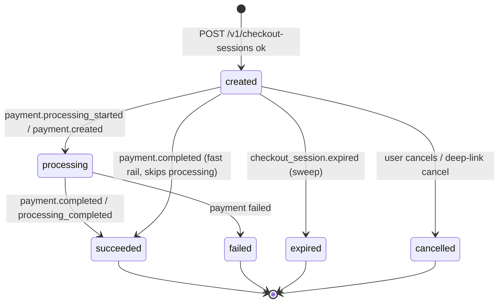

> **COD intents** are modeled in the same table with `provider='cash_on_delivery'`: created at order placement, moved to `succeeded` when `delivery_job.cod_collected_minor` is recorded at delivery, or `cancelled` on a failed/returned delivery. Because `idempotency_key` is `NOT NULL` but no Monime call is made, COD intents use a synthetic key such as `cod-<order_id>`; `provider_intent_id` stays null. This keeps one consistent payment ledger across both rails (ADR-006).

---

## 9. Refunds (manual Monime reconciliation)

**Serves:** Mr. Borteh (handle returns/disputes). **ADR:** ADR-006. **Status: BLOCKED ON MONIME DOCS** — there is **no Monime refund API as of 2026-05** and **no confirmed refund/chargeback webhook**. Refunds are executed **manually in the Monime dashboard**, then recorded here for our own books. This table is therefore an **internal record + reconciliation worklist**, not an automation hook.

```sql
CREATE TABLE refund (
  id                   uuid PRIMARY KEY DEFAULT gen_random_uuid(),
  order_id             uuid NOT NULL REFERENCES "order"(id) ON DELETE RESTRICT,
  payment_intent_id    uuid REFERENCES payment_intent(id) ON DELETE SET NULL,
  amount_minor         bigint NOT NULL CHECK (amount_minor > 0),  -- SLE minor
  currency             char(3) NOT NULL DEFAULT 'SLE',
  status               text NOT NULL DEFAULT 'pending' CHECK (status IN
                         ('pending','manual_processing','completed','failed')),
  reason               text,
  monime_dashboard_ref text,        -- reference operator keys after dashboard refund
  requested_by         uuid REFERENCES app_user(id),    -- staff/owner
  processed_by         uuid REFERENCES app_user(id),
  requested_at         timestamptz NOT NULL DEFAULT now(),
  completed_at         timestamptz,
  notes                text,
  created_at           timestamptz NOT NULL DEFAULT now(),
  updated_at           timestamptz NOT NULL DEFAULT now()
);
CREATE INDEX idx_refund_order  ON refund (order_id);
CREATE INDEX idx_refund_status ON refund (status, requested_at);
```

> **Reconciliation flow (manual):** staff creates a `refund` (`pending`) → owner refunds in Monime dashboard → operator sets `status='completed'` + `monime_dashboard_ref`. Refund state lives **entirely in this table** — `order.status` has **no `refunded` value** (§7.1); the order keeps its fulfillment status (`delivered`/`cancelled`/`returned`) while the `refund` row tracks the money reversal independently. The payment reconciliation cron (ADR-011) lists `manual_processing` refunds older than N days as a nag. **OWNER INPUT:** refund policy (full/partial, window).

---

## 10. Delivery jobs & dispatch

**Serves:** Saidu (assigned deliveries, COD collection), Mr. Borteh (assign/track). **ADR:** ADR-008 (build in-house dispatch).

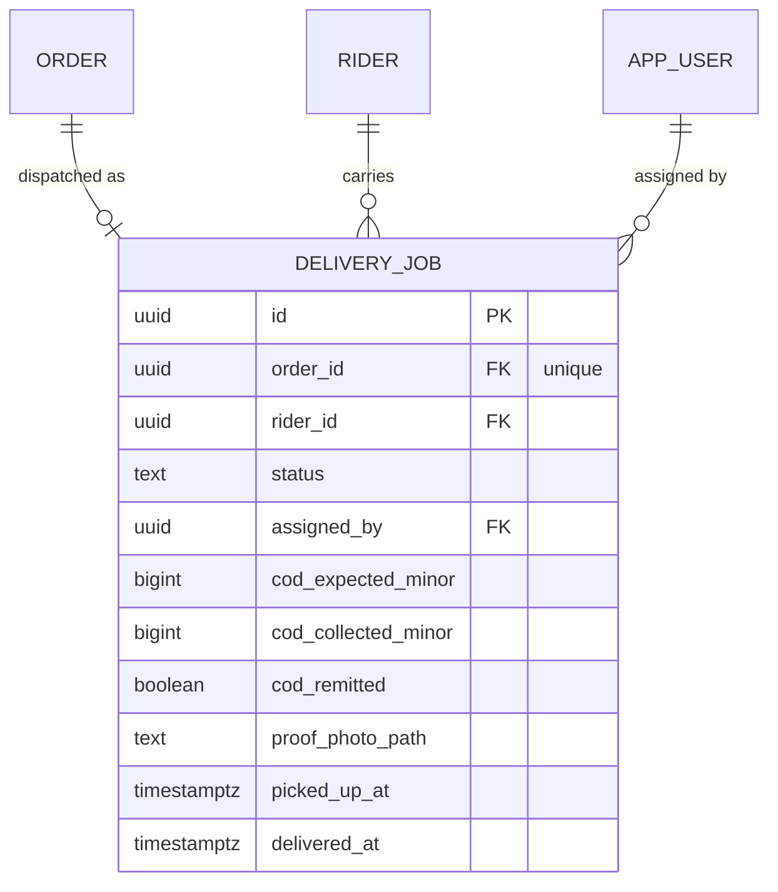

```sql
CREATE TABLE delivery_job (
  id                  uuid PRIMARY KEY DEFAULT gen_random_uuid(),
  order_id            uuid NOT NULL UNIQUE REFERENCES "order"(id) ON DELETE CASCADE,
  rider_id            uuid REFERENCES rider(id) ON DELETE SET NULL, -- null only transiently during reassignment
  -- job is created when staff/owner assigns a rider (order -> out_for_delivery, §7.1).
  status              text NOT NULL DEFAULT 'assigned' CHECK (status IN
                        ('assigned','picked_up','delivered','failed_attempt','returned')),
  assigned_by         uuid REFERENCES app_user(id),     -- staff/owner who assigned
  cod_expected_minor  bigint NOT NULL DEFAULT 0 CHECK (cod_expected_minor >= 0),
  cod_collected_minor bigint NOT NULL DEFAULT 0 CHECK (cod_collected_minor >= 0),
  cod_remitted        boolean NOT NULL DEFAULT false,   -- rider handed cash to store
  proof_photo_path    text,                  -- Storage path; delivery proof
  recipient_note      text,
  failure_reason      text,
  sequence_no         int,                   -- ordering within a rider's run
  assigned_at         timestamptz,
  picked_up_at        timestamptz,
  delivered_at        timestamptz,
  created_at          timestamptz NOT NULL DEFAULT now(),
  updated_at          timestamptz NOT NULL DEFAULT now()
);
CREATE INDEX idx_deljob_rider  ON delivery_job (rider_id, status);
CREATE INDEX idx_deljob_status ON delivery_job (status, created_at);
```

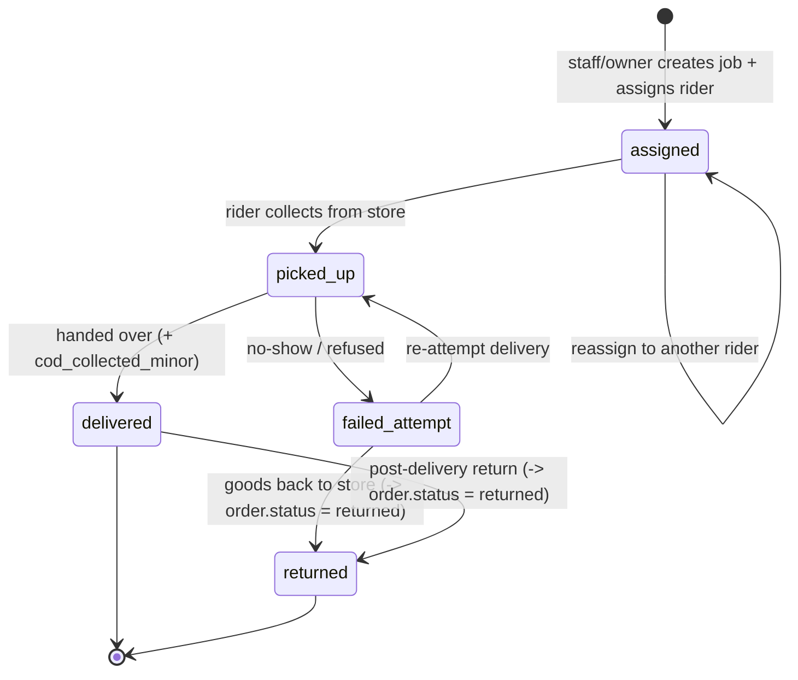

**Notes**
- One **active** `delivery_job` per order (`UNIQUE order_id`), **created at the moment a rider is assigned** (status starts at `assigned`; the order simultaneously moves to `out_for_delivery`, §7.1). Reassignment mutates the same row (`rider_id` swapped, status stays `assigned`); history is captured via `order_status_history` + analytics. **(Assumption — Med.)** If full reassignment history is required, relax to many jobs with a partial-unique active flag — **OWNER INPUT.**
- `cod_expected_minor` is copied from `order.total_minor` for COD orders; `cod_collected_minor` + `cod_remitted` close Saidu's cash loop and feed COD reconciliation.

---

## 11. Engagement: restock, reviews, notifications, promos, loyalty, analytics

**Serves:** Aminata (restock alerts, reviews, loyalty), Mr. Borteh (marketing, analytics). **ADRs:** ADR-007 (in-app notification feed + click-to-chat comms), ADR-008 (in-house analytics), ADR-011 (fan-out crons), ADR-012 (configurable loyalty/promos).

### 11.1 RestockSubscription

```sql
CREATE TABLE restock_subscription (
  id          uuid PRIMARY KEY DEFAULT gen_random_uuid(),
  user_id     uuid NOT NULL REFERENCES app_user(id) ON DELETE CASCADE,
  variant_id  uuid NOT NULL REFERENCES product_variant(id) ON DELETE CASCADE,
  status      text NOT NULL DEFAULT 'active'
              CHECK (status IN ('active','notified','cancelled')),
  channel     text NOT NULL DEFAULT 'in_app'
              CHECK (channel IN ('in_app','push','any')),  -- in-app feed (free); push optional
  notified_at timestamptz,
  created_at  timestamptz NOT NULL DEFAULT now(),
  updated_at  timestamptz NOT NULL DEFAULT now()
);
-- Only one ACTIVE subscription per (user,variant); re-subscribe after notify allowed.
CREATE UNIQUE INDEX uq_restock_active ON restock_subscription (user_id, variant_id)
  WHERE status = 'active';
CREATE INDEX idx_restock_variant ON restock_subscription (variant_id) WHERE status = 'active';
```

> The restock fan-out cron (ADR-011) fires when a `purchase`/`adjustment` pushes `inventory_item.qty_available` from 0 to >0 — the same transition that flips `availability_signal.band` from `out` to `low`/`in_stock`; it selects active subscriptions on that variant and enqueues **in-app `notification` rows** delivered over Supabase Realtime (free; ADR-007), optionally mirrored to free push. Subscribing **requires connectivity** (ADR-003): on failure show a clear offline / Retry state; the action is never queued for later replay.

### 11.2 Review (with verified_purchase)

```sql
CREATE TABLE review (
  id                uuid PRIMARY KEY DEFAULT gen_random_uuid(),
  product_id        uuid NOT NULL REFERENCES product(id) ON DELETE CASCADE,
  user_id           uuid NOT NULL REFERENCES app_user(id) ON DELETE CASCADE,
  order_id          uuid REFERENCES "order"(id) ON DELETE SET NULL, -- proof of purchase
  rating            int  NOT NULL CHECK (rating BETWEEN 1 AND 5),
  title             text,
  body              text,
  verified_purchase boolean NOT NULL DEFAULT false, -- true iff a delivered order exists
  status            text NOT NULL DEFAULT 'pending'
                    CHECK (status IN ('pending','published','rejected')), -- moderation
  created_at        timestamptz NOT NULL DEFAULT now(),
  updated_at        timestamptz NOT NULL DEFAULT now(),
  CONSTRAINT uq_review_user_product UNIQUE (user_id, product_id) -- one review per product
);
CREATE INDEX idx_review_product ON review (product_id, status);
```

> `verified_purchase` is set server-side by checking for a `delivered` (or later `returned`) order containing the product — a key **trust signal** for a developing online-shopping market. Publishing a review recomputes `product.avg_rating` / `review_count` via trigger/RPC.

### 11.3 Notification + NotificationPreference

```sql
CREATE TABLE notification (
  id            uuid PRIMARY KEY DEFAULT gen_random_uuid(),
  user_id       uuid NOT NULL REFERENCES app_user(id) ON DELETE CASCADE,
  type          text NOT NULL CHECK (type IN
                  ('order_status','restock_available','delivery','promo','system')),
  channel       text NOT NULL DEFAULT 'in_app'
                CHECK (channel IN ('in_app','push')),  -- in-app feed (Realtime); push optional (Could)
  title         text,
  body          text NOT NULL,
  status        text NOT NULL DEFAULT 'queued'
                CHECK (status IN ('queued','sent','delivered','failed')),
  provider_ref  text,                       -- Expo/FCM push id (in-app feed has none)
  reference_type text,                       -- 'order' | 'restock_subscription' ...
  reference_id  uuid,
  error         text,
  sent_at       timestamptz,
  created_at    timestamptz NOT NULL DEFAULT now()
);
CREATE INDEX idx_notif_user  ON notification (user_id, created_at DESC);
CREATE INDEX idx_notif_queue ON notification (status, created_at) WHERE status = 'queued';

CREATE TABLE notification_preference (
  user_id            uuid PRIMARY KEY REFERENCES app_user(id) ON DELETE CASCADE,
  in_app_enabled     boolean NOT NULL DEFAULT true,  -- in-app feed: effectively always on
  push_enabled       boolean NOT NULL DEFAULT false, -- optional free Expo/FCM push (Could)
  push_token         text,                           -- Expo/FCM token
  marketing_opt_in   boolean NOT NULL DEFAULT false, -- in-app/push marketing consent
  updated_at         timestamptz NOT NULL DEFAULT now()
);
```

> Customer-facing notifications are an **in-app feed** (order status, restock-available) delivered over **Supabase Realtime** on the `notification` table — **free, no SMS / WhatsApp / Meta API** (ADR-007). Optional free **Expo/FCM push** (a *Could*) may mirror a feed entry; there is **no** SMS or WhatsApp channel. Store->customer contact is handled out-of-band by the owner via **one-tap `tel:` call and `wa.me` click-to-chat** deep links on the admin order screen (no API, no cost) — see 05 / 10.

### 11.4 PromoCode

```sql
CREATE TABLE promo_code (
  id                uuid PRIMARY KEY DEFAULT gen_random_uuid(),
  code              text NOT NULL UNIQUE,         -- case-insensitive at app layer
  description       text,
  discount_type     text NOT NULL CHECK (discount_type IN ('percent','fixed')),
  discount_value    int  NOT NULL CHECK (discount_value > 0), -- percent: 1-100; fixed: minor units
  max_discount_minor bigint,                       -- cap for percent codes
  min_order_minor   bigint NOT NULL DEFAULT 0,
  usage_limit       int,                           -- null = unlimited (global)
  usage_count       int NOT NULL DEFAULT 0,
  per_user_limit    int NOT NULL DEFAULT 1,
  starts_at         timestamptz,
  ends_at           timestamptz,
  is_active         boolean NOT NULL DEFAULT true,
  created_at        timestamptz NOT NULL DEFAULT now(),
  updated_at        timestamptz NOT NULL DEFAULT now()
);
CREATE INDEX idx_promo_active ON promo_code (is_active, ends_at);
```

> For a `fixed` code, `discount_value` is in **SLE minor units** (ADR-009); for `percent` it is a whole-percent integer. Validation + atomic `usage_count` increment happen in the checkout Edge Function. `promo_code` covers **typed coupon codes**; **automatic** owner-configured promotions (spend-threshold discounts, bonus points, card grants) live in `promo_rule` (§11.5, ADR-012).

### 11.5 Configurable loyalty & promotions (ADR-012)

**Owner-editable, NO code change to tune.** Earn rates, redemption value, spend thresholds, discount %, point expiry, and card/tier grants are all **data** in the tables below and editable from the admin. Discounts/points are applied **at checkout** by the checkout Edge Function evaluating the active `promo_rule`(s) **plus** the user's current `loyalty_tier`/card discount, per `loyalty_config`. (New ADR-012.) Coupon-style codes still live in `promo_code` (§11.4); the tables here cover **automatic** promotions + the points/tier engine.

```sql
-- Owner-editable SINGLETON of global loyalty settings.
CREATE TABLE loyalty_config (
  id                       int PRIMARY KEY DEFAULT 1 CHECK (id = 1),  -- enforce one row
  loyalty_enabled          boolean NOT NULL DEFAULT true,             -- master on/off
  promos_enabled           boolean NOT NULL DEFAULT true,
  tiers_enabled            boolean NOT NULL DEFAULT true,
  points_per_currency_unit numeric(10,4) NOT NULL DEFAULT 0,          -- points earned per 1 SLE spent
  point_value_minor        bigint  NOT NULL DEFAULT 0 CHECK (point_value_minor >= 0), -- redemption: SLE minor per 1 point
  points_expiry_days       int,                                       -- null = points never expire
  updated_at               timestamptz NOT NULL DEFAULT now()
);

-- Owner-editable, MANY automatic promotion rules (no coupon code needed). Evaluated at checkout.
CREATE TABLE promo_rule (
  id                uuid PRIMARY KEY DEFAULT gen_random_uuid(),
  name              text NOT NULL,
  rule_type         text NOT NULL CHECK (rule_type IN
                      ('order_spend_threshold_discount','points_earn','loyalty_card_grant')),
  threshold_minor   bigint NOT NULL DEFAULT 0 CHECK (threshold_minor >= 0), -- e.g. order spend >= Le X
  discount_type     text CHECK (discount_type IN ('percent','fixed')),      -- for *_discount rules
  discount_value    int  CHECK (discount_value >= 0),  -- percent: 1-100; fixed: SLE minor units
  points_multiplier numeric(10,4),                     -- for points_earn rules
  scope             text NOT NULL DEFAULT 'all'
                    CHECK (scope IN ('all','category','brand','product')),
  scope_id          uuid,                              -- category/brand/product id when scope <> 'all'
  active_from       timestamptz,
  active_to         timestamptz,
  usage_limit       int,                               -- null = unlimited (global cap)
  usage_count       int NOT NULL DEFAULT 0,
  per_user_limit    int,                               -- null = unlimited per user
  priority          int NOT NULL DEFAULT 0,            -- evaluation order / tie-break
  stackable         boolean NOT NULL DEFAULT false,
  is_active         boolean NOT NULL DEFAULT true,
  created_at        timestamptz NOT NULL DEFAULT now(),
  updated_at        timestamptz NOT NULL DEFAULT now()
);
CREATE INDEX idx_promo_rule_active ON promo_rule (is_active, active_to);

-- Owner-editable loyalty card / tier: cumulative (lifetime) spend grants an ONGOING discount.
CREATE TABLE loyalty_tier (
  id                               uuid PRIMARY KEY DEFAULT gen_random_uuid(),
  name                             text NOT NULL UNIQUE,    -- 'Standard','Silver','Gold' or a custom card
  cumulative_spend_threshold_minor bigint NOT NULL DEFAULT 0 CHECK (cumulative_spend_threshold_minor >= 0),
  discount_percent                 numeric(5,2) NOT NULL DEFAULT 0 CHECK (discount_percent BETWEEN 0 AND 100),
  rank                             int NOT NULL DEFAULT 0,  -- higher rank wins when several qualify
  is_active                        boolean NOT NULL DEFAULT true,
  created_at                       timestamptz NOT NULL DEFAULT now(),
  updated_at                       timestamptz NOT NULL DEFAULT now()
);

-- Per-user loyalty state: points + lifetime spend + the granted card/tier.
CREATE TABLE loyalty_account (
  id                   uuid PRIMARY KEY DEFAULT gen_random_uuid(),
  user_id              uuid NOT NULL UNIQUE REFERENCES app_user(id) ON DELETE CASCADE,
  points_balance       int    NOT NULL DEFAULT 0 CHECK (points_balance >= 0),
  lifetime_points      int    NOT NULL DEFAULT 0,
  lifetime_spend_minor bigint NOT NULL DEFAULT 0 CHECK (lifetime_spend_minor >= 0), -- drives tier/card
  current_tier_id      uuid REFERENCES loyalty_tier(id) ON DELETE SET NULL,         -- granted card/tier
  created_at           timestamptz NOT NULL DEFAULT now(),
  updated_at           timestamptz NOT NULL DEFAULT now()
);

CREATE TABLE loyalty_ledger (
  id            uuid PRIMARY KEY DEFAULT gen_random_uuid(),
  account_id    uuid NOT NULL REFERENCES loyalty_account(id) ON DELETE CASCADE,
  user_id       uuid NOT NULL REFERENCES app_user(id) ON DELETE CASCADE, -- denorm for RLS
  delta         int  NOT NULL,              -- signed points: + earn, - redeem/expire
  type          text NOT NULL CHECK (type IN ('earn','redeem','expire','adjustment')),
  order_id      uuid REFERENCES "order"(id) ON DELETE SET NULL,
  balance_after int  NOT NULL,
  reason        text,
  created_at    timestamptz NOT NULL DEFAULT now()
  -- append-only
);
CREATE INDEX idx_loyalty_ledger_acct ON loyalty_ledger (account_id, created_at);
```

> Like `stock_ledger`, loyalty uses a **balance + append-only ledger**: `loyalty_account.points_balance` must equal `SUM(loyalty_ledger.delta)`. Mutations go through an RPC inside a transaction. **All economics are owner-editable data** (`loyalty_config`, `promo_rule`, `loyalty_tier`) — **no code change to tune** earn rate, point value, expiry, thresholds, or card discount (ADR-012). At checkout the Edge Function folds the matched `promo_rule` discounts + the user's `loyalty_tier.discount_percent` into `order.discount_minor`, accrues `lifetime_spend_minor`, re-evaluates the granted `current_tier_id`, and writes points via `loyalty_ledger`. **(OWNER INPUT:** the initial numbers — `points_per_currency_unit`, `point_value_minor`, `points_expiry_days`, tier thresholds + card %.)

### 11.6 AnalyticsEvent

```sql
CREATE TABLE analytics_event (
  id          uuid PRIMARY KEY DEFAULT gen_random_uuid(),
  user_id     uuid REFERENCES app_user(id) ON DELETE SET NULL, -- nullable: anon sessions
  session_id  text,
  event_type  text NOT NULL,   -- 'product_view','add_to_cart','checkout_start','purchase',
                               --  'search','restock_subscribe', ...
  entity_type text,            -- 'product' | 'variant' | 'order' | 'category'
  entity_id   uuid,
  properties  jsonb NOT NULL DEFAULT '{}'::jsonb,
  app_version text,
  device_info jsonb,           -- coarse: model class, OS, network type
  occurred_at timestamptz NOT NULL,            -- client clock
  created_at  timestamptz NOT NULL DEFAULT now() -- server receive
  -- append-only; high volume
);
CREATE INDEX idx_ae_type_time ON analytics_event (event_type, occurred_at);
CREATE INDEX idx_ae_user      ON analytics_event (user_id, occurred_at);
```

> Events are **batched + uploaded opportunistically** from the device (data-frugality). In-house analytics (ADR-008) reads this table via **SQL materialized views** refreshed by cron (ADR-011), surfaced in Metabase OSS / Supabase dashboards. **(Assumption — Med):** at scale this table is the prime candidate for **monthly range partitioning** + retention pruning — revisit when volume warrants; over-engineering now is wasted budget.

### 11.7 Optional in-app messaging — customer ↔ store (v1.5, deferrable)

**OPTIONAL / DEFERRABLE (Should/Could, v1.5 — NOT required for v1.)** v1 store→customer contact is one-tap **`tel:` call** and **`wa.me` click-to-chat** deep links from the admin order screen (using the customer phone; no API, no cost). If a richer in-app thread is wanted later, it is built **entirely on Supabase** (tables below + Realtime) — still **no SMS / WhatsApp / Meta API**.

```sql
CREATE TABLE conversation (
  id              uuid PRIMARY KEY DEFAULT gen_random_uuid(),
  user_id         uuid NOT NULL REFERENCES app_user(id) ON DELETE CASCADE, -- the customer
  order_id        uuid REFERENCES "order"(id) ON DELETE SET NULL,          -- optional context
  subject         text,
  status          text NOT NULL DEFAULT 'open'
                  CHECK (status IN ('open','closed')),
  last_message_at timestamptz,
  created_at      timestamptz NOT NULL DEFAULT now(),
  updated_at      timestamptz NOT NULL DEFAULT now()
);
CREATE INDEX idx_conversation_user ON conversation (user_id, last_message_at DESC);

CREATE TABLE message (
  id              uuid PRIMARY KEY DEFAULT gen_random_uuid(),
  conversation_id uuid NOT NULL REFERENCES conversation(id) ON DELETE CASCADE,
  sender_id       uuid REFERENCES app_user(id) ON DELETE SET NULL, -- customer or staff/owner
  sender_role     text NOT NULL CHECK (sender_role IN ('customer','staff','owner')),
  body            text NOT NULL,
  attachment_path text,                       -- optional Supabase Storage object
  read_at         timestamptz,
  created_at      timestamptz NOT NULL DEFAULT now()
  -- append-only (messages are not edited)
);
CREATE INDEX idx_message_conversation ON message (conversation_id, created_at);
```

> Delivered over **Supabase Realtime** (same mechanism as the in-app notification feed) — **free, no paid messaging API**. Scoped as **v1.5**; not built for v1.

---

## 12. Caching classification (online-first, ADR-003)

The app is **online-first (with light read caching)** — there is no on-device mirror and no outbox. Every table falls into one of three classes that drive how it is cached and whether its writes require connectivity.

| Class | Tables | Behaviour |
|---|---|---|
| **Cached read (data-saver)** | brand, category, product, product_variant, product_image, scent_note, product_scent_note, delivery_zone, store_location | Fetched online (keyset pagination, WebP) and held in TanStack Query plus a small **read-only persisted cache** of the last-loaded catalog, so cold start / a brief dropout is not a blank screen. The cache is **refreshed when online, never queues writes, never reconciles**; `deleted_at` rows are dropped on refresh. Hot stock changes reach customers as a coarse `availability_signal.band` (`in_stock`/`low`/`out`) via Supabase **Realtime** — **never** raw `inventory_item` quantities (§4). |
| **Require connectivity (write actions)** | wishlist, wishlist_item, cart, cart_item, restock_subscription, review (draft), delivery_location, notification_preference, conversation, message (v1.5), analytics_event | Writes **require connectivity**: on failure show a clear offline / Retry state; actions are **never queued for later replay**. **Server re-validates** — these are intents, not authoritative writes. (`analytics_event` is batched telemetry uploaded opportunistically for data-frugality, not a queued authoritative write.) |
| **Server-authoritative only** | app_user, inventory_item, stock_ledger, availability_signal, "order", order_item, order_status_history, payment_intent, payment_webhook, refund, rider, delivery_job, notification, loyalty_account, loyalty_ledger, loyalty_config, promo_rule, loyalty_tier, promo_code | Never written from a cache; all writes require connectivity. Reads are live (or short-cached via TanStack Query). `availability_signal` is server-written (by the inventory RPC/trigger) and customer-read **only via Realtime** — band, not numbers. Inventory/payment correctness cannot tolerate cached guesses. |

---

## 13. Row Level Security (RLS) policy intentions

**ADRs:** ADR-002 (Supabase RLS), ADR-005 (PostgREST behind RLS). RLS is **ON for every table**. `auth.uid()` is the caller; role comes from `app_user.role` (mirrored into a JWT claim for cheap checks). Service-role (Edge Functions / crons) bypasses RLS for trusted server flows. These are **intentions**; exact policy SQL lives with the migrations later.

| Table | customer | staff / owner | rider |
|---|---|---|---|
| brand, category, product, product_variant, product_image, scent_note, product_scent_note | SELECT (active only) | ALL | SELECT |
| store_location, delivery_zone | SELECT (active) | ALL | SELECT |
| inventory_item | **none** (raw quantities never exposed; customers read `availability_signal` instead) | ALL (exact numbers via authenticated PostgREST) | none |
| availability_signal | SELECT band (active variants); the only stock table customers subscribe to via Realtime | ALL | SELECT |
| stock_ledger | none | SELECT/INSERT (no UPDATE/DELETE) | none |
| app_user | SELECT/UPDATE **own** row | ALL | SELECT own |
| delivery_location | ALL **where `user_id = auth.uid()`** | ALL | SELECT only for an assigned job's order (via function) |
| wishlist, wishlist_item, cart, cart_item | ALL **own** | ALL | none |
| "order", order_item, order_status_history | SELECT **own** (`order.user_id = auth.uid()`); INSERT via checkout RPC only | ALL | SELECT order tied to an **assigned** delivery_job; no item edits |
| payment_intent, payment_webhook | SELECT own intent (no insert) | SELECT (owner); webhooks service-role only | none |
| refund | SELECT own | ALL | none |
| restock_subscription | ALL **own** | SELECT/ALL | none |
| notification | SELECT **own** | ALL | SELECT own |
| notification_preference | ALL **own** | SELECT | ALL own |
| review | SELECT published + own pending; INSERT/UPDATE **own** | ALL (moderation) | SELECT published |
| promo_code | none direct (validated via RPC) | ALL | none |
| loyalty_account, loyalty_ledger | SELECT **own** | ALL | none |
| loyalty_config, loyalty_tier | SELECT (offers / card terms) | ALL (owner-editable) | none |
| promo_rule | SELECT (active offers; applied via checkout RPC) | ALL (owner-editable) | none |
| conversation, message (v1.5) | ALL **where `user_id = auth.uid()`** | ALL | none |
| rider | none | ALL | SELECT/UPDATE **own** rider row (status only; no live GPS) |
| delivery_job | none | ALL | SELECT/UPDATE **where `rider_id` = own rider**; may set status + cod_collected_minor on own jobs |
| analytics_event | INSERT only (own/anon) | SELECT (aggregate) | INSERT own |

**Key RLS principles**
- **Customer = own rows only.** Orders, cart, wishlist, addresses, payments, loyalty all key off `auth.uid()`.
- **Staff/owner = full access** (admin + POS-lite). Distinguish owner-only destructive ops (e.g., price changes, refunds) at the app/RPC layer if needed — **OWNER INPUT** on staff-vs-owner privilege split.
- **Rider = assigned jobs only.** Saidu sees a `delivery_job` (and, through a security-definer function, the linked order's landmark/pin/phone) **only while `rider_id` = his rider**, and can advance status + record COD on those jobs — nothing else.
- **Append-only tables** (`stock_ledger`, `*_history`, `loyalty_ledger`, `payment_webhook`, `analytics_event`): `UPDATE`/`DELETE` revoked for all non-service roles; enforced by RLS + grants.
- **Raw stock counts never reach customers.** Customers have **no** read on `inventory_item`; they see only `availability_signal.band` (`in_stock`/`low`/`out`), which is also the single table they may subscribe to over Realtime. Staff/owner read exact quantities via authenticated PostgREST (§4).
- **Money-moving writes never happen via PostgREST directly** — checkout, stock decrement, loyalty, and webhook processing run as **service-role Edge Functions / RPCs** so RLS can keep client-facing policies strict (ADR-005, ADR-010).
- **Loyalty & promotions are owner-editable data, applied server-side.** `loyalty_config`, `promo_rule`, `loyalty_tier` are writable by owner/staff and read-only to customers; discounts/points are computed by the **checkout RPC**, never trusted from the client (ADR-012).

---

## 14. Index & constraint summary (the load-bearing ones)

| Purpose | Object |
|---|---|
| Oversell guard | `inventory_item` UNIQUE `(variant_id)` (single store) + `CHECK qty_reserved <= qty_on_hand` |
| Stock reconstruction | `stock_ledger (variant_id, created_at)` |
| Low-stock cron | partial index `inventory_item` WHERE `qty_available <= reorder_point` |
| Realtime stock band | `availability_signal` PK `(variant_id)`; coarse band only, no raw qty |
| Popularity keyset sort (07) | `product (popularity_score DESC, id DESC) WHERE is_active` — matches `ORDER BY popularity_score DESC, id DESC` |
| Catalog search (unlimited) | `product` GIN `search_tsv` (full-text) + GIN `name gin_trgm_ops` (pg_trgm fuzzy/substring) |
| Offer / loyalty lookup | `promo_rule (is_active, active_to)`; `loyalty_tier` by `cumulative_spend_threshold_minor` |
| Payment idempotency | `payment_webhook` UNIQUE `(provider, provider_event_id)` |
| Intent uniqueness | `payment_intent` UNIQUE `(provider, provider_intent_id)` and `(provider, idempotency_key)` |
| Expiry sweep | `payment_intent (status, reservation_expires_at)` |
| Order lookup | `order (user_id, created_at DESC)`, `(status, created_at)`, UNIQUE `order_number` |
| Rider queue | `delivery_job (rider_id, status)`; UNIQUE `order_id` |
| One default | partial UNIQUE on `delivery_location`, `store_location`, `product_image (is_primary)` |
| One active per user | partial UNIQUE on `cart` (active), `restock_subscription` (active) |
| Review integrity | UNIQUE `review (user_id, product_id)` + `CHECK rating BETWEEN 1 AND 5` |
| Money integrity | `order` CHECK `total = subtotal + COALESCE(delivery_fee,0) - discount - loyalty_redeem` (fee NULL until owner-confirmed); delivery orders require a `delivery_location_id` |
| Ledger integrity | `stock_ledger` CHECK `qty_delta <> 0 OR qty_reserved_delta <> 0`; reconcile per variant `SUM(qty_delta)=qty_on_hand`, `SUM(qty_reserved_delta)=qty_reserved` |

---

## 15. Enum catalog (text + CHECK)

| Column | Allowed values |
|---|---|
| `product.gender` | male, female, unisex |
| `product_variant.concentration` | EDC, EDT, EDP, Parfum, Extrait |
| `product_scent_note.position` | top, heart, base |
| `store_location.type` | retail_store, warehouse |
| `stock_ledger.movement_type` | purchase, sale_online, sale_instore, adjustment, transfer_in, transfer_out, reservation, release, return |
| `availability_signal.band` | in_stock, low, out |
| `app_user.role` | customer, staff, owner, rider |
| `rider.vehicle_type` / `rider.status` | motorbike, car, bicycle, foot / available, busy, offline |
| `cart.status` | active, converted, abandoned |
| `order.status` | pending_payment, confirmed, preparing, out_for_delivery, delivered, cancelled, returned |
| `order.cancel_reason` (set when status=cancelled; open set) | payment_expired, payment_failed, customer_cancelled, staff_cancelled |
| `order.fulfillment_type` / `order.payment_method` | delivery, pickup / monime, cash_on_delivery |
| `payment_intent.provider` / `.status` | monime, cash_on_delivery / created, processing, succeeded, failed, cancelled, expired |
| `refund.status` | pending, manual_processing, completed, failed |
| `delivery_job.status` | assigned, picked_up, delivered, failed_attempt, returned |
| `restock_subscription.status` / `.channel` | active, notified, cancelled / in_app, push, any |
| `notification.type` / `.channel` / `.status` | order_status, restock_available, delivery, promo, system / in_app, push / queued, sent, delivered, failed |
| `review.status` | pending, published, rejected |
| `promo_code.discount_type` | percent, fixed |
| `loyalty_ledger.type` | earn, redeem, expire, adjustment |
| `promo_rule.rule_type` | order_spend_threshold_discount, points_earn, loyalty_card_grant |
| `promo_rule.scope` / `promo_rule.discount_type` | all, category, brand, product / percent, fixed |
| `conversation.status` / `message.sender_role` (v1.5) | open, closed / customer, staff, owner |

---

## 16. Open questions, blocked items & owner input

**BLOCKED ON MONIME DOCS**
- No refund API (as of 2026-05) → `refund` is a manual-reconciliation record; no refund/chargeback webhook to ingest. Revisit if Monime ships one.
- `Idempotency-Key` TTL assumed 24h (`payment_intent.idempotency_key` reuse window) — confirm.
- No real sandbox (test tokens 401 on `/v1/*`) → end-to-end payment tests touch live money; the schema cannot be validated against a sandbox webhook stream.
- Webhook canonical URL must be the exact Edge Function URL (Monime does not follow redirects) — operational, not schema, but affects which URL we register.

**OWNER INPUT NEEDED**
- Initial `delivery_zone` list + `estimated_fee_minor` / `fee_estimate_text` (guide only) + `eta_text` for Freetown and beyond; note the **binding** fee is confirmed per order on `order.delivery_fee_minor`.
- Loyalty/promo economics (drives `loyalty_config` / `promo_rule` / `loyalty_tier`, ADR-012): `points_per_currency_unit`, `point_value_minor`, `points_expiry_days`, spend thresholds + discount %, card/tier discount %. **All owner-editable in admin — no code change to tune.**
- `product.popularity_score` trailing window length (e.g. 30 vs 60 days) for the popularity-refresh cron (ADR-011).
- Refund policy (full/partial, window) and the staff-vs-owner privilege split for destructive actions.
- Whether `delivery_job` needs full **reassignment history** (many-jobs-per-order) vs single mutable row.

**ASSUMPTIONS TO VERIFY**
- Denormalized `product.avg_rating`/`review_count` caches worth the write cost (**Med**).
- `rider` as 1:1 profile of `app_user` rather than standalone identity (**High**).
- `analytics_event` partitioning deferred until volume warrants (**Med**).
- Phone stored E.164 and is the **UNIQUE login id**; client/edge normalization handles local SL formats (**High**). Auth = **phone + password** via Supabase (phone-confirmation/OTP **disabled**, no SMS); recovery = **admin-assisted reset** + optional email; optional rate-limit/lockout + in-app PIN/biometric (ADR-004).
- `inventory_item.qty_available` is a **STORED generated column** referenced in the `idx_inventory_lowstock` **partial-index predicate**. Verify the target Postgres/Supabase version permits a generated column in an index predicate; if not, index the raw expression `(qty_on_hand - qty_reserved)` or maintain a plain column via trigger (**Med**).
- Failed/returned delivery handling is now **explicit** (§7.1, §10): a `delivery_job.status='failed_attempt'` keeps the order at `out_for_delivery` for re-attempt; once goods are back at the store (`delivery_job.status='returned'`) the order moves to `order.status='returned'` (restock via `movement_type='return'`). A post-delivery customer return uses the same `delivered → returned` transition. **OWNER INPUT:** the maximum number of `failed_attempt` re-tries before auto-`returned`, and whether a failed delivery on a prepaid (Monime) order should also trigger a manual `refund` row (§9). (**Med**)

---

## Cross-references\

- **05-system-architecture.md** — how Edge Functions/crons/Realtime use these tables.
- **07-api-design.md** — PostgREST + RPC surface over this schema.
- **08-payments-monime.md** — full Monime flow behind `payment_intent` / `payment_webhook` / `refund`.
- **09-security-threat-model.md** — RLS policies, webhook signature verification, price-tamper defenses.
- **10-admin-analytics.md** — materialized views over `analytics_event`, stock/COD reconciliation reports.
- **11-adrs.md** — ADR-003, 004, 005, 006, 007, 008, 009, 010, 011, 012 referenced above.
- **12-risks-assumptions.md** — consolidated risk register (oversell, payment race, COD fraud).
```
