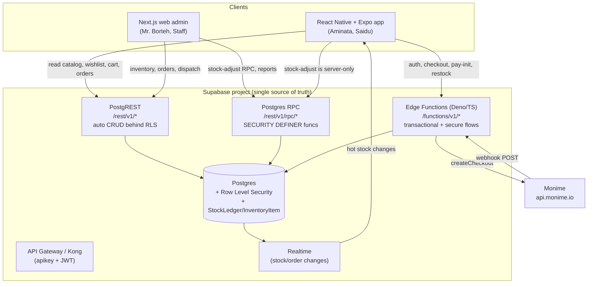
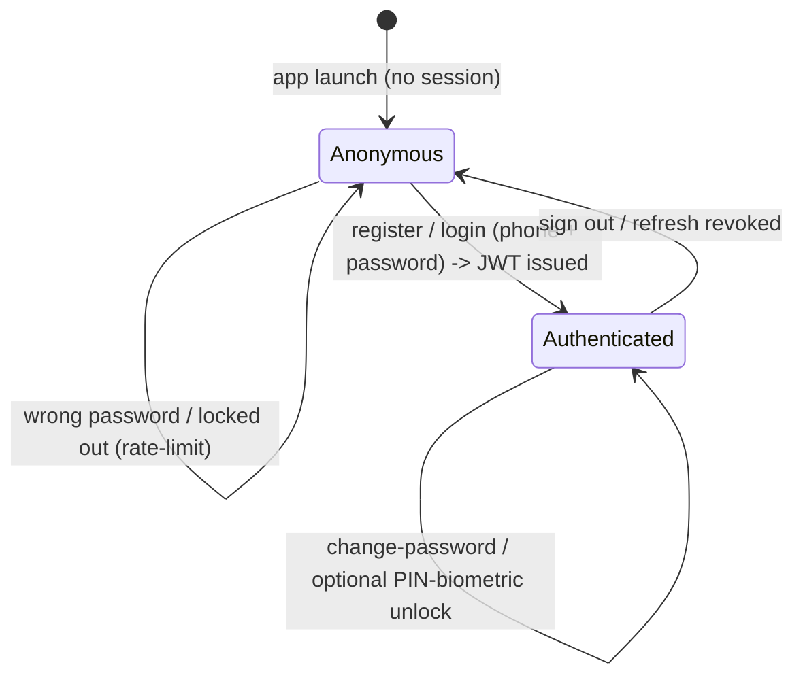
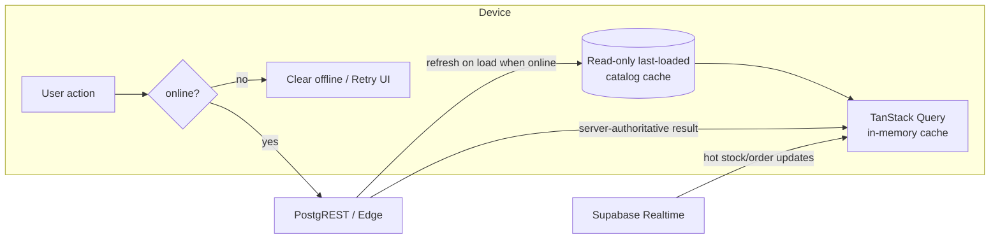

# 07 — API Design

> One-line purpose: Define the complete API surface for Borteh Sprays 001 — the PostgREST-vs-Edge-Function split, endpoint catalog, auth/session model, error model, idempotency, pagination, and versioning — so mobile, admin, riders, and Monime all integrate against one contract.
>
> Part of the Borteh Sprays 001 planning set. See 00-index.md for the full set.

---

## 0. How to read this document

This deliverable specifies the **API contract**, not its implementation. Per the canon, this phase produces research-and-design only: what follows is **interface definitions, schema/DDL sketches, pseudocode, and diagrams** — never production code.

Everything here traces back to **ADR-005 (REST: PostgREST-behind-RLS for CRUD + Edge Functions for transactional/secure flows)**. Related decisions are referenced inline by ADR number; the canonical entity names come from `06-data-model.md`; the payment specifics come from `08-payments-monime.md`.

> **Naming conformance (added in review):** every entity/column/enum name in this document is validated against `06-data-model.md` §15 (enum catalog) and the per-table DDL sketches in 06. Where 06 and this doc previously disagreed, **06 wins** and this doc was corrected. Any name this doc needs that does **not yet exist** in 06 is flagged inline as a **gap to add to 06**.

Confidence labels are used throughout:

- **Fact** — verified from the Monime integration, Supabase docs, or the locked canon.
- **Validated assumption** — a design choice we are confident in but which should be load-tested before launch.
- **Unverified assumption (confidence: High/Medium/Low)** — needs validation; labelled "assumption to verify".
- **BLOCKED ON MONIME DOCS** — cannot be finalized without official Monime documentation or support.

### Traceability at a glance

| API area | Primary persona | Goal served | ADR(s) |
|---|---|---|---|
| Auth (phone + password) | Aminata, Saidu, Mr. Borteh | Sign in with phone + password (no SMS OTP; many users have no email) | ADR-004, ADR-005 |
| Catalog browse / search | Aminata | Lightweight, fast cached, data-frugal browsing of an UNLIMITED catalog | ADR-003, ADR-005 |
| Wishlist / Cart | Aminata | Save intent (requires connectivity + retry) | ADR-003 |
| Checkout + reservation | Aminata | Buy online without overselling in-store stock | ADR-010 |
| Promo / loyalty (configurable) | Aminata, Mr. Borteh | Owner-tunable discounts, points, tier/card — no code change | ADR-012 |
| Payment init + webhook | Aminata, Mr. Borteh | Mobile-money / card via Monime; cash (COD / at pickup) first-class | ADR-006, ADR-009 |
| Order tracking | Aminata, Saidu | Trust via transparency; rider dispatch | ADR-008 |
| Restock subscribe | Aminata | Be notified when a sold-out scent returns | ADR-007, ADR-011 |
| Admin inventory (stock adjust) | Mr. Borteh, Staff | Single source of truth for in-store + online stock | ADR-010 |
| Analytics ingest + reporting | Mr. Borteh | In-house analytics, no paid SaaS | ADR-008, ADR-011 |

---

## 1. API surface overview

Two kinds of HTTP surface, one Supabase project:



**Design rule (ADR-005):** if an operation is a *simple, RLS-protectable read or write of a single resource*, it is a **PostgREST auto-endpoint**. If it is *transactional, multi-step, secret-bearing, rate-limited, or talks to a third party*, it is an **Edge Function** (or a `SECURITY DEFINER` RPC for in-DB atomic work). The client never holds a Monime token, an SMS provider key, or the service-role key.

### 1.1 Split table — PostgREST vs Edge Function vs RPC

| Operation | Surface | Why | RLS / guard | ADR |
|---|---|---|---|---|
| List/browse `Product`, `ProductVariant`, `ProductImage`, `Brand`, `Category`, `ScentNote` | **PostgREST** GET | Read-only catalog, cacheable, keyset-paginated | `SELECT` policy: public/anon | ADR-005, ADR-003 |
| Product search & filters (brand/gender/scent/price) | **PostgREST** GET (+ RPC for ranked search) | Filterable via PostgREST query grammar; full-text via RPC | anon `SELECT` | ADR-005 |
| Read own `Wishlist`/`WishlistItem` | **PostgREST** GET | Owner-scoped read (via `wishlist.user_id`) | `wishlist.user_id = auth.uid()` | ADR-003 |
| Add/remove `WishlistItem` | **PostgREST** POST/DELETE | Single-row owner write; requires connectivity + retry | `wishlist.user_id = auth.uid()` | ADR-003 |
| Read/update own `Cart`/`CartItem` | **PostgREST** GET/POST/PATCH/DELETE | Owner-scoped (via `cart.user_id`); cart is a client *intent*, not authoritative stock | `cart.user_id = auth.uid()` | ADR-003 |
| Read own `Order`, `OrderItem`, `OrderStatusHistory` | **PostgREST** GET | Owner-scoped order tracking | `Order.user_id = auth.uid()` | ADR-008 |
| Read own `Review`; create `Review` | **PostgREST** GET / Edge (verified-purchase check) | Read is public (`status='published'` only, per 06 RLS); create must verify purchase | see §11.3 | ADR-005 |
| Read own `Notification`, `NotificationPreference`; update prefs | **PostgREST** GET/PATCH | Owner-scoped | `user_id = auth.uid()` | ADR-007 |
| **register** (phone + password sign-up) | **Edge Function** | Enforce unique phone, hash via Supabase Auth (phone-confirmation disabled, no OTP), mint session | anon, function-enforced limits | ADR-004 |
| **login** (phone + password) | **Edge Function** | Verify password, rate-limit + lockout per phone+IP, mint session | anon, function-enforced | ADR-004 |
| **refresh** / **change-password** / **admin-reset-password** | **Edge Function** | Silent token refresh; self-service change; owner-assisted reset (no SMS) | authenticated (owner-scoped); role in (`owner`) for reset | ADR-004 |
| **checkout** (create `Order` + `PaymentIntent` + time-boxed reservation) | **Edge Function** → RPC | Atomic reserve across variants; oversell-safe; creates the intent that holds `reservation_expires_at` | service-role inside fn; validates caller JWT | ADR-010 |
| **promo-loyalty-preview** / apply at checkout | **Edge Function** → RPC | Evaluate active `promo_rule`(s) + user tier/card discount server-side; never trust client price | authenticated caller owns the cart/order | ADR-012 |
| **payment-init** (attach Monime session to the existing `PaymentIntent`) | **Edge Function** | Holds Monime token; `Idempotency-Key`; returns `redirectUrl` | authenticated caller owns the order | ADR-006, ADR-009 |
| **monime-webhook** | **Edge Function** (public, no JWT) | Raw-body HMAC verify; event.id dedup; status-guarded update | signature is the auth | ADR-006 |
| **restock-subscribe** | **Edge Function** or PostgREST POST | De-dup subscription; in-app notification opt-in (no SMS) | `user_id = auth.uid()` | ADR-007, ADR-011 |
| **conversations / messages** (customer↔store chat) — *v1.5, DEFERRABLE* | **PostgREST** + Realtime (or Edge Function) | Optional in-app chat; not required for v1 | owner-scoped via `conversation.user_id` | ADR-007 |
| **stock-adjust** (purchase/adjustment) | **RPC** (`SECURITY DEFINER`) | Append `StockLedger` + update per-variant `InventoryItem` atomically | role in (`staff`,`owner`) | ADR-010 |
| **instore-sale** (POS-lite checkout) | **RPC** (`SECURITY DEFINER`) | Atomic in-store decrement, no reservation step | role in (`staff`,`owner`) | ADR-010 |
| **assign-rider** / **update-delivery-status** | **Edge Function** or RPC | Side effects (notifications), status machine guard | role in (`staff`,`owner`,`rider`) | ADR-008 |
| **analytics-ingest** (batch `AnalyticsEvent`) | **Edge Function** | Accept anon + authed, batch, validate, drop PII | anon allowed, server-tagged | ADR-008, ADR-011 |
| **reporting** (sales, top scents, funnel) | **RPC** over materialized views | Pre-aggregated reads, owner-only | role in (`staff`,`owner`) | ADR-008 |
| Reconciliation / expiry / restock fan-out / low-stock | **Scheduled Edge Functions (cron)** | Background sweeps; not client-callable | service-role | ADR-011 |

---

## 2. Conventions

### 2.1 Base URLs

| Surface | Base | Notes |
|---|---|---|
| PostgREST CRUD | `https://<ref>.supabase.co/rest/v1/<table>` | `<ref>` = project ref; injected via env, never hard-coded. |
| RPC | `https://<ref>.supabase.co/rest/v1/rpc/<fn_name>` | POST with JSON args. |
| Edge Functions | `https://<ref>.supabase.co/functions/v1/<fn_name>` | The `v1` here is **Supabase's platform path**, not our app API version (see §9). |
| Realtime | `wss://<ref>.supabase.co/realtime/v1` | Subscribe to stock/order changes (ADR-003). |

> **Fact:** The `/functions/v1/` segment is fixed by the Supabase platform. We do **not** treat it as our product API version. Our versioning is in §9.

### 2.2 Required headers

| Header | Who sends it | Purpose |
|---|---|---|
| `apikey: <anon_or_publishable_key>` | every client call | Supabase gateway admission; **not** an authorization decision. |
| `Authorization: Bearer <supabase_jwt>` | authenticated calls | Carries `auth.uid()` + role claims; RLS reads it. Absent/`anon` for public reads. |
| `Content-Type: application/json` | POST/PATCH | — |
| `Accept-Profile` / `Content-Profile: api_v1` | PostgREST calls (optional) | Pins the exposed Postgres schema version (§9). |
| `Borteh-Client: app@<semver>` or `admin@<semver>` | every client call | Client identification for analytics + min-version gating. |
| `Idempotency-Key: <=64 chars` | mutating Edge Functions | Safe retry over flaky 2G/3G (§7, §10). |
| `X-Borteh-Request-Id: <uuid>` | optional, client-generated | Correlate client logs with server logs. |

> **Fact:** `apikey` admits the request to the gateway; it is **not** authorization. The authorization boundary is **RLS** (§3.3). Do not conflate the two.

---

## 3. Auth & session model

References **ADR-004** (Supabase Auth, **phone + password — no SMS OTP**, email optional) and **ADR-005** (RLS is the authorization boundary).

### 3.1 Identity model

- Primary credential is **phone number + password** (phone in E.164, e.g. `+232XXXXXXXX`). The **phone number is the UNIQUE account identifier** (uniqueness enforced); the password is **hashed by Supabase Auth** with **phone-confirmation DISABLED, so no OTP/SMS is ever sent**. Many Sierra Leonean users have no email — email is **optional (recovery only)**, attached later if at all.
- On successful registration (phone + password), Supabase Auth creates an `auth.users` row; a trigger provisions a matching app-level `User` row. Canon entity is `User`; the **physical table is `app_user`** (`user` is reserved, and Supabase owns `auth.users`) with `app_user.id` a 1:1 FK to `auth.users.id` (06 §1 note). Columns: `app_user(phone, display_name, role, …)`, default `role = 'customer'`.
- Roles: `customer | staff | owner | rider`. Role is **server-controlled** — never set from the client. It is stamped into the JWT via a custom access-token claim so RLS can read it cheaply.

### 3.2 Session / JWT model



| Token | Lifetime (target) | Storage on device | Notes |
|---|---|---|---|
| Access JWT | ~1 hour (validate against Supabase default) | in-memory + Expo SecureStore | Carries `sub` (= `auth.uid()`), `role`, custom `app_role` claim. |
| Refresh token | long-lived, rotating | Expo SecureStore (encrypted) | Survives app restarts so users on flaky data are not forced to re-enter their password. |

- **Anon vs authenticated.** Anonymous (no `Authorization`, just `apikey`) can read the public catalog only. All owner-scoped data (cart, wishlist, orders, notifications) requires an authenticated JWT and is further filtered by RLS.
- **Custom claims.** `app_role` is injected via a Supabase Auth hook (custom access token hook) reading `app_user.role`. This avoids a per-request join. **Validated assumption:** custom-claim hook is available on our plan — verify on the chosen Supabase tier.

### 3.3 RLS is the real authorization boundary

> **Fact (ADR-005):** PostgREST exposes raw tables. The *only* thing preventing Aminata from reading Mr. Borteh's sales or another shopper's cart is **Row Level Security**. Every table reachable via `/rest/v1/*` must have RLS enabled and an explicit policy. "No policy" = "deny all" once RLS is on — that is the safe default we rely on.

Representative policy sketches (DDL sketch, not production):

```sql
-- Catalog: world-readable to anon + authenticated
-- NB: 06 column is `is_active` (there is no `is_published` column in 06).
ALTER TABLE product ENABLE ROW LEVEL SECURITY;
CREATE POLICY product_public_read ON product
  FOR SELECT TO anon, authenticated
  USING (is_active = true);

-- Cart: strictly owner-scoped
ALTER TABLE cart ENABLE ROW LEVEL SECURITY;
CREATE POLICY cart_owner_all ON cart
  FOR ALL TO authenticated
  USING  (user_id = auth.uid())
  WITH CHECK (user_id = auth.uid());

-- cart_item / wishlist_item carry NO user_id: scope them through the parent row.
ALTER TABLE cart_item ENABLE ROW LEVEL SECURITY;
CREATE POLICY cart_item_owner_all ON cart_item
  FOR ALL TO authenticated
  USING      (EXISTS (SELECT 1 FROM cart c WHERE c.id = cart_item.cart_id AND c.user_id = auth.uid()))
  WITH CHECK (EXISTS (SELECT 1 FROM cart c WHERE c.id = cart_item.cart_id AND c.user_id = auth.uid()));
-- wishlist_item is scoped identically through wishlist.user_id.

-- Orders: owner reads own; staff/owner read all
ALTER TABLE "order" ENABLE ROW LEVEL SECURITY;
CREATE POLICY order_owner_read ON "order"
  FOR SELECT TO authenticated
  USING (
    user_id = auth.uid()
    OR (auth.jwt() ->> 'app_role') IN ('staff','owner')
  );

-- Rider sees only orders on a DeliveryJob assigned to them.
-- delivery_job.rider_id references rider(id), NOT app_user; resolve via rider.user_id.
CREATE POLICY order_rider_read ON "order"
  FOR SELECT TO authenticated
  USING (
    (auth.jwt() ->> 'app_role') = 'rider'
    AND EXISTS (
      SELECT 1 FROM delivery_job dj
      JOIN rider r ON r.id = dj.rider_id
      WHERE dj.order_id = "order".id
        AND r.user_id = auth.uid()
    )
  );

-- Inventory writes are NEVER direct: revoke table writes, force the RPC
REVOKE INSERT, UPDATE, DELETE ON inventory_item, stock_ledger FROM authenticated, anon;
```

- **Inventory/stock/payments are never written directly by clients.** Those flow through `SECURITY DEFINER` RPCs and Edge Functions that re-check the caller's role inside the function. The client may *read* `InventoryItem.qty_available` (06's generated `qty_on_hand - qty_reserved` column, for "in stock" badges) but cannot write it.
- **Edge Functions** receive the caller's JWT, verify it, and then act with elevated privilege only after an explicit role/ownership check. They must never blindly trust client-supplied `user_id`.

---

## 4. Error model

### 4.1 Canonical envelope (Edge Functions + RPC wrappers)

All **our** Edge Functions and RPC wrappers return a single, predictable shape so the online-first client can branch on it without string-matching:

```jsonc
// Success
{ "ok": true, "data": { /* endpoint-specific */ } }

// Error
{
  "ok": false,
  "error": {
    "code": "RESERVATION_FAILED",        // stable machine code (SCREAMING_SNAKE)
    "message": "Some items are no longer in stock.", // human, English
    "retriable": false,                  // may the client safely retry as-is?
    "details": { "variant_ids": ["..."] },// optional structured context
    "request_id": "req_01HF..."          // echo for support/correlation
  }
}
```

### 4.2 PostgREST native errors

> **Fact:** PostgREST does **not** emit our envelope. It returns its own shape `{ code, message, details, hint }` (where `code` is a Postgres SQLSTATE) with an HTTP status. We do **not** try to rewrite PostgREST responses. Instead, a thin client-side normalizer maps PostgREST/`PostgrestError` into the same `{ ok:false, error:{...} }` shape so app code has one error path. RLS denials surface as `401/403` or empty result sets — the client treats an empty owner-scoped result as "not yours / not found", never as an error.

### 4.3 HTTP status + code catalogue

| HTTP | `error.code` | When | Retriable |
|---|---|---|---|
| 400 | `VALIDATION_ERROR` | Malformed body, bad phone format, bad cursor | No |
| 401 | `AUTH_REQUIRED` | Missing/expired JWT on protected resource | After refresh |
| 401 | `INVALID_SIGNATURE` | Monime webhook HMAC mismatch (§7.3) | No |
| 403 | `FORBIDDEN_ROLE` | Authenticated but wrong role (e.g. customer hitting stock-adjust) | No |
| 404 | `NOT_FOUND` | Resource absent or RLS-invisible | No |
| 409 | `IDEMPOTENCY_REPLAY` | Same `Idempotency-Key`, different body | No |
| 409 | `RESERVATION_FAILED` | Insufficient available stock at checkout (ADR-010) | No (refresh stock) |
| 409 | `INSUFFICIENT_STOCK` | `stock-adjust`/`instore-sale` would drive `qty_on_hand` negative (§12.1) | No |
| 409 | `ORDER_STATE_INVALID` | Illegal status transition (e.g. pay a cancelled order) | No |
| 422 | `AMOUNT_MISMATCH` | Webhook amount/currency ≠ stored intent (§7.3). **Internal/diagnostic code recorded on the webhook row; the webhook still returns 2xx to Monime** (see §7.3) | No |
| 426 | `CLIENT_TOO_OLD` | Client build below min supported for a breaking change (§9) | No (upgrade) |
| 429 | `LOGIN_RATE_LIMITED` | Too many failed login attempts → temporary lockout (§5) | After `retry_after_s` |
| 429 | `RATE_LIMITED` | Generic throttle | After `retry_after_s` |
| 500 | `INTERNAL` | Unhandled server error | Yes (idempotent calls) |
| 503 | `PROVIDER_UNAVAILABLE` | Monime upstream down | Yes (backoff) |

`429` responses also set `Retry-After` (seconds) and include `error.details.retry_after_s`.

---

## 5. Auth endpoints — phone + password (Edge Functions)

References **ADR-004** (Supabase Auth: **phone + password, phone-confirmation DISABLED so no OTP/SMS is ever sent**). The phone number is the **unique account identifier**; the password is hashed by Supabase Auth. Email is **optional (recovery only)**. **No SMS provider is required** — there is no `request-otp`/`verify-otp` anymore.

Endpoints: `register`, `login`, `refresh`, `change-password`, `admin-reset-password`.

> **Other security features (ADR-004):** login is protected by **rate-limiting + temporary lockout** (anti brute-force / credential-stuffing) keyed on phone + IP; the app MAY add an optional **in-app PIN / biometric unlock** over the stored refresh token for fast re-entry without re-typing the password. No SMS-based recovery exists by design.

### 5.1 `POST /functions/v1/register`

Phone + password sign-up. Anonymous-callable, rate-limited. Enforces phone uniqueness.

Request:

```jsonc
{
  "phone": "+23276123456",     // E.164; server normalizes local formats (076..., 076 123 456)
  "password": "********",      // min length enforced server-side; hashed by Supabase Auth
  "display_name": "Aminata",
  "email": null                // OPTIONAL, recovery only
}
```

Response (201):

```jsonc
{
  "ok": true,
  "data": {
    "access_token": "eyJ...",      // Supabase session
    "refresh_token": "v1...",
    "expires_in": 3600,
    "user": { "id": "uuid", "phone": "+23276123456", "role": "customer", "display_name": "Aminata", "is_new": true }
  }
}
```

- **Duplicate phone -> `409`** (`VALIDATION_ERROR` / `PHONE_TAKEN`); the phone is the unique identifier.
- **No confirmation step:** phone-confirmation is disabled, so the session is issued immediately (no OTP, no SMS).

### 5.2 `POST /functions/v1/login`

Phone + password sign-in. Anonymous-callable, **rate-limited with lockout**.

Request:

```jsonc
{ "phone": "+23276123456", "password": "********" }
```

Response (200):

```jsonc
{
  "ok": true,
  "data": {
    "access_token": "eyJ...",
    "refresh_token": "v1...",
    "expires_in": 3600,
    "user": { "id": "uuid", "phone": "+23276123456", "role": "customer", "display_name": "Aminata", "is_new": false }
  }
}
```

Anti-brute-force (ADR-004):

| Limit | Scope | Target value (assumption to verify, confidence: Medium) | On breach |
|---|---|---|---|
| Failed-login attempts | per phone | 5 fails -> lockout 15 min (escalating) | `429 LOGIN_RATE_LIMITED`, `retry_after_s` |
| Attempts | per IP / device | 20 per hour | `429 LOGIN_RATE_LIMITED` |
| Password length | — | min 8 chars (enforced at register/change) | `400 VALIDATION_ERROR` |

> A wrong password returns a **generic** auth failure that does **not** reveal whether the phone exists (anti-enumeration) and increments the lockout counter.

Pseudocode:

```text
function login(req):
  phone = normalize_e164(req.phone)            # reject VALIDATION_ERROR if impossible
  if locked_out(phone, ip):                    # token-bucket / counter in Postgres
    return 429 LOGIN_RATE_LIMITED(retry_after_s)
  ok = supabase_auth.sign_in_with_password(phone, req.password)
  if not ok:
    record_failed_attempt(phone, ip)           # feeds the lockout window
    return 401 (generic; no existence leak)
  reset_attempts(phone, ip)
  audit_log("login_ok", phone_hash, ip)
  return 200 { access_token, refresh_token, user }
```

### 5.3 `POST /functions/v1/refresh`

Exchanges a rotating refresh token for a fresh access token (Supabase native session refresh). Used silently by the client so users on flaky data are not forced to re-enter their password.

```jsonc
// request
{ "refresh_token": "v1..." }
// response
{ "ok": true, "data": { "access_token": "eyJ...", "refresh_token": "v1...", "expires_in": 3600 } }
```

### 5.4 `POST /functions/v1/change-password`

Authenticated self-service change (the caller proves identity with the current password).

```jsonc
// request (Authorization: Bearer <jwt>)
{ "current_password": "********", "new_password": "********" }
// response
{ "ok": true, "data": { "changed": true } }
```

Optional **email self-service recovery** (only if the user attached an email) uses Supabase Auth's email reset flow — **no SMS**.

### 5.5 `POST /functions/v1/admin-reset-password` (owner-assisted, no SMS)

Default recovery path. The owner verifies the customer **by phone call / WhatsApp** out of band, then resets or issues a new password from the admin. Role-guarded (`owner`).

```jsonc
// request (Authorization: Bearer <owner jwt>)
{ "user_id": "uuid", "new_password": "********" }   // or { "issue_temporary": true }
// response
{ "ok": true, "data": { "reset": true, "must_change_on_next_login": true } }
```

```mermaid
sequenceDiagram
  autonumber
  participant A as Aminata (app)
  participant E as Edge: register / login / refresh
  participant SA as Supabase Auth (phone + password)
  participant DB as Postgres (app_user, login_attempt)

  A->>E: POST register { phone, password, display_name }
  E->>SA: create user (phone unique, password hashed, no confirmation)
  SA-->>E: session
  E->>DB: provision app_user(role=customer)
  E-->>A: 201 { access_token, refresh_token, user }

  A->>E: POST login { phone, password }
  E->>DB: check lockout (failed attempts per phone+IP)
  alt within limits
    E->>SA: sign_in_with_password
    alt valid
      E->>DB: reset attempts; audit_log
      E-->>A: 200 { access_token, refresh_token, user }
    else invalid
      E->>DB: record_failed_attempt
      E-->>A: 401 (generic; no existence leak)
    end
  else locked out
    E-->>A: 429 LOGIN_RATE_LIMITED { retry_after_s }
  end
```

---

## 6. Catalog, search, wishlist, cart (mostly PostgREST)

### 6.1 Catalog browse (keyset-paginated)

Data-frugality is a hard driver: first catalog payload `< ~150 KB` on 3G (canon NFR). We therefore use **keyset pagination** (§8), select only needed columns, and lazy-load images.

`GET /rest/v1/product?select=...&order=...&limit=20` — example:

```
GET /rest/v1/product
  ?select=id,name,gender,brand:brand_id(name),
          variants:product_variant(id,size_ml,concentration,price_minor,sku),
          thumb:product_image(storage_path,sort_order)
  &is_active=eq.true                        -- 06 column (NOT is_published)
  &product_image.is_primary=eq.true         -- thumbnail = the primary image
  &order=popularity_score.desc,id.desc      -- 06 product.popularity_score (int); deterministic keyset sort key (§8)
  &limit=20
Headers: apikey, (Authorization optional), Accept-Profile: api_v1
```

Response (200) — keyset cursor returned via a wrapper view or computed client-side from the last row (§8):

```jsonc
{
  "items": [
    {
      "id": "uuid",
      "name": "Oud Royale",
      "gender": "unisex",
      "brand": { "name": "Borteh House" },
      "variants": [
        { "id": "uuid", "size_ml": 50, "concentration": "EDP", "price_minor": 45000, "sku": "OUD-50-EDP" }
      ],
      "thumb": { "storage_path": "products/oud/oud_thumb.webp", "sort_order": 0 }
    }
  ]
}
```

> **Fact:** `price_minor` is integer SLE minor units (ADR-009). `45000` = Le 450.00. The client formats; it never does float math.

> **Field-name fixes (review):** 06's `product_image` has **`storage_path`** and **`sort_order`** — there is **no `url` or `position`** column. List responses return `storage_path`; the client builds the public CDN URL from it (Supabase Storage). The thumbnail is the row with `is_primary = true`.

> **Resolved against 06 (review):** the browse sort/keyset key **`popularity_score` is now a real column on `product` in 06** — `popularity_score int NOT NULL DEFAULT 0` (06 §3), backed by the dedicated index `idx_product_popularity ON product (popularity_score DESC, id DESC) WHERE is_active`. It is a denormalized integer recomputed by the popularity-refresh scheduled Edge Function (ADR-011) from recent **confirmed sales** over a trailing window (window length is OWNER INPUT), so it is **eventually consistent** — acceptable for a sort key, never used for money or stock. The catalog keyset sort is therefore exactly `ORDER BY popularity_score DESC, id DESC`, tie-broken on `id` so pagination is stable (§8).

Image strategy (NFR alignment): list responses carry only the **thumbnail** (WebP, small). Full `ProductImage` sets load on the product detail screen. Thumbnails are served from Supabase Storage with a CDN cache; the client constructs the URL from `storage_path`.

### 6.2 Filtering by brand / gender / scent / price

PostgREST query grammar covers most filters directly:

| Filter | Query fragment |
|---|---|
| Brand | `&brand_id=eq.<uuid>` (or `in.(...)`) |
| Gender | `&gender=eq.female` (`male`/`female`/`unisex`) |
| Price range (minor units) | nested on variant via an RPC or a `product_browse` view: `price_minor=gte.20000&price_minor=lte.80000` |
| Scent note | join `ProductScentNote`; expose a `product_browse` view with `scent_note_ids uuid[]` and use `scent_note_ids=cs.{<uuid>}` (array contains) |
| In-stock only | `qty_available=gt.0` on the browse view (06's generated `inventory_item.qty_available` column) |

> **Validated assumption:** complex multi-dimensional filtering (price band + scent + in-stock + keyset cursor) is best served by a **denormalized `product_browse` materialized/normal view** rather than deep PostgREST embeds, to keep payloads small and queries index-friendly. This view is refreshed on catalog/stock change and is the natural home for the maintained `popularity_score` sort key (§6.1). Confidence: High.

### 6.3 Search (ranked) — `POST /rest/v1/rpc/search_products`

Free-text search uses a Postgres `tsvector` (06: `product.search_tsv`) + trigram index, wrapped in an RPC so ranking and the same keyset contract apply:

```jsonc
// request (RPC args)
{ "q": "oud rose", "p_gender": null, "p_brand_id": null,
  "p_price_min": null, "p_price_max": null,
  "p_after": null, "p_limit": 20 }

// response
{ "items": [ /* same lean product shape as §6.1 */ ],
  "next_cursor": "eyJyYW5rIjowLjg3LCJpZCI6Ii4uLiJ9" }
```

### 6.4 Wishlist (PostgREST)

`Wishlist` is auto-created per user (trigger). `WishlistItem` rows belong to a `wishlist` (FK `wishlist_id`) — there is **no `user_id` on `wishlist_item`**; ownership is enforced through `wishlist.user_id` (see §3.3). Items are single-row writes that require connectivity; on a dropped connection the UI shows a clear offline / Retry state (ADR-003).

| Action | Call |
|---|---|
| Read | `GET /rest/v1/wishlist_item?select=*,product:product_id(id,name,thumb:product_image(storage_path))&order=created_at.desc` (RLS scopes via parent `wishlist`) |
| Add | `POST /rest/v1/wishlist_item` body `{ "wishlist_id":"uuid", "product_id":"uuid", "variant_id": null }` — RLS verifies the `wishlist` is the caller's; unique `(wishlist_id, product_id, variant_id)` (06) → idempotent |
| Remove | `DELETE /rest/v1/wishlist_item?wishlist_id=eq.<wid>&product_id=eq.<uuid>` (RLS confirms wishlist ownership) |

> **Validated assumption (ADR-003):** wishlist/cart/restock adds **require connectivity**; on a dropped connection the UI shows a clear offline / Retry state — actions are never queued for later replay. The unique constraint `(wishlist_id, product_id, variant_id)` makes a retried add idempotent (adding twice is a no-op). The client uses a deterministic client-generated row `id` so a retried request collides instead of duplicating, and caches its `wishlist_id` (resolved once on first load) so a retry can carry it.

### 6.5 Cart (PostgREST)

`Cart` is owner-scoped and **non-authoritative for stock** (ADR-003/ADR-010): putting an item in the cart reserves nothing. `CartItem` rows belong to a `cart` (FK `cart_id`); there is **no `user_id` on `cart_item`** — ownership is via `cart.user_id` (§3.3). Reservation happens only at checkout (§7.1).

| Action | Call |
|---|---|
| Get cart | `GET /rest/v1/cart_item?select=*,variant:variant_id(id,price_minor,product:product_id(name))` (RLS via parent `cart`) |
| Add / set qty | `POST` / `PATCH /rest/v1/cart_item` body `{ "cart_id":"uuid", "variant_id":"uuid", "qty": 2 }` — unique `(cart_id, variant_id)` (06) |
| Remove | `DELETE /rest/v1/cart_item?cart_id=eq.<cid>&variant_id=eq.<uuid>` |

The cart screen shows **live availability** by reading `InventoryItem.qty_available` (06's generated `qty_on_hand - qty_reserved` column, read-only) and subscribing to Realtime stock changes, but the binding decision is made server-side at checkout.

---

## 7. Checkout, payment, webhook (the critical path)

This is the highest-stakes flow: it must be **oversell-safe** (ADR-010), **money-exact** (ADR-009), **idempotent** (ADR-006), and tolerant of delayed mobile-money confirmations (market context).

### 7.1 `POST /functions/v1/checkout` — create Order + PaymentIntent + reservation

Creates an `Order` in `pending`, snapshots prices into `OrderItem`, **creates the `PaymentIntent` shell** (so `payment_intent.reservation_expires_at` — the home of the time-box per 06 §8 — exists from the start), and **atomically reserves stock** via the inventory RPC. Supports both Monime and COD paths.

> **Sequencing fix (review):** 06 stores `reservation_expires_at` on **`payment_intent`**, and 06 §8.2 already says the **COD intent is created at order placement**. For symmetry and to give the reservation hold a home before `payment-init`, `checkout` creates the `PaymentIntent` (`status='created'`, `provider` per `payment_method`, with `idempotency_key` derived from the new intent id) in the same transaction as the reservation. `payment-init` (§7.2) then *attaches* the Monime session to that existing intent rather than creating a new one. This resolves the earlier gap where §7.1 returned `order.reservation_expires_at` for a field that lives on `payment_intent`.

Request:

```jsonc
{
  "items": [ { "variant_id": "uuid", "qty": 1 } ],   // server re-prices; never trusts client price
  "delivery": {
    "location_id": "uuid",                 // existing DeliveryLocation, OR inline:
    "inline": {
      "label": "Aunty's shop",
      "landmark_text": "Blue gate near Total, Lumley",
      "geo_lat": 8.46, "geo_lng": -13.27,
      "contact_phone": "+23276123456",
      "notes": "Call when at the junction"
    },
    "zone_id": "uuid"                       // DeliveryZone -> estimated_fee_minor / fee_estimate_text (GUIDE only, NOT charged)
  },
  "payment_method": "monime",              // "monime" | "cash_on_delivery" (cash at delivery/pickup; 06 enum, NOT "cod")
  "promo_code": "BORTEH10"                 // optional
}
```

Response (201):

```jsonc
{
  "ok": true,
  "data": {
    "order": {
      "id": "uuid",
      "order_number": "BS-2026-000123",     // 06 column (human-friendly)
      "status": "pending_payment",          // 06 order.status; stays pending_payment until the webhook confirms (or staff accepts cash)
      "subtotal_minor": 45000,
      "delivery_fee_estimate_minor": 5000,  // GUIDE from delivery_zone; shown to the buyer, NOT charged
      "delivery_fee_minor": null,           // ACTUAL fee; NULL until the owner confirms it per order (set at confirmation)
      "discount_minor": 5000,               // from evaluated promo_rule(s) + tier/card discount (see §7.1.1)
      "total_minor": 40000,                 // subtotal - discount; delivery NOT yet included (added when delivery_fee_minor is set)
      "currency": "SLE"
    },
    "payment_intent": {
      "id": "uuid",
      "status": "created",
      "reservation_expires_at": "2026-06-15T12:20:00Z"   // time-boxed (ADR-010); lives on payment_intent (06)
    },
    "next": { "action": "pay", "payment_method": "monime" }  // or "await_cod_confirmation"
  }
}
```

Atomic reservation pseudocode (the RPC the function calls — ADR-010; column names per 06 `stock_ledger`):

```text
RPC reserve_for_order(order_id, items[]) -- SECURITY DEFINER, single transaction
  for each item in items:
    -- atomic conditional update prevents oversell vs concurrent in-store sale
    UPDATE inventory_item
      SET qty_reserved = qty_reserved + item.qty
      WHERE variant_id = item.variant_id                 -- per-variant balance (single store)
        AND (qty_on_hand - qty_reserved) >= item.qty   -- guard (== qty_available)
      RETURNING 1;
    if not updated: RAISE 'RESERVATION_FAILED' (variant_id)  -- whole tx rolls back
    INSERT INTO stock_ledger(variant_id, movement_type, qty_delta,
                             reference_type, reference_id)
      VALUES (item.variant_id, 'reservation', -item.qty,
              'order', order_id);
  -- all-or-nothing
```

- **`RESERVATION_FAILED` → `409`** with `details.variant_ids` so the cart can show exactly which scent sold out.
- **Cash path (cash on delivery / at pickup):** order stays `pending_payment` (06 has no `pending_cod_confirmation` status); reservation still held; the `payment_intent` is `provider='cash_on_delivery'`, `status='created'`; confirmation (`pending_payment → confirmed`) is a staff/owner action (anti-fraud, market trust context) — and it is **at this confirmation that the owner sets the actual `order.delivery_fee_minor`** and the final `total_minor`. No Monime call.
- **Reservation expiry:** a cron Edge Function (ADR-011) releases reservations whose `payment_intent.reservation_expires_at` passed and the order never paid → ledger `release` rows, `Order` → `cancelled` with `cancel_reason='payment_expired'` (06 §7.1 maps unpaid expiry to `cancelled`); `payment_intent` → `expired`.
- **Delivery fee is an ESTIMATE, not an auto-charge (owner decision):** `delivery_zone` holds a guidance estimate (`estimated_fee_minor` / `fee_estimate_text`); checkout **shows** it but does **not** hard-charge a computed zone fee. `order.delivery_fee_minor` is **nullable until confirmation**, when the owner (or the price agreed on the call) sets the actual fee and the order total is finalized. For the Monime path the payable amount is therefore the goods total (subtotal − discount); any delivery fee is settled per the owner's confirmed arrangement.

### 7.1.1 Promo + loyalty preview / apply (server-side, configurable — ADR-012)

Discounts, points, and tiers are **owner-configurable with no code change** (ADR-012): a singleton `loyalty_config` (`points_per_currency_unit`, `point_value_minor`, `points_expiry_days`, feature flags), many `promo_rule`, and `loyalty_tier` / `loyalty_card` definitions drive everything; per-user state lives in `loyalty_account` (+ `loyalty_ledger`). The client **never** computes money — it previews, then `checkout` re-evaluates authoritatively.

`POST /functions/v1/promo-loyalty-preview` returns the discount + points the current cart would attract, evaluating **active `promo_rule`(s)** (e.g. `order_spend_threshold_discount`: spend ≥ Le X in an order -> Y% or Le Z off, with `discount_type` percent|fixed, `scope` all|category|brand|product, inside `active_from`/`active_to` and usage caps) **plus** the caller's `loyalty_tier` / `loyalty_card` ongoing `discount_percent`:

```jsonc
// request (Authorization: Bearer <jwt>)
{ "items": [ { "variant_id": "uuid", "qty": 1 } ], "promo_code": "BORTEH10" }
// response
{ "ok": true, "data": {
    "subtotal_minor": 45000,
    "applied": [
      { "source": "promo_rule",   "id": "uuid", "rule_type": "order_spend_threshold_discount", "discount_minor": 4500 },
      { "source": "loyalty_card", "tier": "gold", "discount_percent": 5, "discount_minor": 500 }
    ],
    "discount_minor": 5000,
    "points_to_earn": 40,                  // per loyalty_config.points_per_currency_unit
    "total_after_discount_minor": 40000,
    "currency": "SLE" } }
```

**Apply is not a separate trust boundary:** `checkout` (§7.1) re-runs the **same server-side evaluator** inside its transaction, so the stored `order.discount_minor` and any `loyalty_ledger` earn/redeem entries are authoritative; the preview is advisory only. Points are credited to `loyalty_account` / `loyalty_ledger` when the order reaches `confirmed`; redemption value uses `loyalty_config.point_value_minor`, expiry uses `points_expiry_days`. A `loyalty_card`/`loyalty_tier` is granted when `loyalty_account.lifetime_spend_minor` crosses a `cumulative_spend_threshold_minor` (e.g. lifetime spend ≥ Le X -> a card giving Y% off future orders). All thresholds, rates, percentages, and on/off flags are editable by the owner in the admin (ADR-012).

### 7.2 `POST /functions/v1/payment-init` — attach Monime session, get redirectUrl

References **ADR-006**, **ADR-009**, and `08-payments-monime.md`. Only for `payment_method = "monime"`. Operates on the `PaymentIntent` already created by `checkout` (§7.1).

Request:

```jsonc
{ "order_id": "uuid" }
```

What the function does (Fact-based, from the battle-tested Monime integration):

```text
function payment_init(req, caller_jwt):
  order  = load_order(req.order_id)
  assert order.user_id == caller.sub          # ownership
  assert order.status == 'pending_payment'    # else ORDER_STATE_INVALID (409)

  intent = load_open_intent(order.id)         # created at checkout (§7.1); status 'created'
  idem   = intent.idempotency_key             # = sha256(`${intent.id}:checkout-sessions`).slice(0,64)
                                              #   assigned at creation; deterministic, <=64 chars

  resp = monime.POST('/v1/checkout-sessions',
     headers = {
       Authorization: 'Bearer '+MONIME_ACCESS_TOKEN,
       'Monime-Space-Id': MONIME_SPACE_ID,
       'Monime-Version': 'caph.2025-08-23',
       'Content-Type': 'application/json',
       'Idempotency-Key': idem },
     body = {
       name: 'Borteh Order #'+order.order_number,        # 06 column order_number (NOT short_code)
       successUrl: APP_DEEPLINK + '/checkout/success?intent='+intent.id,
       cancelUrl:  APP_DEEPLINK + '/checkout/cancelled?intent='+intent.id,
       reference: order.id,
       callbackState: intent.id,                       # round-trip our id (1 of 2)
       financialAccountId: MONIME_FINANCIAL_ACCOUNT_ID,
       lineItems: order.items.map(to_monime_line_item), # price.value in SLE minor units
       metadata: { intent_id: intent.id, order_id: order.id } # round-trip our id (2 of 2)
     })

  UPDATE payment_intent
     SET provider_intent_id = resp.result.id,          # the scs- id, for webhook matching
         redirect_url       = resp.result.redirectUrl
   WHERE id = intent.id;
  # order.status stays 'pending_payment' — 06's corrected enum has NO 'awaiting_payment';
  # the webhook (§7.3) is the only path that flips the order to 'confirmed'.
  return 200 { redirectUrl: resp.result.redirectUrl }  # checkout.monime.io/scs-...
```

> **Note (BLOCKED ON MONIME DOCS):** the exact request field names for `successUrl`/`cancelUrl`/`financialAccountId`/`lineItems` are not among the canon's pinned facts — confirm against official Monime docs. The pinned facts (host, version header, required headers, `Idempotency-Key`, `result.id`/`result.redirectUrl`, webhook signature, intent matching) are used verbatim.

Response (200):

```jsonc
{ "ok": true, "data": { "provider": "monime",
  "redirect_url": "https://checkout.monime.io/scs-xxxxxxxx",
  "intent_id": "uuid", "expires_at": "..." } }
```

Client (React Native) opens `redirect_url` in **Expo WebBrowser** (in-app browser), then returns via deep link to success/cancel screens. **The redirect is NOT proof of payment** — final truth comes from the webhook (§7.3). The success screen shows "confirming payment…" and polls/realtime-watches the order status.

> **Facts pinned here:** SLE only; amounts in minor units; `Idempotency-Key` is REQUIRED and `<=64` chars; round-trip our intent id through **both** `callbackState` and `metadata.intent_id`; store `result.id` (`scs-`) as `provider_intent_id`.

### 7.3 `POST /functions/v1/monime-webhook` — the webhook handler

References `08-payments-monime.md`. **Public** endpoint (no Supabase JWT): the **HMAC signature is the authentication**. This must be the **exact canonical Edge Function URL** registered in the Monime dashboard — webhooks do **not** follow redirects.

Handler contract (Fact, from the integration — order matters):

```text
function monime_webhook(req):
  raw = req.text()                              # RAW body BEFORE any JSON parse (re-serialize breaks sig)
  sig = req.headers.get('monime-signature')     # lowercase lookup

  if not verify(raw, sig):                       # see signature rule below
     return 401 INVALID_SIGNATURE               # NO db writes; the ONLY non-2xx response

  evt = JSON.parse(raw)

  # idempotency anchor: UNIQUE(provider, provider_event_id) (06)
  inserted = INSERT payment_webhook(provider='monime', provider_event_id = evt.event.id,
                                    event_type=evt.event.name, raw_body=raw, payload=evt,
                                    verified=true)
            ON CONFLICT (provider, provider_event_id) DO NOTHING RETURNING id
  if not inserted: return 200 "ok (duplicate)"   # already processed

  COMPLETION = { 'payment.completed', 'payment.processing_completed' }  # also checkout_session.completed
  if evt.event.name not in COMPLETION and evt.event.name != 'checkout_session.completed':
     mark_ignored(inserted);  return 200 "ok (non-completion)"

  intent = match_intent(evt)                     # 3 strategies, in order (below); set match_method
  if not intent: mark_ignored(inserted); return 200 "ok (no match)"

  if evt.data.amount.value != intent.amount_minor or evt.data.amount.currency != intent.currency:
     mark_failed(inserted,'AMOUNT_MISMATCH');  alert_ops()
     return 200 "ok (amount mismatch recorded)"  # 2xx so Monime stops retrying; flagged for manual review

  # status-guarded update: avoid race with the reservation/expiry sweep
  UPDATE payment_intent SET status='succeeded', paid_at=now()
     WHERE id = intent.id AND status IN ('created','processing');

  confirm_order(intent.order_id)                 # order -> 'confirmed', confirm reservation,
                                                 # append stock_ledger sale_online (on_hand-=n, reserved-=n),
                                                 # enqueue notifications
  mark_processed(inserted)
  return 200 "ok"
```

> **Webhook response policy (review):** after a **valid signature**, business-logic rejections (`duplicate`, `non-completion`, `no match`, `AMOUNT_MISMATCH`) return **2xx** so Monime stops retrying, while the row is persisted/flagged for manual reconciliation and ops alerting. The **only** non-2xx is `401 INVALID_SIGNATURE` (an unauthenticated/forged call). `AMOUNT_MISMATCH` stays in the error catalogue (§4.3) as the internal/diagnostic code recorded on the `payment_webhook` row — **not** the HTTP status returned to Monime. *Rationale:* an amount mismatch is deterministic; retries cannot fix it, so a retry storm adds no value and risks burying the alert.

**Signature rule (Fact — the #1 gotcha):**

```
Monime-Signature: t=<unix-seconds>,v1=<base64 of 32 bytes>
signed_payload = `${t}_${rawBody}`          # UNDERSCORE separator, NOT a period (unlike Stripe)
v1 == base64( HMAC_SHA256(secret, signed_payload) )   # timing-safe compare
reject if (now - t) > 300  OR  (t - now) > 60          # replay window
secrets: try CURRENT then PREVIOUS (two-secret rotation)
```

**Intent matching, in order (Fact):**
1. `data.metadata.intent_id` or `data.channel.metadata.intent_id`.
2. For `checkout_session.*` events: the object id equals our `provider_intent_id` (the `scs-` id).
3. Walk `data.ownershipGraph.owner` up to **depth 5** to find the `checkout_session` id.

The chosen path is recorded in `payment_webhook.match_method` (`'metadata' | 'object_id' | 'ownership_graph'`, per 06) for debugging.

**Event taxonomy (Fact):** subscribe to ALL events; **ACT only** on `payment.completed` and `payment.processing_completed` (Monime fires one or the other by rail; treat both as success). `checkout_session.completed` is the same transition with a different shape. `checkout_session.expired` = abandoned. `payment.created` / `processing_started` / `financial_transaction.created` are informational.

> **BLOCKED ON MONIME DOCS:** no real sandbox (test tokens 401 on `/v1/*`); token scopes are per-action; **no refund API as of 2026-05** (refunds done manually in the Monime dashboard, then recorded in our `Refund` table); no confirmed refund/chargeback webhook; `Idempotency-Key` TTL assumed 24h (confirm); confirm whether `checkout_session.completed` is signed with the same scheme. These are tracked in `12-risks-assumptions.md` and the open-questions list (§15).

### 7.4 End-to-end checkout → payment → confirmation

```mermaid
sequenceDiagram
  autonumber
  participant A as Aminata (RN app)
  participant CK as Edge: checkout
  participant RPC as RPC reserve_for_order
  participant PI as Edge: payment-init
  participant M as Monime (api.monime.io)
  participant WB as Browser (checkout.monime.io)
  participant WH as Edge: monime-webhook
  participant DB as Postgres (Order/PaymentIntent/StockLedger)
  participant N as Notifications (in-app feed + Realtime)

  A->>CK: POST checkout { items, delivery, payment_method:"monime" }
  CK->>RPC: reserve_for_order(order_id, items)
  alt stock available
    RPC->>DB: atomic reserve + StockLedger(reservation), Order=pending_payment, PaymentIntent(created, reservation_expires_at)
    RPC-->>CK: reserved (expires_at)
    CK-->>A: 201 { order(pending_payment), payment_intent(created), next:"pay" }
  else insufficient
    RPC-->>CK: RESERVATION_FAILED(variant_ids)
    CK-->>A: 409 RESERVATION_FAILED
  end

  A->>PI: POST payment-init { order_id }
  PI->>M: POST /v1/checkout-sessions (Idempotency-Key, metadata.intent_id, callbackState)
  M-->>PI: result.id (scs-...), result.redirectUrl
  PI->>DB: save provider_intent_id = scs-..., redirect_url (Order stays pending_payment)
  PI-->>A: 200 { redirect_url }

  A->>WB: open redirect_url (Expo WebBrowser)
  WB->>M: customer pays (Orange/Africell/card)
  WB-->>A: deep link -> /checkout/success (NOT proof of payment)
  A->>A: show "confirming payment...", watch order via Realtime

  M-->>WH: POST webhook (Monime-Signature: t,v1)
  WH->>WH: read RAW body; HMAC verify (t_"_"rawBody); replay window
  WH->>DB: INSERT payment_webhook(event.id) ON CONFLICT DO NOTHING
  alt new + completion event + intent matched + amount ok
    WH->>DB: UPDATE PaymentIntent=succeeded WHERE status IN (created,processing)
    WH->>DB: Order=confirmed, confirm reservation, StockLedger(sale_online)
    WH->>N: enqueue "order confirmed" (in-app feed via Realtime; optional FCM/Expo push later)
    WH-->>M: 200 ok
    DB-->>A: Realtime: order=confirmed -> success UI
  else duplicate / non-completion / no match / amount mismatch
    WH-->>M: 200 ok (no state change; mismatch flagged for manual review)
  end
```

### 7.5 Reconciliation safety net (ADR-011)

Because mobile-money confirmations can be delayed and webhooks can be missed, a scheduled **payment reconciliation sweep** (cron Edge Function) periodically calls Monime `getStatus` for intents still `created/processing` past a threshold, and a **reservation expiry sweep** releases stock for unpaid orders. Both use the same status-guarded updates so they never fight the webhook. This is the durability backstop for the success path above.

---

## 8. Pagination — keyset for data-frugality

> **Validated assumption (NFR-driven):** offset/`LIMIT..OFFSET` pagination degrades on deep pages and re-scans rows, wasting bytes and time on 3G. We use **keyset (cursor) pagination** everywhere lists can grow. Confidence: High.

- **Order key:** a stable, unique composite, e.g. `(sort_field, id)` — `id` breaks ties so the cursor is total-ordered.
- **Cursor:** opaque base64url of the last row's key, e.g. `base64({"popularity_score":1280,"id":"..."})` (`popularity_score` is an integer in 06). Clients treat it as opaque.
- **Next page (PostgREST):** order by `popularity_score.desc,id.desc` plus a boundary filter:

```
&order=popularity_score.desc,id.desc
&or=(popularity_score.lt.1280,and(popularity_score.eq.1280,id.lt.<lastId>))
&limit=20
```

> **Backed by 06:** the `popularity_score` sort key is a real, indexed column on `product` in 06 (`popularity_score int NOT NULL DEFAULT 0`, index `idx_product_popularity (popularity_score DESC, id DESC) WHERE is_active`), so this keyset order is index-friendly. The keyset boundary technique is identical for any `(sort_field, id)` key.

- **RPC/Edge list responses** return an explicit `next_cursor` (null at end), so the client never constructs the boundary filter itself:

```jsonc
{ "items": [ /* ... */ ], "next_cursor": "eyJwb3B1bGFyaXR5X3Njb3JlIjowLjg3..." }
```

- **Page size:** default 20, max 50 (`limit` capped server-side to protect the 150 KB first-payload budget).
- **Stable sorts only:** never paginate on a non-unique field without the `id` tiebreaker.

---

## 9. API versioning

Three independent version axes; keep them distinct.

| Axis | Mechanism | Notes |
|---|---|---|
| **Our product API version** | `Borteh-API-Version: 2026-06-15` request header (date-based), default = latest, with a documented support window | Lets us evolve Edge Function contracts without breaking installed apps over slow OTA adoption. |
| **PostgREST schema version** | Exposed Postgres schema `api_v1` selected via `Accept-Profile`/`Content-Profile` | Breaking table/view changes ship as `api_v2` schema (new views over the same tables); old apps keep hitting `api_v1`. |
| **Monime API version** | `Monime-Version: caph.2025-08-23` (server→Monime only) | Pinned (Fact). Never exposed to our clients. |

> **Validated assumption:** we expose **views in a dedicated `api_v1` Postgres schema** rather than raw `public` tables to PostgREST, so internal column renames don't break clients and RLS-friendly shapes are curated. Confidence: High. The Supabase `/functions/v1/` and `/rest/v1/` path segments are **platform** versions and are intentionally *not* our product version.

**Min-version gating (market reality):** because OTA (EAS Update, ADR-001) reaches devices unevenly over poor connectivity, the gateway/Edge layer reads `Borteh-Client: app@<semver>` and can return `426 Upgrade Required` (mapped to `error.code = CLIENT_TOO_OLD`, §4.3) when a client is below the minimum supported build for a breaking payment/security change.

---

## 10. Idempotency strategy (consolidated)

Idempotency is non-negotiable on flaky 2G/3G where the *response* is often lost even though the *request* succeeded.

| Surface | Key | Behaviour |
|---|---|---|
| `checkout` | `Idempotency-Key` header (client-generated UUID per checkout attempt) | Same key → returns the same `Order`/`PaymentIntent`/reservation, never double-reserves. Stored with a request-hash; different body + same key → `409 IDEMPOTENCY_REPLAY`. |
| `payment-init` | Deterministic per-intent key | Re-init for the same intent returns the same `redirectUrl`; the **Monime `Idempotency-Key`** (`sha256(intentId:'checkout-sessions')[:64]`) makes the upstream `POST /v1/checkout-sessions` safe to retry. The intent id is assigned at `checkout`, so the key is stable across retries and satisfies 06's `payment_intent.idempotency_key NOT NULL` + `UNIQUE(provider, idempotency_key)`. |
| `monime-webhook` | `event.id` with `UNIQUE(provider, provider_event_id)` (06) | `INSERT ... ON CONFLICT DO NOTHING` — duplicate Monime retries are no-ops returning `200`. |
| Wishlist / Restock adds | unique business key (`(wishlist_id, product_id, variant_id)`; restock `(user_id, variant_id)` WHERE active) + client-generated row id | A retried add (after a dropped connection) is naturally idempotent. |
| Cart adds | unique business key (`(cart_id, variant_id)`) + client-generated row id | A retried add (after a dropped connection) is naturally idempotent. |
| Generic mutating Edge Functions / RPCs | `Idempotency-Key` table `(key, request_hash, response_snapshot, expires_at)` | First call stores result; retries within TTL return the stored response. **TTL assumption: 24h** (mirrors Monime's assumed key TTL) — assumption to verify, confidence: Medium. |

> **Fact / safety property:** before flipping a `PaymentIntent` to `succeeded`, the webhook re-checks amount + currency against the stored intent, and the UPDATE is **status-guarded** (`WHERE status IN ('created','processing')`) so it cannot race the expiry/reconciliation sweep (§7.5).

---

## 11. Order tracking, restock, reviews, dispatch

### 11.1 Order tracking (PostgREST read + Realtime)

`GET /rest/v1/order?id=eq.<uuid>&select=*,items:order_item(*),history:order_status_history(from_status,to_status,created_at),job:delivery_job(status,rider:rider_id(profile:user_id(display_name,phone)))` — owner-scoped by RLS.

> **Field-name fixes (review):** 06's `order_status_history` columns are **`from_status`/`to_status`** (there is no `status` column). 06's `delivery_job.rider_id` references `rider(id)`, and `rider` carries no `display_name`/`phone` — those live on `app_user`, reached via `rider.user_id` (hence the nested `profile:user_id(...)` embed).

Order status machine — **the authoritative version is 06 §7.1**; this is the API-side view using 06's exact `order.status` enum (06 §7.1/§15: `pending_payment, confirmed, preparing, out_for_delivery, delivered, cancelled, returned`). Fine-grained **payment** progress lives on `payment_intent.status` (§7.3); fine-grained **delivery** progress (incl. failed attempts) lives on `delivery_job.status`:

```mermaid
stateDiagram-v2
  [*] --> pending_payment: checkout created (Monime checkout session OR COD selected)
  pending_payment --> confirmed: webhook payment.completed / payment.processing_completed<br/>(Monime success) OR staff accepts COD
  pending_payment --> cancelled: checkout_session.expired / payment failed /<br/>reservation TTL sweep / customer cancel (sets cancel_reason)
  confirmed --> preparing: staff picks & packs
  confirmed --> cancelled: staff cancel (release stock; cancel_reason=staff_cancelled)
  preparing --> out_for_delivery: rider assigned & picks up (delivery_job)
  preparing --> delivered: pickup order collected in-store
  out_for_delivery --> delivered: rider marks delivered (+ COD collected)
  out_for_delivery --> returned: delivery failed, goods back<br/>(delivery_job failed_attempt -> returned)
  delivered --> returned: post-delivery return
  cancelled --> [*]
  delivered --> [*]
  returned --> [*]
```



> **Cancel-reason mapping (06 §7.1):** any transition into `cancelled` sets `order.cancel_reason` from the documented open set — `payment_expired` (reservation/expiry sweep or `checkout_session.expired`), `payment_failed` (failed rail), `customer_cancelled` (user abandons), or `staff_cancelled` (manual). Cancelling releases the stock reservation (`movement_type='release'`, 06 §4).

> **Failed-delivery note (review):** a failed/refused delivery is tracked at the **`delivery_job`** level (06 §10: `delivery_job.status` `failed_attempt`/`returned`), **not** as an `order.status`. While an attempt fails and is re-attempted, the order remains `out_for_delivery`; only when the goods come back to the store does the order move to `returned` (06 §7.1). There is no `failed_delivery`, `awaiting_payment`, `payment_processing`, `ready_for_dispatch`, `completed`, `pending_cod_confirmation`, `expired`, or `refunded` *order* status — those earlier names are absent from 06's corrected enum and have been remapped above (payment progress → `payment_intent.status`; money reversal → the `refund` table, 06 §9).

> Each transition appends an `OrderStatusHistory` row (`from_status`/`to_status`, audit + tracking timeline). The app subscribes to Realtime on the `order` row so Aminata sees status changes without polling (data-frugal).

### 11.2 Restock subscribe — `POST /functions/v1/restock-subscribe`

```jsonc
{ "variant_id": "uuid" }   // de-duped on (user_id, variant_id) WHERE status='active' (06); delivered to the in-app notification feed
```

Response `200 { ok:true, data:{ subscribed:true } }`. When stock returns, the **restock-available fan-out** cron (ADR-011) reads `RestockSubscription`, writes rows to the **in-app `Notification` feed** (delivered live via Supabase Realtime; optional FCM/Expo push later), and marks them `notified`. Subscribing requires connectivity; on a dropped connection the UI shows a clear offline / Retry state, and the `(user_id, variant_id)` de-dup makes a retry idempotent.

### 11.3 Reviews — `POST /functions/v1/create-review`

Review creation runs as an Edge Function (not raw PostgREST) so it can enforce **verified purchase**: the function checks the caller has a `delivered` `Order` containing the product before inserting `Review(verified_purchase=true, status='pending')` (06's corrected enum has no `completed` status; a later `returned` order was still delivered, so it also qualifies). Reviews enter moderation (06 §11.2: `status` `pending → published`/`rejected`); public PostgREST GETs return `status='published'` only. Publishing recomputes `product.avg_rating`/`review_count`. Trust-building per market context.

### 11.4 Dispatch (rider) endpoints

- `GET /rest/v1/delivery_job?...` — RLS-scoped (via `rider.user_id = auth.uid()`) so Saidu sees only his assigned jobs (landmark/pin + phone, ADR-008).
- `POST /functions/v1/update-delivery-status { job_id, status, cod_collected_minor? }` — guards the `delivery_job` status machine (06 §10: `assigned → picked_up → delivered`, with `picked_up → failed_attempt → returned` for failed/refused deliveries), records `cod_collected_minor` (cash collected on delivery), appends `OrderStatusHistory`, and writes a customer **in-app notification**. `assign-rider` is staff/owner-only (manual/assisted assignment, ADR-008). The rider view is **simple**: an assigned-orders list with items + drop-off details (`landmark_text`, GPS pin, contact phone) and the mark picked-up/delivered + cash-collected actions — **no live GPS tracking**.

> **Comms strategy (owner decision, no paid APIs):** the system sends **no SMS and uses no WhatsApp/Meta Cloud API**. Customer-facing notifications are the **in-app `Notification` feed** (order status, restock-available) delivered via Supabase Realtime — free. For store->customer contact the admin order screen offers **one-tap deep links** built from the customer phone: **call** (`tel:+232...`) and **WhatsApp click-to-chat** (`https://wa.me/<number>?text=...`) — these need no API and cost nothing.

---

## 12. Admin inventory + analytics

### 12.1 Stock-adjust RPC — `POST /rest/v1/rpc/stock_adjust`

The single safe path for inventory mutations (ADR-010). Direct table writes are revoked (§3.3). Used by the admin POS-lite and by goods-receiving.

```jsonc
// request (RPC args)
{
  "p_variant_id": "uuid",            // single store: balance is per-variant (no location dimension in v1)
  "p_kind": "purchase",              // 06 movement_type values usable manually:
                                     //   purchase | adjustment | sale_instore | return
                                     // (reservation/release/sale_online are system-driven, not manual;
                                     //   transfer_in/transfer_out are DEFERRED with multi-store)
  "p_qty_delta": 24,                 // signed: +24 received, -1 sold in store
  "p_reason": "Supplier delivery #INV-0912",
  "p_idempotency_key": "client-uuid" // safe retry
}
```

```text
RPC stock_adjust(...) -- SECURITY DEFINER, transaction
  assert auth.jwt().app_role in ('staff','owner')      -- else FORBIDDEN_ROLE
  if seen(p_idempotency_key): return prior_result        -- idempotent
  SELECT ... FROM inventory_item
     WHERE variant_id=p_variant_id                       -- per-variant balance (single store)
     FOR UPDATE;                                          -- row lock (ADR-010)
  if p_qty_delta < 0 and (qty_on_hand + p_qty_delta) < 0:
     RAISE 'INSUFFICIENT_STOCK'  -- 409; never negative on-hand (distinct from RESERVATION_FAILED)
  UPDATE inventory_item SET qty_on_hand = qty_on_hand + p_qty_delta ...;
  INSERT INTO stock_ledger(variant_id, movement_type, qty_delta,
                           balance_after, reason, created_by)         -- 06 column names
    VALUES (p_variant_id, p_kind, p_qty_delta,
            new_qty_on_hand, p_reason, auth.uid());
  return { qty_on_hand_new, ledger_id }
```

Response `200 { ok:true, data:{ qty_on_hand: 24, qty_reserved: 0, ledger_id:"uuid" } }`.

A **low-stock alerting** cron (ADR-011) reads `InventoryItem` against per-variant `reorder_point` thresholds and notifies Mr. Borteh.

### 12.2 Analytics ingestion — `POST /functions/v1/analytics-ingest`

Batch endpoint (ADR-008). Accepts anon + authenticated; batches to respect the data budget; the server stamps trustworthy fields (server time, derived geo, session) and drops anything PII-sensitive.

```jsonc
{
  "events": [
    { "event_type": "product_view", "occurred_at": "2026-06-15T11:02:00Z", "entity_type": "product", "entity_id": "uuid", "properties": { "client_event_id": "uuid" } },
    { "event_type": "add_to_cart",  "occurred_at": "2026-06-15T11:03:10Z", "entity_type": "variant", "entity_id": "uuid", "properties": { "qty": 1, "client_event_id": "uuid" } }
  ]
}
```

> **Field-name note (review):** 06's `analytics_event` uses **`event_type`**, **`occurred_at`** (client clock), **`entity_type`/`entity_id`**, and **`properties`** (not `name`/`ts`/`props`). The request shape above matches 06; `client_event_id` (carried in `properties`) is the de-dup key for retried batches.

- Writes to the append-only `AnalyticsEvent` table.
- Response `202 { ok:true, data:{ accepted: 2, rejected: 0 } }` (fire-and-forget; never blocks UX).
- **Validated assumption:** events are buffered on-device and flushed in batches on connectivity to protect the `< ~1 MB` session budget. Confidence: High.

### 12.3 Reporting — `POST /rest/v1/rpc/report_*`

Owner/staff-only reads over **materialized views** (ADR-008): `report_sales_daily`, `report_top_scents`, `report_conversion_funnel`, `report_low_stock`, `report_cod_vs_online`. These power the Next.js admin and/or Metabase OSS. Views are refreshed by cron (ADR-011). Example:

```jsonc
// request
{ "p_from": "2026-06-01", "p_to": "2026-06-15" }
// response (report_sales_daily)
{ "rows": [ { "day":"2026-06-01", "orders":12, "gross_minor":540000, "cod_minor":210000, "online_minor":330000 } ],
  "currency": "SLE" }
```

> All monetary report fields are integer minor units (ADR-009); the admin formats to "Le".

---

## 13. Online-first client + light read caching (ADR-003)

The app is **online-first**: the API itself is plain online REST, and the client merely **caches reads** for speed and data-frugality. There is no sync engine, no on-device mirror of the catalog, and no write outbox/replay.



- **Reads (caching, not sync):** catalog responses are cached in-memory (TanStack Query) plus HTTP/image caching. An OPTIONAL small **read-only** persisted cache of the last-loaded catalog keeps cold start / a brief dropout from being a blank screen; it is refreshed when online, **never** queues writes, and **never** reconciles. Live stock freshness comes from Supabase Realtime (`inventory_item.qty_available`).
- **Writes (require connectivity):** cart, checkout, payment, wishlist-add, and restock-subscribe **require connectivity**. On a dropped connection the UI shows a clear offline / Retry state; actions are **not** queued for later replay (payment needs a network anyway). Idempotency keys + unique business keys (§10) make a manual retry safe. Inventory and payment are **never** client-authoritative — the server is the source of truth.
- **Server is authoritative:** stock and price are always taken from the server; a stale cached value never wins — the client surfaces "price/stock changed" at checkout rather than trusting a stale cart.

---

## 14. Rate limiting & abuse (summary)

| Endpoint class | Limit (assumption to verify, confidence: Medium) | Mechanism |
|---|---|---|
| `register` / `login` | §5 limits per phone + IP (failed-login lockout) | Postgres token-bucket / counter; `429 LOGIN_RATE_LIMITED` |
| `checkout` / `payment-init` | e.g. 10/min per user | per-user counter; protects Monime + stock |
| `analytics-ingest` | e.g. 60 batches/min per device | cheap counter; shed load, never block UX |
| `monime-webhook` | none (signature-gated) | HMAC + replay window are the control |
| PostgREST reads | gateway-level fair use | Supabase platform limits + caching |

---

## 15. Open questions / blocked items (carry into 12-risks-assumptions.md)

1. **No SMS / paid messaging (owner decision).** Auth is **phone + password (no OTP)** and all customer notifications use the **in-app feed via Realtime**; store->customer contact is one-tap `tel:` / `wa.me` click-to-chat. There is therefore **no SMS provider dependency** and **no WhatsApp/Meta Cloud API** to procure. (Optional free FCM/Expo push and optional in-app chat are deferred — see item 7 and the v1.5 messaging note in §11.)
2. **Supabase custom access-token hook** availability on the chosen tier (for `app_role` claim) — verify; fallback is a per-request role lookup.
3. **Phone + password on Supabase Auth** — confirm phone-confirmation can be disabled (no OTP sent) and that `sign_in_with_password` / Admin password reset work for phone identities on the Supabase Auth version in use; confirm the failed-login lockout store (Postgres counter vs KV).
4. **`popularity_score` sort key — RESOLVED in 06.** 06 §3 now defines `product.popularity_score int NOT NULL DEFAULT 0` with index `idx_product_popularity (popularity_score DESC, id DESC) WHERE is_active`, refreshed by the popularity cron (ADR-011) from recent confirmed sales. The browse/keyset sort (§6.1, §8) uses it directly: `ORDER BY popularity_score DESC, id DESC`. Remaining **OWNER INPUT:** the trailing-window length used to recompute the score.
5. **Monime — BLOCKED ON MONIME DOCS:** no real sandbox (test tokens 401 on `/v1/*`); per-action token scopes; **no refund API as of 2026-05** (manual dashboard refund → record in `Refund`); no confirmed refund/chargeback webhook; whether `checkout_session.completed` uses the same signing scheme; exact checkout-session request field names; `Idempotency-Key` TTL (assumed 24h); webhook URL must be the exact canonical Edge Function URL (no redirects).
6. **Generic idempotency-key TTL** (24h assumption) and storage location (Postgres table vs KV) — verify, confidence: Medium.
7. **Optional free push (FCM / Expo) and optional in-app chat (conversations/messages, v1.5)** — both are deferrable enhancements over the in-app `Notification` feed; neither is required for v1, and neither uses a paid messaging API.
8. **Rate-limit thresholds** in §5/§14 are starting values — tune against real traffic before launch.

---

## 16. Owner input needed (Mr. Borteh)

- Confirm acceptable **failed-login lockout** thresholds and cooldown (balance brute-force protection vs. legitimate retries on flaky networks).
- Confirm **cash (COD / pickup) confirmation policy**: which orders require manual phone confirmation before reserving/dispatching (fraud vs. friction), and confirm the **actual delivery fee** is set per order at confirmation (the zone fee is only an estimate).
- Confirm **reservation TTL** length (how long online stock is held awaiting mobile-money confirmation) — affects oversell risk vs. abandoned-cart lockup.
- Confirm initial **loyalty & promo configuration** (ADR-012): `points_per_currency_unit`, `point_value_minor`, `points_expiry_days`, the first `promo_rule`(s) (spend thresholds -> % / fixed off), and the `loyalty_tier`/`loyalty_card` lifetime-spend thresholds + ongoing discount % — all owner-editable later with no code change.

---

## 17. Cross-references

- `06-data-model.md` — canonical entities and columns referenced throughout (source of truth; names in this doc are validated against 06 §15).
- `08-payments-monime.md` — full Monime mechanics; §7.2–§7.5 here are the API view of it.
- `09-security-threat-model.md` — RLS policies, webhook signature threats, login brute-force/lockout, idempotency as anti-replay.
- `05-system-architecture.md` — where these endpoints sit in the runtime.
- `10-admin-analytics.md` — consumers of §12 reporting RPCs.
- `11-adrs.md` — ADR-003/004/005/006/008/009/010/011/012 referenced above.
- `13-roadmap.md` — sequencing of these endpoints across the 3–4 month v1.
