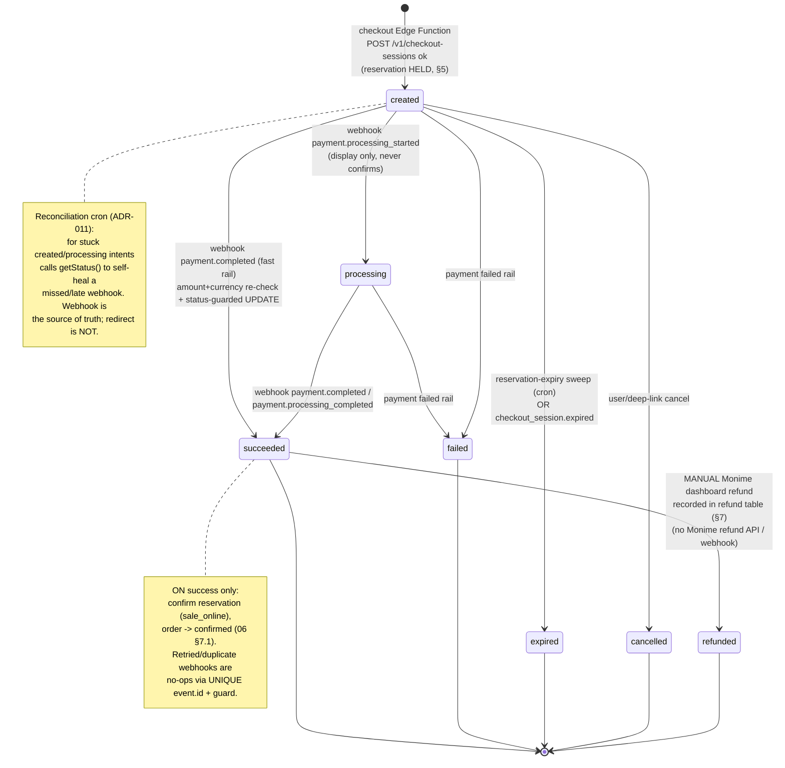
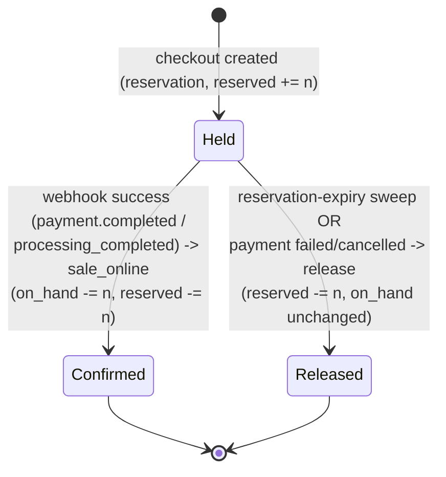
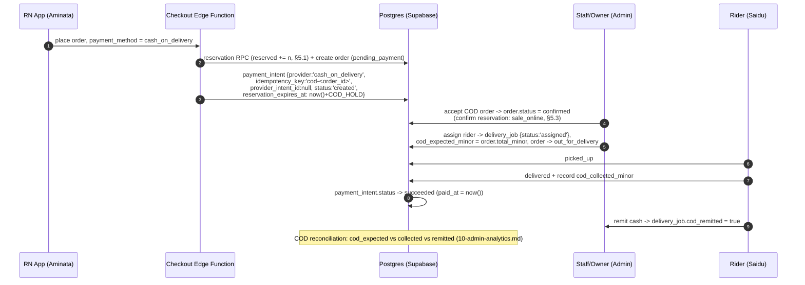
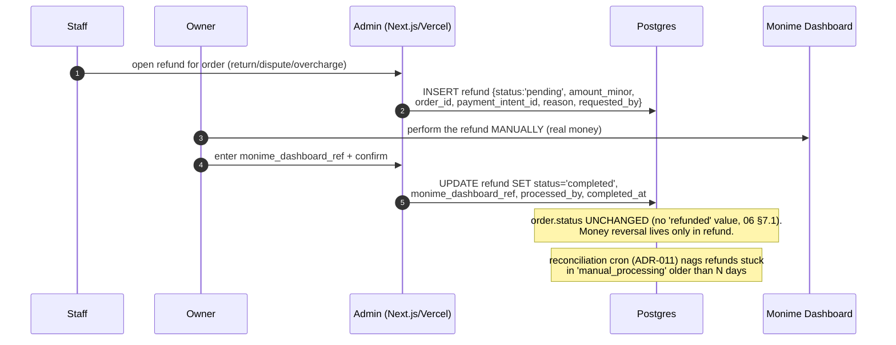

# 08 — Payments Design (Monime-ready)

> One-line purpose: define the provider-agnostic payment abstraction, the Monime hosted-Checkout-Session integration, the webhook verification + idempotency rules, the payment/inventory state machine, and the cash (cash-on-delivery / cash-at-pickup) and manual-refund flows for Borteh Sprays 001 — so checkout, reconciliation, and reservations are correct, auditable, and impossible to double-charge.

> Part of the Borteh Sprays 001 planning set. See 00-index.md for the full set.

---

## 0. How to read this document

This is the designated home for the deep Monime payment design that 00-index.md flagged as missing. It is **design-only** (interface sketches, DDL references, pseudocode, diagrams) per the project canon — there is **no production code** here.

Naming authority: **06-data-model.md is the source of truth** for every entity and column. This file references `payment_intent`, `payment_webhook`, `refund`, `order`, `delivery_job`, `stock_ledger`, `inventory_item`, and `availability_signal` exactly as 06 defines them; if anything here disagrees with 06, **06 wins**.

Cross-references used throughout:

| Doc | What it owns that this file builds on |
|---|---|
| **06-data-model.md** | `payment_intent` / `payment_webhook` / `refund` / `order` / `delivery_job` schema, §8 PaymentIntent state machine, §4 two-dimension StockLedger + reservation lifecycle. |
| **07-api-design.md** | The PostgREST-vs-Edge-Function split, the checkout Edge Function contract, error model, idempotency conventions. |
| **05-system-architecture.md** | Where Edge Functions, crons, Realtime, and the RN app sit; online-first writes (requires connectivity + retry). |
| **09-security-threat-model.md** | Secrets handling, webhook spoofing/replay threats, tampered-price defence, RLS posture on payment tables. |

Labelling convention (same as 06):

| Tag | Meaning |
|---|---|
| **(Fact)** | Canon-locked or battle-tested truth (Monime mechanics, ADR decisions). |
| **(Assumption — High/Med/Low)** | Design assumption + confidence; "assumption to verify". |
| **BLOCKED ON MONIME DOCS** | Cannot be finalized until official Monime documentation/support confirms (see §10). |
| **OWNER INPUT** | Needs a decision/data point from Mr. Borteh before build. |

Traceability: this file derives from **ADR-006** (PaymentProvider abstraction + Monime/COD adapters), **ADR-009** (integer SLE minor units), **ADR-005** (REST = PostgREST behind RLS + Edge Functions for transactional flows), **ADR-010** (atomic reservation / oversell prevention), and **ADR-011** (reconciliation + reservation-expiry crons).

### Pinned Monime facts we rely on (NOT blocked)

All **(Fact)**, from the canon's battle-tested integration:

- Host `https://api.monime.io`; header `Monime-Version: caph.2025-08-23`.
- Every call sends `Authorization: Bearer <token>`, `Monime-Space-Id`, `Monime-Version`, `Content-Type`; **`Idempotency-Key` (≤64 chars) is REQUIRED** on `POST /v1/checkout-sessions`.
- `POST /v1/checkout-sessions` creates a **hosted** checkout. Response `result.id` (`scs-…`) is stored as `payment_intent.provider_intent_id`; `result.redirectUrl` (`checkout.monime.io/scs-…`) is stored as `payment_intent.redirect_url` and opened by the app.
- Currency **SLE only**; amounts in **minor units** (`100 = Le 1.00`, ADR-009).
- Round-trip our `payment_intent.id` through **both** `callbackState` **and** `metadata.intent_id`; the channel path `data.channel.metadata.intent_id` survives most cleanly.
- Webhook header `Monime-Signature: t=<unix-seconds>,v1=<base64 of 32 bytes>`. Verify `HMAC-SHA256(secret, t + "_" + raw_body)` — **underscore, not Stripe's period** — base64-compared, timing-safe, over the **raw** body, with a **+300s past / +60s future** replay window. Two-secret rotation (CURRENT + PREVIOUS).
- **Act only on `payment.completed` and `payment.processing_completed`** (Monime fires one or the other per rail; both mean success). `checkout_session.completed` is the same transition, different shape. `checkout_session.expired` = abandoned. `payment.created` / `payment.processing_started` / `financial_transaction.created` are informational. **There is no event named `payment.processing`** — do not use it.
- Dedup webhooks on `event.id` via `UNIQUE (provider, provider_event_id)`; re-check amount + currency before a **status-guarded** flip.

Everything that depends on official Monime documentation is collected in **§10 (INTEGRATION QUESTIONS)** and tagged **BLOCKED ON MONIME DOCS** inline.

---

## 1. Payment abstraction layer (ADR-006)

The system never talks to Monime directly from business logic. Everything goes through a single **`PaymentProvider`** interface so that (a) **cash (cash-on-delivery / cash-at-pickup)** and Monime are interchangeable, first-class rails over one `payment_intent` ledger, and (b) a future provider (Orange Money direct, a card PSP, a second aggregator) plugs in without touching orders, inventory, or the webhook router. This is **ADR-006** made concrete.

> These are **interface / type sketches only**. No implementation, no real bodies — design review artifacts.

### 1.1 Shared value types

```ts
// ---- Money (ADR-009): integer SLE minor units only. Never float. ----
type Currency = "SLE";                 // Monime supports SLE only (Fact)
interface Money {
  amountMinor: bigint;                 // 100 = Le 1.00  -> payment_intent.amount_minor
  currency: Currency;                  // payment_intent.currency
}

// Mirrors payment_intent.status in 06 (created|processing|succeeded|failed|cancelled|expired)
type PaymentStatus =
  | "created" | "processing" | "succeeded" | "failed" | "cancelled" | "expired";

// What the abstraction hands back to the order/inventory layer. Decoupled from any
// provider-specific event name so callers never branch on Monime vocabulary.
type CanonicalOutcome =
  | "success"          // -> intent.status = succeeded  (the ONLY money/stock-moving outcome)
  | "processing"       // -> intent.status = processing (non-authoritative display only)
  | "expired"          // -> intent.status = expired    (abandoned)
  | "failed"           // -> intent.status = failed
  | "informational"    // ledger/created/started noise; persist + ignore
  | "ignored";         // verified but no intent matched / not our concern
```

### 1.2 The `PaymentProvider` interface

The five methods are exactly the ADR-006 surface: `createCheckout`, `verifyWebhookSignature`, `parseEvent`, `matchIntent`, `getStatus`.

```ts
interface PaymentProvider {
  readonly id: "monime" | "cash_on_delivery"; // -> payment_intent.provider (06 CHECK)

  /**
   * Create (or idempotently re-create) a checkout for an order.
   * Pure intent: it does NOT touch stock — the caller already holds the reservation.
   * For Monime: POST /v1/checkout-sessions; returns redirectUrl + provider_intent_id.
   * For COD: no network call; returns a synthetic intent with redirectUrl = null.
   */
  createCheckout(input: CreateCheckoutInput): Promise<CreateCheckoutResult>;

  /**
   * Stateless signature/authenticity check on a raw inbound webhook.
   * MUST run on the RAW request bytes before any JSON parse (§4).
   * For COD this is a no-op provider (no inbound webhooks) -> always returns
   * { verified: false } so COD can never be driven by a forged webhook.
   */
  verifyWebhookSignature(raw: RawWebhook): SignatureCheck;

  /**
   * Normalize a verified provider event into our vocabulary.
   * Extracts provider_event_id (event.id), event_type, amount, currency, and the
   * candidate intent locators (metadata.intent_id, object id, ownershipGraph chain).
   * Does NOT decide success — it classifies into CanonicalOutcome.
   */
  parseEvent(raw: RawWebhook): ParsedEvent;

  /**
   * Resolve a ParsedEvent to OUR payment_intent.id, recording HOW it matched
   * (-> payment_webhook.match_method: 'metadata' | 'object_id' | 'ownership_graph').
   * Returns null when no intent matches (event persisted, marked ignored).
   */
  matchIntent(evt: ParsedEvent): Promise<IntentMatch | null>;

  /**
   * Authoritative pull of current status from the provider for ONE intent.
   * Used by the reconciliation sweep (ADR-011) to self-heal a missed webhook.
   * BLOCKED ON MONIME DOCS: exact GET endpoint/scope for a checkout session (§10).
   */
  getStatus(intent: IntentRef): Promise<{ outcome: CanonicalOutcome; raw: unknown }>;
}
```

```ts
// ---- Supporting shapes (sketch) ----
interface CreateCheckoutInput {
  intentId: string;                    // our payment_intent.id (round-tripped both ways)
  orderId: string;                     // order.id
  orderNumber: string;                 // order.order_number -> Monime session "name"
  amount: Money;                       // = order.total_minor / currency (incl. owner-confirmed delivery fee; not an auto zone charge)
  idempotencyKey: string;              // -> payment_intent.idempotency_key (<=64, §3)
  successUrl: string;                  // deep-linkable return (app), informational only
  cancelUrl: string;
  lineItems: Array<{ name: string; quantity: number; price: Money }>;
}
interface CreateCheckoutResult {
  providerIntentId: string | null;     // Monime result.id 'scs-...'; null for COD
  redirectUrl: string | null;          // checkout.monime.io/scs-...; null for COD
  rawResponse: unknown;                // -> payment_intent.checkout_session_raw (audit)
  reservationExpiresAt: string;        // -> payment_intent.reservation_expires_at (§5)
}
interface RawWebhook { body: string; headers: Headers; }   // body = exact raw bytes
interface SignatureCheck { verified: boolean; signatureT?: number; secretUsed?: "current" | "previous"; }
interface ParsedEvent {
  providerEventId: string;             // event.id -> payment_webhook.provider_event_id
  eventType: string;                   // -> payment_webhook.event_type
  outcome: CanonicalOutcome;
  amount?: Money;                      // for amount+currency re-check (§3)
  locators: { metadataIntentId?: string; objectId?: string; ownershipChain?: string[] };
}
interface IntentMatch { intentId: string; matchMethod: "metadata" | "object_id" | "ownership_graph"; }
interface IntentRef { intentId: string; providerIntentId: string | null; }
```

### 1.3 `MonimeProvider` adapter (hosted Checkout Sessions)

```ts
// Sketch only — bodies elided. Runs inside Supabase Edge Functions (Deno), ADR-005.
class MonimeProvider implements PaymentProvider {
  readonly id = "monime" as const;

  // Config from env (09 secrets posture): MONIME_ACCESS_TOKEN, MONIME_SPACE_ID,
  // MONIME_VERSION = "caph.2025-08-23", MONIME_FINANCIAL_ACCOUNT_ID,
  // MONIME_WEBHOOK_SECRET_CURRENT, MONIME_WEBHOOK_SECRET_PREVIOUS.

  createCheckout(input: CreateCheckoutInput): Promise<CreateCheckoutResult>;
  // POST https://api.monime.io/v1/checkout-sessions
  //   headers: Authorization: Bearer <token>, Monime-Space-Id, Monime-Version,
  //            Content-Type: application/json, Idempotency-Key: input.idempotencyKey
  //   body: { name: orderNumber, successUrl, cancelUrl,
  //           reference: orderId, callbackState: intentId,    // round-trip #1
  //           financialAccountId, lineItems: [{ type:'custom', name, quantity,
  //                                             price:{ currency:'SLE', value:<minor> } }],
  //           metadata: { intent_id: intentId, order_id: orderId } }  // round-trip #2
  //   -> result.id ('scs-...') => providerIntentId; result.redirectUrl => redirectUrl;
  //      whole response => checkout_session_raw.

  verifyWebhookSignature(raw: RawWebhook): SignatureCheck;  // HMAC rules, §4
  parseEvent(raw: RawWebhook): ParsedEvent;                  // taxonomy, §1.5
  matchIntent(evt: ParsedEvent): Promise<IntentMatch | null>; // 3-strategy order, §1.6
  getStatus(intent: IntentRef): Promise<...>;                 // GET (endpoint BLOCKED, §10)
}
```

### 1.4 `CashOnDeliveryProvider` adapter

**Cash is a first-class payment method** — both **cash-on-delivery** and **cash-at-pickup** — on the **same** `payment_intent` ledger (`provider='cash_on_delivery'`) so reconciliation, analytics, and the order lifecycle have one money model (ADR-006). Cash sits alongside Monime as an equal rail at checkout.

```ts
class CashOnDeliveryProvider implements PaymentProvider {
  readonly id = "cash_on_delivery" as const;

  createCheckout(input): Promise<CreateCheckoutResult>;
  // NO network call. Creates payment_intent with:
  //   provider='cash_on_delivery', provider_intent_id = null,
  //   idempotency_key = `cod-${orderId}` (synthetic; column is NOT NULL in 06),
  //   redirect_url = null, status='created',
  //   reservation_expires_at = now() + COD_HOLD (longer than mobile-money TTL, §5).

  verifyWebhookSignature(): SignatureCheck;   // always { verified:false } — no inbound hooks
  parseEvent(): ParsedEvent;                  // n/a; COD is driven by delivery_job, not events
  matchIntent(): Promise<null>;               // n/a
  getStatus(intent): Promise<...>;            // derives outcome from delivery_job.status (§6)
}
```

Cash success is **not** webhook-driven: it flips to `succeeded` when the rider records `delivery_job.cod_collected_minor` at delivery, or when staff record the cash collected at the store counter for **cash-at-pickup** (§6).

### 1.5 Monime event → `CanonicalOutcome` mapping (Fact)

`parseEvent` collapses Monime's taxonomy to our vocabulary. **Only the first two rows move money/stock.**

| Monime event | `CanonicalOutcome` | Effect on `payment_intent.status` |
|---|---|---|
| `payment.completed` | `success` | → `succeeded` (status-guarded, §3) |
| `payment.processing_completed` | `success` | → `succeeded` (same; different rail) |
| `checkout_session.completed` | `success`* | → `succeeded` (same transition, nested shape; *signing parity BLOCKED, §10) |
| `payment.processing_started` | `processing` | → `processing` (display only; never confirms) |
| `payment.created` | `informational`/`processing` | optional `processing`; never confirms |
| `financial_transaction.created` | `informational` | persist only; metadata lives at `ownershipGraph.owner.metadata` |
| `checkout_session.expired` | `expired` | → `expired` (abandoned; or let sweep handle) |

We **subscribe to all events** (no downside) and **act only on the two completion events**; treat `checkout_session.completed` as a redundant confirmation of the same transition, preferring the `payment.*` event when both arrive. **(Fact.)**

### 1.6 Intent-matching order (Fact)

`matchIntent` tries these in order and records the winner in `payment_webhook.match_method`:

1. **`metadata`** — `data.metadata.intent_id` **or** `data.channel.metadata.intent_id` (the channel path survives most cleanly).
2. **`object_id`** — for `checkout_session.*` events, the object `id == payment_intent.provider_intent_id`.
3. **`ownership_graph`** — walk `data.ownershipGraph.owner` up to **depth 5** to find the `checkout_session` id, then match it to `provider_intent_id` (`financial_transaction` events chain `payment → checkout_session`).

No match → persist the webhook, mark it `ignored` (return `200` so Monime stops retrying), and let the reconciliation sweep reconcile via `getStatus` if needed.

### 1.7 How a future provider plugs in

```text
business logic (orders/inventory/reconcile)
        │  depends only on PaymentProvider + CanonicalOutcome
        ▼
   PaymentRouter  ── selects adapter by payment_intent.provider
        ├── MonimeProvider          (hosted Checkout Sessions)
        ├── CashOnDeliveryProvider  (no network, delivery-driven)
        └── <FutureProvider>        e.g. OrangeMoneyDirect / CardPSP / 2nd aggregator
```

To add a provider: (1) implement the 5 methods; (2) add its name to the `payment_intent.provider` and `order.payment_method` `CHECK` lists in 06 (one-line change, per 06 §15 enum policy); (3) register a webhook route that calls `verifyWebhookSignature → parseEvent → matchIntent`; (4) add its secrets to the 09 secrets registry. **Orders, inventory, refunds, and analytics need zero changes** — they only ever see `payment_intent` rows and `CanonicalOutcome`. **(Design invariant, ADR-006.)**

---

## 2. Payment state machine


This is the **payment** lifecycle (it lives on `payment_intent.status`, 06 §8.2). It is intentionally distinct from `order.status` (06 §7.1) and `delivery_job.status` (06 §10) — payment is a sub-state that *drives* order transitions but is not the same axis. The diagram below annotates where the **webhook**, the **reservation hold**, the **reconciliation cron**, and **retries** act.



Notes:
- **`refunded` is not a `payment_intent.status` value in 06** (the column CHECK is `created|processing|succeeded|failed|cancelled|expired`). It is shown here as a terminal *money-reversal* phase that is tracked **entirely in the `refund` table** (§7); the intent row stays `succeeded`. This matches 06 §7.1 "No `refunded` order status". Treat the dashed `refunded` node as documentation of the reconciliation worklist, not a literal status flip. **(Design note.)**
- Every **money/stock-moving** edge (`→ succeeded`) is gated by the §3 triad: amount+currency re-check, `UNIQUE` event dedup, and a status-guarded `UPDATE`.
- **Retries**: Monime re-delivers webhooks on non-2xx; the reconciliation cron is the second safety net. Both are idempotent (§3).

---

## 3. Idempotency, double-charge prevention & ledger auditability

Three independent guards make payment processing **exactly-once** even under duplicate webhooks, retried checkouts, and races with the expiry sweep. **(Fact — all locked in 06 §8.1.)**

### 3.1 Guard 1 — `Idempotency-Key` on checkout creation

- `POST /v1/checkout-sessions` always carries an `Idempotency-Key` (**≤64 chars**, REQUIRED). We persist it in `payment_intent.idempotency_key` and enforce **`uq_intent_idem UNIQUE (provider, idempotency_key)`** (06).
- The key is **deterministic per intent** so a client/network retry of the *same* checkout reuses the *same* Monime session and the *same* `payment_intent` row — never a second charge. Recommended derivation: `sha256(intentId + ":" + "checkout-sessions")` truncated to 64 hex chars (matches the skill's pattern). **(Assumption — High** on the exact derivation; the requirement to send a stable key is **Fact**.)
- **BLOCKED ON MONIME DOCS:** the key's TTL is **assumed 24h** — confirm (§10).

### 3.2 Guard 2 — Webhook dedup on `event.id`

- Every inbound event is inserted into `payment_webhook` with **`uq_webhook_event UNIQUE (provider, provider_event_id)`** where `provider_event_id = event.id`.
- Pattern: `INSERT … ON CONFLICT (provider, provider_event_id) DO NOTHING RETURNING id`. **No row returned ⇒ already processed ⇒ ack `200` and stop.** Monime can legitimately deliver the same event multiple times; this makes processing idempotent at the door.
- `payment_webhook` is **append-only** (06 §2): no `UPDATE`/`DELETE` for app roles except the controlled `verified`/`processed`/`processed_at` transition by the function's service role. It is the **full audit trail**: `raw_body`, `signature_t`, `payload`, `verified`, `processed`, `match_method`, `error`.

### 3.3 Guard 3 — Amount/currency re-check + status-guarded `UPDATE`

Before flipping any intent to `succeeded`, the handler **first** re-verifies the event's amount and currency against the stored intent with an explicit read, **then** applies a **status-guarded** update so it can never (a) double-apply or (b) race the reservation-expiry sweep. The two steps are deliberately separate: folding the amount check *only* into the `UPDATE … WHERE` clause would make a real **AMOUNT_MISMATCH** (tampering / misconfig) return zero rows — indistinguishable from a benign already-processed no-op, which also returns zero rows. The explicit pre-check is what makes the mismatch *alertable*; the guard then repeats amount/currency as defence-in-depth (matches 06 §8.1's "re-verify … then apply").

```sql
-- 06 §8.1, reproduced as the canonical success transition (sketch).

-- STEP 1 — explicit amount+currency verification BEFORE any flip, under a row lock.
--          This is what distinguishes a tampering signal from a benign duplicate.
SELECT amount_minor, currency, status
  INTO :intent
  FROM payment_intent
 WHERE id = :matched_intent_id
   FOR UPDATE;                                   -- lock the row for this txn
-- if :intent.amount_minor <> :event_amount_minor
--    OR :intent.currency  <> :event_currency  -> AMOUNT_MISMATCH branch (below), STOP.

-- STEP 2 — status-guarded flip (amount/currency repeated as defence-in-depth).
UPDATE payment_intent
   SET status = 'succeeded', paid_at = now(), updated_at = now()
 WHERE id = :matched_intent_id
   AND amount_minor = :event_amount_minor   -- amount must match the intent
   AND currency     = :event_currency       -- currency must match (SLE)
   AND status IN ('created','processing')    -- guard: prevents double-apply + sweep race
RETURNING id;
-- ONLY if a row is returned do we:
--   (1) confirm the reservation: stock_ledger movement_type='sale_online'
--       (qty_delta = -n, qty_reserved_delta = -n), update inventory_item, refresh
--       availability_signal.band  (06 §4, single RPC, one transaction);
--   (2) move order.status pending_payment -> confirmed (06 §7.1);
--   (3) mark payment_webhook.processed = true, processed_at = now().
```

- **Amount/currency mismatch** (Step 1) ⇒ do **not** flip; mark `payment_webhook.error='AMOUNT_MISMATCH'`, alert (a tampering/misconfig signal, see 09), return `500` so it is retried/inspected. This branch is only reachable *because* the check is explicit — not buried in the `UPDATE` guard.
- **Zero rows from Step 2** *after* a passing Step 1 ⇒ a benign race: the intent was already `succeeded`/`expired` (duplicate webhook, or the expiry sweep won first). Ack `200`, no-op — never an error.
- **A row returned** but the *follow-on* work fails ⇒ the webhook stays `processed=false`; redelivery + the reconciliation cron retry the side effects (all idempotent).

### 3.4 Auditability summary

| Question | Answered by |
|---|---|
| "Did we already handle this event?" | `payment_webhook.provider_event_id` UNIQUE + `processed` |
| "Why did this intent succeed?" | `payment_webhook.raw_body` + `payload` + `match_method` linked via `payment_intent_id` |
| "Was the signature real?" | `payment_webhook.verified` + `signature_t` |
| "Did money == order total?" | amount/currency re-check (§3.3) vs `payment_intent.amount_minor` |
| "What moved stock?" | `stock_ledger` rows with `reference_type='order'`, `reference_id=order.id` (06 §4) |
| "Where's the money reversal?" | `refund` row + `monime_dashboard_ref` (§7) |

---

## 4. Webhook verification — Supabase Edge Function (Deno)

The verification rules are **(Fact)** and identical to 06 §8.1 / 09. Described as pseudocode; **not** a full implementation.

### 4.1 Rules (locked)

1. **Read the RAW body first.** `const raw = await req.text();` **before any `JSON.parse`**. Re-serialized JSON changes the bytes and breaks the HMAC. We persist exactly these bytes in `payment_webhook.raw_body`.
2. **Parse the header** `Monime-Signature: t=<unix-seconds>,v1=<base64 of 32 bytes>` into `t` and `v1`. Header lookup must be **case-insensitive** (`req.headers.get("monime-signature")` — Deno/`Headers` lowercases keys).
3. **Replay window:** reject if `(now - t) > 300` **or** `(t - now) > 60` (seconds). Store `t` in `payment_webhook.signature_t`.
4. **Signed payload uses an UNDERSCORE:** `signed_payload = t + "_" + raw` — **NOT** Stripe's period. This is the #1 gotcha.
5. **Compute** `expected = HMAC-SHA256(secret, signed_payload)`, **base64-encode**, compare to `v1` **byte-for-byte, timing-safe**.
6. **Two-secret rotation:** try `MONIME_WEBHOOK_SECRET_CURRENT`, then `MONIME_WEBHOOK_SECRET_PREVIOUS`; success on either ⇒ verified (record which in the audit row). Drain ~24h, then clear PREVIOUS.
7. **On verify failure:** return `401` with **zero** DB writes that could be mistaken for a real event (optionally log a diagnostic row marked `verified=false`); never process.

### 4.2 Pseudocode (Deno Edge Function)

```ts
// supabase/functions/monime-webhook  (sketch — NOT a full implementation)
serve(async (req) => {
  // (1) RAW body BEFORE parse — load-bearing for the signature
  const raw = await req.text();
  const sigHeader = req.headers.get("monime-signature"); // case-insensitive

  // (2) parse "t=...,v1=..."
  const { t, v1 } = parseSignatureHeader(sigHeader);     // null-safe
  if (!t || !v1) return new Response("bad signature header", { status: 401 });

  // (3) replay window
  const now = Math.floor(Date.now() / 1000);
  if (now - t > 300 || t - now > 60) return new Response("stale", { status: 401 });

  // (4)+(5)+(6) HMAC over (t + "_" + raw), base64, timing-safe, two secrets
  const signedPayload = `${t}_${raw}`;                   // UNDERSCORE, not "."
  const ok = await verifyAnySecret(signedPayload, v1, [
    Deno.env.get("MONIME_WEBHOOK_SECRET_CURRENT"),
    Deno.env.get("MONIME_WEBHOOK_SECRET_PREVIOUS"),
  ]);
  if (!ok) return new Response("invalid signature", { status: 401 }); // (7) no writes

  // verified — NOW safe to parse + dedup-insert + dispatch
  const evt = JSON.parse(raw);
  const inserted = await insertWebhookOnConflictDoNothing({
    provider: "monime",
    provider_event_id: evt.event.id,   // UNIQUE anchor (§3.2)
    event_type: evt.event.name,
    signature_t: t,
    raw_body: raw,
    payload: evt,
    verified: true,
  });
  if (!inserted) return new Response("ok (duplicate)", { status: 200 });

  // classify -> match -> (only on success) amount-check + guarded UPDATE + confirm stock
  await routeVerifiedEvent(inserted.id, evt);            // §1.5 / §1.6 / §3.3
  return new Response("ok", { status: 200 });
});
```

### 4.3 Crypto availability in Deno (note)

- Supabase Edge Functions run on **Deno**, which exposes **both** the **Web Crypto API** (`crypto.subtle`) **and** Node's `node:crypto` via npm/Node compatibility.
- Either works for HMAC-SHA256:
  - **Web Crypto:** `crypto.subtle.importKey("raw", secretBytes, {name:"HMAC",hash:"SHA-256"}, false, ["sign"])` → `crypto.subtle.sign("HMAC", key, payloadBytes)` → base64. Web Crypto has **no** `timingSafeEqual`, so do a **constant-time compare** over equal-length byte arrays (or import `timingSafeEqual` from Deno std / `node:crypto`).
  - **`node:crypto`:** `createHmac("sha256", secret).update(signedPayload).digest()` + `timingSafeEqual(...)` — closest to the skill's reference and the simplest to audit.
- Encode the secret and payload as **UTF-8** consistently on both sides of the comparison. **(Fact / implementation note.)**

### 4.4 Deployment gotchas (Fact, from the integration skill)

- **Webhooks do NOT follow redirects.** The URL registered in the Monime dashboard must be the **exact canonical** Edge Function URL (`https://<project-ref>.functions.supabase.co/monime-webhook` or the custom domain that does **not** 30x-redirect). A `307`/`301` ⇒ the event is silently dropped. **BLOCKED ON MONIME DOCS:** webhook subscription is dashboard-only (no public API) — confirm the exact URL form and that it is reachable (`curl` should return `401 invalid signature`, not a redirect/404).
- Subscribe to **all** events in the dashboard; act only on the two completion events (§1.5).

---

## 5. Failure & dispute handling + inventory reservation during pending payment

### 5.1 The reservation is a HOLD, not a decrement (ties to 06 §4)

When the checkout Edge Function runs, the stock is already **reserved** via the 06 §4 reservation RPC — a movement on the **reserved** dimension only:

- **Hold (at checkout):** `stock_ledger` `movement_type='reservation'`, `qty_delta = 0`, `qty_reserved_delta = +n`; `inventory_item.qty_reserved += n`; `availability_signal.band` recomputed. The customer cannot oversell because `qty_available = qty_on_hand - qty_reserved` (06 generated column + `ck_reserved_le_onhand`).
- The hold is **time-boxed** by `payment_intent.reservation_expires_at`.

### 5.2 Reservation TTL

| Rail | Suggested hold | Why |
|---|---|---|
| **Monime mobile money** | **~15 min** | Mobile-money confirmation is near-real-time; a short hold frees stock fast if the customer abandons. **(Assumption — Med; OWNER INPUT** to tune.) |
| **COD** | Longer (e.g. until staff accept / next sweep window) | No external confirmation step; released on a failed/returned delivery instead (§6). **(Assumption — Med.)** |

### 5.3 What resolves the hold



- **Confirm on success:** the §3.3 guarded `UPDATE` returning a row triggers `movement_type='sale_online'` (`qty_delta = -n, qty_reserved_delta = -n`) — the reserved units become an actual on-hand decrement, all in **one transaction** with the status flip and the `order → confirmed` transition.
- **Release on expiry/failure:** the **reservation-expiry sweep** (ADR-011) finds `payment_intent` rows with `status IN ('created','processing')` and `reservation_expires_at < now()`, flips them to `expired`, and emits `movement_type='release'` (`qty_delta = 0, qty_reserved_delta = -n`) so the hold returns to availability. The status-guarded design (§3.3) means a **late webhook racing the sweep cannot both win** — whichever flips `created/processing` first wins; the loser's guard matches zero rows and no-ops.

### 5.4 Failure cases

| Case | Detection | Effect |
|---|---|---|
| Customer abandons hosted page | `checkout_session.expired` and/or hold TTL elapses | intent → `expired`; `release`; `order → cancelled` with `cancel_reason='payment_expired'` (06 §7.1) |
| Payment fails on rail | failed webhook | intent → `failed`; `release`; `order → cancelled`, `cancel_reason='payment_failed'` |
| Missed/late webhook | reconciliation cron `getStatus` | self-heals: confirms (→ `sale_online`) or expires (→ `release`) |
| Amount mismatch | §3.3 re-check | no flip; `payment_webhook.error`; alert (09); manual review |
| Deep-link returns "success" but no webhook yet | redirect is **not trusted** | order stays `pending_payment` until the webhook (or cron) confirms — never confirm on redirect |

### 5.5 Disputes / chargebacks

- **BLOCKED ON MONIME DOCS:** there is **no confirmed dispute/chargeback API or webhook** as of 2026-05. Until confirmed, a dispute is handled **operationally** (owner works it in the Monime dashboard) and, if money is returned, recorded as a `refund` row (§7) for our books. No automated state machine is designed for disputes yet — this is a tracked gap (§10, and 12-risks-assumptions.md PAY-series).

---

## 6. COD flow (reserve → deliver → collect → mark paid)

COD uses the **same** `payment_intent` ledger with `provider='cash_on_delivery'` (06 §8.2 note).



- COD success is driven by **`delivery_job.cod_collected_minor`** at delivery (06 §10), not by a webhook — `verifyWebhookSignature` for COD is a permanent no-op, so COD can never be advanced by a forged event.
- A **failed/returned** COD delivery (`delivery_job.status='failed_attempt'`/`'returned'`) releases the hold (`movement_type='release'` or `'return'`) and moves the COD intent to `cancelled` (06 §8.2 note); the order follows 06 §7.1.
- `cod_expected_minor` is copied from `order.total_minor` (which includes the delivery fee **confirmed by the owner at order processing** — not an auto `delivery_zone` charge); `cod_collected_minor` + `cod_remitted` close Saidu's cash loop and feed COD reconciliation (06 §10, 10-admin-analytics.md). **OWNER INPUT:** partial-collection / short-payment policy.
- **Cash-at-pickup** is the same cash rail (`provider='cash_on_delivery'`) **without** a `delivery_job`: the customer pays at the store counter and staff record the cash, flipping the COD `payment_intent` to `succeeded` against the same ledger and reconciliation. **OWNER INPUT:** confirm the admin's at-pickup cash-capture point.

---

## 7. Refund flow (manual — no Monime refund API)

**Status: BLOCKED ON MONIME DOCS.** There is **no Monime refund API as of 2026-05** and **no confirmed refund webhook**. Refunds are executed **manually in the Monime dashboard** and recorded in the `refund` table (06 §9) for our own books + reconciliation. The `refund` table is an **internal record + worklist**, not an automation hook.



- `refund.status` transitions `pending → manual_processing → completed` (or `failed`) — exactly the 06 §9 CHECK set.
- **No `refunded` order status** (06 §7.1): the order keeps its fulfillment status (`delivered`/`cancelled`/`returned`) while the `refund` row independently tracks the money. Net revenue reporting subtracts `completed` refunds (10-admin-analytics.md).
- If a refund implies returned goods, the **stock** side is handled separately via `delivery_job` → `movement_type='return'` (06 §4/§10), keeping money and inventory decoupled.
- **OWNER INPUT:** refund policy (full vs partial, window).

---

## 8. End-to-end checkout sequence (Monime)

Checkout → payment-init (Edge Function) → Monime redirect → customer pays → webhook → verify → order confirmed. The **webhook is the source of truth; the redirect is not**.

> **Delivery fee (Owner Decision):** `order.total_minor` reflects a delivery fee **confirmed by the owner at order processing** (written to `order.delivery_fee_minor`, nullable until confirmed) — **not** an auto-computed `delivery_zone` charge. The `delivery_zone` fee is a **guidance estimate** shown at checkout only; the binding amount sent to Monime (and re-checked in §3.3) — or collected as `cod_expected_minor` for cash — is the owner-confirmed total.

```mermaid
sequenceDiagram
    autonumber
    participant App as RN App (Expo)
    participant EF as payment-init Edge Function
    participant DB as Postgres (Supabase)
    participant Monime as Monime API
    participant Pay as Monime Hosted Checkout
    participant WH as monime-webhook Edge Function

    App->>EF: checkout(order draft)  (ADR-005 transactional flow)
    EF->>DB: re-price server-side from product_variant.price_minor (09)<br/>reservation RPC: reserved += n (HOLD, §5.1)
    EF->>DB: INSERT order (pending_payment) + payment_intent<br/>{provider:'monime', status:'created',<br/>amount_minor = order.total_minor, idempotency_key}
    EF->>Monime: POST /v1/checkout-sessions<br/>headers: Bearer, Space-Id, Version, Idempotency-Key<br/>body: callbackState + metadata.intent_id (round-trip), lineItems(SLE minor)
    Monime-->>EF: result.id 'scs-...' + result.redirectUrl
    EF->>DB: payment_intent.provider_intent_id = scs-...,<br/>redirect_url = ..., checkout_session_raw = full response
    EF-->>App: return redirectUrl (do NOT redirect() server-side; §8.1)
    App->>Pay: open redirectUrl in Expo WebBrowser
    Pay-->>App: customer pays; deep-link back (NOT trusted)
    Note over App,DB: order stays pending_payment until webhook confirms

    Monime->>WH: POST webhook (payment.completed / processing_completed)
    WH->>WH: read RAW body; verify HMAC over t + "_" + body (§4)
    WH->>DB: INSERT payment_webhook ON CONFLICT(event.id) DO NOTHING
    WH->>WH: parseEvent -> matchIntent (metadata -> object_id -> ownership_graph, §1.6)
    WH->>DB: re-check amount+currency; status-guarded UPDATE -> succeeded (§3.3)
    WH->>DB: confirm reservation (sale_online), order -> confirmed (06 §4/§7.1)
    WH->>DB: enqueue in-app notification (Realtime feed) + mark webhook processed
    WH-->>Monime: 200 ok
    DB-->>App: Realtime/poll: order confirmed
```

### 8.1 Client return note (Fact, from the skill)

The Edge Function **returns** `redirectUrl` to the app; the app opens it in an **Expo WebBrowser** and handles the deep-link return. Do **not** perform a server-side external redirect from inside a transition-wrapped action — external redirects from such actions are silently swallowed; return the URL and navigate client-side. The deep-link "success" return is **cosmetic** — order confirmation always waits for the verified webhook (or the reconciliation cron).

---

## 9. Edge Functions & crons map (ADR-005 / ADR-011)

| Component | Type | Responsibility | References |
|---|---|---|---|
| `payment-init` | Edge Function (on-demand) | Re-price, reserve stock, create `order` + `payment_intent`, call `createCheckout`, return `redirect_url` | §8, 07 |
| `monime-webhook` | Edge Function (public, signed) | Verify (§4) → dedup (§3.2) → match (§1.6) → amount-check + guarded flip (§3.3) → confirm stock/order | §3, §4, §8 |
| reservation-expiry sweep | Scheduled Edge Function | Expire stale `created/processing` intents past `reservation_expires_at`; `release` stock; cancel order (`payment_expired`) | §5.3, ADR-011 |
| payment reconciliation sweep | Scheduled Edge Function | `getStatus` self-heal for stuck intents (missed webhooks); nag `refund` rows in `manual_processing` | §2, §7, ADR-011 |

All four are idempotent and converge to the same terminal state regardless of event ordering or duplication.

---

## 10. INTEGRATION QUESTIONS TO ANSWER ONCE MONIME DOCS ARRIVE

> Every item here is **BLOCKED ON MONIME DOCS / support** or ring-fenced live-mode testing. Until resolved, payments **must not** be trusted in production. These mirror the PAY-series in 12-risks-assumptions.md and the aggregated register in 00-index.md.

| # | Question | Current assumption / workaround | Status |
|---|---|---|---|
| Q1 | **Is there a real sandbox?** Test tokens (`mon_test_*`) return **401 on `/v1/*`**; real tests appear to require live mode (real money). | Plan ring-fenced minimum-SLE live smoke tests; no automated sandbox suite. | **BLOCKED** |
| Q2 | **Token scopes per action.** A token may `POST /v1/checkout-sessions` but `401` on `GET /v1/checkout-sessions`/FA reads. Which scope does `getStatus` need? | Provision broadest needed scopes; disambiguate 401 via `GET /` (`isAuthenticated`). | **BLOCKED** |
| Q3 | **Refund API / refund webhook.** Any programmatic refund? Any event on refund? | None as of 2026-05 → manual dashboard refund + `refund` table (§7) + manual reconciliation. | **BLOCKED** |


| Q4 | **Dispute / chargeback API or webhook.** Exists? Shape? | None confirmed → operational handling only (§5.5). | **BLOCKED** |
| Q5 | **`Idempotency-Key` TTL.** Confirmed 24h? | Assume **24h**; `uq_intent_idem` makes a stale-key retry reuse the intent regardless. | **BLOCKED** |
| Q6 | **`checkout_session.completed` signing parity.** Same HMAC scheme/shape as `payment.*`? | Prefer acting on `payment.completed`/`processing_completed`; treat `checkout_session.completed` as redundant until parity confirmed. | **BLOCKED** |
| Q7 | **Webhook URL form & redirects.** Webhooks **don't follow redirects**; subscription is dashboard-only (no public API). Exact canonical Edge Function URL? | Register the exact non-redirecting Function URL; verify with `curl` (expect `401`, not `30x`). | **BLOCKED** |
| Q8 | **`Monime-Space-Id` `.test` suffix.** Do test spaces use `spc-….test`? | Use the exact value Monime provides; never add/strip suffix ourselves. | **BLOCKED** |
| Q9 | **`getStatus` endpoint.** Exact `GET` path + scope to read a checkout session / payment for reconciliation. | Reconciliation cron designed but endpoint unconfirmed. | **BLOCKED** |

When Q1–Q9 are answered, update this section, 06 §8.1 notes, and 12-risks-assumptions.md, and remove the corresponding BLOCKED tags.

---

## 11. Cross-references

- **06-data-model.md** — `payment_intent`, `payment_webhook`, `refund`, `order`, `delivery_job`, `stock_ledger`, `inventory_item`, `availability_signal` schemas; §8.2 PaymentIntent state machine; §4 reservation lifecycle; §7.1 order lifecycle. **(Source of truth.)**
- **07-api-design.md** — checkout/payment Edge Function contracts, PostGREST-vs-Edge split, error model, idempotency conventions, pagination.
- **05-system-architecture.md** — placement of Edge Functions, crons, Realtime, online-first writes (requires connectivity + retry), and how the webhook fits the overall topology.
- **09-security-threat-model.md** — secrets registry (Monime token/space/webhook secrets), webhook spoof/replay threat, tampered-price defence (server-side re-pricing), RLS posture on payment tables.
