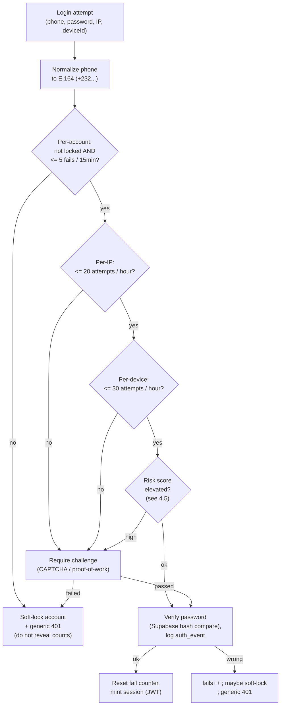
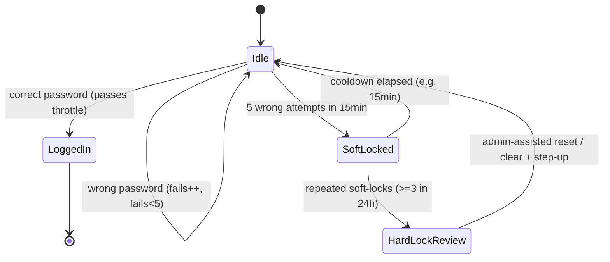
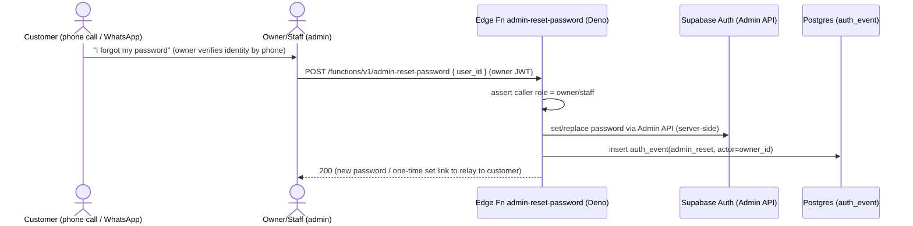
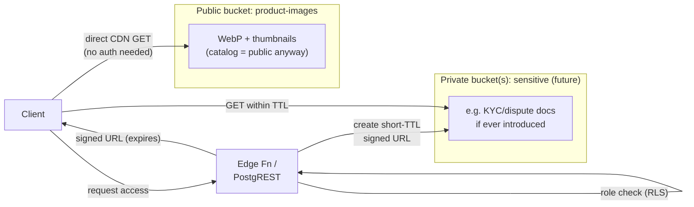
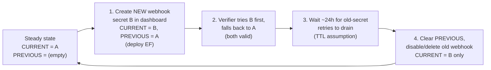
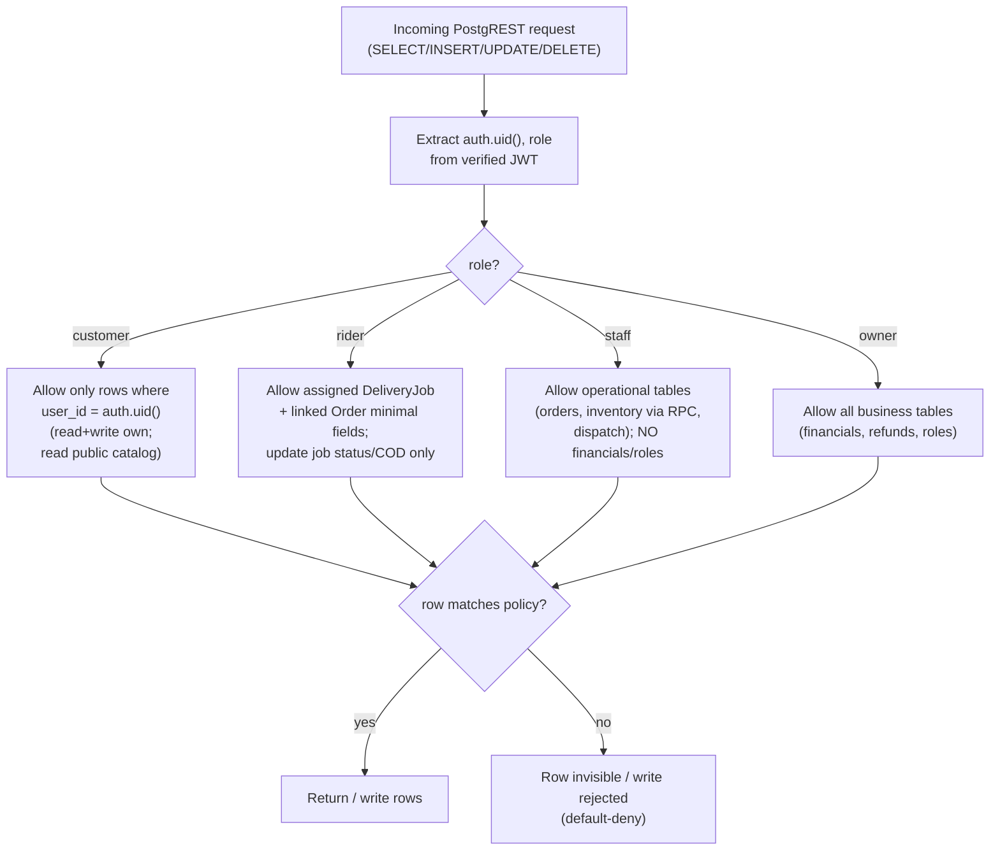

# 09 — Security, Privacy & Threat Model

> One-line purpose: define the security posture, STRIDE threat model, auth hardening, data protection, secrets management, RBAC-via-RLS, and SL regulatory flags for Borteh Sprays 001.

> Part of the Borteh Sprays 001 planning set. See 00-index.md for the full set.

---

## 0. How to read this document

This is a **design artifact**, not an implementation. It contains pseudocode, DDL/policy sketches, interface definitions, and diagrams only — no production code (per the phase rule).

**Confidence labels** are attached to every non-trivial claim:

| Label | Meaning |
|---|---|
| **Fact** | Hard, citable, or directly verified (e.g. Monime mechanics validated in a real integration; see `08-payments-monime.md`). |
| **Validated assumption** | Reasoned from confirmed constraints in the canon; low risk of being wrong. |
| **Unverified assumption (High/Medium/Low confidence)** | A design guess. The phrase **"assumption to verify"** marks it. |
| **BLOCKED ON MONIME DOCS** | Cannot be finalized until official Monime documentation/support answers it. |
| **VERIFY WITH COUNSEL** | A legal/regulatory point we must NOT assert as fact; route to a Sierra Leone lawyer. |

**Traceability:** every control traces to a persona (Aminata / Mr. Borteh / Saidu / Staff) and/or an ADR number (`11-adrs.md`). Payment-security details are the authoritative companion to `08-payments-monime.md`; the data shapes referenced live in `06-data-model.md`; the surfaces map to `05-system-architecture.md`.

---

## 1. Security objectives & non-goals

### 1.1 Objectives (what "secure enough for v1" means)

| # | Objective | Driven by | Trace |
|---|---|---|---|
| O1 | No oversell / negative stock under concurrent online + in-store sales. | Single source of truth = Postgres. | ADR-003, ADR-010 |
| O2 | No customer can read or mutate another customer's orders, cart, wishlist, addresses, or loyalty balance. | Trust-building (SL online-shopping trust is developing). | ADR-002 (RLS) |
| O3 | Payment state can only flip to `succeeded` from an authentic, amount-verified Monime webhook — never from a client. | Fraud/chargeback resistance. | ADR-006, `08` |
| O4 | Login cannot be brute-forced or credential-stuffed, and password reset cannot be abused to hijack an account. | Account security (auth = phone + password; no SMS budget to drain). | ADR-004 |
| O5 | We store the **minimum** PII to run a delivery business; **zero** card/wallet credentials. | PII minimization + cost + regulatory. | ADR-009, ADR-006 |
| O6 | Secrets (Monime webhook secret, service-role key) never ship to the device or the browser; passwords are hashed by Supabase, never transmitted/stored in plaintext. | Standard secret hygiene. | ADR-005 |
| O7 | The admin/POS, rider app, and shopper app each see only what their role needs. | Least privilege. | ADR-002 |

### 1.2 Non-goals for v1 (explicit, to bound scope)

- We are **not** building PCI-DSS cardholder-data infrastructure: Monime hosts the payment page, so card/wallet PANs never touch our systems (Fact; see §8). PCI scope is therefore minimized to "SAQ-A-like" redirect/iframe posture — **assumption to verify** (Medium) with Monime + an assessor.
- We are **not** running a SOC, SIEM, or paid WAF in v1 (budget = Supabase only, per canon). We use Supabase logs + lightweight in-DB audit instead (§12).
- We are **not** implementing full KYC of shoppers in v1; KYC obligations, if any, are **VERIFY WITH COUNSEL** (§11).

---

## 2. System trust boundaries

Every control below maps to a **surface**. These are the surfaces named in the assignment and in `05-system-architecture.md`.

```mermaid
flowchart TB
    subgraph UNTRUSTED["UNTRUSTED ZONE (attacker-controllable)"]
        APP["Shopper App<br/>RN + Expo<br/>(Aminata)"]
        RIDER["Rider App<br/>RN + Expo<br/>(Saidu)"]
        ADMINUI["Web Admin / POS-lite<br/>Next.js on Vercel<br/>(Mr. Borteh, Staff)"]
        HOSTED["Monime Hosted<br/>Checkout page<br/>(customer pays here)"]
        ATTACKER["Hostile clients,<br/>bots, replayed<br/>requests"]
    end

    subgraph EDGE["SEMI-TRUSTED EDGE (our code, public endpoints)"]
        PGREST["PostgREST<br/>auto CRUD<br/>(behind RLS)"]
        EF["Edge Functions (Deno)<br/>login / checkout / webhook /<br/>inventory RPC / crons"]
        AUTH["Supabase Auth<br/>phone + password<br/>(no SMS/OTP)"]
        RT["Realtime (WSS)<br/>RLS-filtered<br/>coarse availability only"]
    end

    subgraph TRUSTED["TRUSTED CORE (Supabase project)"]
        PG[("Postgres<br/>RLS + RPC<br/>source of truth")]
        STOR[("Storage<br/>product images +<br/>signed-URL private buckets")]
        SECRETS["EF secrets / env<br/>service-role key,<br/>Monime webhook secret"]
    end

    subgraph EXTERNAL["EXTERNAL PROVIDERS"]
        MONIME["Monime API<br/>api.monime.io"]
        FCM["FCM/Expo push<br/>(optional, later)"]
    end

    APP -->|"HTTPS + anon JWT"| PGREST
    APP -->|"HTTPS"| EF
    RIDER -->|"HTTPS + rider JWT"| PGREST
    RIDER -->|"HTTPS"| EF
    ADMINUI -->|"HTTPS + staff/owner JWT"| PGREST
    ADMINUI -->|"HTTPS"| EF
    APP -->|"WSS subscribe<br/>(RLS-filtered)"| RT
    ADMINUI -->|"WSS subscribe"| RT
    ATTACKER -.->|"probing"| EF
    ATTACKER -.->|"probing"| PGREST
    ATTACKER -.->|"probing"| RT

    PGREST --> PG
    RT --> PG
    EF --> PG
    EF --> STOR
    EF --> SECRETS
    AUTH --> PG
    APP -->|"open in-app browser"| HOSTED
    HOSTED --> MONIME
    EF -->|"create checkout<br/>(server-side, secret token)"| MONIME
    MONIME -->|"webhook POST<br/>(signed)"| EF
    EF -.->|"optional push (later)"| FCM

    classDef untrusted fill:#ffe5e5,stroke:#c00;
    classDef edge fill:#fff5e0,stroke:#d98c00;
    classDef trusted fill:#e6f5e6,stroke:#2a7;
    classDef external fill:#e8eefc,stroke:#36c;
    class APP,RIDER,ADMINUI,HOSTED,ATTACKER untrusted;
    class PGREST,EF,AUTH,RT edge;
    class PG,STOR,SECRETS trusted;
    class MONIME,FCM external;
```



**Trust-boundary rules (validated assumptions):**

1. Everything in the **untrusted zone** is attacker-controllable, including a tampered app build, a stolen JWT, or a scripted client. The device-side read-only catalog cache (ADR-003) is an **advisory hint, not an authoritative source** — never trust it for stock, price, or payment state; writes are never queued on-device (no outbox) and always require connectivity.
2. The **anon/auth JWT** sent from clients carries `role` and `sub` (user id) claims; RLS (§10) is what actually enforces access, not the client.
3. The **only** way payment state becomes `succeeded` is an authenticated Monime webhook hitting an Edge Function (§8). No PostgREST path, no client path, can write `order.payment_status = paid` directly (RLS forbids it).
4. **Secrets never cross into the untrusted zone.** The Monime *access token* and *webhook secret* and the Supabase *service-role key* live only in Edge Function env (§7). Passwords are never stored or transmitted in plaintext — Supabase Auth hashes them (§4).

---

## 3. STRIDE threat model

STRIDE = **S**poofing, **T**ampering, **R**epudiation, **I**nformation disclosure, **D**enial of service, **E**levation of privilege. The table walks every surface from §2.

> Legend for "Status": designed = built into v1 · partial = partial/monitored in v1 · deferred = tracked but later (`12-risks-assumptions.md`).

### 3.1 Clients (Shopper / Rider / Admin apps)

| STRIDE | Threat | Vector | Mitigation | Trace | Status |
|---|---|---|---|---|---|
| S | Impersonate another user | Stolen/forged JWT, stolen/guessed password, credential stuffing | Short-lived access JWT + refresh rotation; RLS keys off `auth.uid()` not client-supplied id; passwords hashed by Supabase Auth; login rate-limit + lockout (§4); **step-up re-auth** (password re-entry / optional PIN/biometric) for sensitive changes (phone change, payout, refunds). | ADR-004 | designed |
| T | Tamper price/qty/stock client-side | Edit the locally cached cart, replay modified request | Server recomputes every price from `ProductVariant.price_minor` at checkout; quantities re-validated against `InventoryItem`; client cart is advisory only. | ADR-003, ADR-010 | designed |
| T | Tamper app binary / OTA bundle | Malicious repackaged APK; MITM of EAS Update | HTTPS-only; EAS Update served over TLS with Expo signature; no secrets in bundle; server-authoritative validation makes a tampered client unable to gain trust. OTA code-signing — **assumption to verify** (Medium). | ADR-001 | partial |
| R | User denies placing an order / COD refusal | Claims "I never ordered" at the door | `OrderStatusHistory` append-only audit; phone-confirmation step before dispatch; COD acceptance recorded on `DeliveryJob`; landmark+pin+phone captured. | ADR-008 | designed |
| I | Local data theft from a shared/stolen phone | Reading the on-device read-only catalog cache | Store **catalog only** on device (public data); no card/wallet data ever; minimal PII cached; rely on OS app-sandbox; **optional in-app PIN / biometric unlock** on resume — **assumption to verify** (Low). | ADR-003 | partial |
| D | App-driven abuse to DoS our backend | Scripted client hammering endpoints | Per-user + per-IP rate limits at Edge Functions; PostgREST behind RLS + statement limits; Supabase platform DDoS protection. | ADR-005 | partial |
| E | Customer acts as staff/owner/rider | Setting `role` claim client-side, calling admin endpoints | `role` is server-assigned in `auth` metadata / `User.role`, never trusted from the client; RLS checks server-side role; admin Edge Functions assert role. | ADR-002 | designed |

### 3.2 Supabase Postgres + Row Level Security (PostgREST surface)

| STRIDE | Threat | Vector | Mitigation | Trace | Status |
|---|---|---|---|---|---|
| S | Query as another tenant/user | Forged `user_id` filter in PostgREST query | RLS policies use `auth.uid()` / `auth.jwt()`; client-supplied filters cannot widen the row set. | ADR-002 | designed |
| T | Direct write to protected columns | PATCH `orders.payment_status`, `inventory.qty_on_hand` via PostgREST | Those columns are NOT writable by customer/staff RLS; stock changes only via `SECURITY DEFINER` RPC (§10.4); payment state only via webhook EF. | ADR-010, ADR-006 | designed |
| R | Deny a stock adjustment / price change | Staff edits then denies | Append-only `StockLedger` and `OrderStatusHistory`; `actor_user_id` + `created_at` recorded; no UPDATE/DELETE grant on ledgers. | ADR-010 | designed |
| I | Read others' PII / payment ids | Broad SELECT, missing policy, leaky view | Default-deny: RLS ON for every table, no permissive fallback; views run with `security_invoker`; column-level minimization (§9). | ADR-002 | designed |
| D | Expensive query / connection exhaustion | Unbounded scans, N+1 from clients | Keyset pagination (perf budget); `statement_timeout`; PostgREST `max-rows`; pgbouncer pooling; hot reads cached in TanStack Query. | ADR-005 | partial |
| E | Privilege escalation via RPC | Calling a `SECURITY DEFINER` function with bad args | RPCs validate caller role internally, parameter-check, and never trust `role` from args; `EXECUTE` granted narrowly. | ADR-010 | designed |

### 3.3 Edge Functions (Deno: login/auth, checkout, webhook, inventory RPC, crons)

| STRIDE | Threat | Vector | Mitigation | Trace | Status |
|---|---|---|---|---|---|
| S | Forge an authenticated call | Missing JWT verification on a function | Each function verifies the Supabase JWT (except the public webhook, which verifies the Monime signature instead). | ADR-005 | designed |
| T | Inject via unvalidated input | SQLi, header injection, oversized body | Parameterized queries only (no string-built SQL); body size caps; strict schema validation (zod-style) at the boundary. | ADR-005 | designed |
| R | Untraceable privileged action | Cron writes with no record | Cron jobs log to `AnalyticsEvent` + a job-run audit row; reconciliation sweeps are idempotent and logged. | ADR-011 | designed |
| I | Secret leakage in logs / errors | Logging the service-role key, token, or webhook secret | Never log secrets or raw tokens; structured logs redact; diagnostic body-dump (Monime) is temporary + base64 of body only, never the secret. | §7 | partial |
| D | Auth / function abuse (DoS) | Flooding login or checkout-create | Multi-layer rate limits + lockout (§4); idempotent checkout creation; per-IP throttle. | ADR-004 | designed |
| E | Service-role misuse | A user-facing function using service-role to bypass RLS | Service-role used ONLY where required (webhook, inventory RPC, crons) and with explicit internal authz checks; user-facing functions use the caller's JWT. | ADR-002 | designed |

### 3.4 Auth (Supabase Auth — phone + password, no SMS/OTP)

| STRIDE | Threat | Vector | Mitigation | Trace | Status |
|---|---|---|---|---|---|
| S | Account takeover | Password brute force / credential stuffing / phishing | Passwords **hashed by Supabase Auth (bcrypt)**, never stored plaintext; login rate-limit + progressive lockout (§4); optional CAPTCHA escalation; **step-up re-auth** for sensitive actions (§4.6). | ADR-004 | designed |
| T | Tamper password verification | Replaying or guessing credentials | Verification is server-side in Supabase Auth (constant-time hash compare); no client-side credential check is ever trusted. | ADR-004 | designed |
| R | Deny a login / password-reset action | "I never logged in / I never reset my password" | Append-only `auth_event` audit (login success/fail, lockout, reset) with phone hash + IP + device id + timestamp; admin-assisted resets log the acting owner/staff id. | ADR-004 | designed |
| I | Enumerate registered phones | Different responses for known vs unknown numbers on login / reset | Uniform "invalid phone or password" response regardless of registration; **phone uniqueness enforced server-side**; constant-time-ish handling; rate-limit probing. | ADR-004 | designed |
| D | Login-endpoint abuse (DoS) | Bot hammering login or password-reset | Per-account, per-IP, per-device rate limits + lockout (§4); CAPTCHA escalation; **no SMS cost exists to drain** (auth is password-only). | ADR-004 | designed |
| E | Elevate via auth metadata | Self-set `role: owner` in sign-up | `role` never accepted from the client at sign-up; defaults to `customer`; elevation is an owner-only admin action. | ADR-002 | designed |

### 3.5 Monime webhook endpoint (public Edge Function)

This is the highest-value attack surface (it flips money state). Authoritative mechanics in `08-payments-monime.md`; security view here.

| STRIDE | Threat | Vector | Mitigation | Trace | Status |
|---|---|---|---|---|---|
| S | Forge a "payment succeeded" event | POST a fake JSON body to our webhook URL | HMAC-SHA256 signature verify over `t_rawBody` (underscore separator) with timing-safe compare; reject before any DB write. | `08`, §8 | designed |
| T | Tamper amount after the fact | Replay a real event with a higher/lower amount | Body is signature-covered (tamper breaks HMAC); plus independent amount + currency check vs stored `PaymentIntent` before flip. | ADR-009, §8 | designed |
| R | Provider/our-side dispute "did the event arrive?" | Lost/duplicated deliveries | Persist every event in `PaymentWebhook` (raw payload + `provider_event_id` UNIQUE); idempotent processing; reconciliation cron. | ADR-011 | designed |
| I | Leak intent/order data via webhook errors | Verbose error responses to a prober | Return terse `401 invalid signature` / `200 ok`; no intent details in responses; signature failure does zero DB work. | §8 | designed |
| D | Flood the webhook | Spray of unsigned/garbage POSTs | Signature check is cheap and first; unsigned requests rejected pre-DB; rate limit on the route; replay window drops stale `t`. | §8 | designed |
| E | Replay an old valid event to re-trigger logic | Capture + resend a genuine signed event | Replay window (reject `now - t > 300s` or `t - now > 60s`) + idempotency on `event.id` + status-guarded UPDATE. | §8 | designed |

### 3.6 Storage (product images + any private buckets)

| STRIDE | Threat | Vector | Mitigation | Trace | Status |
|---|---|---|---|---|---|
| S | Upload as someone else | Unauthenticated upload to a bucket | Write policies require staff/owner role; uploads go through the admin only. | ADR-002 | designed |
| T | Overwrite / poison product images | Path traversal, predictable keys, content-type spoof | Server-generated keys; content-type + size validation; image re-encode to WebP on ingest; no client-chosen overwrite of existing keys. | perf budget | partial |
| R | Deny who uploaded an asset | No provenance | `ProductImage` row records uploader + timestamp. | `06` | designed |
| I | Leak private files | Public bucket for sensitive docs | Public bucket = **catalog images only** (already public). Anything sensitive (e.g. KYC docs if ever added) -> private bucket + short-TTL signed URLs (§6.3). | §6 | designed |
| D | Storage-cost / egress abuse | Hotlinking, huge uploads | Size caps; WebP + thumbnail variants; CDN caching; bandwidth monitored (cost-frugality). | perf budget | partial |
| E | Use Storage to reach DB | Misconfigured policy bridging buckets to tables | Storage RLS scoped per bucket; no cross-object trust. | ADR-002 | designed |

### 3.7 Web Admin / POS-lite (Next.js on Vercel)

| STRIDE | Threat | Vector | Mitigation | Trace | Status |
|---|---|---|---|---|---|
| S | Hijack an owner/staff session | XSS stealing token, CSRF | Same RLS as everyone (defense in depth); strict CSP; auth tokens in httpOnly where feasible; SameSite cookies; admin behind phone+password + login lockout + (future) TOTP / PIN. | ADR-002 | partial |
| T | CSRF write to admin endpoints | Forged cross-site POST | SameSite cookies; CSRF token / double-submit on state-changing admin routes; Edge Functions require Bearer JWT (not cookie-only). | ADR-005 | partial |
| R | Staff repudiates a POS sale/adjustment | "I didn't ring that up" | Append-only ledger with `actor_user_id`; POS sales create `StockLedger sale_instore` rows. | ADR-010 | designed |
| I | Over-broad admin visibility | Staff sees owner-only financials | Role split: `staff` (inventory/orders/POS) vs `owner` (financials/refunds/payouts/analytics). | ADR-002 | designed |
| D | Admin endpoint abuse | Bulk export, report spam | Pagination + rate limits; heavy analytics served from materialized views (ADR-008), not live scans. | ADR-008 | partial |
| E | Staff -> owner escalation | Granting self owner role | Role changes are owner-only RLS-guarded; logged; staff cannot write `User.role`. | ADR-002 | designed |

### 3.8 Realtime (WSS subscriptions — hot stock + order status)

The mobile app and admin hold a WebSocket to Supabase Realtime (ADR-003; `05-system-architecture.md` §4.3). It is a distinct public surface, so it gets its own STRIDE row set.

| STRIDE | Threat | Vector | Mitigation | Trace | Status |
|---|---|---|---|---|---|
| S | Subscribe as another user | Opening a channel / `postgres_changes` filter for another `user_id` (e.g. their order status) | Realtime Authorization: RLS is evaluated on the change stream; a client only receives rows its JWT can `SELECT`; channel/topic authorization via `auth.uid()`, not client-supplied filters. | ADR-002, ADR-003 | designed |
| T | Forge a "stock" / "order paid" push | Spoofing a Realtime message to the client | Clients subscribe to **DB change events only** (Postgres → Realtime), not peer-published messages; UI treats Realtime as a *hint* and re-reads authoritative state from PostgREST/RPC before acting (mirrors §2 rule 1). | ADR-003 | designed |
| R | Dispute "I was/wasn't notified of stock" | No record of pushes | Realtime is best-effort UX, **not** the system of record; authoritative truth is `InventoryItem`/`OrderStatusHistory` (append-only). Restock *notifications* are audited separately (§3.9, `Notification`). | ADR-010 | designed |
| I | Leak exact stock / others' order data | Subscribing to raw `qty_on_hand` or another's `Order` | Expose a **coarse availability projection only** (in_stock / low-stock band, never raw `qty_on_hand` or `qty_reserved`); RLS filters order/PII rows to owner/assigned-rider. | ADR-003, §9 | designed |
| D | Subscription exhaustion / fan-out cost | Opening thousands of channels; very broad subscriptions | Narrow per-variant/per-user subscriptions (deltas only); connection/subscription quotas; Realtime concurrency cost tracked as an **assumption to verify** (Medium, mirrors `05` open item). | ADR-002 | partial |
| E | Escalate via Realtime to write DB | Treating the socket as a write path | Realtime is **read/subscribe only**; all writes go through PostgREST (RLS) or RPC/EF — no write path exists over the socket. | ADR-002 | designed |

### 3.9 Customer notifications (in-app feed) + store→customer contact (click-to-chat)

There is **no paid messaging integration** — no SMS, no WhatsApp/Meta Cloud API (removed). Customer-facing notifications (order status, restock-available, COD confirmations) are delivered to an **in-app notification feed** (`Notification` table + Supabase Realtime — free; ADR-011). Store→customer contact is **one-tap click-to-chat**: `tel:` and `https://wa.me/<number>?text=...` deep links opened from the admin order screen against the customer's phone — no API, no cost. The owner already calls/WhatsApps customers manually. Optional free Expo/FCM **push** is a later "Could"; an optional in-app customer↔store chat (Supabase tables + Realtime) is a deferrable **v1.5**.

| STRIDE | Threat | Vector | Mitigation | Trace | Status |
|---|---|---|---|---|---|
| S | Forge / spoof a notification to a customer | Injecting a fake `Notification` row or push | Notifications are **server-created only** (RLS: customers cannot INSERT for others); Realtime delivers DB changes, not peer messages; the app treats the feed as a hint and re-reads authoritative order state before acting (mirrors §2 rule 1). | ADR-002, ADR-011 | designed |
| T | Tamper notification content / inject links | Compromised template or injected order data | Server-rendered notification text with escaped, allow-listed fields; no user-supplied HTML/links; `wa.me`/`tel:` deep links are built **server-side** from the validated, normalized customer phone (no free-text number injection). | ADR-011 | designed |
| R | "I never got the order update / restock alert" | Lost/unseen notification | Persist every notification in `Notification` (type, payload, created_at, read_at); the **owner also contacts the customer manually** via click-to-chat/call for critical steps; the in-app feed is the system-of-record for what was sent. | ADR-011 | designed |
| I | Leak order/PII to the wrong recipient | Notification routed to wrong user; number reassignment | `Notification` rows are RLS-scoped to **owner-of-row**; minimal content ("your order is on the way" + landmark hint, no financials); phone uniqueness + step-up on number change (§4.6) limit reassignment risk. | §4.6, §9 | partial |
| D | Notification flood (in-app) | Bug or abuse triggering mass fan-out | Restock/low-stock fan-out runs as an **idempotent cron** (ADR-011) with per-user de-dup; in-app writes are free (no SMS budget to burn), but fan-out volume is still capped + monitored. | ADR-011 | designed |
| E | Marketing without consent / no opt-out | Pushing marketing to users who never opted in | `NotificationPreference` is the gate; marketing requires opt-in; every notification honors opt-out; consent/opt-out rules are **VERIFY WITH COUNSEL** (§11). | ADR-011, §11 | partial |

---

## 4. Auth hardening (phone + password, rate-limiting, lockout, reset, fraud, sessions)

Persona focus: **Aminata** (phone-only, prepaid data, may share a device) and **Mr. Borteh/Staff** (admin). Mechanism: **phone number + password** via Supabase Auth, with **phone-confirmation DISABLED so no OTP/SMS is ever sent** (ADR-004). The **phone number is the unique account identifier** (uniqueness enforced); **email is optional** (recovery only). Passwords are **hashed by Supabase Auth (bcrypt)** — we never see or store plaintext. There is **no SMS budget** to defend; the auth threats here are **brute-force, credential-stuffing, and password-reset abuse**. Other security features the owner is open to: **login rate-limit + lockout** (below) and **optional in-app PIN/biometric unlock** (§4.6).

### 4.1 Threat: password brute-force & credential stuffing

With phone + password auth, the **primary** auth threat is an attacker scripting login attempts — either **brute-forcing** one account's password or **credential-stuffing** leaked phone/password pairs across many accounts. Because SL phone ranges are predictable/enumerable, an attacker can target many accounts cheaply. There is **no SMS cost** to drain, so the defense is **rate-limiting + progressive lockout + optional CAPTCHA** on the login (and password-reset) path, plus strong password hashing so a DB leak does not yield plaintext. Confidence: **High** this is the dominant auth abuse vector for a phone+password app.

### 4.2 Layered login rate-limit, lockout & cooldown model



**Limit set (all values are unverified assumptions to verify — tune with real traffic):**

| Scope | Limit (starting point) | Rationale | Confidence |
|---|---|---|---|
| Per account, failed-login lockout | 5 fails / 15min → soft-lock | Anti brute-force on one account (see §4.3) | Medium |
| Per IP, hourly | 20 attempts / hour | Caps a single source spraying many accounts | Medium |
| Per device id, hourly | 30 attempts / hour | Catches IP-rotating bots on one device | Low |
| Password-reset requests, per account | 3 / 24h | Limits reset-abuse / account harassment | Medium |
| Min password strength | length + server-side breach/common-password check | Resists guessing / credential reuse | Medium |

State for counters lives in Postgres (a small `login_throttle` table keyed by phone-hash/IP/device, with windowed counts + lock state) so it survives function cold starts — **validated assumption** (Supabase is our only stateful store; no Redis in budget). A short-TTL approach via `created_at` window queries is sufficient at our scale.

Two auth tables, distinct roles (aligning with `07-api-design.md`): **`login_throttle`** holds the windowed counters + lockout state above; **`auth_event`** is the append-only audit of login success/fail, lockouts, and password resets (§12). Note the **device id and IP are client-controllable** — a bot rotates both trivially — so the **per-account failed-login lockout** is the real backstop; per-IP/per-device limits only raise the cost of casual spraying. Supabase Auth's **own built-in login rate-limits + CAPTCHA** (§4.7) sit underneath our throttle as belt-and-braces.

### 4.3 Password policy & login lockout state machine

- Passwords are **hashed by Supabase Auth (bcrypt)**; we never persist or log plaintext. Minimum strength (length + server-side breach/common-password check) enforced at set/reset time.
- Max **5** failed login attempts per account within a 15-min window → **soft-lock** (time-based cooldown), without permanently locking a real user out.
- Progressive lockout on repeated failure to deter brute force / credential stuffing; CAPTCHA escalates before lockout where configured.



`SoftLocked` is time-based (e.g. 15-min cooldown). `HardLockReview` flags the account/phone for elevated friction (CAPTCHA always, owner-visible) and may require an **admin-assisted reset** (§4.4) where the owner verifies the customer by phone and issues a new password — no code is ever sent over SMS.

### 4.4 Login & password-reset sequences (secrets stay server-side)

```mermaid
sequenceDiagram
    actor A as Aminata (app)
    participant EF as Edge Fn login (Deno)
    participant DB as Postgres (login_throttle + auth_event)
    participant AU as Supabase Auth (GoTrue)

    A->>EF: POST /functions/v1/login { phone, password }
    EF->>EF: normalize E.164, hash phone (throttle key)
    EF->>DB: check login_throttle (account/IP/device) + lock state
    alt locked or over limit
        EF->>DB: insert auth_event(blocked)
        EF-->>A: 429 generic / require CAPTCHA
    else allowed
        EF->>AU: sign in with phone + password (bcrypt compare, server-side)
        alt valid
            AU-->>EF: session (access + refresh JWT, app_role claim)
            EF->>DB: reset fail counter + insert auth_event(success)
            EF-->>A: 200 + session
        else invalid
            EF->>DB: fails++ ; maybe SoftLock ; insert auth_event(fail)
            EF-->>A: 401 generic ("invalid phone or password")
        end
    end
```

**Password recovery — NO SMS.** Default = **admin-assisted reset**: the owner/staff verifies the customer out-of-band (the owner already calls/WhatsApps customers), then issues or resets the password from the admin via a `SECURITY DEFINER`/Admin-API action. Every admin-assisted reset writes an `auth_event` with the acting owner/staff id (audit). **Optional self-service email reset** (Supabase Auth recovery email) is available only for users who added an optional recovery email. No OTP/SMS code is ever generated or sent.



Note: login verification runs in **Supabase Auth (bcrypt hash compare, server-side)**; our Edge Function adds the throttle/lockout/audit layer in front (§4.7). The **service-role / Admin key lives only in Edge Function env** (§7); the client receives only session tokens. The exact session-mint and Admin-API reset mechanics are a **validated assumption** to confirm against the Supabase Auth version (mirrors the `07` open item).

### 4.5 Fraud signals (lightweight, in-budget)

Computed in-DB / in-function from data we already have; surfaced to **Mr. Borteh** in the admin (`10-admin-analytics.md`). All thresholds are **assumptions to verify** (Low–Medium):

| Signal | What it suggests | Cheap source |
|---|---|---|
| Many failed logins, zero successes, from one IP/device | Brute-force / credential-stuffing / phone enumeration | `auth_event` vs sessions |
| New account -> high-value COD order within minutes | COD fraud risk | `User.created_at` vs `Order` |
| Repeated COD refusals at delivery for a phone | Serial COD abuser | `DeliveryJob` outcomes |
| Multiple accounts sharing a device id / landmark | Promo/loyalty multi-accounting | `User` <-> device <-> `DeliveryLocation` |
| Velocity: many orders / promo redemptions in short window | Promo / loyalty abuse | `Order`, `promo_rule` usage caps, `loyalty_ledger` |
| Mismatched amount/currency on webhook | Tamper / misroute | webhook check (§8) |

v1 action: **flag + raise friction (require prepayment instead of COD, require CAPTCHA, hold for owner review)** rather than hard auto-ban — avoids punishing legitimate low-trust-context users. Confidence this is the right posture: **Medium-High** for the SL trust environment.

### 4.6 Session / JWT handling

| Control | Design | Confidence |
|---|---|---|
| Token type | Supabase-issued JWT (access) + opaque refresh token. | Fact |
| Access token TTL | Short (~1h, Supabase default) — assumption to verify. | Medium |
| Refresh rotation | Rotating refresh tokens; reuse-detection revokes the family. | Validated assumption |
| Role claim | Server-set; RLS reads `auth.jwt()`/`auth.uid()`, never client body. | Fact (RLS) |
| Storage on device | Secure storage (Expo SecureStore / Keychain / Keystore), not plain AsyncStorage. | Validated assumption |
| Logout / revoke | Sign-out revokes refresh; owner can force-revoke a user's sessions. | Validated assumption |
| Step-up re-auth | Required for: change phone, change payout/COD settings, role changes, refunds. Re-prompt the **password** (and/or optional in-app **PIN/biometric**, §4.6 below) before the action; never trusts a client flag. | Validated assumption |
| Optional app lock (PIN/biometric) | Optional on-resume in-app unlock (PIN or device biometric) for shared/stolen phones; gates the local catalog cache + cached session. **Assumption to verify** (Low) — UX vs friction. | Medium |
| SIM-swap residual risk | Phone is the identifier, but there is **no SMS OTP and no SMS-based recovery** — a SIM-swap alone does **not** grant login (the password is still required, and reset is admin-assisted, §4.4). Residual risk is therefore **low**; mitigate further via step-up + fraud signals; tracked in `12`. | Medium |
| Clock | All token/replay checks use server time (UTC), never client time. | Fact |

### 4.7 Closing the GoTrue bypass (why our throttle is authoritative)

Supabase Auth (GoTrue) ships a built-in **password sign-in** endpoint (`POST /auth/v1/token?grant_type=password`) reachable by anyone holding the public **anon** key. If clients hit it directly, a bot could **bypass the §4.2 throttle entirely** and brute-force / credential-stuff at GoTrue's own (looser) limits — the exact threat §4.1 exists to stop. This is the single most important auth-hardening detail and is easy to miss. **Mitigations (designed):**

- **All sign-in flows through our `login` Edge Function** (§4.4); the app does not call GoTrue's native password endpoint directly. Our Edge Function throttle (per-account lockout + per-IP/device limits) is the sanctioned sign-in path, with GoTrue's password verify (bcrypt compare) invoked server-side behind it.
- **Belt-and-braces:** enable Supabase Auth's own built-in auth rate limits and CAPTCHA (hCaptcha / Cloudflare Turnstile) on any GoTrue auth route that remains reachable, so even a direct hit is capped. CAPTCHA cost/UX on low-end 2G devices is itself an open item — prefer **Turnstile or proof-of-work** for data-frugality (§4.2). **Assumption to verify** (Medium): availability/config of these knobs on the chosen Supabase tier.
- **Password reset is admin-assisted, not self-serve-over-SMS** (§4.4): there is no client-reachable OTP/reset endpoint to abuse; the optional email-recovery path uses Supabase's own rate-limited recovery flow.

Confidence: **High** that the bypass must be closed; **Medium** on the exact GoTrue configuration (verify against the Supabase Auth version, mirrors the `07` open item).

---

## 5. Data in transit

| Path | Protection | Confidence |
|---|---|---|
| App/Admin <-> Supabase (PostgREST, Auth, Storage, Functions, Realtime) | TLS 1.2+ (HTTPS/WSS), enforced by Supabase. | Fact |
| Edge Function <-> Monime API | HTTPS to `https://api.monime.io`; pinned `Monime-Version: caph.2025-08-23`; Bearer token + `Monime-Space-Id` server-side. | Fact (`08`) |
| Monime <-> our webhook | HTTPS POST to the **exact canonical** Edge Function URL (webhooks do NOT follow redirects — a 3xx = dropped event). | Fact (`08`) |
| App <-> Monime hosted checkout | Opened in Expo `WebBrowser` (in-app browser) over HTTPS; returns via deep link. Final truth from webhook, not redirect. | Fact (`08`) |
| Edge Function <-> FCM/Expo push (optional, later) | HTTPS with provider keys held server-side. No SMS/WhatsApp-API path exists (removed); customer notifications are the in-app feed (§3.9). | Validated assumption |
| Realtime stock updates | WSS subscription; reads only, RLS-filtered. | Validated assumption |

Additional in-transit notes:
- **No secrets in URLs/query strings** (they leak to logs/proxies); secrets go in headers/body. **Validated assumption.**
- **Certificate pinning** in the RN app is *considered but deferred* (operational cost vs benefit on OTA-updated app) — **assumption to verify** (Low); tracked in `12`.
- Deep-link return URLs are treated as **untrusted** (they can be spoofed); the app must re-fetch authoritative order/payment state from the server after return, never trust deep-link params. **Fact** (mirrors §2 rule 1 and `08`).

---

## 6. Data at rest

### 6.1 Database & Storage encryption

| Asset | At-rest protection | Confidence |
|---|---|---|
| Postgres data (incl. PII, order, payment-intent rows) | Supabase-managed encryption at rest (disk-level). | Fact (Supabase platform) |
| Storage objects (product images) | Supabase Storage encryption at rest. | Fact (platform) |
| Backups / PITR | Managed by Supabase; backup access = same trust as DB. Retention per plan — **assumption to verify** (Medium). | Medium |
| Secrets (EF env) | Stored as Supabase Function secrets, not in the repo or DB rows. | Fact |

Application-level field encryption (e.g. encrypting `contact_phone`) is **deferred** for v1: it breaks search/uniqueness and adds key-management cost; disk-level encryption + strict RLS + minimization is the v1 posture. **Assumption to verify** (Medium) whether SL data-protection rules later require field-level encryption for any element (§11).

### 6.2 What we deliberately do NOT store at rest

- **No card numbers, no mobile-money PINs, no wallet credentials, no CVV.** Monime hosts the payment page, so we never see these. (Fact; §8.) This is the single biggest at-rest risk reduction.
- No full government ID by default (no shopper KYC in v1).
- **No plaintext passwords, ever** — Supabase Auth stores only the bcrypt hash; we never see, log, or persist the cleartext. No OTP codes exist to store (auth is password-only, no SMS).

### 6.3 Storage access via signed URLs



- **Product images** are public (browsing must stay fast from the read-only cached catalog and be data-frugal; serving them via CDN with long cache is correct). **Validated assumption** (ADR-003 read-only catalog cache).
- **Any sensitive object** lives in a **private bucket** reachable only via **short-TTL signed URLs** minted server-side after an RLS/role check. TTL kept short (minutes). **Validated assumption.**
- Signed-URL minting is logged; URLs are single-purpose and not embedded in long-lived caches. **Validated assumption.**

---

## 7. Secrets management

### 7.1 Secret inventory & where each lives

| Secret | Lives in | NEVER in | Trace |
|---|---|---|---|
| Supabase **anon** key | Client app/admin (public by design, RLS-gated) | — | ADR-002 |
| Supabase **service-role** key | Edge Function env only | Client, browser, repo, DB | ADR-002 |
| Monime **access token** (`mon_...`) | Edge Function env (checkout creation) | Client, browser | `08` |
| Monime **webhook secret** CURRENT | Edge Function env (webhook verify) | Client, browser, repo | `08`, §8 |
| Monime **webhook secret** PREVIOUS | Edge Function env (rotation only) | — | §7.3 |
| Monime **Space-Id**, FA id | Edge Function env (low-sensitivity but server-side) | — | `08` |
| FCM / Expo push key (optional, later) | Edge Function env | Client | ADR-011 |

**Golden rule:** the client only ever holds the **anon key** + the user's **session JWT**. Everything else is server-only. **Fact** (this is the architecture's core secret boundary).

### 7.2 Handling rules

- Secrets injected via Supabase Function secrets / env; **never committed**. `.env` is git-ignored; CI uses secret stores. **Validated assumption.**
- **Never logged.** The Monime diagnostic recipe (from the integration playbook) logs only the **base64 of the request body** and the signature header value for debugging — **never the secret** — and is removed after debugging. **Fact** (from the verified Monime integration notes).
- Least-privilege Monime tokens: tokens are **scoped per-action** (a token that can `POST /v1/checkout-sessions` may `401` on reads) — request only the scopes we use. **Fact** (Monime behavior).
- Separate webhook **secret** (from the webhook config page) vs API **token** — different credentials, do not conflate. **Fact.**

### 7.3 Two-secret webhook rotation

Monime has **no in-place rotation**; we run a CURRENT+PREVIOUS dual-secret window so in-flight retries on the old secret keep verifying during cutover.



Verifier logic (sketch, matches `08`): try CURRENT, then PREVIOUS; success if either matches under timing-safe compare. The ~24h drain window assumes the Idempotency-Key/retry TTL — **BLOCKED ON MONIME DOCS** (confirm TTL). **Fact** that the dual-secret approach is required; the 24h figure is the open item.

---

## 8. Payment-data handling & webhook security (authoritative companion to `08`)

### 8.1 Data-handling principles

1. **We store no payment credentials** — only: our own `PaymentIntent` (amount_minor, currency `SLE`, status, provider, our `intent_id`), the Monime `provider_intent_id` (`scs-...`), and raw webhook payloads in `PaymentWebhook` for audit/reconciliation. (Fact; ADR-006, ADR-009.)
2. **All money is integer minor units (SLE cents); never floats.** `100 = Le 1.00`. (Fact; ADR-009.)
3. **Client never asserts payment success.** The deep-link return is cosmetic; authoritative state comes only from a verified webhook. (Fact; §2, §5.)
4. **Verify amount + currency before flipping status.** A signature-valid event whose amount/currency doesn't match the stored intent is rejected (`AMOUNT_MISMATCH`) and never marked paid. (Fact; §3.5.)

### 8.2 Webhook verification — the five hard checks

```mermaid
sequenceDiagram
    participant M as Monime
    participant EF as Edge Fn /webhooks/monime
    participant DB as Postgres

    M->>EF: POST (raw JSON) + Monime-Signature t=...,v1=...
    EF->>EF: 1. READ RAW BODY before any JSON.parse
    EF->>EF: 2. parse header -> t, v1
    EF->>EF: 3. replay window reject if (now-t)>300s or (t-now)>60s
    EF->>EF: 4. signed = t + underscore + rawBody  (UNDERSCORE, not period)
    EF->>EF: 4. HMAC-SHA256(secret, signed) base64; timing-safe vs v1 (try CURRENT then PREVIOUS)
    alt signature invalid
        EF-->>M: 401 invalid signature  (NO db writes)
    else valid
        EF->>EF: JSON.parse(rawBody)
        EF->>DB: 5. INSERT PaymentWebhook ON CONFLICT(event.id) DO NOTHING
        alt duplicate event.id
            EF-->>M: 200 ok (duplicate)
        else new
            alt event not in {payment.completed, payment.processing_completed, checkout_session.completed}
                EF->>DB: mark ignored
                EF-->>M: 200 ok (non-completion)
            else completion event
                EF->>EF: match intent (metadata.intent_id -> checkout_session id -> ownershipGraph walk depth<=5)
                EF->>EF: verify amount_minor + currency == stored intent
                alt amount/currency mismatch (tamper / misroute)
                    EF->>DB: persist as failed + alert owner
                    EF-->>M: 200 ok (acked, never flipped)
                else no intent match (possible pre-create race)
                    EF->>DB: leave unmatched for reconciliation cron
                    EF-->>M: 500 (invite bounded retry)
                else matched + amounts equal
                    EF->>DB: UPDATE intent SET status=succeeded WHERE status IN (created,processing)
                    EF->>DB: confirm reservation -> order paid (RPC)
                    EF-->>M: 200 ok
                end
            end
        end
    end
```

The five non-negotiable checks (all **Fact**, validated in a real integration; see `08`):

| # | Check | Why (the gotcha) |
|---|---|---|
| 1 | Read **raw body before parsing** | Re-serialized JSON bytes break the HMAC. |
| 2 | Signed payload uses **`t` + `_` (underscore) + rawBody** | NOT a period like Stripe — the #1 gotcha. |
| 3 | **base64** of HMAC-SHA256, **timing-safe** compare | Prevents timing oracles; encoding must match. |
| 4 | **Replay window**: reject `now-t > 300s` or `t-now > 60s` | Stops replay + clock-skew abuse. |
| 5 | **Idempotency** on `event.id` UNIQUE + **status-guarded UPDATE** | Dedups retries; avoids race with the reservation-expiry sweep (ADR-011). |

Plus: **two-secret rotation** (CURRENT->PREVIOUS, §7.3), **amount/currency re-check** before flip, and the registered URL must be the **exact canonical** Edge Function URL (no redirects).

**Completion set + response-code discipline (matches `03/05/06/07-api-design.md` and the canon event taxonomy):**

- Act on `payment.completed`, `payment.processing_completed`, **and `checkout_session.completed`** (the same transition in a different shape). Idempotency on `event.id` guarantees that receiving more than one of these for a single payment flips the intent exactly once. Whether `checkout_session.completed` is signed with the same scheme is **BLOCKED ON MONIME DOCS** (§14).
- **Amount/currency mismatch** on a signature-valid event = tamper or misroute, not a transient error: persist as `failed`, alert the owner, and return **`200`** (do *not* invite a retry storm; it will never succeed).
- **No intent match** can be a benign race (webhook arrives before our `PaymentIntent` row commits): return **`500`** to invite a bounded Monime retry, and let the reconciliation cron (ADR-011) catch stragglers — never silently drop.

### 8.3 Refunds & disputes (security-relevant gaps)

- **No Monime refund API as of 2026-05.** Refunds are performed **manually in the Monime dashboard**, then recorded in our `Refund` table (owner-only RLS) for reconciliation. (Fact; `08`, ADR-006.)
- **No confirmed refund/chargeback webhook** -> no automatic state-back-propagation; plan **manual reconciliation** + a periodic reconciliation cron (ADR-011). (Fact / **BLOCKED ON MONIME DOCS** for any future webhook.)
- Refund actions in admin require **owner** role + step-up re-auth (password / optional PIN-biometric, §4.6) and are audit-logged.

### 8.4 COD-specific integrity

- COD orders never touch Monime; they confirm on **rider acceptance** at delivery. `DeliveryJob.cod_collected_minor` records the collected amount (minor units); reconciled against `Order` total. (Fact; ADR-008, ADR-010.)
- COD fraud (refusal, fake address) is mitigated by phone-confirmation pre-dispatch, fraud signals (§4.5), and optional prepayment requirement for high-risk profiles.

---

## 9. PII minimization, retention & data classification

### 9.1 Data classification

| Class | Examples | Handling |
|---|---|---|
| **Sensitive PII** | phone number, GPS pin (`geo_lat/lng`), landmark text, contact phone, display name | Minimize, RLS-restrict to owner-of-row + staff-with-need; retention-bounded. |
| **Operational** | orders, order items, delivery jobs, loyalty ledger | RLS per role; retained for business/audit needs. |
| **Payment refs** | `PaymentIntent` (amount, currency, status), `provider_intent_id`, raw `PaymentWebhook` | Server-side; owner-visible financials; NO credentials. |
| **Public** | catalog (Brand/Category/Product/Variant/images), reviews (text + rating) | Cacheable; read-only cached on device. |
| **Secrets** | tokens/keys (§7) | Server-only. |

### 9.2 Minimization principles (phone-centric)

- **Phone is the primary identity; email is optional** (ADR-004). We do **not** demand email, full name, or address-as-street. **Fact** (canon addressing reality).
- Addresses are **landmark + GPS pin + contact phone + notes** (DeliveryLocation), not formal street data — collect only what dispatch needs. **Fact** (canon).
- We collect **no** government ID, DOB, or payment credentials in v1. **Validated assumption.**
- Reviews are tied to `verified_purchase` to limit fake-review games but expose only display name + rating + text publicly. **Validated assumption.**

### 9.3 Retention (proposed; all VERIFY WITH COUNSEL + owner)

| Data | Proposed retention | Confidence / flag |
|---|---|---|
| `auth_event` / `login_throttle` audit | 30–90 days then purge | Low — assumption to verify |
| Raw `PaymentWebhook` payloads | Keep for reconciliation window (e.g. 12–24 mo) then prune to summary | Low — assumption to verify |
| Delivered-order PII (landmark/pin/contact) | Retain while order active + returns window; then minimize | VERIFY WITH COUNSEL |
| Inactive customer accounts | Define dormancy + deletion-on-request flow | VERIFY WITH COUNSEL |
| Analytics events | Aggregate into materialized views; raw events time-boxed | Medium |

**Data-subject rights** (access/export/delete) — design a request flow even if minimal; obligation specifics are **VERIFY WITH COUNSEL** (§11).

---

## 10. RBAC via Postgres Row Level Security

Roles (from `User.role`, ADR-002): **customer**, **staff**, **owner**, **rider**. The role is server-controlled and surfaced in the JWT as the custom **`app_role`** claim — injected by a Supabase custom access-token hook reading `User.role` (per `07-api-design.md`; availability is an assumption to verify on the chosen tier, with a per-request role lookup as fallback). RLS reads `auth.jwt() ->> 'app_role'` and `auth.uid()`, **never** a client-supplied value.

### 10.1 Role capability matrix

| Capability | customer (Aminata) | rider (Saidu) | staff | owner (Mr. Borteh) |
|---|---|---|---|---|
| Browse catalog | yes | yes | yes | yes |
| Own cart/wishlist/orders/reviews | yes (own) | own only | yes | yes |
| See other customers' PII | no | only for assigned job | yes (operational) | yes |
| Create order (online) | yes | no | yes (POS) | yes |
| Adjust stock / POS sale | no | no | yes (via RPC) | yes |
| Assign deliveries / dispatch | no | no | yes | yes |
| Update assigned DeliveryJob status / COD | no | yes (assigned only) | yes | yes |
| View financials / refunds / payouts | no | no | no | yes |
| Issue refund record | no | no | no | yes (+ step-up) |
| Manage products/prices/promos | no | no | yes (limited) | yes |
| Change a user's role | no | no | no | yes |
| View analytics dashboards | no | no | partial | yes |

("own only" = constrained by `auth.uid()`.) Confidence: **Validated assumption** (maps directly to personas + ADR-008 dispatch model).

### 10.2 RLS decision flow (conceptual)



### 10.3 Per-table policy intent

> Default posture: **RLS ENABLED on every table, default-deny**, add explicit policies. Catalog tables are world-readable; everything else is scoped. Writes to inventory/payment/role columns go through `SECURITY DEFINER` RPCs, not direct grants.

| Table (`06-data-model.md`) | SELECT intent | INSERT/UPDATE/DELETE intent |
|---|---|---|
| Brand, Category, ScentNote, Product, ProductVariant, ProductImage, ProductScentNote | Public (anon + all roles) | staff/owner only |
| StoreLocation | staff/owner (and public if shown) | owner only |
| InventoryItem | staff/owner read; customers read derived availability only (not raw reserved) | **No direct writes** — only via stock RPC (ADR-010) |
| StockLedger | staff/owner read | **Append-only via RPC**; no UPDATE/DELETE for anyone |
| User | self (`auth.uid()`); staff see operational subset; owner all | self limited fields; `role` writable by **owner only** |
| DeliveryLocation | owner-of-row; assigned rider for active job; staff | owner-of-row create/edit; staff assist |
| DeliveryZone | public (fees/ETA shown) | owner only |
| Wishlist, WishlistItem, Cart, CartItem | owner-of-row only | owner-of-row only |
| Order, OrderItem | owner-of-row; staff/owner; assigned rider (minimal) | customer creates own (server-priced); status changes via RPC/EF; payment_status webhook-only |
| OrderStatusHistory | same visibility as parent order | **Append-only**; written by server flows |
| PaymentIntent | owner + the paying customer (own) | created by checkout EF; status flipped by webhook EF only |
| PaymentWebhook | owner only | webhook EF only (service-role) |
| Refund | owner only | owner only (+ step-up); append-style |
| RestockSubscription | owner-of-row | owner-of-row create; fan-out cron reads (service-role) |
| Notification, NotificationPreference | owner-of-row | owner-of-row prefs; system creates notifications |
| Review | public read | author creates own; `verified_purchase` set by server; owner can moderate |
| Rider | owner/staff; rider self | owner manages |
| DeliveryJob | assigned rider; staff/owner | rider updates status/COD for own job; staff/owner assign |
| AnalyticsEvent | owner (and aggregated views) | append by server/clients (write-only intent); not user-readable in raw |
| LoyaltyConfig, PromoRule, LoyaltyTier/LoyaltyCard (owner-editable config, ADR-012) | active rules evaluated via RPC at checkout; config readable to staff/owner, not list-mutable by customers | **owner manages** (discounts/thresholds/caps/points rates); never client-set |
| LoyaltyAccount, LoyaltyLedger | owner-of-row read balance (points_balance, lifetime_spend, tier/card) | **Ledger append-only via RPC**; no client balance/tier writes |

### 10.4 Why stock & loyalty go through `SECURITY DEFINER` RPCs (not direct RLS writes)

Oversell prevention (ADR-010) and loyalty integrity require **atomic, server-validated** mutations. Direct table grants can't express "decrement only if `qty_on_hand - qty_reserved >= n` inside a row-locked transaction." Sketch:

```
-- pseudocode / function contract (NOT an implementation)
-- single store: a simple per-variant balance (qty_on_hand, qty_reserved); no location dimension in v1
function reserve_stock(variant_id, qty, order_id) returns reservation
  assert caller role in (customer via order ownership | staff | owner)
  BEGIN
    SELECT qty_on_hand, qty_reserved
      FROM InventoryItem
     WHERE variant_id = $1
       FOR UPDATE;                          -- row lock, ADR-010
    if (qty_on_hand - qty_reserved) < qty then RAISE 'INSUFFICIENT_STOCK';
    UPDATE InventoryItem SET qty_reserved = qty_reserved + qty ... ;
    INSERT StockLedger(kind = 'reservation', ...);  -- append-only
  COMMIT
-- reservation is time-boxed; confirmed on payment success / COD acceptance,
-- released by the expiry-sweep cron (ADR-011) -> avoids the webhook race (8.2 check 5)
```

RPC `EXECUTE` is granted narrowly; the function re-checks authorization and never trusts a `role` passed as an argument. **Validated assumption** (the standard Supabase pattern and the only way to honor ADR-010 under RLS).

**Loyalty & promotions are server-evaluated only (ADR-012).** Loyalty/promo config is **owner-editable** (`loyalty_config`, `promo_rule`, `loyalty_tier`/`loyalty_card`) but **discounts, points, thresholds and tier grants are never set by the client.** At checkout an EF/RPC re-reads the *active* `promo_rule`(s) and the user's `loyalty_account` tier/card, recomputes the discount server-side, and **enforces the owner-configured caps** (usage caps, active_from/active_to window, scope = all/category/brand/product, max discount). Points earn/redeem and tier changes are written **append-only to `loyalty_ledger`** via `SECURITY DEFINER` RPC (no direct client writes to `loyalty_account.points_balance` or `lifetime_spend_minor`); every config change and redemption is audited with `actor_user_id`. A client-supplied discount, promo code, or points value is treated as **untrusted input** and re-validated/recomputed, never applied as sent. **Validated assumption** (mirrors the stock-RPC pattern; only way to keep owner-tunable promos tamper-proof).

---

## 11. Sierra Leone regulatory considerations — VERIFY WITH COUNSEL

> We do **NOT** assert legal specifics as fact. The following are **items to verify with a qualified Sierra Leone lawyer** and the relevant regulators. Treat each as an open compliance task in `12-risks-assumptions.md`.

| Area | Question to verify | Why it matters here |
|---|---|---|
| **Data protection** | Does SL have an enacted data-protection statute/authority with registration, lawful-basis, retention, breach-notice, and cross-border-transfer rules? (Supabase region/hosting may be outside SL.) | We hold phone numbers + GPS pins (PII); §9 retention + §6 cross-border hosting must comply. |
| **Cross-border data transfer** | Is storing SL customer PII on Supabase infra outside SL permitted / does it require consent or safeguards? | Supabase region choice + DPA. |
| **Consumer protection** | Required pre-contract disclosures, pricing transparency (in SLE/Le), returns/refunds rights, delivery-failure remedies. | Trust + our refund/COD flows (§8.3, §8.4). |
| **Payments / e-money / KYC / AML** | Are we (as merchant) in scope for any KYC/AML obligation, or is that fully borne by Monime + the MNO wallets? Merchant onboarding/KYB requirements? | Determines whether shopper KYC is ever needed (currently a non-goal, §1.2). |
| **Electronic transactions / e-signature** | Validity of click-wrap consent, electronic records, password-authenticated action as consent. | Order formation + consent capture. |
| **Messaging & marketing** | Consent/opt-out rules for in-app marketing notifications and for the owner's **manual** WhatsApp/calls (click-to-chat, no API); do-not-disturb expectations. | ADR-011 in-app notifications; opt-out must be honored (NotificationPreference). |
| **Tax** | GST/sales-tax handling on `price_minor`, invoicing requirements. | Pricing + receipts. |
| **Record-keeping** | Mandatory retention periods for financial/transaction records. | Conflicts with PII-minimization deletion (§9.3) — reconcile with counsel. |

Confidence on all of the above: **Low (assumption to verify)** by design — these are legal determinations, not engineering facts.

---

## 12. Logging, audit & incident response (in-budget)

No paid SIEM (budget = Supabase only). v1 approach:

| Need | v1 mechanism | Trace |
|---|---|---|
| Auth audit | `auth_event` + `login_throttle` tables + Supabase Auth logs (login success/fail, lockout, admin-assisted reset) | ADR-004 |
| Money/state audit | append-only `OrderStatusHistory`, `StockLedger`, `PaymentWebhook`, `LoyaltyLedger` | ADR-010, ADR-011 |
| Admin action audit | `actor_user_id` + timestamp on privileged writes; owner-visible | ADR-002 |
| Anomaly visibility | fraud-signal views surfaced in admin (Metabase OSS / Supabase dashboards) | ADR-008 |
| Function errors | Supabase Edge Function logs (no secrets logged) | §7 |
| Reconciliation | scheduled crons: payment reconciliation sweep, reservation-expiry sweep, low-stock alert | ADR-011 |

**Incident playbook (sketch):** (1) rotate the implicated secret (webhook secret via §7.3 dual-secret; service-role via Supabase) -> (2) revoke affected sessions -> (3) freeze the affected flow (e.g. disable COD for a flagged profile, pause a promo) -> (4) reconcile money state from `PaymentWebhook` + Monime dashboard -> (5) record + notify per the (counsel-confirmed) breach-notice obligation (§11). Confidence: **Validated assumption** (right shape for our scale).

---

## 13. Security requirements traceability

| Req | Control(s) | Persona | ADR |
|---|---|---|---|
| SR-1 No oversell | §10.4 RPC + row lock + append-only ledger | Mr. Borteh, Staff, Aminata | ADR-003, ADR-010 |
| SR-2 Tenant isolation | §10 RLS default-deny, `auth.uid()` | Aminata | ADR-002 |
| SR-3 Payment integrity | §8 signed/replay/idempotent/amount-checked webhook | Mr. Borteh, Aminata | ADR-006, ADR-009 |
| SR-4 Login abuse defense (brute-force / credential-stuffing) | §4 password hashing + layered rate-limit + progressive lockout + admin-assisted reset | Aminata, Mr. Borteh | ADR-004 |
| SR-5 No credential storage | §6.2, §8.1 (Monime-hosted) | Aminata | ADR-006 |
| SR-6 Secret containment | §7 server-only + rotation | (system) | ADR-005 |
| SR-7 Least-privilege roles | §10 RBAC matrix | all | ADR-002 |
| SR-8 Dispatch data minimization | §9 landmark/pin only, rider sees assigned-only | Saidu, Aminata | ADR-008 |
| SR-9 Auditability/non-repudiation | §12 append-only ledgers | Mr. Borteh | ADR-010, ADR-011 |
| SR-10 Regulatory readiness | §11 counsel flags | Mr. Borteh | (cross-cutting) |
| SR-11 Realtime least-data + RLS-filtered subscriptions | §3.8 coarse availability only, RLS on change stream, read-only socket | Aminata, Mr. Borteh | ADR-002, ADR-003 |
| SR-12 In-app notification integrity + opt-out | §3.9 server-only notifications, server-built `tel:`/`wa.me` links, `NotificationPreference` opt-out | Aminata | ADR-011 |
| SR-13 Loyalty/promo integrity (no client-set discounts) | §10.4 server-side evaluation of owner-configured `promo_rule`/`loyalty_config` with caps + append-only `loyalty_ledger` audit | Aminata, Mr. Borteh | ADR-010, ADR-012 |

---

## 14. Open questions & blocked items

**BLOCKED ON MONIME DOCS:**
- Idempotency-Key / webhook-retry **TTL** (assumed ~24h) — sets the §7.3 rotation drain window.
- Whether any **refund/chargeback/dispute webhook** exists (currently none confirmed -> manual reconciliation, §8.3).
- Exact **token scope catalogue** (for least-privilege token requests, §7.2).
- Webhook signing scheme parity for `checkout_session.completed` vs `payment.*` events.
- No real **sandbox** (test tokens 401 on `/v1/*`) — security smoke-tests run against live mode / minimal real money; plan test choreography accordingly.

**OWNER INPUT NEEDED:**
- Final **login rate-limit / lockout thresholds** (§4.2) — failed-login lockout count/window, per-IP and per-device caps, password-reset cap.
- Posture on **auto-friction vs hard-ban** for fraud signals (§4.5) — confirm "raise friction, owner reviews."
- Owner-configurable **loyalty/promo** caps & defaults (ADR-012: `loyalty_config`, `promo_rule` usage caps) so server-side validation has bounds to enforce (§10.4).
- Retention periods (§9.3) pending counsel.

**ASSUMPTIONS TO VERIFY (non-legal):**
- Supabase Auth **phone+password** config: phone-confirmation (OTP) **disabled** so no SMS is ever sent, phone uniqueness enforced, optional recovery email (ADR-004).
- Supabase backup/PITR retention window (§6.1).
- Access-token TTL / refresh-rotation specifics vs Supabase defaults (§4.6).
- Whether certificate pinning / OTA code-signing are worth the operational cost in v1 (§3.1, §5).
- Direct GoTrue **password sign-in** kept behind our `login` throttle + Supabase Auth built-in rate-limit/CAPTCHA (Turnstile/hCaptcha) config so the §4.2 throttle is unbypassable (§4.7); plus the Admin-API password-reset mechanism for admin-assisted resets (mirrors `07` open item).
- Realtime concurrent-subscription limits / fan-out cost at scale (§3.8; mirrors `05` open item).

**VERIFY WITH COUNSEL:** all of §11.

---

## 15. Cross-references

- `05-system-architecture.md` — the surfaces/trust zones modeled here.
- `06-data-model.md` — canonical tables the RLS policies (§10) protect.
- `07-api-design.md` — the PostgREST + Edge Function endpoints these controls guard.
- `08-payments-monime.md` — **authoritative** payment flow; §8 here is its security companion.
- `10-admin-analytics.md` — where fraud signals + audit views surface for Mr. Borteh.
- `11-adrs.md` — ADR-001…ADR-011, referenced throughout.
- `12-risks-assumptions.md` — residual risks (SIM-swap residual, password-reset abuse, legal/regulatory) tracked here.
- `13-roadmap.md` — phasing of deferred controls (cert pinning, field-level encryption, TOTP for admin).
