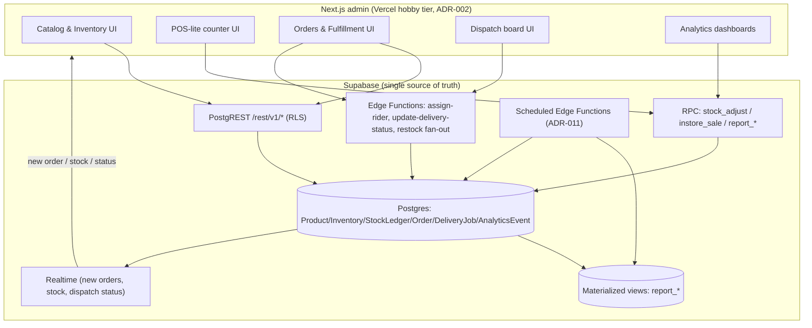
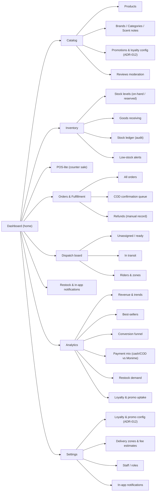
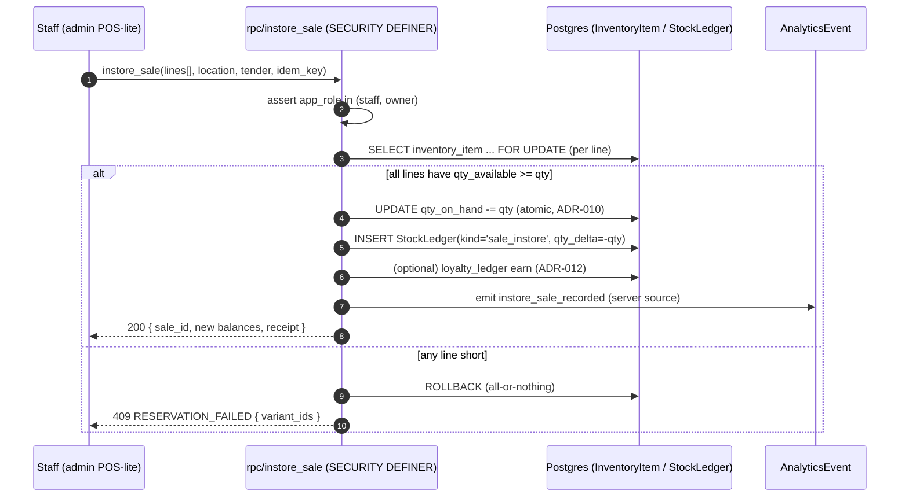
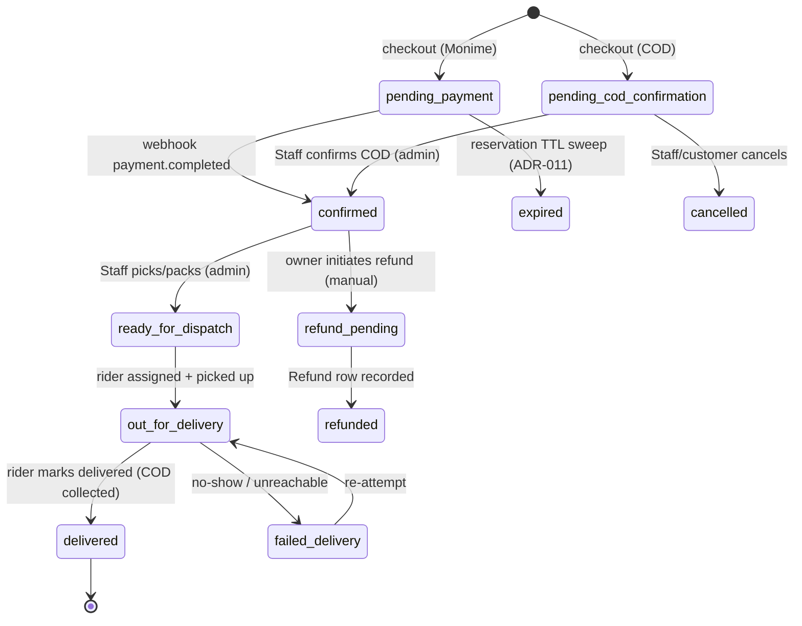
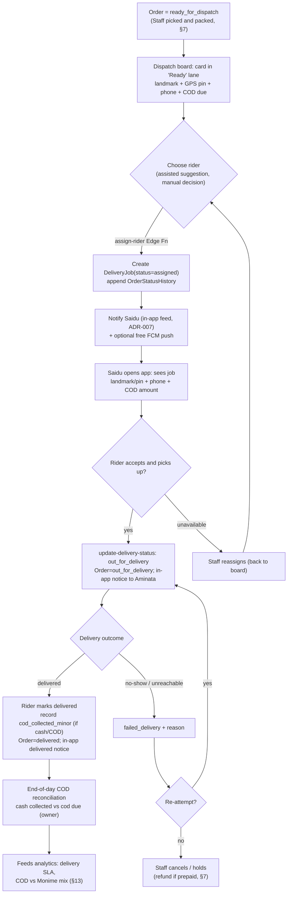
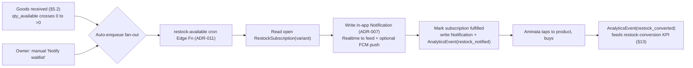
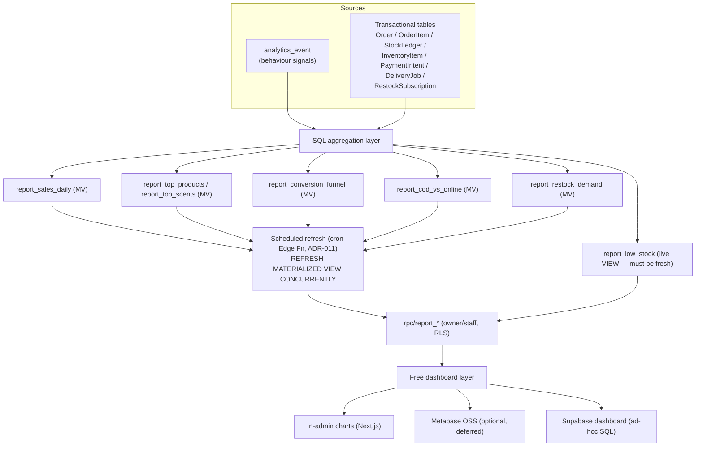
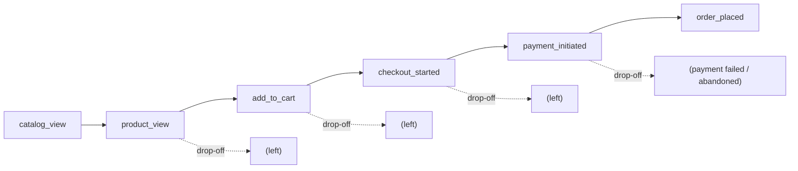

# 10 — Admin & Analytics

> One-line purpose: Specify the owner-facing admin surface (Next.js web app, ADR-002) — catalog/inventory CRUD, POS-lite in-store sales, order + fulfillment management, rider dispatch, and restock-notification triggers — and the in-house analytics design (AnalyticsEvent taxonomy, dashboards/metrics, and the events → Postgres → materialized-views → free-dashboard pipeline), with every metric traced back to the PRD KPIs.
>
> Part of the Borteh Sprays 001 planning set. See 00-index.md for the full set.

---

## 0. How to read this document

This deliverable is **research-and-design only** (per canon): screens are described at **wireframe-level bullet lists**, decisions trace to ADRs, and anything executable is a **schema/DDL sketch, interface definition, or pseudocode** — never production code.

It has two halves:

- **Part A — the Admin surface** (`§1`–`§9`): what Mr. Borteh and Staff see and do in the Next.js web admin (ADR-002), which doubles as a lightweight in-store **POS** so Postgres is the single inventory truth for counter *and* online from day one (ADR-010).
- **Part B — Analytics** (`§10`–`§16`): the `AnalyticsEvent` taxonomy, the dashboards/metrics, the data pipeline, SQL sketches, and the KPI traceability that closes the loop back to `03-prd.md` and `01-executive-summary.md`.

Confidence labels (same vocabulary as `07-api-design.md`):

- **Fact** — locked by canon/ADR, or verified from the Monime integration / Supabase docs.
- **Validated assumption** — a design choice we are confident in; should be load/usability-tested before launch.
- **Unverified assumption (confidence: High/Medium/Low)** — needs validation; carries the words "assumption to verify".
- **BLOCKED ON MONIME DOCS** — cannot be finalized without official Monime documentation/support.
- **OWNER INPUT NEEDED** — a business decision only Mr. Borteh can make.

### 0.1 Traceability at a glance

| Admin / analytics area | Primary persona | Goal served | ADR(s) | API surface (`07`) |
|---|---|---|---|---|
| Catalog CRUD (Brand→Variant→Image) | Mr. Borteh | A browsable, trustworthy online catalog | ADR-002, ADR-005 | PostgREST CRUD behind RLS |
| Inventory + goods receiving | Mr. Borteh, Staff | One stock truth, no oversell | ADR-010 | `rpc/stock_adjust` (`07 §12.1`) |
| POS-lite in-store sale | Staff, Mr. Borteh | Counter sales decrement the *same* ledger | ADR-010 | `rpc/instore_sale` (`07 §1.1`) |
| Orders & fulfillment | Mr. Borteh, Staff | Confirm, pick/pack, refund, track | ADR-006, ADR-008 | PostgREST + status RPCs |
| Rider dispatch | Mr. Borteh, Staff → Saidu | Own riders, manual/assisted assignment | ADR-008 | `assign-rider`, `update-delivery-status` (`07 §11.4`) |
| Restock-notification triggers | Mr. Borteh → Aminata | Capture demand on sold-out scents | ADR-007, ADR-011 | restock fan-out cron |
| Analytics ingest + reporting | Mr. Borteh | In-house analytics, zero paid SaaS | ADR-008, ADR-011 | `analytics-ingest`, `rpc/report_*` (`07 §12.2–12.3`) |

> **Fact (ADR-008):** we **BUILD** analytics in-house (an `AnalyticsEvent` table + SQL materialized views + a free dashboard) rather than buying analytics SaaS, and we **BUILD** lightweight dispatch on Supabase rather than buying a logistics platform. Cost-frugality is the hard driver (ADR-002): the admin adds **no committed cost** beyond Supabase + Vercel hobby tier.

---

# PART A — THE ADMIN SURFACE

## 1. What the admin is (and is not)

The admin is a **Next.js web app on Vercel free/hobby tier** (ADR-002). It is the operational cockpit for the whole business and the lightweight POS.

| Property | Decision | Trace |
|---|---|---|
| Framework / host | Next.js (App Router) on Vercel hobby tier; no committed cost | ADR-002 |
| Data access | Supabase JS client → PostgREST (CRUD) + RPCs (atomic stock/reporting) + Edge Functions (dispatch side-effects) | ADR-005, `07` |
| AuthZ boundary | Supabase Auth (**phone number + password**, ADR-004 — no SMS OTP) + **RLS**; `app_role ∈ {owner, staff}` for admin, `rider` uses the app | ADR-004, ADR-005, `07 §3` |
| Money | All amounts integer **minor units (cents) in SLE**; UI formats to "Le" — never floats | ADR-009 |
| Stock writes | **Never** direct table writes — always via `stock_adjust` / `instore_sale` / reservation RPCs | ADR-010, `07 §3.3` |
| Devices | Desktop/laptop primary; must also work on a **mid-range Android browser** at the counter (Mr. Borteh "sometimes uses the app/phone") | canon (devices) |

**It is NOT:** a full ERP, a third-party logistics console, or a paid BI tool. Riders do **not** use the admin — Saidu works the rider role inside the React Native app (ADR-001/ADR-008). The admin is where dispatch is *assigned*; the app is where it is *executed*.

### 1.1 Admin runtime placement



> **Validated assumption (confidence: High):** the admin reads the **same** RLS-protected endpoints as the app, with `owner/staff` policies granting the broader visibility (e.g. all orders, all inventory). No separate "admin database" exists — that would fork the single source of truth (ADR-010).

### 1.2 Role-based access inside the admin (RBAC)

> **Fact (`07 §3`):** role is **server-controlled**, stamped into the JWT as `app_role`, and enforced by **RLS** + RPC role checks — never by hiding a button alone. UI gating below is convenience; the security boundary is the database.

| Capability | Owner (Mr. Borteh) | Staff / Shop Assistant | Notes |
|---|---|---|---|
| Catalog CRUD (Brand…Variant…Image) | yes | edit yes, delete no | Deletes are soft (`is_published=false`) to protect order history |
| Inventory adjust / goods receiving | yes | yes | `rpc/stock_adjust`, role in (`staff`,`owner`) |
| POS-lite in-store sale | yes | yes | `rpc/instore_sale` |
| Orders: view / confirm COD / cancel / refund-record | yes | view+confirm yes, refund no | Refund recording is owner-only (ADR-006) |
| Dispatch: assign rider / reassign | yes | yes | `assign-rider` (staff/owner) |
| Manage riders (`Rider` records) | yes | no | Onboarding/payroll-adjacent |
| Loyalty & promo config (`loyalty_config` / `promo_rule` / tiers & cards) | yes | no | Discount/points policy is owner risk (ADR-012) |
| Analytics dashboards | full | operational subset | Revenue/margin views owner-only (see §13.4) |
| Customer contact & in-app notifications | yes | yes | One-tap call / WhatsApp click-to-chat (§7) + in-app feed (ADR-007) |
| User roles / staff onboarding | yes | no | Owner administers roles |

---

## 2. Admin information architecture (navigation map)



Every screen below names: **Purpose · Persona · Capabilities (wireframe bullets) · Entities · API/RPC · ADR trace**.

---

## 3. Dashboard (home)

- **Purpose:** the 10-second "is the shop healthy?" glance Mr. Borteh opens each morning.
- **Persona:** Mr. Borteh (Owner). Goal: run and grow the business without being technical.
- **Capabilities (wireframe):**
  - Top KPI strip: **Today's revenue (Le)**, orders today, cash/COD vs Monime split, units sold (online + in-store combined).
  - **Action queues** (the "what needs me now" panel): `COD orders awaiting confirmation`, `orders ready to dispatch`, `low-stock variants`, `failed deliveries to re-attempt`, `unread reviews`. Each is a count + deep link.
  - **Live order feed** (Realtime, ADR-003 infra): new online orders appear without refresh; a soft chime/badge for new COD orders.
  - 7-day revenue sparkline and "best-seller this week" tile.
  - Reconciliation banner if the payment reconciliation sweep (ADR-011) flagged unmatched intents (`08-payments-monime.md`).
- **Entities:** `Order`, `InventoryItem`, `Review`, `PaymentIntent`, `DeliveryJob`.
- **API/RPC:** `rpc/report_sales_daily` (today's slice), Realtime subscription on `order`, PostgREST counts for queues.
- **ADR trace:** ADR-002 (admin), ADR-008 (in-house analytics), ADR-011 (sweeps surface here).

> **Validated assumption (confidence: Medium):** the dashboard reads pre-aggregated `report_*` materialized views for trend tiles (cheap, fast) and only hits live tables for the small "today + queues" counts, to keep the page snappy on a counter-side Android browser. Assumption to verify against real data volumes.

---

## 4. Catalog management

References `06-data-model.md` for canonical entities; CRUD is plain **PostgREST behind RLS** (ADR-005) because each is a single-resource, role-gated read/write.

### 4.1 Products

- **Purpose:** create and curate the perfumes Aminata browses.
- **Persona:** Mr. Borteh / Staff. Goal (Aminata's): a trustworthy, complete catalog with honest detail.
- **Capabilities (wireframe):**
  - List view: search + filter by Brand / Category / Gender / published-state; columns = thumbnail, name, brand, #variants, in-stock badge, published toggle.
  - Create/edit `Product`: name, description, **Gender attribute (male/female/unisex)**, `Brand`, `Category`, and `ScentNote` assignments with **top/heart/base position** (`ProductScentNote` join).
  - Manage `ProductVariant` rows: `size_ml`, **`concentration` (EDT/EDP/Parfum)**, `sku`, `barcode`, `price_minor` (entered as Le, stored minor units — ADR-009), per-variant `low_stock_threshold`.
  - Manage `ProductImage`: upload to Supabase Storage; set `position`; auto-generate a **WebP thumbnail** (data-frugality NFR — the app list only pulls the thumbnail, `07 §6.1`).
  - **Publish/unpublish** = soft visibility (`is_published`); deletes are soft to preserve `OrderItem` history.
  - Barcode field doubles as the POS-lite scan key (§6).
- **Entities:** `Brand`, `Category`, `ScentNote`, `Product`, `ProductVariant`, `ProductImage`, `ProductScentNote`, Gender attribute.
- **API/RPC:** PostgREST `POST/PATCH/DELETE` on each table; Storage upload for images.
- **ADR trace:** ADR-002, ADR-005, ADR-009 (price minor units).

> **Validated assumption (confidence: High):** the catalog is **unlimited and must scale** (single store, but no cap on products). The list view uses **keyset pagination** (not OFFSET), **Postgres trigram/full-text search indexes** on product/brand/scent-note, **Supabase Storage CDN** for images, and **lazy WebP thumbnails** with small payloads — so search/browse stays fast as the catalog grows (decision: scale the catalog, not stores).

### 4.2 Brands / Categories / Scent notes

- **Purpose:** maintain the taxonomy that powers filtering/search (`07 §6.2–6.3`).
- **Persona:** Mr. Borteh. Goal (Aminata's): find a scent by brand/note quickly on a weak signal.
- **Capabilities (wireframe):** simple CRUD lists for `Brand`, `Category`, `ScentNote`; merge/rename guarded (renames are safe because the app reads via `api_v1` views, `07 §9`); usage counts so the owner sees "12 products use this note".
- **ADR trace:** ADR-005.

### 4.3 Promo codes & Reviews moderation (supporting)

- **Promotions** (`promo_rule`, ADR-012): owner-editable spend-threshold / scoped discounts are configured in the **Loyalty & promotions configuration** surface (§4.4) and surfaced/applied at checkout (`07 §7.1`). Owner-only (RBAC §1.2).
- **Reviews moderation** (`Review`): queue of submitted reviews; flag/hide abusive text; **`verified_purchase` is set by the server** at creation (`07 §11.3`), not editable here — protecting the trust signal. Owner/staff can hide, not fabricate.
- **ADR trace:** ADR-005; trust context per canon.

### 4.4 Loyalty & promotions configuration (owner-editable, ADR-012)

- **Purpose:** let Mr. Borteh tune loyalty and promotions **with no code change** — every threshold, rate, discount type/value, and tier/card rule is owner-edited in the admin and applied at checkout by evaluating the active rules.
- **Persona:** Mr. Borteh (Owner). Goal: reward repeat buyers and run spend-based promos on his own terms. Owner-only (RBAC §1.2).
- **Capabilities (wireframe):**
  - **Loyalty config** (`loyalty_config`, singleton): `points_per_currency_unit` (earn rate), `point_value_minor` (redemption value), `points_expiry_days`, and per-feature on/off flags.
  - **Promo rules** (`promo_rule`, many): `rule_type` (`order_spend_threshold_discount` | `points_earn` | `loyalty_card_grant` | …), `threshold_minor`, `discount_type` (`percent` | `fixed`), `discount_value`, `scope` (`all` | `category` | `brand` | `product`), `active_from`/`active_to`, and usage caps. Example: spend ≥ Le X in an order → Y% or Le Z off.
  - **Tiers / cards** (`loyalty_tier` / `loyalty_card`): `cumulative_spend_threshold_minor` → grants a card/tier with an ongoing configurable `discount_percent`. Example: lifetime spend ≥ Le X → a loyalty card giving Y% off future orders.
  - **Per-user state** (read-only here): `loyalty_account` (`points_balance`, `lifetime_spend_minor`, current tier/card) and the `loyalty_ledger` (points earned/redeemed entries).
  - **Preview + guardrails:** show how a sample order prices under the active rules; warn on overlapping/stacking rules before activation.
- **Entities:** `loyalty_config`, `promo_rule`, `loyalty_tier`, `loyalty_card`, `loyalty_account`, `loyalty_ledger`, `ProductVariant`, `Order`.
- **API/RPC:** PostgREST CRUD (owner RLS) on the config tables; checkout evaluates the active `promo_rule`(s) + the user's tier/card discount per `loyalty_config` (`07`).
- **ADR trace:** ADR-012 (configurable loyalty/promotions), ADR-009 (minor units), ADR-005 (RLS CRUD).

---

## 5. Inventory management

This is the spine of the single-source-of-truth bet (ADR-010). **All** mutations append to the **`StockLedger`** and update the simple per-variant **`InventoryItem`** balance (`qty_on_hand` / `qty_reserved`) via RPC — direct writes are revoked (`07 §3.3`). (Single store: the location dimension is **deferred**; multi-store is revisited only on a future trigger.)

### 5.1 Stock levels

- **Purpose:** see and correct on-hand vs reserved stock per variant (single store; multi-store deferred).
- **Persona:** Mr. Borteh / Staff. Goal: never promise stock the shop does not have.
- **Capabilities (wireframe):**
  - List: variant (SKU · product · size · concentration) showing `qty_on_hand`, `qty_reserved`, derived **`qty_available = qty_on_hand − qty_reserved`**, and the per-variant threshold. **Keyset-paginated + searchable** so it scales with an unlimited catalog.
  - Filter to "low or out", "has reservations", "dead stock (no sale in N days)".
  - Inline **adjust** action → opens the goods-receiving / adjustment drawer (§5.2).
- **Entities:** `InventoryItem`, `ProductVariant`.
- **API/RPC:** PostgREST read of `inventory_item`; mutations via `rpc/stock_adjust`.
- **ADR trace:** ADR-010.

### 5.2 Goods receiving & adjustments

- **Purpose:** record incoming supplier stock and corrections.
- **Persona:** Mr. Borteh / Staff.
- **Capabilities (wireframe):**
  - "Receive delivery" form: pick variant (by search **or barcode scan**), qty (+), reason/reference (e.g. supplier invoice no.), optional unit cost (for margin analytics, §13.4).
  - "Adjust / write-off" form: signed delta, reason (`adjustment`); the RPC **refuses to drive `qty_on_hand` negative** (`07 §12.1`).
  - Every submit is **idempotent** via a client-generated key (safe retry over flaky counter Wi-Fi, `07 §10`).
- **API/RPC:** `rpc/stock_adjust` with `p_kind ∈ {purchase, adjustment, release}` (ADR-010 ledger kinds).
- **ADR trace:** ADR-010, ADR-009 (unit cost minor units).

### 5.3 Stock ledger (audit)

- **Purpose:** the append-only truth trail behind every balance — answers "where did this number come from?".
- **Persona:** Mr. Borteh (trust/accountability), Staff.
- **Capabilities (wireframe):** filterable, read-only timeline of `StockLedger` movements (`purchase / sale_online / sale_instore / adjustment / reservation / release`) with actor, qty_delta, timestamp, and link to the source `Order`/sale. Export to CSV (free, client-side) for the owner's records.
- **Entities:** `StockLedger`.
- **ADR trace:** ADR-010 (append-only ledger is the design).

### 5.4 Low-stock alerts (screen + trigger)

- **Purpose:** tell Mr. Borteh what to reorder *before* it sells out, weighted by demand.
- **Persona:** Mr. Borteh. Goal: keep best-sellers in stock; capture demand on the rest.
- **Capabilities (wireframe):**
  - List of variants at/under threshold, sorted by **urgency = how fast it's selling (velocity) × how many shoppers are waiting (`RestockSubscription` count)**.
  - "Days of cover" estimate from trailing sales velocity (SQL in §14.2).
  - One-click → goods-receiving (§5.2) when restocked, which **fires the restock fan-out** (§8).
- **Trigger:** a **scheduled low-stock alerting Edge Function** (cron, ADR-011) writes/refreshes the `report_low_stock` view and raises an **in-admin / in-app alert** (no SMS/WhatsApp API, ADR-007) to the owner when a variant crosses its threshold.
- **API/RPC:** `rpc/report_low_stock`; cron fan-out (ADR-011).
- **ADR trace:** ADR-010, ADR-011, ADR-007.

---

## 6. POS-lite — in-store sale entry

> **Fact (canon + ADR-010):** the admin **doubles as a lightweight in-store POS** so Postgres inventory is the single source of truth for in-store *and* online stock from day one. A counter sale and an online sale decrement the **same** `InventoryItem` and write the **same** `StockLedger` — just with different `kind` (`sale_instore` vs `sale_online`).

- **Purpose:** record a face-to-face counter sale fast, so the digital ledger always matches the shelf.
- **Persona:** Staff / Shop Assistant (primary), Mr. Borteh. Goal: 100% of in-store sales flow through one ledger (the 6-month "inventory truth" signal, `01 §6mo`).
- **Capabilities (wireframe):**
  - **Fast add line:** barcode scan (phone camera / USB scanner) or type-ahead by SKU/name → adds a `ProductVariant` line; qty stepper; running total in **Le**.
  - Live **availability guard**: each line shows `qty_available`; the screen warns if the counter is selling the last units that are also reserved online.
  - Optional walk-in customer link (phone lookup → existing `User`) to credit **loyalty** (`loyalty_account`, ADR-012) — otherwise an anonymous sale.
  - Payment tender: **Cash** (default at counter), or **mobile money received in person** (recorded as a tender label for the books) — this is *not* a Monime online flow.
  - **Commit** → calls `rpc/instore_sale` atomically; on success prints/shows a simple receipt and clears the cart. (No SMS receipt — printed/on-screen only.)
  - Held/parked sale (resume later) for a busy counter.
- **Entities:** `ProductVariant`, `InventoryItem`, `StockLedger (kind='sale_instore')`, optional `User`, `loyalty_ledger`, `AnalyticsEvent`.
- **API/RPC:** `rpc/instore_sale` (`SECURITY DEFINER`, role in `staff/owner`) — atomic decrement, **no online reservation step** (it is an immediate sale, `07 §1.1`).
- **ADR trace:** ADR-010 (oversell-safe shared ledger), ADR-009 (minor units), ADR-012 (optional loyalty earn), ADR-008 (emits `instore_sale_recorded` analytics).

### 6.1 POS-lite commit flow (oversell-safe, shared ledger)



> **Why this matters:** because the counter and the website share one `InventoryItem` row under `SELECT … FOR UPDATE` (ADR-010), a customer cannot buy online the last bottle that Staff is simultaneously selling at the counter. This is the concrete payoff of "one truth from day one."

> **OWNER INPUT NEEDED:** the exact **in-store tender labels** Mr. Borteh wants on the books (cash, Orange Money in person, Africell Money in person) and whether in-person mobile money should ever route through Monime (default: no — Monime is for *online* checkout only, ADR-006).

---

## 7. Orders & fulfillment management

- **Purpose:** the operational console for the online order lifecycle from payment to doorstep.
- **Persona:** Mr. Borteh / Staff. Goal (Aminata's): transparency and a delivered order; Goal (owner's): fraud-resistant fulfillment.
- **Capabilities (wireframe):**
  - **All-orders list:** filter by status, payment method (cash/COD vs Monime), zone, date; columns = short code, customer, total (Le), method, status, age, zone.
  - **Order detail:** items (snapshotted prices), totals (subtotal / **delivery fee set per order** / discount / total — all minor units; `delivery_fee_minor` is **nullable until the owner confirms it**), `DeliveryLocation` (landmark text + GPS pin + contact phone), `OrderStatusHistory` timeline, linked `PaymentIntent`/`PaymentWebhook` status (`08-payments-monime.md`), and the `DeliveryJob`.
  - **COD confirmation queue:** COD orders sit in `pending_cod_confirmation` until Staff confirms (phone-call verification, anti-fraud) → moves to `confirmed`, holding the reservation (`07 §7.1`).
  - **Pick & pack:** `confirmed → ready_for_dispatch` once Staff has the bottle(s) in hand.
  - **Cancel / fail** transitions with reason capture (appends `OrderStatusHistory`).
  - **Refunds (manual):** owner records a `Refund` row after performing the refund **manually in the Monime dashboard** — see blocked note below.
  - **Set delivery fee (per order):** the `DeliveryZone` estimate is shown as a **guide only**; the owner sets/confirms the binding `order.delivery_fee_minor` per order (agreed on the call / at confirmation). Checkout never hard-charges a computed zone fee (ADR-006).
  - **Cash handling (cash is first-class, alongside Monime):** cash-on-delivery and cash-at-pickup are recorded explicitly — COD cash is recorded by the rider on delivery (§8); pickup cash is taken via POS-lite (§6). The order screen shows amount **due vs collected** for end-of-day reconciliation.
  - **Contact customer:** one-tap **CALL** (`tel:<phone>`) and **WhatsApp** (`https://wa.me/<number>?text=...` click-to-chat) deep links using `contact_phone` — **no API, no cost** (ADR-007), reinforcing trust.
- **Entities:** `Order`, `OrderItem`, `OrderStatusHistory`, `PaymentIntent`, `PaymentWebhook`, `Refund`, `DeliveryLocation`, `DeliveryZone`, `DeliveryJob`.
- **API/RPC:** PostgREST reads (owner/staff RLS), status-transition Edge Functions/RPCs (`07 §11`), `assign-rider` (§8).
- **ADR trace:** ADR-006 (payments + manual refunds), ADR-008 (dispatch), ADR-011 (reconciliation feeds status).

### 7.1 Order status machine (the contract admin shares with app + dispatch)

This mirrors `07 §11.1` — reproduced so fulfillment actions map cleanly to buttons.



> **BLOCKED ON MONIME DOCS (ADR-006):** there is **no Monime refund API as of 2026-05**. The admin's "refund" action is a **workflow aid**: it (a) reminds the owner to refund manually in the Monime dashboard, then (b) records a `Refund` row for our books and analytics. There is also **no confirmed refund/chargeback webhook**, so refund reconciliation is manual. Tracked in `08-payments-monime.md` and `12-risks-assumptions.md`.

---

## 8. Rider dispatch

> **Fact (ADR-008):** we **BUILD** lightweight in-house dispatch on Supabase with the store's **own riders** and **manual/assisted assignment** — not third-party couriers. Saidu executes jobs in the app; the owner/staff *assign* them here.

- **Purpose:** turn `ready_for_dispatch` orders into `DeliveryJob`s on a rider and track them to the door.
- **Personas:** Mr. Borteh / Staff (assign, track) → Saidu (execute, collect COD). Goal: ≥90% delivered within quoted zone ETA (`01 §6mo`).
- **Capabilities (wireframe):**
  - **Dispatch board** with three lanes: **Ready/unassigned**, **In transit**, **Done/failed** (Kanban-style, Realtime-updated).
  - Each ready order card shows: customer, **landmark text + GPS pin (mini-map)**, contact phone, `DeliveryZone` + **fee estimate** (actual fee set per order, §7), COD/cash amount due (or "PAID — Monime"), and item count.
  - **Assisted assignment:** suggest riders whose current load/zone fits (assist), but the human makes the call (manual) — `assign-rider` creates the `DeliveryJob` and notifies Saidu **in-app** (ADR-007).
  - **Reassign / unassign** if a rider is unavailable; **batch-assign** several same-zone orders to one rider.
  - **Track status:** live `DeliveryJob.status`; failed-delivery cards surface a re-attempt action.
  - **COD reconciliation:** when Saidu marks delivered with `cod_collected_minor`, the board flags cash owed vs collected for end-of-day owner reconciliation.
  - **Riders & zones tabs:** manage `Rider` records; manage `DeliveryZone` (named region, **`estimated_fee_minor` / fee-estimate text**, `eta_text`) — the zone fee is an **estimate/guide only**; the binding fee is set per order (§7).
- **Entities:** `Order`, `DeliveryJob (status, cod_collected_minor)`, `Rider`, `DeliveryZone`, `DeliveryLocation`, `OrderStatusHistory`, `Notification`.
- **API/RPC:** `assign-rider` (staff/owner Edge Function), `update-delivery-status` (rider via app), Realtime on `delivery_job` (`07 §11.4`).
- **ADR trace:** ADR-008 (own-rider dispatch), ADR-007 (in-app notifications), ADR-009 (`cod_collected_minor` minor units).

> **Fact (rider = simple):** the rider experience is deliberately minimal — an **assigned-orders list** with order items + drop-off details (`landmark_text`, GPS pin, contact phone) and actions to **mark picked-up / delivered** and **record cash collected**. There is **no live GPS tracking** of the rider (removed; revisit only in the far future).

### 8.1 Dispatch flow (required diagram)



> **Validated assumption (confidence: Medium):** assignment is **manual/assisted, not auto-routed** (ADR-008) — at Borteh's scale a human dispatcher beats a routing engine, and it costs nothing. Auto-suggestion ("nearest idle rider in zone") is a cheap heuristic, not a routing optimizer. Revisit only if order volume makes manual dispatch the bottleneck (`13-roadmap.md`).

> **OWNER INPUT NEEDED:** the real **delivery zones, fee estimates (Le), and ETAs** (the binding fee is set per order, §7), plus the **per-order COD/cash exposure cap** (above which an order needs extra verification before dispatch). These calibrate both the dispatch board and the fraud posture (`01`, `09-security-threat-model.md`).

---

## 9. Restock & notification triggers

- **Purpose:** convert "out of stock" from a dead-end into captured demand, and let the owner manage the comms that build trust.
- **Personas:** Mr. Borteh (configure) → Aminata (receives an **in-app** restock notification). Goal: ≥20% of `RestockSubscription` notifications convert to an order (`01 §12mo`).
- **Capabilities (wireframe):**
  - **Restock demand view:** per out-of-stock variant, the count of open `RestockSubscription`s — i.e. "47 people are waiting for Oud Royale 50ml EDP." Sortable; this is the demand signal feeding low-stock urgency (§5.4).
  - **Restock trigger:** receiving stock (§5.2) that crosses 0→available **automatically enqueues** the restock fan-out (no manual step needed); the owner can also **manually fire** a fan-out for a variant.
  - **In-app notification feed:** order-status and restock-available notifications are delivered to the customer's **in-app feed** via **Supabase Realtime + a `notification` table** — free, with **no SMS / WhatsApp / Meta API** (ADR-007).
  - **Broadcast (light marketing):** opt-in, `NotificationPreference`-respecting **in-app announcement** for a new arrival or promo — consent-gated. (Bulk SMS/WhatsApp API is out of scope; for one-off outreach the owner uses the click-to-chat WhatsApp deep link, §7.)
  - **Delivery log:** per `Notification`, in-feed status (created / read) for transparency and debugging.
  - **In-app messaging inbox (DEFERRABLE v1.5):** an optional customer ↔ store chat built on Supabase (`conversation` + `message` tables + Realtime) — Should/Could, not required for v1.
- **Entities:** `RestockSubscription`, `Notification`, `NotificationPreference`, `InventoryItem`, `ProductVariant`.
- **API/RPC:** restock-available fan-out **cron Edge Function** (ADR-011) reads `RestockSubscription`, **writes an in-app `Notification` row (Supabase Realtime delivers it to the feed)**, marks fulfilled.
- **ADR trace:** ADR-011 (fan-out + low-stock jobs), ADR-007 (in-app notification feed), ADR-010 (stock event is the trigger).

### 9.1 Restock trigger flow



> **Open question (carry to `12-risks-assumptions.md`):** in-app notifications require the customer to **open the app** to see the feed; an **optional free Expo/FCM push** (Could, deferred) would surface restock/order-status alerts without opening the app — adoption to verify. No SMS / WhatsApp / Meta API dependency remains (cost-driven decision).

---

# PART B — ANALYTICS

## 10. Analytics design principles

> **Fact (ADR-008):** analytics is **built in-house** — an append-only **`AnalyticsEvent`** table + SQL **materialized views** + a **free dashboard** (in-admin charts and/or Metabase OSS / Supabase) — *not* a paid analytics SaaS. No committed cost beyond Supabase (ADR-002).

Design principles, each tied to canon:

| Principle | Why | Trace |
|---|---|---|
| **Server holds the truth; client events are signals** | Revenue/stock come from `Order`/`StockLedger`, never from client-fired events; client events explain *behaviour* (funnel, browse), not *money* | ADR-008, ADR-010 |
| **Batch + buffer events on device** | Protect the `< ~1 MB` session data budget on 2G/3G; flush opportunistically | canon NFR, ADR-003, `07 §12.2` |
| **Idempotent ingest** | A batch may be re-sent after a dropout or retry; dedup on `client_event_id` | ADR-003, `07 §10` |
| **Pre-aggregate, don't scan live** | Materialized views keep dashboards cheap and fast at small scale | ADR-008 |
| **Minor units everywhere; no PII in props** | Money exact (ADR-009); ingest **drops PII** server-side | ADR-009, `09-security-threat-model.md` |
| **Two sources, reconciled** | `AnalyticsEvent` (behaviour) + transactional tables (outcomes) join on `order_id`/`user_id` for funnels | ADR-008 |

---

## 11. AnalyticsEvent taxonomy

### 11.1 Event envelope (every event)

The `AnalyticsEvent` table (canonical entity) is append-only; the **envelope** is common, the **`props`** vary by event. DDL sketch (not production):

```sql
-- DDL SKETCH (ADR-008). Append-only; never UPDATE.
CREATE TABLE analytics_event (
  id              bigint GENERATED ALWAYS AS IDENTITY PRIMARY KEY,
  client_event_id uuid        NOT NULL,           -- dedup key for offline replay (07 §10)
  name            text        NOT NULL,           -- from the taxonomy below
  occurred_at     timestamptz NOT NULL,           -- CLIENT time (when it happened)
  received_at     timestamptz NOT NULL DEFAULT now(), -- SERVER time (trustworthy)
  source          text        NOT NULL,           -- 'app' | 'admin' | 'server'
  user_id         uuid        NULL REFERENCES "user"(id),   -- null for anonymous
  anon_id         text        NULL,               -- stable per-device id (pre-login)
  session_id      text        NULL,
  client          text        NULL,               -- 'app@1.4.0' / 'admin@1.1.0' (07 §2.2)
  platform        text        NULL,               -- 'android' | 'ios' | 'web'
  network_type    text        NULL,               -- '2g' | '3g' | '4g' | 'wifi' (market signal)
  props           jsonb       NOT NULL DEFAULT '{}',
  UNIQUE (client_event_id)                          -- idempotent ingest
);
-- Hot-path indexes for the views:
CREATE INDEX ON analytics_event (name, received_at);
CREATE INDEX ON analytics_event (user_id, received_at);
CREATE INDEX ON analytics_event USING gin (props);
```

> **Validated assumption (confidence: High):** `occurred_at` (client) and `received_at` (server) are kept **separate** — devices on poor connectivity flush late, so trend/time-bucketing uses `received_at` for revenue-adjacent integrity but can use `occurred_at` for genuine behaviour timing. Assumption to verify in tuning.

### 11.2 Event catalogue (names + properties)

> Naming convention: `snake_case`, `object_action`. **Money in `props` is minor units** (ADR-009). `source` shows whether the app, admin, or server emits it.

| Event name | Source | Key `props` | Funnel/metric it feeds |
|---|---|---|---|
| `session_start` | app | `network_type`, `cold_start_ms` | Engagement, perf budget (`01`) |
| `catalog_view` | app | `filter`, `sort`, `result_count` | Funnel: top of funnel |
| `product_view` | app | `product_id`, `from` (`list`/`search`/`wishlist`) | Funnel; product interest; best-seller demand |
| `search_performed` | app | `query_len`, `result_count`, `had_results` (bool) | Search quality; demand gaps |
| `filter_applied` | app | `brand_id?`, `gender?`, `scent_note_id?`, `price_band?` | Merchandising insight |
| `wishlist_add` / `wishlist_remove` | app | `product_id` | Latent demand |
| `add_to_cart` | app | `variant_id`, `qty`, `price_minor` | Funnel: intent |
| `remove_from_cart` | app | `variant_id` | Cart abandonment insight |
| `checkout_started` | app | `cart_value_minor`, `item_count` | Funnel: checkout entry |
| `delivery_info_entered` | app | `zone_id`, `has_gps` (bool) | Funnel; zone demand |
| `payment_method_selected` | app | `method` (`monime`/`cod`/`cash`) | **cash/COD vs Monime mix (intent)** |
| `payment_initiated` | app/server | `intent_id`, `method`, `amount_minor` | Funnel; payment success rate |
| `payment_succeeded` | **server** (webhook) | `intent_id`, `order_id`, `amount_minor` | Funnel close; revenue corroboration |
| `payment_failed` / `checkout_abandoned` | app/server | `intent_id?`, `reason?`, `last_step` | Funnel leak analysis |
| `order_placed` | **server** | `order_id`, `method`, `total_minor`, `zone_id` | Revenue, conversion |
| `order_confirmed` | **server** | `order_id`, `method` | Fulfillment start; COD confirm rate |
| `order_out_for_delivery` | **server** | `order_id`, `rider_id`, `zone_id` | Delivery SLA |
| `order_delivered` | **server** | `order_id`, `eta_met` (bool), `cod_collected_minor?` | **Delivery reliability KPI**; COD realized |
| `order_cancelled` / `order_expired` | **server** | `order_id`, `at_status` | Leakage, reservation tuning |
| `instore_sale_recorded` | **server** | `sale_id`, `total_minor` | In-store revenue; inventory truth |
| `stock_adjusted` | **server** | `variant_id`, `kind`, `qty_delta` | Ops audit; velocity inputs |
| `restock_subscribed` | app | `variant_id` | **Restock demand** |
| `restock_notified` | **server** (cron) | `variant_id`, `subscriber_count` | Restock fan-out volume |
| `restock_converted` | **server** | `variant_id`, `order_id` | **Restock-conversion KPI** |
| `review_submitted` | app | `product_id`, `rating`, `verified_purchase` | Trust content coverage |
| `notification_created` / `notification_read` | **server/app** | `type` (`order_status`/`restock`), `status` | In-app feed reliability |
| `loyalty_earned` / `loyalty_redeemed` | **server** | `points`, `order_id?` | Loyalty engagement (ADR-012) |
| `promo_applied` | **server** | `promo_rule_id`, `discount_minor`, `order_id` | Promotion uptake / effectiveness (ADR-012) |
| `events_flushed` | app | `batch_size`, `flush_ms` | Analytics flush / cache health (ADR-003) |
| `app_error` | app | `code`, `screen` | Stability |

> **Fact / privacy (`09-security-threat-model.md`):** the `analytics-ingest` Edge Function **strips PII** — no raw phone numbers, names, landmark text, or GPS pins land in `props`. Identity is by opaque `user_id`/`anon_id`. Money is minor units. This keeps the analytics store low-risk under SL data-protection considerations (flag-to-verify-with-counsel, per canon).

### 11.3 Ingest path (recap from `07 §12.2`)

```mermaid
graph LR
  subgraph Device["App (Aminata / Saidu)"]
    UI["User action"] --> BUF[("SQLite event buffer")]
    BUF --> FL["Flush in batches on connectivity"]
  end
  ADMINSRC["Admin / server actions (POS, dispatch, webhook, cron)"] --> SRVE["server-emitted events"]
  FL -->|POST analytics-ingest (batch)| EF["Edge Fn: validate, drop PII, dedup on client_event_id"]
  SRVE --> EF
  EF --> AE[("analytics_event (append-only)")]
  AE --> MV[("report_* materialized views")]
  MV --> DASH["Dashboards (in-admin / Metabase OSS / Supabase)"]
```

---

## 12. Data pipeline: events to Postgres to materialized views to dashboard



### 12.1 Why materialized views (and where NOT to use them)

| Aspect | Decision | Trace |
|---|---|---|
| Heavy aggregates (revenue, best-sellers, funnel, mix) | **Materialized views**, refreshed by cron — cheap reads, no live scans | ADR-008 |
| Refresh mechanism | `REFRESH MATERIALIZED VIEW CONCURRENTLY` (needs a `UNIQUE` index) so dashboards never block | Fact (Postgres) |
| Refresh cadence | Daily/hourly per view (§12.2); near-real-time tiles read live | ADR-011 |
| **Low-stock** | A **live (non-materialized) view** — staleness would cause oversell decisions; it must reflect current `InventoryItem` | ADR-010 |
| "Today + queues" | Live counts on indexed tables (small) | — |

### 12.2 Refresh schedule (cron Edge Functions, ADR-011)

| View | Cadence (assumption to verify, confidence: Medium) | Rationale |
|---|---|---|
| `report_sales_daily` | hourly (today) + nightly (full backfill) | Owner watches today; history rarely changes |
| `report_top_products` / `report_top_scents` | nightly | Best-sellers move slowly |
| `report_conversion_funnel` | every 1–3 h | Behavioural, tolerant of lag |
| `report_cod_vs_online` | hourly | Tracks the trust-shift signal |
| `report_restock_demand` | on stock change + hourly | Drives restock urgency |
| `report_low_stock` | **live view, no refresh** | Must be current (ADR-010) |

> **Validated assumption (confidence: High):** the same cron infrastructure already specified in ADR-011 (reconciliation, reservation-expiry, restock fan-out, low-stock alerting) hosts these refresh jobs — **no new service, no new cost** (ADR-002, ADR-008).

### 12.3 Dashboard tooling — trade-off (cost-frugality driver)

| Option | Cost | Pros | Cons | Verdict |
|---|---|---|---|---|
| **In-admin charts (Next.js, `rpc/report_*`)** | **Free** (already on Vercel hobby) | Zero extra infra; owner sees it in the tool he already uses; mobile-friendly at the counter | We build the charts; less ad-hoc flexibility | **v1 default** |
| **Metabase OSS** (self-host) | Free software, **but needs a host** | Powerful ad-hoc exploration, no SQL needed for the owner | A host has cost/ops; violates "free-tier only" unless run locally / on a free VM | **Deferred / optional** (ADR-008 names it as an option) |
| **Supabase dashboard / SQL editor** | Free (included) | Zero setup for *our* ad-hoc SQL | Not owner-facing; engineer tool | **Internal use** |

> **Decision (Validated assumption, confidence: High):** v1 ships **in-admin charts** powered by the `rpc/report_*` reads (no committed cost, ADR-002). **Metabase OSS is documented as the optional power-analysis path** (ADR-008) and deferred until/unless it can run on a genuinely free host. This keeps the frugality bet intact.

---

## 13. Dashboards & metrics catalogue

Each dashboard names: **metric · source · KPI it serves (`03`/`01`) · the report it reads**.

### 13.1 Revenue & trends

- **Metrics:** revenue today / 7d / 30d (Le); orders count; **online vs in-store** split; average order value (AOV); day-over-day and week-over-week trend lines.
- **Source:** `Order` + `OrderItem` (online), `instore_sale_recorded` + `StockLedger(sale_instore)` (counter) → `report_sales_daily`.
- **KPI served:** "online order share ≥15% (6mo) / ≥30% (12mo)", cost-discipline context (`01`).
- **Revenue-recognition note — OWNER INPUT NEEDED:** recognize online revenue at `confirmed` (paid) and COD revenue at `delivered` (cash in hand)? Default in §14.1 SQL = paid/confirmed for Monime, delivered for COD. Owner to confirm.

### 13.2 Best-sellers

- **Metrics:** top variants/products by **units** and by **revenue (Le)** over a window; top **scent notes** by demand (joins `ProductScentNote`); "rising" (trend vs prior window); dead stock (no sale in N days).
- **Source:** `OrderItem` (+ `StockLedger` sales) → `report_top_products`, `report_top_scents`.
- **KPI served:** merchandising/restock decisions; feeds low-stock urgency (§5.4).

> **Naming note:** `07 §12.3` lists `report_top_scents`; this doc **adds** `report_top_products` (variant/product best-sellers) as a complement. Additive, not a contradiction — `07` and `10` should stay in sync on the `report_*` set.

### 13.3 Conversion funnel

- **Metrics:** `catalog_view → product_view → add_to_cart → checkout_started → payment_initiated → order_placed`, with step-to-step conversion %, drop-off, and a split by payment method and by `network_type` (does 2G hurt conversion?).
- **Source:** `analytics_event` (behaviour) joined to `Order` (outcome) → `report_conversion_funnel`.
- **KPI served:** checkout success ≥90% (`01 §6mo`); diagnoses where Aminata abandons.



### 13.4 Payment mix — cash/COD vs Monime

- **Metrics:** count + value share of **cash (COD + in-store) vs Monime** orders; **mobile-money share trend** (the trust-shift signal); cash/COD **collection rate** (`cod_collected_minor` vs amount due); Monime checkout success rate (intents succeeded / initiated, from `08`).
- **Source:** `Order.payment_method`, `PaymentIntent`, `DeliveryJob.cod_collected_minor` → `report_cod_vs_online`.
- **KPI served:** "mobile-money share trending up" (6mo) and "mobile money ≥ COD" (12mo) (`01`).

### 13.5 Low-stock & restock demand

- **Metrics:** variants at/under threshold with **days-of-cover**; per-variant **waiting-subscriber count**; restock **fan-out → conversion** funnel (`restock_subscribed → restock_notified → restock_converted`).
- **Source:** `report_low_stock` (live) + `RestockSubscription` + restock events → `report_restock_demand`.
- **KPI served:** restock conversion ≥20% (12mo) (`01`); keeps best-sellers in stock.

### 13.6 Operations / delivery

- **Metrics:** orders by status (aging); **delivery SLA** = % delivered within zone `eta_text`; failed-delivery rate + reasons; rider load/throughput; reservation-expiry rate (oversell-tuning signal).
- **Source:** `OrderStatusHistory`, `DeliveryJob`, `DeliveryZone`.
- **KPI served:** delivery reliability ≥90% (`01 §6mo`).

> **Margin/cost view (owner-only):** if the owner enters unit cost at goods-receiving (§5.2), a gross-margin view becomes possible. Marked **Unverified assumption (confidence: Low)** — depends on the owner consistently recording cost; otherwise revenue-only.

### 13.7 Loyalty & promotions (ADR-012)

- **Metrics:** points **earned vs redeemed** and outstanding liability (≈ `points_balance × point_value_minor`); **promo uptake** (orders with a `promo_rule` applied + Le discount given); **tier/card holders** and their share of revenue; repeat-rate lift among loyalty members vs non-members.
- **Source:** `loyalty_ledger`, `loyalty_account`, `promo_applied` events, `Order` → loyalty rollup.
- **KPI served:** loyalty engagement ≥25% (`01`); measures whether the owner-configured promos/tiers (ADR-012) actually move repeat purchase.

---

## 14. SQL sketches (required)

> **Sketches, not production** (canon). All money is integer minor units (ADR-009). Statuses/kinds match `06-data-model.md` / ADR-010. Each needs index review + an EXPLAIN pass before launch.

### 14.1 Daily revenue (`report_sales_daily`)

```sql
-- DDL SKETCH: combined online + in-store daily revenue, cash/COD vs Monime split.
-- Revenue recognition: Monime at confirmed (paid); COD at delivered (cash collected).
-- (Recognition basis is OWNER INPUT NEEDED — see §13.1.) Single store: no location dimension.
CREATE MATERIALIZED VIEW report_sales_daily AS
WITH online AS (
  SELECT
    date_trunc('day', COALESCE(o.delivered_at, o.confirmed_at))::date AS day,
    o.payment_method,                                                 -- 'monime' | 'cod'
    o.id                                                              AS order_id,
    o.total_minor
  FROM "order" o
  WHERE (o.payment_method = 'monime' AND o.status NOT IN ('pending_payment','expired','cancelled'))
     OR (o.payment_method = 'cod'    AND o.status = 'delivered')
),
instore AS (                                                          -- counter sales from the shared ledger
  SELECT
    date_trunc('day', s.created_at)::date AS day,
    'instore'::text                       AS payment_method,
    s.id                                  AS order_id,
    s.total_minor
  FROM instore_sale s
),
unioned AS (
  SELECT day, payment_method, order_id, total_minor FROM online
  UNION ALL
  SELECT day, payment_method, order_id, total_minor FROM instore
)
SELECT
  day,
  count(DISTINCT order_id)                                              AS orders,
  sum(total_minor)                                                      AS gross_minor,
  sum(total_minor) FILTER (WHERE payment_method = 'cod')               AS cod_minor,
  sum(total_minor) FILTER (WHERE payment_method = 'monime')            AS online_momo_minor,
  sum(total_minor) FILTER (WHERE payment_method = 'instore')           AS instore_cash_minor,
  round(sum(total_minor)::numeric / NULLIF(count(DISTINCT order_id),0)) AS aov_minor
FROM unioned
GROUP BY day;

-- Required for REFRESH ... CONCURRENTLY:
CREATE UNIQUE INDEX ON report_sales_daily (day);
```

### 14.2 Low-stock alert (`report_low_stock` — live view)

```sql
-- DDL SKETCH: LIVE view (no materialization) so it never lags real stock (ADR-010).
-- Urgency = how little is left, how fast it sells, and how many shoppers are waiting.
-- Single store: per-variant balance, no location dimension.
CREATE VIEW report_low_stock AS
WITH velocity AS (                                       -- trailing 14-day sell-through per variant
  SELECT
    variant_id,
    -- ledger sale kinds are negative deltas; flip sign to get units sold
    (-sum(qty_delta) FILTER (WHERE kind IN ('sale_online','sale_instore')))::numeric
      / 14.0                                            AS units_per_day
  FROM stock_ledger
  WHERE created_at >= now() - interval '14 days'
  GROUP BY variant_id
),
waiting AS (
  SELECT variant_id, count(*) AS waiting_subscribers
  FROM restock_subscription
  WHERE fulfilled_at IS NULL
  GROUP BY variant_id
)
SELECT
  ii.variant_id,
  pv.sku,
  p.name                                               AS product_name,
  pv.size_ml,
  pv.concentration,
  ii.qty_on_hand,
  ii.qty_reserved,
  (ii.qty_on_hand - ii.qty_reserved)                   AS qty_available,
  COALESCE(pv.low_stock_threshold, 3)                  AS threshold,
  COALESCE(v.units_per_day, 0)                         AS units_per_day,
  CASE WHEN COALESCE(v.units_per_day,0) > 0
       THEN round((ii.qty_on_hand - ii.qty_reserved) / v.units_per_day, 1)
       ELSE NULL END                                   AS days_of_cover,
  COALESCE(w.waiting_subscribers, 0)                   AS waiting_subscribers
FROM inventory_item ii
JOIN product_variant pv ON pv.id = ii.variant_id
JOIN product         p  ON p.id  = pv.product_id
LEFT JOIN velocity   v  ON v.variant_id = ii.variant_id
LEFT JOIN waiting    w  ON w.variant_id = ii.variant_id
WHERE (ii.qty_on_hand - ii.qty_reserved) <= COALESCE(pv.low_stock_threshold, 3)
ORDER BY
  COALESCE(w.waiting_subscribers,0) DESC,              -- most-wanted first
  days_of_cover ASC NULLS LAST;                         -- then most-urgent cover
```

### 14.3 Best-sellers (`report_top_products`)

```sql
-- DDL SKETCH: best-sellers by units and revenue over a rolling window.
-- Counts only orders that became real revenue (confirmed onward); excludes cancelled/expired.
CREATE MATERIALIZED VIEW report_top_products AS
SELECT
  pv.product_id,
  p.name                                          AS product_name,
  oi.variant_id,
  pv.sku,
  pv.size_ml,
  pv.concentration,
  sum(oi.qty)                                      AS units_sold,
  sum(oi.qty * oi.unit_price_minor)                AS revenue_minor,   -- snapshotted price (minor units)
  count(DISTINCT oi.order_id)                      AS orders,
  max(o.confirmed_at)                              AS last_sold_at
FROM order_item oi
JOIN "order"          o  ON o.id  = oi.order_id
JOIN product_variant  pv ON pv.id = oi.variant_id
JOIN product          p  ON p.id  = pv.product_id
WHERE o.status IN ('confirmed','ready_for_dispatch','out_for_delivery','delivered')
  AND o.confirmed_at >= now() - interval '30 days'
GROUP BY pv.product_id, p.name, oi.variant_id, pv.sku, pv.size_ml, pv.concentration;

CREATE UNIQUE INDEX ON report_top_products (variant_id);   -- enables CONCURRENTLY refresh
```

> **Note:** in-store best-sellers can be folded in by `UNION ALL`-ing `stock_ledger(kind='sale_instore')` rollups — same pattern as §14.1 — so "best-seller" reflects **both** channels (the single-truth payoff again, ADR-010).

---

## 15. KPI to metric to instrumentation traceability

> The PRD (`03-prd.md`) formalizes KPIs; the canonical targets are the 6- and 12-month signals in `01-executive-summary.md`. This table closes the loop: **what we promised → what we measure → how it's instrumented.** All targets are **assumptions to verify** (Low–Medium) per `01`.

| KPI / signal (`01`, `03`) | Metric here | Instrumentation (events + tables) | Report |
|---|---|---|---|
| Inventory truth: 100% of in-store + online via one ledger | In-store vs online revenue both present; ledger covers all sales | `instore_sale_recorded`, `StockLedger`, `Order` | `report_sales_daily` |
| Fast cached catalog / data-saver mode (cold start / dropout not blank) ≥95% | % cold starts / brief dropouts served from the read-only cache (not a blank screen) | `session_start`, `catalog_view` (`cache_hit`) | (behavioural, ad-hoc) |
| Online order share ≥15% / ≥30% | online ÷ (online + in-store) by volume | `order_placed`, `instore_sale_recorded` | `report_sales_daily` |
| Payment mix: mobile-money share trending up | cash/COD vs Monime share + trend | `payment_method_selected`, `Order.payment_method`, `PaymentIntent` | `report_cod_vs_online` |
| Checkout success ≥90% | succeeded ÷ initiated intents | `payment_initiated`, `payment_succeeded` (server/webhook) | funnel + `08` recon |
| Delivery reliability ≥90% within ETA | delivered-within-`eta_text` ÷ delivered | `order_out_for_delivery`, `order_delivered (eta_met)`, `DeliveryJob` | `report_conversion_funnel` (ops) |
| Cost discipline = Supabase only | n/a (operational fact) | — | — |
| Repeat-purchase ≥30% (12mo) | distinct users with ≥2 orders | `order_placed` by `user_id` | `report_sales_daily` (+ cohort query) |
| Loyalty engagement ≥25% | active `loyalty_account` among repeat buyers | `loyalty_earned`, `loyalty_redeemed`, `promo_applied` | loyalty rollup (ADR-012) |
| Restock conversion ≥20% | converted ÷ notified | `restock_subscribed`, `restock_notified`, `restock_converted` | `report_restock_demand` |
| Review coverage ≥40% of delivered | verified reviews ÷ delivered orders | `review_submitted (verified_purchase)`, `Order` | reviews rollup |
| Reach beyond Freetown | sustained orders from ≥1 outer zone | `delivery_info_entered (zone_id)`, `Order.zone_id` | `report_sales_daily` by zone |
| Perf budgets held | cold start, payload size | `session_start (cold_start_ms)`, `network_type` | perf rollup |

> **Instrumentation rule:** every KPI above has at least one **server-emitted** event or transactional table behind it — so a KPI can never be gamed by client-only events. Money/outcome KPIs read transactional tables; behaviour KPIs read `analytics_event`. (ADR-008.)

---

## 16. Non-functional, security & cost notes (admin + analytics)

| Concern | Position | Trace |
|---|---|---|
| **Cost** | Admin = Vercel hobby (no committed cost); analytics = Postgres + cron + in-admin charts. Only committed spend remains **Supabase** | ADR-002, ADR-008 |
| **AuthZ** | Admin/analytics reads are RLS-gated to `owner/staff`; revenue/margin views owner-only; reporting via `rpc/report_*` (`SECURITY DEFINER`, role-checked) | ADR-005, `07 §3`, `09` |
| **PII** | `analytics_event.props` carry **no** raw phone/name/landmark/GPS; ingest strips PII; identity is opaque ids | `09`, canon (data-protection flag-to-verify) |
| **Money integrity** | All amounts minor units; reports never float; UI formats Le | ADR-009 |
| **Offline (admin)** | Admin assumes connectivity at the shop, but POS-lite submits are **idempotent** so a dropped counter connection can't double-sell | ADR-010, `07 §10` |
| **Realtime cost** | Dashboard/dispatch use Realtime sparingly (orders, dispatch, hot stock) to respect Supabase quotas | ADR-003 |
| **Performance** | Dashboards read pre-aggregated MVs; refresh on cron (ADR-011); CONCURRENTLY refresh avoids read-blocking | ADR-008, ADR-011 |

---

## 17. Open questions / blocked items (carry into `12-risks-assumptions.md`)

1. **Refund & chargeback analytics — BLOCKED ON MONIME DOCS (ADR-006):** no Monime refund API as of 2026-05 and no confirmed refund/chargeback webhook → refunds are recorded manually in the `Refund` table; any refund/chargeback metric is therefore manual-entry-dependent and may lag. (`08`, `12`.)
2. **In-app notification reach (ADR-007):** the customer must open the app to see the feed; an **optional free Expo/FCM push** (deferred) would surface restock/order-status alerts without opening the app — adoption to verify. **No SMS / WhatsApp / Meta API** is used (cost-driven decision), so no gateway cost/approval risk remains.
3. **Loyalty/promo rule evaluation (ADR-012):** how multiple active `promo_rule`(s) plus a user's tier/card discount **stack/combine** at checkout (precedence, max-discount caps) is owner-configurable; the default stacking policy needs to be confirmed. Affects §4.4 / §13.7.
4. **Metabase OSS hosting:** can it run on a genuinely free host without breaching the "Supabase-only committed cost" rule? If not, stays deferred (§12.3). Assumption to verify.
5. **MV refresh cadences (§12.2):** starting values; tune against real data volume and Supabase quota. Confidence: Medium.
6. **Supabase custom access-token hook for `app_role`** (shared with `07 §15`): if unavailable on tier, admin RBAC falls back to a per-request role lookup.
7. **Regulatory (SL data-protection/consumer):** the analytics PII posture (§11.2/§16) must be reviewed by counsel — flag, do not assert (`09`, canon).

## 18. Owner input needed (Mr. Borteh)

- **Revenue recognition basis** (Monime at confirmed vs COD at delivered) for §13.1/§14.1.
- **Delivery zone fee estimates (Le) + ETAs** (the binding fee is set **per order**, §7) and the **per-order COD/cash exposure cap** for dispatch + fraud posture (§8).
- **In-store tender labels** for POS-lite books, and whether in-person mobile money ever routes through Monime (default: no) (§6).
- **Loyalty & promo configuration (ADR-012):** points earn rate, point redemption value, points expiry, spend thresholds, discount type/value + scope, and tier/card rules — and the default rule-stacking policy (§4.4, §13.7).
- **Per-variant low-stock thresholds** (or accept the default of 3) and whether unit cost will be recorded at receiving (enables margin view, §13.4).
- **Staff roster + roles** to seed admin RBAC (§1.2).

## 19. Cross-references

- `01-executive-summary.md` — the 6/12-month signals this doc instruments (§15).
- `03-prd.md` — formal KPIs and requirement traceability (the metrics here close back to it).
- `06-data-model.md` — canonical entities (`StockLedger`, `InventoryItem`, `Order`, `DeliveryJob`, `AnalyticsEvent`, `RestockSubscription`, …) — source of truth for all names/columns used above.
- `07-api-design.md` — `rpc/stock_adjust`, `rpc/instore_sale`, `analytics-ingest`, `rpc/report_*`, `assign-rider`, `update-delivery-status`, order status machine (this doc is their admin/analytics consumer).
- `08-payments-monime.md` — payment/refund reality behind the COD-vs-Monime mix and the manual-refund workflow (§7, §13.4, §17).
- `09-security-threat-model.md` — RLS for admin scope, analytics PII stripping, RBAC enforcement.
- `11-adrs.md` — ADR-002 (admin/Vercel), ADR-004 (auth = phone + password, no SMS OTP), ADR-006 (payments/refunds + cash), ADR-007 (in-app notifications + click-to-chat), ADR-008 (build dispatch + analytics in-house), ADR-009 (minor units), ADR-010 (stock truth), ADR-011 (cron jobs incl. MV refresh), ADR-012 (configurable loyalty & promotions).
- `13-roadmap.md` — sequencing of admin screens, dispatch, and analytics across the 3–4 month v1.
