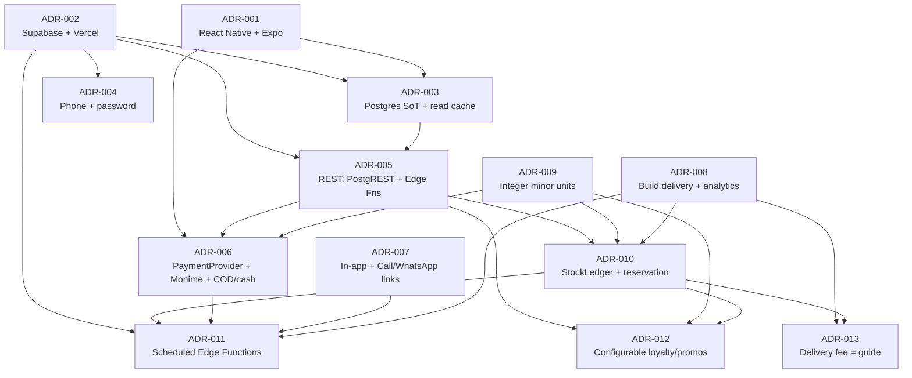
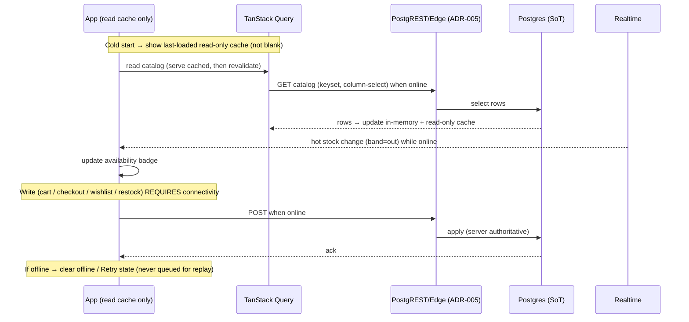
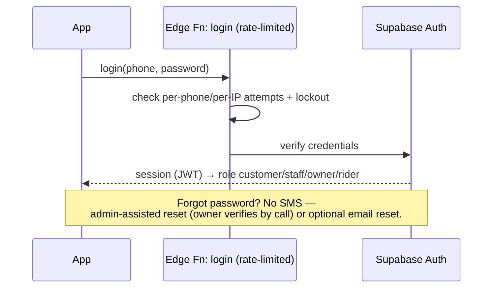

# 11 — Architecture Decision Records (ADR-001 … ADR-013)

> One-line purpose: The canonical, append-only log of the load-bearing technical decisions for Borteh Sprays 001 — each with its context, the genuine alternatives weighed, the decision, its consequences, and the trigger that would make us revisit it — so every other document can cite a decision by number instead of re-arguing it.
>
> Part of the Borteh Sprays 001 planning set. See 00-index.md for the full set.

---

## 0. How to read this document

An **Architecture Decision Record (ADR)** captures a single significant decision: the forces in play, the options we genuinely considered, the option we chose, and what we now owe as a consequence. ADRs are **immutable once Accepted** — we do not edit a decision, we supersede it with a new one. This keeps the reasoning auditable for a small founding team that will change shape over the next year.

These thirteen ADRs are the **locked technology decisions** referenced throughout the planning set (`01`…`13`). Other documents must reference them by number and must not re-open a chosen path as if it were still undecided.

### 0.1 Status legend

| Status | Meaning | In this set |
|---|---|---|
| **Accepted** | Decision is made and binding; build to it. | ADR-001 … ADR-013 (all) |
| **Proposed** | Direction is chosen in principle, but a **vendor/owner input is still pending** that could change the concrete realization (not the strategy). | none |
| Superseded | Replaced by a later ADR. | none yet |
| Deprecated | No longer relevant. | none yet |

> Note on ADR-006: the **decision** (adopt Monime via a `PaymentProvider` abstraction + COD) is **Accepted** and battle-tested in integration; several *operational* details remain **BLOCKED ON MONIME DOCS** (refund API, sandbox, idempotency TTL). The blocked items are validation tasks, not decision-blockers — the abstraction exists precisely to absorb them. See `08-payments-monime.md`.

### 0.2 Confidence labelling (per canon authoring rules)

Where an ADR makes a market or quantitative claim, it is tagged **High / Medium / Low** confidence and the words **"assumption to verify"** unless it is a hard, citable fact. Hard facts (e.g. Monime webhook mechanics, Supabase capabilities) are labelled **Fact**.

### 0.3 The decisions at a glance

| ADR | Decision | Status | Chosen | Primary driver | Personas served |
|---|---|---|---|---|---|
| 001 | Mobile framework | Accepted | React Native + Expo (TS) | One TS stack; OTA over poor links; lean | Aminata, Saidu, Mr. Borteh |
| 002 | Backend & hosting | Accepted | Supabase + Next.js on Vercel free | One committed cost; batteries included | all |
| 003 | Data access & caching | Accepted | Online-first; Postgres SoT + thin read cache | Online-first on 2G/3G; light read caching | Aminata |
| 004 | Auth | Accepted | Phone + password (no SMS OTP) | SMS too expensive; phone is unique id | Aminata, Saidu, Mr. Borteh |
| 005 | API style | Accepted | REST: PostgREST + Edge Functions | Data-frugal, fits read cache | all |
| 006 | Payment abstraction & Monime | Accepted | `PaymentProvider` iface + Monime hosted checkout + COD | Mobile money + COD are how SL pays | Aminata, Mr. Borteh |
| 007 | Notifications & contact | Accepted | In-app feed + Call/WhatsApp links (no paid APIs) | No SMS/WhatsApp-API cost | Aminata, Saidu, Mr. Borteh |
| 008 | Build vs buy (delivery + analytics) | Accepted | Build both in-house on Supabase | Own riders; no paid SaaS | Saidu, Mr. Borteh |
| 009 | Money handling | Accepted | Integer minor units (SLE cents) | Correctness; matches Monime | Mr. Borteh |
| 010 | Inventory consistency | Accepted | StockLedger + reservation + locking RPC (per-variant, single store) | Cannot oversell shared stock | Mr. Borteh, Aminata |
| 011 | Background jobs | Accepted | Scheduled Edge Functions (cron) | $0 jobs in-platform | Mr. Borteh |
| 012 | Promotions & loyalty | Accepted | Owner-configurable rules engine | Tune promos/loyalty without code | Aminata, Mr. Borteh |
| 013 | Delivery fee | Accepted | Guide/estimate; actual confirmed per order | Weak addressing; no wrong auto-charge | Aminata, Saidu, Mr. Borteh |

### 0.4 How the decisions depend on each other



> Read: ADR-002 (Supabase) is the substrate almost everything stands on; ADR-009 (money units) underpins every monetary ADR; ADR-011 (cron) is where the reconciliation/expiry/fan-out obligations created by ADR-006, ADR-007 and ADR-010 are actually discharged. All thirteen ADRs are **Accepted**.

---

## ADR-001 — Mobile framework: React Native + Expo (TypeScript)

- **Status:** Accepted
- **Date:** 2026-06-15
- **Deciders:** Founding Engineering Lead; Product Lead; Mr. Borteh (Store Owner, budget authority)

### Context

The customer and rider experiences (Aminata, Saidu) are **mobile-first** on **predominantly low-to-mid-range Android** devices with limited RAM/storage and small/old screens; iOS is a supported minority. The market context is hostile: intermittent 2G/3G outside Freetown, expensive per-MB data, and a need to ship fixes fast when something breaks in the field. Our team is small and our committed budget is **Supabase only** (see ADR-002), so we want **one language across mobile, backend Edge Functions, and the web admin** to avoid context-switching and duplicated talent.

We need: small APK (< ~25 MB per ABI — target, assumption to verify), cold start < 3s on mid-range Android (target), the ability to ship JS-level fixes **without** waiting on a Play Store review (valuable when users are on flaky links and updating is painful), and an ecosystem with a large, hireable talent pool in/around Sierra Leone and remotely.

### Options Considered

| Option | Pros | Cons | Notes |
|---|---|---|---|
| **React Native + Expo (TypeScript)** *(chosen)* | Single TypeScript stack shared with Supabase Edge Functions (Deno/TS) and Next.js admin; **Expo EAS Update OTA** ships JS fixes without Play Store review; Hermes engine keeps bundle/memory lean; huge talent pool; `expo-sqlite`, `expo-notifications`, `expo-web-browser` cover ADR-003/006/007 needs out of the box | JS bridge/Hermes performance ceiling below native for heavy animation/compute (commerce UI is not heavy); native modules occasionally needed via prebuild/dev-client; Expo managed constraints | **Runner-up: Flutter.** Adequate performance for commerce UI; revisit trigger is profiling jank on target devices |
| **Flutter (Dart)** | Excellent rendering consistency on old/cheap Android; compiled AOT, strong perf; great offline UI | **Separate language (Dart)** from our TS backend/admin — splits the team's stack and hiring; no OTA-style JS update path comparable to EAS Update (code push needs full store release); smaller local TS-overlap talent pool | Strong technically; loses the one-stack leverage that matters most to a tiny team |
| **Native (Kotlin + Swift)** | Best possible performance, memory, and bundle control on target devices | **Two codebases** for a team that can barely staff one; slowest to v1; no shared stack; OTA only via custom infra | Wrong cost/throughput trade for a 3–4 month standard v1 |
| **PWA / web-only (installable)** | Zero app-store friction; smallest distribution; one web codebase | Weak/uneven offline + background + push on low-end Android WebViews; **SMS/USSD-style payment return flows and deep links are fragile**; limited access to reliable on-device SQLite, FCM, secure storage; data-heavy unless hand-optimized | Weaker fit with the online-first read-caching model (ADR-003) and push (ADR-007); kept only as a possible future thin reach channel |

### Decision

Build the mobile app in **React Native + Expo with TypeScript**, using **Hermes**, **EAS Build** for binaries, and **EAS Update** for over-the-air JS delivery. Flutter is the documented runner-up. Native and PWA are rejected for v1.

### Consequences

- One TypeScript codebase spans app + Edge Functions + admin; shared types (e.g. API contracts in `07-api-design.md`, money types from ADR-009) can be reused, reducing drift.
- We can hotfix logic in the field via EAS Update without a store round-trip — directly mitigating the "slow, expensive update over 2G/3G" problem. (Native binary changes still require a store release.)
- We accept a performance ceiling vs native; we must **actively manage** it: Hermes on, keyset-paginated lists (FlashList/virtualization), WebP thumbnails, lazy images, minimal re-renders, and per-ABI APK splits to hit the < ~25 MB target (assumption to verify).
- `expo-sqlite`/secure storage for the optional read-only catalog cache (ADR-003), `expo-web-browser` for Monime hosted checkout (ADR-006), `expo-notifications`/FCM (ADR-007) are first-class — no bespoke native bridging expected for v1.
- Expo managed workflow may need a **dev client / prebuild** if a required native module is outside the managed set; budget a small contingency for this.

### Validation / Revisit triggers

- **Revisit if** profiling on representative low-end Android (target tier — assumption to verify the exact device matrix with the owner) shows unacceptable jank/memory on catalog scroll, image-heavy product pages, or cold start > 3s that we cannot engineer away.
- **Validate:** measure cold start, scroll FPS, memory, and APK size on at least two real low-end devices before launch; confirm EAS Update reliably reaches devices on intermittent links.
- **Revisit if** a required capability forces ejecting from Expo in a way that erodes the OTA/update advantage that justified the choice.

---

## ADR-002 — Backend & hosting: Supabase + Next.js admin on Vercel free tier

- **Status:** Accepted
- **Date:** 2026-06-15
- **Deciders:** Founding Engineering Lead; Mr. Borteh (Store Owner, budget authority); Product Lead

### Context

Budget is the hard design driver: the **only paid service we commit to is Supabase**; everything else must be free-tier or deferred (canon, locked). We are greenfield (no POS, inventory, or website), and we need, on day one: a relational store that is the **single source of truth for in-store and online stock** (ADR-010), auth (ADR-004), file storage for product images, server-side secure flows (login rate-limiting, checkout, Monime initiation + webhook — ADR-006), realtime stock updates (ADR-003), and scheduled jobs (ADR-011). We also need an **owner-facing web admin** that doubles as a lightweight in-store POS for Mr. Borteh and Staff.

A small team cannot operate bespoke infrastructure (Postgres HA, auth, object storage, a job runner, a realtime layer) cheaply or reliably. We want **managed, batteries-included, Postgres-native** infrastructure with Row-Level Security so the same database can safely back customer, staff, owner, and rider roles.

### Options Considered

| Option | Pros | Cons | Notes |
|---|---|---|---|
| **Supabase (Postgres, Auth, Storage, Edge Functions, Realtime, RLS)** *(chosen)* | One managed bill; **real Postgres** (RLS, transactions, RPC, `pg_cron`-class scheduling) → enables ADR-010 atomic inventory and ADR-003 live read freshness via Realtime; auto **PostgREST** API (ADR-005); built-in phone + password Auth (ADR-004); Storage for images; Edge Functions (Deno/TS) keep us one-stack; Realtime for hot stock | Single-vendor concentration; free/low tiers can pause/limit on inactivity or quota; cold-start on Edge Functions; we own scaling decisions as we grow | Locked decision; **Next.js admin hosted on Vercel free/hobby — no committed cost** |
| **Custom Node + self-managed Postgres (VPS)** | Full control; no vendor lock; cheapest raw compute in theory | We must build/operate auth, storage, realtime, backups, HA, a job runner, an API layer — **huge ops burden** for a tiny team; security surface we cannot staff; slower to v1 | Highest total cost in **time** despite low cash cost — fails the throughput constraint |
| **Firebase (Firestore + Functions + Auth)** | Excellent offline SDK; managed; generous free tier; strong push | **Document store, not relational** — atomic multi-row inventory reservation (ADR-010) and ad-hoc analytical SQL (ADR-008) are awkward/costly; query-cost model can surprise; lock-in to Google's data model; SQL talent doesn't transfer | Offline strength is real but inventory correctness + SQL analytics decide it against us |
| **Appwrite / PocketBase (self-host or managed)** | Open-source, lighter, Postgres/SQLite-backed; cheap | Smaller ecosystem; thinner managed offering and realtime/edge story; we'd still self-operate for reliability; less proven at our integration depth | Viable hedge but weaker batteries-included story than Supabase |

### Decision

Adopt **Supabase** (Postgres + Auth + Storage + Edge Functions + Realtime + RLS) as the entire backend and single source of truth. Host the **Next.js web admin on Vercel's free/hobby tier** (no committed cost). Postgres is the inventory source of truth for both in-store POS-lite and online (ADR-010).

### Consequences

- **Exactly one committed cost** (Supabase). This is the frugality bet (see `01-executive-summary.md`) and is High confidence as a design fact (it is in our control).
- Real Postgres unlocks the decisions that depend on it: atomic reservations and `SELECT … FOR UPDATE` (ADR-010), live read freshness via Realtime (ADR-003), PostgREST (ADR-005), and scheduled Edge Functions (ADR-011).
- We accept **single-vendor concentration risk**; we mitigate by keeping the schema portable (standard Postgres, minimal proprietary features beyond what Supabase exposes as Postgres), keeping Edge Functions in plain Deno/TS, and taking regular DB backups/exports.
- Free-tier limits (project pausing on inactivity, function cold starts, storage/egress caps) must be monitored; the **migration to a paid Supabase tier is the expected first paid-spend decision** as volume grows — flag to owner as a known future cost.
- Vercel hobby terms are for non-commercial/low-volume use — **assumption to verify** that admin usage stays within acceptable hobby limits; if not, the admin may need a paid Vercel plan or relocation. Confidence: Medium.

### Validation / Revisit triggers

- **Revisit if** Supabase free/low tier quotas (egress, storage, function invocations, DB size) are routinely exceeded such that reliability or the 99.5% availability target (assumption to verify) is threatened → plan paid-tier upgrade.
- **Revisit if** Vercel hobby terms disallow our admin usage → move admin hosting.
- **Validate:** confirm Supabase region/latency to Sierra Leone users is acceptable for the p95 < ~800 ms read target on 3G (assumption to verify); confirm backup/restore procedure before launch.

---

## ADR-003 — Online-first data access with light read caching (Postgres single source of truth)

- **Status:** Accepted
- **Date:** 2026-06-16
- **Deciders:** Founding Engineering Lead; Product Lead; Mr. Borteh (Store Owner)

### Context

Aminata browses on **intermittent 2G/3G with expensive data**, so the app must feel fast and be frugal with bytes. The **owner has explicitly rejected the complexity of building a sync engine** (offline write queues, delta sync, conflict resolution): the value does not justify the engineering and bug surface for a mostly read-heavy catalog whose checkout needs a network anyway. **Postgres on Supabase remains the single source of truth** (ADR-002); the client is never authoritative for inventory (ADR-010). What we need is ordinary **caching** — to keep the UI responsive and data-frugal on flaky links — **not** synchronization: never queue writes, never reconcile, never re-download the whole catalog. Live stock freshness still arrives over **Supabase Realtime** (band-only availability signal) while online.

We must do this on **near-zero budget** (ADR-002) — no paid sync platform.

### Options Considered

| Option | Pros | Cons | Notes |
|---|---|---|---|
| **(a) Full offline-first sync** — managed or hand-built Postgres↔SQLite (e.g. PowerSync, or an `expo-sqlite` mirror + local outbox queue + `updated_at` high-water-mark delta sync + conflict resolution) | True offline browse and offline actions that replay on reconnect | We **build/own (or pay for)** sync, merge, conflict, ordering, clock-skew, and outbox idempotency — a large, bug-prone surface; PowerSync is a **paid vendor** (violates the one-committed-cost constraint, ADR-002); far more than a read-heavy catalog with network-bound checkout needs | **REJECTED — too complex for the value (owner decision).** Revisit only if field data demands it |
| **(b) Online-first + light read caching** *(chosen)* — Postgres SoT; TanStack Query in-memory cache + HTTP/image caching; an **optional small read-only persisted cache of the last-loaded catalog**; Supabase Realtime for hot stock; **writes require connectivity** | **Far simpler, fewer bugs, faster to build**; cold start / a brief dropout shows the last catalog instead of a blank screen; data-frugal (cache hits, keyset pagination, WebP, column selection); no sync engine to operate; matches that checkout needs a network anyway | No offline ordering or offline write capture (acceptable — payments need a network); a long outage degrades to a clear offline / Retry state | Aligns with ADR-005 (REST) and ADR-010 (server authoritative) |
| **(c) No caching at all** — online-only, refetch everything on every view | Trivial to build | **Poor UX and high data cost** on 2G/3G: a blank screen on every dropout, and repeated re-downloads burn expensive MB | **Rejected** — fails the SL data-cost / intermittent-connectivity reality |

### Decision

**The app is online-first.** Postgres (Supabase) is the **single source of truth**; there is **no sync engine, no on-device mirror, no outbox, and no delta/conflict reconciliation**. The client keeps a **thin read cache only**: **TanStack Query** for an in-memory response cache/dedup/retry, **HTTP/image caching** for assets, and an **optional small read-only persisted cache of the last-loaded catalog** so cold start or a brief dropout is not a blank screen. That cache is **refreshed when online and never queues writes or reconciles**. Live stock freshness uses **Supabase Realtime** (band-only availability signal) while online. **All writes — cart, checkout, payment, wishlist-add, restock-subscribe — require connectivity**; when offline they show a clear offline / **Retry** state and are **not** queued for later replay.

### Consequences

- **Far simpler client**: no sync engine, no on-device mirror, no outbox, no merge/conflict/clock-skew code → **fewer bugs and a faster build**.
- Cold start or a brief dropout shows the **last-loaded read-only cached catalog** instead of a blank screen; repeat browsing is cheap on data (cache hits), directly serving the < ~1 MB typical-session budget (assumption to verify, ADR perf budgets).
- Data frugality comes from **TanStack Query in-memory caching + HTTP/image caching + keyset pagination + WebP + column selection** (ADR-005) — not from a local catalog mirror.
- **No offline ordering or offline write capture** — acceptable, since cart, checkout, payment, wishlist-add and restock-subscribe all need a network anyway (payment especially). When offline, writes show a clear offline / **Retry** state and are **never queued for later replay**.
- Live "sold out" freshness arrives via **Supabase Realtime** (band-only availability signal) while online; the read cache is **never authoritative for inventory** (ADR-010 is server-authoritative).
- The persisted cache is **read-only**: refreshed when online, never reconciled, and never re-downloads the whole catalog; a long outage degrades gracefully to an offline / Retry state.

#### Read-cache / data flow (sketch)



### Validation / Revisit triggers

- **Validate:** measure first-sync payload and steady-state delta sizes against the < ~150 KB first-catalog and < ~1 MB session budgets (assumptions to verify) on a real 3G profile.
- **Revisit if** `updated_at` high-water-mark sync proves unreliable (missed/duplicated rows, skew) → consider logical-replication-style change feeds or revisit PowerSync **if budget allows**.
- **Revisit if** Realtime free-tier connection/message limits are hit at scale → fall back to lower-frequency polling for stock.
- **Revisit if** offline write needs grow beyond simple user-intent rows (e.g. true offline order placement) — that materially raises conflict complexity and should get its own ADR.

---

## ADR-004 — Auth: Supabase Auth with phone number + password (no SMS OTP)

- **Status:** Accepted
- **Date:** 2026-06-16
- **Deciders:** Founding Engineering Lead; Mr. Borteh (Store Owner); Product Lead

### Context

In Sierra Leone **many users have a phone number but no email** (canon, identity context). Aminata, Saidu, and often Mr. Borteh think in phone numbers, not email. The natural identifier is the **mobile number**. The obvious verification pattern — SMS OTP — was **rejected by the owner on cost**: SMS into SL networks is expensive and would be charged on every login/signup, an unacceptable recurring burden for a frugal, Supabase-only build (ADR-002). We therefore authenticate with **phone number + password**: the phone is the **unique** account id, and a password (not an SMS code) proves identity. Supabase Auth supports phone + password natively, with phone-confirmation **disabled** so no OTP is ever sent. Email is **optional** (recovery only). The owner is open to layering additional, **zero-marginal-cost** security.

### Options Considered

| Option | Pros | Cons | Notes |
|---|---|---|---|
| **Supabase Auth, phone number + password (no OTP)** *(chosen)* | **No per-message SMS cost** — the binding constraint; phone is the unique id SL users actually have; native in Supabase (ADR-002); pairs with phone-keyed `User`, `DeliveryLocation.contact_phone`, COD/rider flows; works with zero messaging spend | No automatic possession-proof of the number (mitigated: the owner already verifies customers by phone); **password recovery cannot use SMS** → needs an alternate path; passwords add brute-force/credential-stuffing risk → needs rate-limit + lockout | Phone-confirmation disabled; recovery = admin-assisted + optional email |
| **Supabase Auth, phone number + SMS OTP** | Proves number possession; familiar (like mobile money); no password to forget | **SMS into SL is expensive and recurring** (owner-rejected); SMS can be delayed; SMS-pumping/OTP-abuse spend risk | **REJECTED — SMS too expensive (owner decision).** Could return only if an SMS budget is ever approved |
| **Email + password** | Cheap, standard, easy recovery | **Excludes the many users without email**; not how this market is identified | Email kept only as an **optional** recovery channel, never the primary id |
| **Social login (Google/Apple)** | No password; IdP-managed | Assumes Google/Apple accounts + OAuth redirects over flaky links; Apple mainly iOS minority | Optional convenience at best; not a primary identity for Aminata |

### Decision

Use **Supabase Auth with phone number + password** as the primary identity. The **phone number is unique** (one account per number). **Phone-confirmation is disabled** — no SMS OTP is ever sent. Email is **optional**, used only for recovery. Because there is no SMS, **password recovery is admin-assisted by default**: the owner verifies the customer out-of-band (a phone call she already makes) and **resets/issues a password from the admin**; optional **email** self-service recovery is offered to users who add an email. To harden the password rail at **zero marginal cost**, we add **login rate-limiting + temporary lockout** (per phone + per IP) via an Edge Function (ADR-005) and an **optional in-app PIN/biometric unlock**. This ADR is **Accepted** — no vendor is pending.

### Consequences

- `User.phone` is the canonical, **unique** identifier across orders, delivery, COD, and rider contact; addressing (landmark + phone) and COD reconciliation stay simple.
- **No SMS dependency anywhere in auth** → no SMS budget, no SMS-pumping exposure, no delayed-OTP design. This is the main win and is High confidence (in our control).
- We **must** build **login rate-limiting + temporary lockout** (per phone + per IP) and password-strength rules (see `09-security-threat-model.md`) to resist brute-force / credential-stuffing — these replace the old OTP-abuse defenses.
- **Account recovery is an operational flow, not an automated SMS flow**: admin-assisted reset (owner verifies by phone) + optional email reset. This fits the owner's habit of calling customers, but it is **manual** — documented in `10-admin-analytics.md`.
- Passwords can be forgotten and there is no self-service phone reset without email — a real UX trade we accept for the cost saving; mitigated by optional email capture at signup and a clear "contact the shop to reset" path.
- Auth is now **fully decoupled from notifications** (ADR-007) — no shared SMS vendor — simplifying both.

#### Sign-in & recovery (sketch)



### Validation / Revisit triggers

- **Validate:** login rate-limit/lockout thresholds against real traffic; the password-reset flows (admin + email) are usable for non-technical staff and customers.
- **Revisit if** account-recovery friction proves too high in the field → consider a WhatsApp-link recovery or a low-cost OTP **only for recovery** if a small SMS budget is later approved.
- **Revisit if** credential-stuffing becomes a problem → add step-up checks / device trust / optional OTP for sensitive actions.

---

## ADR-005 — API style: REST (PostgREST behind RLS) + Supabase Edge Functions

- **Status:** Accepted
- **Date:** 2026-06-15
- **Deciders:** Founding Engineering Lead; Product Lead

### Context

We need an API that is **data-frugal** (2G/3G, expensive MB), **fits the read cache** (ADR-003), is cheap to operate (ADR-002), and cleanly separates *simple RLS-protectable CRUD* from *transactional/secret-bearing flows* (login rate-limiting, checkout/reservation, Monime initiation + webhook, atomic inventory). Supabase gives us **auto-generated PostgREST** endpoints over our tables (guarded by Row-Level Security) for free, plus **Edge Functions (Deno/TS)** for secure server logic. The full surface is specified in `07-api-design.md`.

### Options Considered

| Option | Pros | Cons | Notes |
|---|---|---|---|
| **REST: PostgREST (auto CRUD behind RLS) + Edge Functions for transactional/secure flows** *(chosen)* | **Zero-cost CRUD** auto-generated from schema; RLS makes every row read/write policy-checked; keyset pagination + column selection → **data-frugal** (great for 3G + read caching, ADR-003); Edge Functions hold secrets (Monime token, service-role) and do atomic/multi-step work; one TS stack (ADR-001/002); HTTP caching friendly | PostgREST query grammar is a learning curve; complex reads need RPC/views; we hand-design endpoint contracts and error model; no built-in typed schema contract like GraphQL | Matches ADR-002/003/010; client never holds privileged secrets |
| **GraphQL (Hasura / PostGraphile / Supabase pg_graphql)** | One flexible typed endpoint; client shapes queries; strong tooling | **Heavier client** (often larger payloads/over-fetch risk if misused) — worse on metered 2G/3G; extra server complexity; weaker fit with simple REST read caching + HTTP caching; another layer to operate on a tiny budget | **Considered and REJECTED** (canon): added complexity, weaker fit with Supabase + read caching + data-frugality |
| **Bespoke REST API server (custom Node/Express)** | Total control of contract | We'd hand-write all CRUD that PostgREST gives free; more code, more ops, more cost (a server to run) — fails ADR-002 frugality | No advantage over PostgREST + Edge Functions for our needs |

### Decision

**REST.** Use **Supabase auto-generated PostgREST endpoints behind Row-Level Security** for CRUD, and **Supabase Edge Functions (Deno/TS)** for transactional/secure flows: login rate-limiting (ADR-004), checkout + reservation (ADR-010), payment initiation (ADR-006), the **Monime webhook** (ADR-006), and atomic inventory operations. **GraphQL is rejected.** Design rule (see `07-api-design.md`): *simple, RLS-protectable single-resource read/write → PostgREST; transactional / multi-step / secret-bearing / rate-limited / third-party → Edge Function (or `SECURITY DEFINER` RPC for in-DB atomic work).*

### Consequences

- Most catalog/wishlist/cart/order reads are **free PostgREST + RLS**, keyset-paginated and column-selected for data frugality — directly serving the read caching of ADR-003.
- **Secrets never touch the client.** Monime tokens and the service-role key live only in Edge Functions; the client calls our functions, not third parties.
- Atomic inventory and reservation logic lives in **`SECURITY DEFINER` RPCs / Edge Functions** (ADR-010), not in client writes.
- We **own the error model, idempotency, pagination, and versioning** conventions (specified in `07-api-design.md`) — consistency is on us, not the framework.
- RLS policy correctness becomes **the** security boundary (see `09-security-threat-model.md`); policies must be reviewed as carefully as code.

### Validation / Revisit triggers

- **Validate:** p95 read latency < ~800 ms on 3G (assumption to verify) for the hot catalog endpoints; payload sizes within budget.
- **Revisit if** clients end up over-fetching or making many round-trips that GraphQL-style selection would meaningfully reduce **and** the savings beat the added complexity (currently judged not worth it).
- **Revisit if** RLS policy complexity becomes unmanageable for a given surface → move that surface to an Edge Function/RPC with explicit checks.

---

## ADR-006 — Payment abstraction & Monime: `PaymentProvider` interface + Monime hosted checkout + Cash-on-Delivery

- **Status:** **Accepted** *(decision firm; several operational details **BLOCKED ON MONIME DOCS** — see Consequences)*
- **Date:** 2026-06-15
- **Deciders:** Founding Engineering Lead; Payments Engineer; Mr. Borteh (Store Owner)

### Context

In Sierra Leone **mobile money dominates** (Orange Money, Africell Money) and **COD remains essential** for trust (canon, payments context). **Monime** is the chosen aggregator/gateway, integrated via **hosted Checkout Sessions**. We need to (a) keep payment vendors **swappable** so we are not re-architected if we add/replace a provider, and (b) treat **COD as a first-class rail**, not an afterthought. All money is **integer SLE minor units** (ADR-009). Initiation and webhook handling must run **server-side** in Edge Functions (ADR-005) where secrets live.

The Monime mechanics are **Fact** (from a battle-tested integration; see `08-payments-monime.md`): host `https://api.monime.io`; version header `Monime-Version: caph.2025-08-23`; per-call headers `Authorization: Bearer`, `Monime-Space-Id`, `Monime-Version`, `Content-Type`, and **`Idempotency-Key` (REQUIRED on `POST /v1/checkout-sessions`)**; the response `result.redirectUrl` (checkout.monime.io/scs-…) is where the customer pays and `result.id` (scs-…) is stored as `provider_intent_id`; **final truth is the webhook, not the redirect**. The webhook signature is `Monime-Signature: t=<unix>,v1=<base64 of 32 bytes>`, verified as `HMAC-SHA256(secret, signed_payload)` where **`signed_payload = t + "_" + raw_body`** (UNDERSCORE, not a period — the #1 gotcha), compared base64 + timing-safe, with replay rejection if `(now − t) > 300s` or `(t − now) > 60s`, read **raw body before JSON parse**, two-secret rotation. **Act only on `payment.completed` / `payment.processing_completed`** (and the equivalent `checkout_session.completed`); dedup on `event.id`.

### Options Considered

| Option | Pros | Cons | Notes |
|---|---|---|---|
| **`PaymentProvider` interface (`createCheckout`, `verifyWebhookSignature`, `parseEvent`, `matchIntent`, `getStatus`) with a Monime adapter (hosted Checkout Sessions) + a CashOnDelivery adapter** *(chosen)* | Vendors **plug in without re-architecting**; COD is a first-class adapter, not special-cased everywhere; hosted checkout means **we never touch card/wallet credentials** (lower PCI/KYC burden); battle-tested Monime mechanics; isolates the underscore-signature/intent-matching quirks behind one verified adapter | We build/maintain the abstraction + each adapter; Monime has real gaps (no sandbox, no refund API as of 2026-05) we must work around | Initiation + webhook in Edge Functions (ADR-005); amounts SLE minor units (ADR-009) |
| **Direct telco integrations (Orange Money / Africell APIs), no aggregator** | Potentially lower per-txn fees; direct rails | **Two+ separate integrations**, separate KYC/contracts, separate webhooks/edge cases; far more to build/maintain; defeats the aggregator value | An aggregator (Monime) exists precisely to avoid this |
| **Single hard-coded Monime integration (no abstraction)** | Less code now | **Couples the whole app to one vendor**; COD becomes special-case branching; any future provider = re-architecture; harder to test | Rejected — the abstraction is cheap insurance |
| **International card gateway (Stripe/Flutterwave) as primary** | Mature SDKs, refunds, sandbox | **Card penetration is low**; doesn't serve mobile-money-first users or COD; FX/availability issues in SL | Wrong rail for THIS market; could be a future adapter |

### Decision

Define a **`PaymentProvider` interface** — `createCheckout`, `verifyWebhookSignature`, `parseEvent`, `matchIntent`, `getStatus` — with a **Monime adapter (hosted Checkout Sessions)** and a **CashOnDelivery adapter**, so providers plug in without re-architecting. **Initiation and webhook handling run in Supabase Edge Functions (Deno)** (ADR-005). All amounts are **SLE minor units** (ADR-009). Follow the Monime mechanics above **exactly** (especially the **underscore** signed-payload separator and webhook-as-source-of-truth).

#### Interface sketch (definition only — no implementation)

```text
interface PaymentProvider {
  createCheckout(intent: PaymentIntent): Promise<{ providerIntentId; redirectUrl }>
  verifyWebhookSignature(rawBody: bytes, header: string, secrets: [current, previous]): boolean
  parseEvent(rawBody: bytes): ProviderEvent           // typed taxonomy
  matchIntent(event: ProviderEvent): PaymentIntentId | null
  getStatus(providerIntentId: string): Promise<ProviderStatus>
}
// Adapters: MonimeAdapter (hosted checkout), CashOnDeliveryAdapter (no external call)
```

#### Checkout truth-flow (sketch)

```mermaid
sequenceDiagram
  participant App
  participant EF as Edge Fn: payment-init
  participant M as Monime (api.monime.io)
  participant WH as Edge Fn: monime-webhook
  participant PG as Postgres (PaymentIntent)
  App->>EF: pay order (mobile money)
  EF->>PG: create PaymentIntent (created)
  EF->>M: POST /v1/checkout-sessions (Idempotency-Key, intent_id in callbackState + metadata)
  M-->>EF: result.id (scs-...), result.redirectUrl
  EF-->>App: redirectUrl → open in Expo WebBrowser
  App->>M: customer pays on checkout.monime.io
  M-->>WH: webhook (raw body, Monime-Signature t=..,v1=..)
  WH->>WH: verify HMAC over t + "_" + rawBody (underscore!), replay window, dedup event.id
  WH->>PG: status-guarded UPDATE WHERE status IN (created,processing) + amount/currency match
  Note over App: App returns via deep link; truth = webhook, not redirect
```

### Consequences

- We can add/replace providers behind the interface; **Cash is co-equal** with mobile money — both **cash-on-delivery** and **in-store cash** are first-class (serves Aminata's trust + the conversion bet in `01-executive-summary.md`).
- The Monime adapter encodes the **non-obvious traps**: **underscore** (not period) signed-payload separator; **raw body before JSON parse**; replay window (`now−t > 300s` or `t−now > 60s`); **two-secret rotation** (current + previous); intent matching order — (1) `data.metadata.intent_id` / `data.channel.metadata.intent_id`, (2) `checkout_session` object id == `provider_intent_id`, (3) walk `data.ownershipGraph.owner` up to depth 5; **act only on** `payment.completed` / `payment.processing_completed` (and `checkout_session.completed`); **dedup on `event.id` (UNIQUE)**; verify **amount + currency** before flipping status; **status-guarded UPDATE** (`WHERE status IN (created, processing)`) to avoid racing the expiry sweep (ADR-011).
- We round-trip our own `intent_id` through **both** `callbackState` **and** `metadata.intent_id`; the channel-specific `data.channel.metadata.intent_id` often survives most cleanly.
- The registered webhook URL must be the **exact canonical Edge Function URL** — **webhooks do not follow redirects** (Fact).

**BLOCKED ON MONIME DOCS (must stay in `12-risks-assumptions.md` open-questions):**
- **No real sandbox** — test tokens 401 on `/v1/*`; real testing uses live mode / real money. Plan a controlled small-value live test protocol.
- **No refund API as of 2026-05** — refunds are done **manually in the Monime dashboard**, then recorded in our `Refund` table → **manual reconciliation** is a standing operational task.
- **No confirmed refund/chargeback webhook** — cannot auto-react to refunds/chargebacks yet.
- **`Idempotency-Key` TTL assumed 24h** — confirm with Monime.
- Token **scopes are per-action** — confirm the minimal scope set we need.

### Validation / Revisit triggers

- **Validate:** a live-mode, small-value end-to-end test for each rail (Orange Money, Africell Money) confirming webhook signature verification, intent matching, idempotency, and amount/currency guard before launch.
- **Revisit if** Monime ships a refund API / refund-chargeback webhook → add `refund()` to the interface and automate reconciliation.
- **Revisit if** a sandbox appears → wire it into CI/test.
- **Revisit if** fees/availability shift such that a direct telco or card adapter becomes worthwhile → add an adapter (no re-architecture needed — that is the point).

---

## ADR-007 — Notifications & customer contact: in-app feed + click-to-chat deep links (no paid messaging APIs)

- **Status:** Accepted
- **Date:** 2026-06-16
- **Deciders:** Founding Engineering Lead; Product Lead; Mr. Borteh (Store Owner)

### Context

Customers need to know about order status and restock-availability, and the shop needs to talk to customers. The original SMS-first / WhatsApp-Cloud-API plan was **rejected by the owner**: SMS is expensive (same reason as ADR-004) and the WhatsApp/Meta Business API is **too much work and cost** to stand up. Crucially, the owner **already communicates with customers on WhatsApp manually and calls them** — the workflow exists; we just make it one tap and capture the phone numbers. So notifications run on **no paid messaging API**: free, in-platform, leaning on the phone number we already hold. Fan-out (writing in-app notifications) is dispatched by scheduled Edge Functions (ADR-011).

### Options Considered

| Option | Pros | Cons | Notes |
|---|---|---|---|
| **In-app notification feed (Supabase Realtime) + one-tap Call (`tel:`) / WhatsApp (`wa.me` click-to-chat) from the admin** *(chosen)* | **Zero cost, no API, no approval**; uses the phone number we already store; in-app feed is free via Realtime; click-to-chat opens WhatsApp with a pre-filled message and needs **no Business API**; matches how the owner already works | In-app feed reaches app users only when they open the app; store→customer contact is **owner-initiated/manual**; no guaranteed push to a closed app without optional FCM | Optional in-app chat + free FCM push are additive |
| **SMS-first + WhatsApp Cloud API** | SMS reaches every phone; WhatsApp rich | **SMS cost + WhatsApp API cost/approval/effort** — all owner-rejected | **REJECTED — cost + effort (owner decision)** |
| **Optional in-app messaging (customer↔store chat, Supabase Realtime)** | Two-way, in-app, free; conversations stay in our DB | Build effort (`Conversation`/`Message` tables + inbox UI); only works in-app | **Scoped as deferrable v1.5** (Should/Could) |
| **Free Expo/FCM push** | ~Free; instant for app users on data | Misses offline/closed-app + non-app users; setup overhead | **Optional enhancement (Could)** |
| **Email** | Free-ish | Many users have no email (ADR-004) | Not a primary channel here |

### Decision

**No paid messaging APIs.** Customer-facing notifications (order status, restock-available) go to an **in-app notification feed** backed by a `Notification` table + **Supabase Realtime**. Store→customer contact is **one-tap Call (`tel:`) and WhatsApp (`https://wa.me/<number>?text=…`) click-to-chat** from the **admin order screen** (ADR-002, `10-admin-analytics.md`), using the customer's stored phone number — **no Business/Cloud API, no per-message cost**. **Optional in-app messaging** (customer↔store chat on Supabase Realtime) is scoped as a **deferrable v1.5**. **Free Expo/FCM push** is an optional enhancement. This ADR is **Accepted** — no vendor is pending.

### Consequences

- A `Notification` (+ optional `NotificationPreference`) model drives the **in-app feed**; restock-available and order-status updates are **DB inserts** fanned out by ADR-011 jobs and delivered live by Realtime — **$0 per message**.
- **No SMS/WhatsApp-API spend or approval** anywhere — this removes the biggest recurring cost and the longest-lead-time dependency (Meta verification) from the whole project (see `13-roadmap.md`).
- Store→customer outreach is **owner-initiated** via tap-to-Call / tap-to-WhatsApp from the order/customer screen — fast, familiar, and free, but **manual** (an operational load on the owner; noted in `12-risks-assumptions.md`).
- **Optional in-app chat (v1.5)** would add `Conversation` + `Message` tables on Supabase Realtime plus an admin inbox; it is **not** in the v1 critical path.
- Auth no longer shares a messaging vendor (ADR-004) — both ADRs are simpler and independently Accepted.

#### Customer contact / notification (sketch)

```mermaid
flowchart TD
  E["Event (order status / restock)"] --> N["Insert Notification row"]
  N --> RT["Supabase Realtime in-app feed"]
  O["Owner needs to reach a customer"] --> A["Admin order screen"]
  A --> T["Tap Call (tel:)"]
  A --> W["Tap WhatsApp (wa.me click-to-chat, pre-filled)"]
  A -. optional v1.5 .-> C["In-app chat (Conversation/Message + Realtime)"]
```

### Validation / Revisit triggers

- **Validate:** the in-app feed updates live over Realtime on a real 3G profile; `tel:` and `wa.me` deep links open correctly from the admin on the owner's device.
- **Revisit (pull into v1) if** the owner wants two-way in-app chat at launch → promote the v1.5 messaging module.
- **Revisit if** reaching closed/offline apps matters enough → enable free FCM push (still no paid API).
- **Revisit if** a small SMS budget is ever approved for truly critical reach → add an SMS channel behind the same `Notification` model (the model already abstracts channel).

---

## ADR-008 — Build vs buy: in-house dispatch (own riders) + in-house analytics

- **Status:** Accepted
- **Date:** 2026-06-15
- **Deciders:** Founding Engineering Lead; Mr. Borteh (Store Owner); Product Lead; Dispatch/Ops (Saidu's manager)

### Context

Two build-vs-buy questions, decided together because both are dominated by the **one-committed-cost** constraint (ADR-002) and the SL reality. **Delivery:** the store runs its **own dispatch riders** (Saidu) against **landmark/GPS** addresses — not third-party couriers (canon, locked). We need a rider role, manual/assisted assignment, delivery zones with **indicative (guide) fees** (ADR-013), and **simple** order/delivery status tracking — **no live GPS tracking**. **Analytics:** Mr. Borteh needs sales/inventory insight (top scents, restock signals, funnel) without a paid analytics SaaS. We are greenfield with no logistics or analytics platform to inherit.

### Options Considered

| Option | Pros | Cons | Notes |
|---|---|---|---|
| **BUILD: lightweight in-house dispatch on Supabase (own riders, manual/assisted assignment, zones with guide fees (ADR-013), simple status tracking — no live tracking) + BUILD analytics via `AnalyticsEvent` table + SQL materialized views + free dashboard (Metabase OSS / Supabase dashboards)** *(chosen)* | No new paid vendors (ADR-002 holds); **fits SL reality** — own accountable riders, landmark/GPS addressing, COD collection; analytics data stays in our Postgres (privacy, full SQL freedom, ad-hoc queries); tailored exactly to Mr. Borteh's workflow | We build + maintain dispatch UI, assignment logic, and analytics pipeline/dashboards; manual assignment doesn't auto-scale to large rider fleets | Dispatch entities: `Rider`, `DeliveryJob`, `DeliveryZone`, `DeliveryLocation`; analytics via `AnalyticsEvent` + materialized views + ADR-011 jobs |
| **BUY: third-party logistics/courier platform** | Offloads routing/tracking | **No suitable third-party courier to lean on** in our context; recurring cost; loses control/accountability; doesn't match own-rider + COD + landmark model | Rejected — does not fit SL operating reality |
| **BUY: paid analytics SaaS (Mixpanel / Amplitude / GA4 360)** | Polished dashboards, funnels out of the box | **Recurring cost** (violates ADR-002); ships customer/sales data to a third party (privacy/regulatory flag, `09`); over-featured for our scale; another vendor | Free GA4 conceivable but data-export/SQL-join limits + privacy push us in-house |
| **Manual / offline (phone + paper for dispatch, spreadsheets for analytics)** | Zero build | Doesn't scale; no live tracking for Aminata's trust; error-prone; no single source of truth; defeats the whole project | Status quo we are replacing |

### Decision

**BUILD** both in-house on Supabase: (1) a **lightweight dispatch system** — own riders, manual/assisted assignment, delivery zones with **guide/estimate fees** (ADR-013), **simple** order/delivery status tracking — **no live GPS tracking** (entities `Rider`, `DeliveryJob`, `DeliveryZone`, `DeliveryLocation`); and (2) **in-house analytics** via an **`AnalyticsEvent` table + SQL materialized views + a free dashboard** (Metabase OSS or Supabase dashboards). Reject buying a logistics platform and reject paid analytics SaaS.

### Consequences

- Saidu gets a **simple assigned-deliveries list**: order items + customer landmark/pin + phone, mark picked-up/delivered, collect cash/COD (`DeliveryJob.cod_collected_minor`, in SLE minor units per ADR-009). There is **no live GPS tracking** in v1 (ADR-013 context) — the rider screen is deliberately minimal.
- Mr. Borteh gets dispatch + analytics in the **same admin** (ADR-002), keeping all business data in **one Postgres source of truth** — good for privacy and ad-hoc SQL.
- Analytics ingest (`analytics-ingest`) and **materialized-view refresh / low-stock alerting** run as Edge Functions, refreshed on schedule (ADR-011); we own the SQL and the dashboards.
- **Manual assignment is deliberate for v1** (small fleet); assisted/auto-assignment (by zone/proximity) is a documented future enhancement, not v1.
- We carry the maintenance burden, but avoid 2+ recurring vendor bills — the frugality bet (High confidence as a control-in-our-hands fact).
- Customer/sales data **not** shipped to third-party analytics → simpler regulatory posture (still flag SL data-protection specifics to counsel, `09`/`12`).

### Validation / Revisit triggers

- **Revisit dispatch if** rider fleet/volume outgrows manual assignment → add assisted/auto-assignment (zone + proximity), still in-house.
- **Revisit analytics if** in-house SQL/materialized-view + free dashboard cannot answer the owner's questions, or maintenance cost exceeds a modest paid tool — re-evaluate a low-cost SaaS (with privacy review).
- **Validate:** ≥ 90% of dispatched orders delivered within quoted zone ETA (assumption to verify, Low confidence — see `01`); dashboard answers Mr. Borteh's top restock/sales questions.

---

## ADR-009 — Money handling: integer minor units (SLE cents), never floats

- **Status:** Accepted
- **Date:** 2026-06-15
- **Deciders:** Founding Engineering Lead; Payments Engineer; Mr. Borteh (Store Owner)

### Context

We handle prices, cart totals, delivery fees, payments, COD collection, refunds, and loyalty — across in-store and online. Floating-point money causes rounding/representation errors that are unacceptable in a financial system. **Monime amounts are SLE minor units** (Fact: `100 = Le 1.00`), so matching that representation removes a whole class of conversion bugs at the payment boundary (ADR-006). Currency is **SLE only** for v1.

### Options Considered

| Option | Pros | Cons | Notes |
|---|---|---|---|
| **Integer minor units (SLE cents), stored as integers everywhere** *(chosen)* | **Exact** — no float rounding; **matches Monime's representation** (Fact) → no conversion at the payment edge; trivial to sum/compare; portable across app/DB/Edge Fn (one TS stack) | Must remember to format to major units only at the UI edge ("Le X.XX"); developers must never introduce a float midstream | Canon-locked; `price_minor`, `estimated_fee_minor`, `delivery_fee_minor`, `cod_collected_minor`, etc. all integer |
| **Float / double in major units (e.g. 12.50)** | Easy to read in code | **Rounding errors** accumulate; `0.1 + 0.2` class bugs; unsafe for money | Rejected outright |
| **Postgres `NUMERIC`/`DECIMAL` in major units** | Exact decimal arithmetic in DB | Mismatch with Monime minor units → conversions; JS has no native decimal (serialization to string, extra handling); heavier than integers; still risks float coercion in JS clients | Exact but adds friction vs integers given our JS stack + Monime |
| **`money` type / currency library objects** | Encapsulates currency + amount | Overkill for single-currency v1; serialization overhead across REST/read cache; extra dependency | Reconsider only if multi-currency arrives |

### Decision

Store **all monetary amounts as integer MINOR units (cents) in SLE**; **never floats**. Convert to major units **only for display** at the UI edge. Monime amounts are SLE minor units (`100 = Le 1.00`). All canonical money fields (`ProductVariant.price_minor`, `DeliveryZone.estimated_fee_minor`, `Order.delivery_fee_minor`, `DeliveryJob.cod_collected_minor`, `PaymentIntent`, `Refund`, loyalty ledger amounts, etc.) are integers.

### Consequences

- Arithmetic (sums, totals, fees, change due, loyalty accrual) is **exact** and cheap; comparisons for the Monime **amount-match guard** (ADR-006) are integer-equal — no epsilon.
- A **shared money type/helper** (one place to format `minor → "Le X.XX"` and parse input) lives in the shared TS layer; UI uses it, business logic never does float math.
- DB columns are `BIGINT`/`INTEGER` minor units; API contracts (`07-api-design.md`) document every amount field as **minor units** to prevent client mistakes.
- v1 is **single-currency (SLE)**; multi-currency would need an explicit currency field everywhere and is out of scope (revisit trigger).
- Tax/rounding rules (if any) are applied in integer minor units with a documented rounding policy.

### Validation / Revisit triggers

- **Validate:** golden tests for totals, fees, COD change, refunds, and loyalty accrual in minor units; confirm the Monime amount/currency guard compares minor-unit integers.
- **Revisit if** we ever support a **second currency** → introduce explicit currency on every monetary row + a money value object.
- **Revisit if** a denomination/redenomination or sub-cent need arises (none expected for SLE v1).

---

## ADR-010 — Inventory consistency / oversell prevention: StockLedger + InventoryItem + time-boxed reservation via locking RPC

- **Status:** Accepted
- **Date:** 2026-06-15
- **Deciders:** Founding Engineering Lead; Mr. Borteh (Store Owner); Product Lead

### Context

Stock is **shared** between **in-store POS-lite** sales (Staff) and **online** orders (Aminata) against the **same** Postgres source of truth (ADR-002/003). **v1 is a single store**, so inventory is effectively **per-variant** (one default location); the location dimension is kept in the schema only to enable a deferred multi-store future. Concurrent sales on the same `ProductVariant` must **never oversell** (the unlimited/scalable *catalog* is handled by keyset pagination + search indexing in ADR-005 / `06-data-model.md`, not by the inventory model). Online orders need a **time-boxed reservation** (hold stock while the customer pays via Monime or accepts COD) that is **confirmed on success** and **released on expiry/failure**. We also want an **auditable history** of every stock movement for reconciliation and analytics (ADR-008). The client is **not** authoritative — its cart is an *intent* (ADR-003); authority lives in the DB.

### Options Considered

| Option | Pros | Cons | Notes |
|---|---|---|---|
| **Append-only `StockLedger` (movements) + `InventoryItem` balance per (variant, location); decrements + reservations inside a Postgres transaction via an RPC using `SELECT … FOR UPDATE` (or atomic conditional `UPDATE`); time-boxed online reservation confirmed on payment/COD, released on expiry** *(chosen)* | **Cannot oversell** — row lock / conditional update serializes concurrent online + in-store sales; **full audit trail** (purchase/sale_online/sale_instore/adjustment/transfer/reservation/release) for reconciliation + analytics; reservation models the real payment-wait cleanly; all in one DB transaction (no distributed coordination) | We design the RPC, the reservation lifecycle, and the **expiry sweep** (ADR-011); ledger + balance must stay consistent (balance is a derived cache of the ledger) | Entities: `StockLedger`, `InventoryItem(qty_on_hand, qty_reserved)`; movement types per canon |
| **Naive `UPDATE qty = qty - n` with no ledger / no lock discipline** | Simplest | **Race conditions oversell** under concurrency; no audit trail; can't reconcile or explain discrepancies | Rejected — the exact failure we must prevent |
| **Optimistic concurrency (version column, retry on conflict), no ledger** | No long locks; scales reads | Retest/retry complexity under contention; still needs a ledger for audit; reservation semantics bolted on | Locking RPC is simpler and sufficient at our scale; optimistic is a possible internal refinement |
| **External lock / queue / distributed coordination (e.g. serialize via a queue)** | Decouples write contention | **Over-engineered** for a single-store/low-scale start; new moving parts + cost; Postgres already gives us ACID + row locks | Unnecessary given Postgres; revisit only at large multi-store scale |
| **Eventual consistency (allow transient oversell, fix later)** | Maximal availability/throughput | **Unacceptable for trust** — overselling breaks Aminata's confidence (the core bet, `01`) and creates refunds/COD disputes | Rejected on trust grounds |

### Decision

Use an **append-only `StockLedger`** of movements plus an **`InventoryItem` balance per `(variant, location)`** (`qty_on_hand`, `qty_reserved`). **Stock decrements and order reservations happen inside a Postgres transaction via an RPC** using **row locking (`SELECT … FOR UPDATE`) or an atomic conditional `UPDATE`**, so concurrent online + in-store sales **cannot oversell**. Online orders place a **time-boxed reservation**; the reservation is **confirmed** on payment success / COD acceptance and **released** on expiry/failure. The server is authoritative; client carts are intents (ADR-003).

#### Reservation lifecycle (state machine)

```mermaid
stateDiagram-v2
  [*] --> Available
  Available --> Reserved: checkout RPC (FOR UPDATE) / qty_reserved += n if available >= n / ledger reservation
  Reserved --> Confirmed: payment.completed (ADR-006) or COD accepted / ledger sale_online; qty_on_hand -= n
  Reserved --> Released: expiry sweep (ADR-011) or payment failed / ledger release; qty_reserved -= n
  Released --> Available
  Confirmed --> [*]
  note right of Reserved
    Time-boxed hold.
    In-store sale (sale_instore) decrements
    available concurrently, under the same lock.
  end note
```

#### Reservation RPC (pseudocode — not implementation)

```text
function reserve(variant_id, location_id, n, order_id):  -- SECURITY DEFINER, in txn
  row = SELECT qty_on_hand, qty_reserved
          FROM InventoryItem
          WHERE variant_id AND location_id
          FOR UPDATE                       -- serialize concurrent buyers
  available = row.qty_on_hand - row.qty_reserved
  if available < n: raise INSUFFICIENT_STOCK
  UPDATE InventoryItem SET qty_reserved = qty_reserved + n ...
  INSERT StockLedger(type='reservation', qty=n, ref=order_id, ...)
  return reservation handle (with expiry timestamp)
-- confirm(): ledger 'sale_online', qty_on_hand -= n, qty_reserved -= n
-- release(): ledger 'release', qty_reserved -= n   (idempotent w.r.t. order_id)
```

### Decision rationale links

This is the mechanism behind the "live stock that can't oversell" promise in `01-executive-summary.md`; the checkout Edge Function (ADR-005) calls this RPC; confirmation is driven by the Monime webhook / COD acceptance (ADR-006); expiry/release is a scheduled sweep (ADR-011); every movement feeds analytics (ADR-008); amounts elsewhere are minor units (ADR-009).

### Consequences

- Online + in-store concurrency is **safe**: the `FOR UPDATE` lock (or atomic conditional `UPDATE … WHERE qty_on_hand - qty_reserved >= n`) serializes the critical section per `(variant, location)`.
- `InventoryItem` is a **derived balance** (cache of the ledger); the **`StockLedger` is the truth** and supports reconciliation, audit, and analytics. A periodic check can re-derive balance from the ledger to detect drift.
- Reservations require a **time box + expiry sweep** (ADR-011): abandoned/failed payments **must** release stock, or we slowly leak availability. `release()` must be **idempotent** to avoid double-release racing the webhook confirm — hence the **status-guarded** updates (ties to ADR-006's `WHERE status IN (created, processing)`).
- Adds RPC + lifecycle complexity, accepted as the cost of the no-oversell guarantee that the trust bet depends on.
- Lock contention is negligible at single-store/low scale; at high concurrency on a hot SKU, consider shorter critical sections or optimistic retry (revisit).

### Validation / Revisit triggers

- **Validate:** concurrency test — parallel online + in-store sales on one variant never drive available below zero; reservation expiry reliably releases; ledger sum reconciles to `InventoryItem`.
- **Revisit if** lock contention on hot SKUs causes latency → shorten critical section / optimistic concurrency / partitioned counters.
- **Revisit if** multi-location transfers or multi-store scale change the locking model.
- **Validate:** reservation TTL value with the owner (balance trust vs leaving stock held during slow mobile-money confirmations — assumption to verify).

---

## ADR-011 — Background jobs via scheduled Edge Functions (cron)

- **Status:** Accepted
- **Date:** 2026-06-15
- **Deciders:** Founding Engineering Lead; Product Lead; Mr. Borteh (Store Owner)

### Context

Several obligations created by other ADRs must run **without a user request**: **payment reconciliation** (catch webhooks we missed / verify Monime state — ADR-006), **reservation expiry** (release abandoned holds — ADR-010), **restock-available fan-out** (notify `RestockSubscription` holders when stock returns — ADR-007), **low-stock alerting** (warn Mr. Borteh — ADR-008), and **materialized-view refresh** for analytics (ADR-008). We must do this on the committed Supabase platform (ADR-002) with **no extra paid worker/queue** and one TS stack.

### Options Considered

| Option | Pros | Cons | Notes |
|---|---|---|---|
| **Scheduled Edge Functions (cron) on Supabase** *(chosen)* | **In-platform, $0 extra** (ADR-002); same Deno/TS stack as the rest; runs with service-role for sweeps; co-located with the DB and our webhook function (ADR-006) | Cold starts; need idempotency + overlap guards; scheduling/observability is on us; long jobs must be chunked within function limits | Jobs: reconciliation, reservation expiry, restock fan-out, low-stock, view refresh |
| **`pg_cron` (in-database scheduler)** | Runs inside Postgres; great for pure-SQL jobs (view refresh, expiry) | Awkward for jobs needing **HTTP to Monime** (ADR-006); logic in SQL not TS; harder to share code with Edge Functions | **Complementary** — fine for pure-SQL refresh/expiry; we standardize on Edge Functions for anything with external calls |
| **External cron (GitHub Actions / cron-job.org hitting our endpoints)** | Free schedulers; simple triggers | **Another moving part + external dependency**; secrets/availability/observability split across vendors; reliability outside our control | Possible fallback trigger if Supabase scheduling is insufficient |
| **Dedicated worker dyno / queue service (e.g. a hosted queue + worker)** | Robust, scalable, retries, backoff | **Recurring cost + ops** → violates ADR-002; over-engineered for our scale | Reconsider only at much larger scale |
| **Client-triggered "jobs" (run on app open)** | No infra | Unreliable (depends on a user being online); can't release stock for inactive users; wrong for reconciliation | Rejected |

### Decision

Run **notification + restock fan-out and reconciliation jobs as scheduled Edge Functions (cron)**: a **payment reconciliation sweep**, a **reservation expiry sweep**, **restock-available fan-out**, and **low-stock alerting** (plus analytics materialized-view refresh, ADR-008). Pure-SQL maintenance **may** use `pg_cron` as a complement, but anything requiring external HTTP (e.g. Monime) runs as an Edge Function.

### Consequences

- Each job **must be idempotent and overlap-safe** (use advisory locks / "is a run already in progress?" guards) so a slow or retried run doesn't double-send notifications (ADR-007) or double-release reservations (ADR-010).
- The **reservation expiry sweep** and the **Monime webhook** (ADR-006) race by design — both resolved by **status-guarded updates** (`WHERE status IN (created, processing)`) so whichever runs first wins cleanly.
- The **reconciliation sweep** is our safety net for the "no real sandbox / missed webhook" Monime gaps (ADR-006): it re-checks `getStatus` for stuck intents and reconciles. Manual-refund entries (no refund API, ADR-006) are also reconciled here.
- Jobs run with **service-role** and are **not client-callable** (ADR-005); they need their own **observability** (run logs, failure alerts) since there's no user watching.
- We accept cold-starts and self-managed scheduling; long jobs are **chunked/keyset-paginated** to fit function limits.

#### Indicative schedule

```mermaid
gantt
  title ADR-011 scheduled Edge Functions (indicative cadence — assumption to verify)
  dateFormat HH:mm
  axisFormat %H:%M
  section Frequent
  Reservation expiry sweep (every 1-5 min)      :a1, 00:00, 5m
  Payment reconciliation sweep (every 5-15 min) :a2, 00:00, 10m
  section Event-paced
  Restock-available fan-out (on restock / periodic)  :b1, 00:02, 6m
  section Periodic
  Low-stock alerting (hourly)                   :c1, 00:00, 30m
  Analytics materialized-view refresh (hourly)  :c2, 00:00, 20m
```



> Cadences above are **assumptions to verify** (Medium confidence) — tune against real load and Supabase scheduling limits.

### Validation / Revisit triggers

- **Validate:** each job is idempotent under retry/overlap (no duplicate notifications, no double-release, no double-confirm); reconciliation actually catches a deliberately dropped webhook in test.
- **Revisit if** Supabase scheduling limits/reliability are insufficient → add `pg_cron` for SQL jobs and/or an external scheduler as a trigger.
- **Revisit if** job volume/duration outgrows Edge Function limits → chunk further or, at scale, reconsider a worker/queue (against ADR-002 cost).
- **Validate:** failure alerting reaches Mr. Borteh/ops when a sweep fails (no silent reconciliation gaps).

---

## ADR-012 — Configurable promotions & loyalty rules engine (owner-tunable, no code change)

- **Status:** Accepted
- **Date:** 2026-06-16
- **Deciders:** Founding Engineering Lead; Product Lead; Mr. Borteh (Store Owner)

### Context

The owner wants loyalty and promotions, but specifically wants to **tune the economics herself without a developer**: e.g. "spend ≥ Le X in an order → Y% off", "reach Le X lifetime spend → earn a loyalty card worth Y% off future orders", and configurable points (earn rate, redemption value, expiry). Hard-coding any of these would mean a code change + app release for every tweak — unacceptable. So promotions/loyalty must be a **data-driven, owner-editable rules engine**, evaluated server-side at checkout. Money is integer SLE minor units (ADR-009); discounts must be validated **server-side** (never client-set — see `09-security-threat-model.md`).

### Options Considered

| Option | Pros | Cons | Notes |
|---|---|---|---|
| **Configurable rules engine** — owner-editable `loyalty_config` + `promo_rule` + `loyalty_tier`/`loyalty_card` + `loyalty_account` + `loyalty_ledger`, evaluated server-side at checkout *(chosen)* | Owner tunes thresholds/discounts/points **with no code change**; all rules + balances live in Postgres (auditable, analytics-friendly); server-side evaluation prevents client tampering | We design the schema + an evaluation function + an admin config UI; rule interactions (stacking, caps, precedence) need clear rules | Tables per `06-data-model.md`; applied in the checkout Edge Function (ADR-005) |
| **Hard-coded promo logic** | Fast to ship one rule | **Every change = code + app release** — exactly what the owner rejected | Rejected |
| **Third-party loyalty/promo SaaS** | Feature-rich | Recurring cost (violates ADR-002); another vendor + data export | Rejected on cost |

### Decision

Build a **configurable promotions & loyalty rules engine** in Postgres: a `loyalty_config` (points-per-currency, point redemption value, expiry, feature flags), many `promo_rule` rows (`rule_type` e.g. `order_spend_threshold_discount` / `points_earn` / `loyalty_card_grant`; threshold, discount type `percent|fixed`, value, scope, active window, usage caps), `loyalty_tier`/`loyalty_card` (cumulative-spend threshold → ongoing configurable discount), `loyalty_account` (points balance, lifetime spend, current tier), and `loyalty_ledger` (earn/redeem entries). The owner edits all parameters in the admin (`10-admin-analytics.md`). Discounts are **evaluated and validated server-side** in the checkout flow (ADR-005/ADR-010); the client never sets a discount. All amounts are SLE minor units (ADR-009).

### Consequences

- The owner can run "spend Le X → Y% off" promos and a "Le X lifetime → loyalty card at Y% off" program **without a release**.
- Discount **precedence/stacking** and **caps** must be explicit (e.g. best-single vs additive; max discount %) to prevent over-discounting or abuse (`09`, `12`).
- Loyalty balances + ledger are first-class data → analytics (ADR-008) can report promo uptake and loyalty ROI.
- Adds schema + an evaluation step at checkout; kept to a small, well-defined rule set for v1, extensible later.

### Validation / Revisit triggers

- **Validate:** golden tests for rule evaluation (thresholds, percent/fixed, tier discount, points earn/redeem) in minor units; confirm a misconfigured rule **cannot** produce a negative total or unbounded discount (server-side caps).
- **Revisit if** owners need richer rule types (bundles, BOGO, time-boxed flash sales) → extend `promo_rule` types.
- **Owner input:** the actual numbers (thresholds, discount values, points rate/value/expiry, card tiers) are an owner checklist item (`00-index.md`).

---

## ADR-013 — Delivery fee as a guide; actual fee confirmed per order

- **Status:** Accepted
- **Date:** 2026-06-16
- **Deciders:** Founding Engineering Lead; Product Lead; Mr. Borteh (Store Owner)

### Context

Formal addressing is weak (canon): delivery effort varies by exact drop-off, and the owner does not want the app to **auto-charge a fixed zone fee** that might be wrong. She wants delivery zones to give the customer a **rough idea** of cost, with the **actual fee confirmed per order** (often on the phone call she already makes). So the delivery fee is **indicative at browse/checkout and authoritative only once the owner confirms it**.

### Options Considered

| Option | Pros | Cons | Notes |
|---|---|---|---|
| **Delivery fee as a guide; actual confirmed per order** *(chosen)* | Matches reality (effort varies, addressing is weak); no wrong auto-charge; owner keeps control; pairs with the existing confirm-by-call habit | Order total isn't final at checkout (delivery part); needs a clear "estimated — confirmed before dispatch" UX so trust isn't dented | `delivery_zone.estimated_fee_minor` is guidance; `order.delivery_fee_minor` set at confirmation |
| **Fixed auto-charged zone fee** | Final total at checkout; simple | Often wrong given weak addressing; owner-rejected; risks under/over-charging | Rejected |
| **No delivery fee in app (settle entirely offline)** | Simplest | No price transparency at all; hurts trust | Rejected — we still want a guide |

### Decision

`delivery_zone` carries an **estimate** (`estimated_fee_minor` and/or a `fee_estimate_text` range) shown as **guidance** at checkout. The **actual** delivery fee (`order.delivery_fee_minor`) is **null until the owner confirms the order** and sets it (admin, `10-admin-analytics.md`), typically after a quick call. Checkout shows the estimate plus a clear "final delivery fee confirmed before dispatch" message; the order total is finalized at confirmation. Amounts are SLE minor units (ADR-009).

### Consequences

- Customers get **price transparency (an estimate)** without the app committing to a possibly-wrong fee — supports the trust bet (`01`) while staying honest.
- The order lifecycle (`06`, `07`) has a **confirmation step** where the owner sets the real delivery fee before the order moves to dispatch.
- Payment timing: for **Monime** the customer typically pays once the total (incl. confirmed delivery) is set; for **cash/COD** the rider collects the confirmed total — see `08-payments-monime.md`.
- Reporting (ADR-008) can distinguish estimated vs actual delivery fees.

### Validation / Revisit triggers

- **Validate:** the "estimate vs confirmed" UX does not create checkout drop-off or trust issues (test with real customers, plain-English copy).
- **Revisit if** the owner later wants fixed per-zone fees for well-mapped areas → allow a zone to mark its fee as binding.
- **Owner input:** the per-zone **estimates** + ETAs are an owner checklist item (`00-index.md`).

---

## Appendix A — Traceability: ADR → personas, goals, entities, siblings

| ADR | Personas | Goal served | Canonical entities touched | Sibling docs |
|---|---|---|---|---|
| 001 | Aminata, Saidu, Mr. Borteh | Lightweight, updatable mobile client on low-end Android | — | 03-prd, 05-system-architecture |
| 002 | all | One committed cost; managed relational backend | all | 05-system-architecture, 12-risks-assumptions |
| 003 | Aminata | Online-first browse + light read caching (data-saver) | Product/Variant/Image, Wishlist, Cart, RestockSubscription | 05, 07-api-design |
| 004 | Aminata, Saidu, Mr. Borteh | Phone + password identity (no SMS) | User | 07-api-design, 09-security-threat-model, 12 |
| 005 | all | Data-frugal, secret-safe API surface | all | 07-api-design |
| 006 | Aminata, Mr. Borteh | Mobile money + COD; vendor-swappable | PaymentIntent, PaymentWebhook, Refund, Order | 08-payments-monime, 09 |
| 007 | Aminata, Saidu, Mr. Borteh | In-app notifications + click-to-chat contact (no paid APIs) | Notification, NotificationPreference, RestockSubscription, (Conversation/Message v1.5) | 10, 07, 12 |
| 008 | Saidu, Mr. Borteh | Own-rider dispatch + in-house analytics | Rider, DeliveryJob, DeliveryZone, DeliveryLocation, AnalyticsEvent | 10-admin-analytics, 05 |
| 009 | Mr. Borteh, Aminata | Exact money, matches Monime | every `*_minor` field | 06-data-model, 08 |
| 010 | Mr. Borteh, Aminata | No oversell across in-store + online | StockLedger, InventoryItem, Order/OrderItem | 06, 07 |
| 011 | Mr. Borteh | Background reconciliation/expiry/fan-out at $0 | PaymentIntent, InventoryItem, RestockSubscription, Notification | 06, 07, 08, 10 |
| 012 | Aminata, Mr. Borteh | Owner-configurable promotions & loyalty | loyalty_config, promo_rule, loyalty_tier, loyalty_account, loyalty_ledger | 06, 07, 10 |
| 013 | Aminata, Saidu, Mr. Borteh | Delivery fee guide; actual confirmed per order | DeliveryZone, Order | 06, 07, 10 |

## Appendix B — Open vendor/owner items still to resolve

> Note: the former **SMS-provider** and **WhatsApp-Cloud-API** items are **removed** — ADR-004 (phone + password) and ADR-007 (in-app + click-to-chat) eliminate paid messaging entirely, so neither gates anything anymore. The remaining items are below.

| Item | Gates | Owner / source | Status |
|---|---|---|---|
| Monime: no sandbox; no refund API (2026-05); no confirmed refund/chargeback webhook; Idempotency-Key TTL (~24h?); per-action token scopes | ADR-006, ADR-011 | Monime docs/support | **BLOCKED ON MONIME DOCS** |
| Supabase paid-tier threshold; Vercel hobby terms for commercial admin | ADR-002 | Owner; verify | Watch — assumption to verify (Medium) |
| SL data-protection / consumer / payments-KYC specifics | 004, 006, 008 | Legal counsel | Flag to verify — do not assert as fact |
| Target low-end device matrix for perf budgets | ADR-001 | Owner; field test | Assumption to verify (Medium) |

---

> **Change control:** ADRs are immutable once Accepted. To change a decision, add a new ADR that **supersedes** the old one (update its Status to *Superseded by ADR-0XX*) — never edit the original. New significant decisions get the next ADR number and follow this same template.
