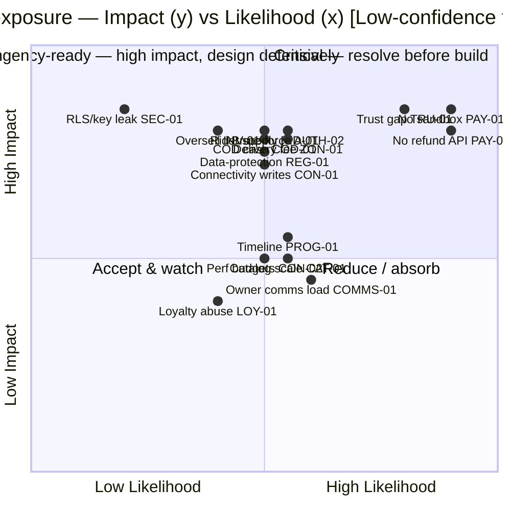
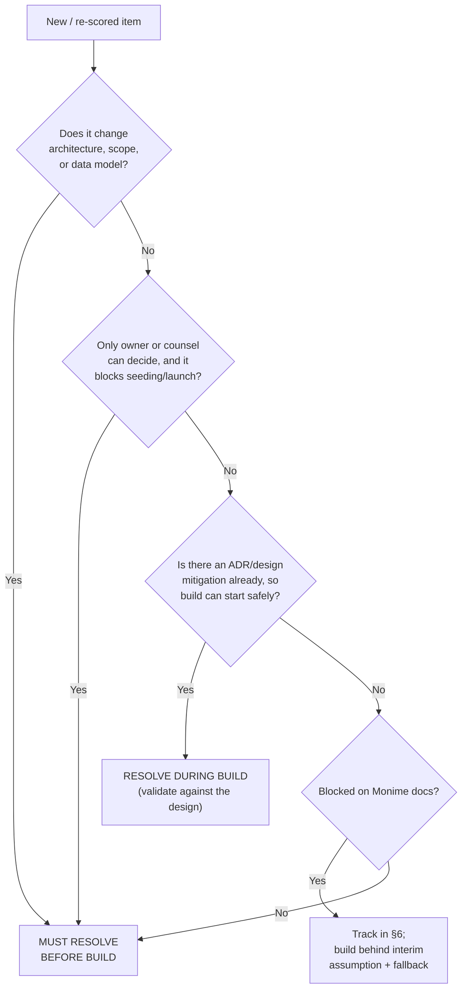
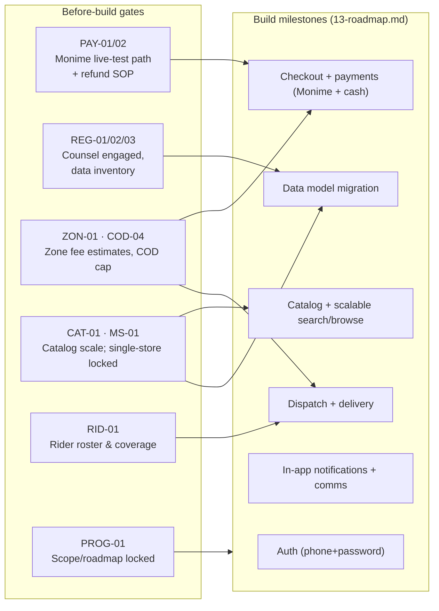
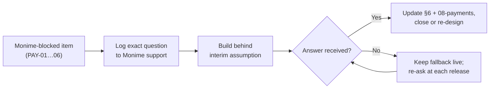
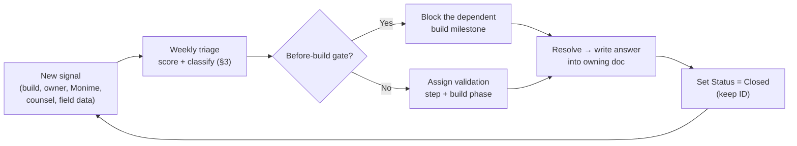

# 12 — Risks, Assumptions & Open Questions Register

> One-line purpose: A single, living register of every risk, unverified assumption, and open question that could move Borteh Sprays 001 off-course — each scored, owned by a role, and tied to a concrete mitigation or validation step, then triaged into what we **must resolve before build** versus what we **resolve during build**.

> Part of the Borteh Sprays 001 planning set. See 00-index.md for the full set.

---

## 0. How to read this register

This is a **living document**. Items are added, re-scored, and closed continuously; nothing here is final. It is the project's shared "what could go wrong / what are we assuming / what don't we know yet" surface, and it is the canonical home for everything other docs flag as *open*, *assumption to verify*, *needs owner*, or *blocked on Monime docs*.

Per the project canon this is a research-and-design artifact: it contains **no production code** — only tables, diagrams, interface/contract sketches, and validation plans.

### 0.1 Column definitions (master register, §2)

| Column | Meaning |
|---|---|
| **ID** | Stable identifier (`PREFIX-NN`). Other docs may reference these IDs; never re-number a retired ID — mark it closed. |
| **Item** | The risk, assumption, or open question, stated specifically enough to act on. |
| **Type** | `Risk` (a bad thing that may happen), `Assumption` (something we are treating as true but have not verified), `Open Q` (a question we cannot yet answer), or `Blocked` (an Open Q that is specifically **blocked on Monime docs/support**). |
| **Impact** | If it bites / is wrong: **H** (threatens launch, money, trust, or legality), **M** (meaningful rework or cost), **L** (annoyance, absorbable). |
| **Likelihood** | Probability it bites / the assumption is wrong: **H / M / L**. For `Blocked` items "likelihood" reads as *how likely this stays unresolved when we need it*. |
| **Owner** | The **role** accountable for driving it to closure (key in §0.3). Accountability is a role, not a person, so it survives staffing changes. |
| **Mitigation / Validation step** | The concrete next action that reduces the risk or answers the question — what we will actually *do*. |
| **Status** | `Open`, `Blocked` (on Monime), `Needs-owner` (waiting on Mr. Borteh), `Needs-counsel` (waiting on legal), `In-design` (mitigation designed in an ADR/doc; to be validated in build), `Accepted` (consciously accepted + monitored), `Closed`. |

### 0.2 Confidence vs. labels

Following the canon, every quantitative or market claim is labelled **High / Medium / Low** confidence and, where it is not a hard citable fact, the words **"assumption to verify."** This register is where those assumptions are collected and tracked; see the consolidated list in §7.

### 0.3 Owner role key

| Code | Role | Accountable for |
|---|---|---|
| **OWN** | Store Owner — *Mr. Borteh* | Business inputs & decisions (zones, fee estimates, COD cap, catalog, rider roster, loyalty/promo config, budget sign-off). |
| **PRD** | Product Lead | Scope, trust UX, prioritization, persona fit. |
| **ENG** | Engineering Lead / Tech Lead | Architecture calls, vendor selection, free-tier/quota strategy. |
| **PAY** | Payments Engineer | Monime + cash (COD) adapters, webhooks, reconciliation (ADR-006). |
| **BE** | Backend Engineer | Supabase/Postgres, RLS, RPCs, inventory atomicity (ADR-010). |
| **MOB** | Mobile Engineer | React Native + Expo app, online-first (with light read caching), performance budgets (ADR-001/003). |
| **OPS** | Operations / Dispatch Lead | Riders, COD cash handling, zone operations (ADR-008). |
| **SEC** | Security owner *(ENG/BE wearing the hat)* | Threat model, secrets, RLS verification (`09-security-threat-model.md`). |
| **DATA** | Data / Analytics | AnalyticsEvent pipeline, KPI instrumentation (ADR-008/011). |
| **LEG** | Legal Counsel *(external — to be engaged)* | SL data-protection, consumer, payments/KYC posture. **Not yet retained — engaging counsel is itself a before-build action.** |

> **Note on LEG:** every legal item is flagged for verification with counsel. This register **does not assert SL legal specifics as fact** — it records the questions and routes them to LEG.

---

## 1. Snapshot & exposure heatmap

> The heatmap is a triage aid, not a measurement. Positions are **Low-confidence assumptions to verify** and will move as we learn.

### 1.1 Counts by category and gate

| Category (prefix) | Items | Before build | During build | H-impact items |
|---|---|---|---|---|
| Payments / Monime (`PAY`) | 9 | 1 strategy gate (+5 Monime-blocked tracked) | 3 | 6 |
| Auth & account security (`AUTH`) | 3 | 0 | 3 | 1 |
| Notifications & comms (`NOT`, `COMMS`, `FCM`) | 3 | 0 | 3 | 0 |
| Regulatory & legal (`REG`) | 5 | 3 | 2 | 1 |
| Connectivity & device (`CON`) | 5 | 0 | 5 | 1 |
| Trust gap (`TRU`) | 3 | 0 | 3 | 1 |
| COD & fraud (`COD`) | 4 | 1 | 3 | 1 |
| Catalog & inventory (`CAT`, `INV`) | 6 | 1 | 5 | 1 |
| Single-vs-multi-store (`MS`) | 1 | 1 | 0 | 0 |
| Riders & dispatch (`RID`) | 4 | 1 | 3 | 1 |
| Delivery zones & fees (`ZON`) | 4 | 1 | 3 | 1 |
| Program & cost (`PROG`, `SEC`) | 5 | 1 | 4 | 2 |
| Loyalty & promotions (`LOY`) | 2 | 0 | 2 | 0 |
| **Total** | **54** | **11 gates** | **39** | **16** |

### 1.2 Impact vs. likelihood heatmap (representative top items)

### 1.3 The "do these or do not start" five

If we resolve nothing else first, these five gate a responsible build start (full treatment in §4):

1. **PAY (Monime engagement)** — establish a workable **live-mode test approach** and a **manual-refund SOP** given no sandbox and no refund API (PAY-01, PAY-02). Cash on delivery / at pickup is a first-class rail alongside Monime, but we still cannot safely build card/mobile-money checkout against unknowns.
2. **Owner business inputs** — delivery-zone **fee estimates + ETAs** (ZON-01, an estimate for guidance, **not** a binding auto-charge), **COD exposure cap** (COD-04), and **catalog scale** (SKU/variant count, CAT-01). These shape the data model, checkout, and catalog search/pagination. (Store count is **locked to a single store** in v2; multi-store is deferred — MS-01.)
3. **Rider supply & coverage** (RID-01) — confirm the own-rider dispatch model is operationally real before we build a (simple, no-live-GPS) dispatch system for it (ADR-008).
4. **Engage legal counsel** (REG-01/02/03) — get a data-protection + payments/KYC read before we model PII and wire payments.
5. **Lock scope & roadmap** (PROG-01) — fix the v1 cut-lines (loyalty/promotions per ADR-012 and optional in-app customer↔store chat are the first things to defer) before committing the timeline.

---

## 2. The master register

> Grouped by theme. Every row carries the required columns (ID · Item · Type · Impact · Likelihood · Owner · Mitigation/Validation) plus a **Status** for living tracking. Gate assignment (before/during build) is in §4–§5.

### 2.A Payments & Monime — ADR-006 / ADR-009; see `08-payments-monime.md`

| ID | Item | Type | Imp | Lik | Owner | Mitigation / Validation step | Status |
|---|---|---|---|---|---|---|---|
| PAY-01 | **No real Monime sandbox** — test tokens 401 on `/v1/*`; real tests run in live mode with real money. | Blocked | H | H | PAY | Build a **live-mode staging path**: dedicated Monime Space, ring-fenced test wallet, micro-value (Le 1) transactions behind a feature flag; manual refund after. Formally **ask Monime for a sandbox/test mode**. Don't gate launch on a sandbox arriving. | Blocked |
| PAY-02 | **No refund API as of 2026-05** — refunds done manually in the Monime dashboard. | Blocked | H | H | PAY · OWN | Define a **manual-refund SOP**: refund in dashboard → record in our `Refund` table → daily reconciliation sweep matches dashboard to `PaymentIntent`. Poll Monime for an eventual API. | Blocked |
| PAY-03 | **Token scopes are per-action** — unclear which scopes checkout-create vs. read vs. webhook need. | Blocked | M | M | PAY | During integration, enumerate the exact scope each call requires; request **least-privilege** tokens; document the scope→endpoint map. Ask Monime for the scope catalog. | Blocked |
| PAY-04 | **Webhook signing scope & secret-rotation cadence** — two-secret CURRENT/PREVIOUS confirmed, but which events are signed and the rotation procedure are not. | Blocked | H | M | PAY · SEC | Implement two-secret verify now (the verify recipe is a **Fact**, see §6); ask Monime which events are signed and the rotation runbook. Reject unsigned/invalid. | Blocked |
| PAY-05 | **`Idempotency-Key` TTL assumed 24h** — unconfirmed. | Blocked | M | M | PAY | Store our own key→intent map with our own TTL; never reuse a key beyond the assumed window; treat a late duplicate as new. Ask Monime for the real TTL. | Blocked |
| PAY-06 | **No confirmed refund/chargeback webhook** — reversals may not notify us. | Blocked | M | M | PAY · OPS | Manual reconciliation sweep (ADR-011) plus periodic dashboard review catches reversals; `Refund` table is source of truth our side. Ask Monime if reversal events exist. | Blocked |
| PAY-07 | **Delayed / async payment confirmation** (mobile money / USSD) — webhook lags; redirect is not authoritative. | Risk | M | H | PAY | Webhook-as-truth; `PaymentIntent` `pending` UX; reconciliation cron; in-app notification to the customer only on confirmed completion. Act only on `payment.completed` / `payment.processing_completed`. | In-design |
| PAY-08 | **Webhooks do not follow redirects** — registered URL must be the exact canonical Edge Function URL. | Risk | M | L | BE | Register the canonical `/functions/v1/monime-webhook` URL; no proxy/redirect in front; monitor for 3xx at that path. (Fact, mitigation known.) | In-design |
| PAY-09 | **Live-mode money exposure during dev/QA** — real Leones spent on tests. | Risk | M | M | PAY · OWN | Ring-fenced low-balance wallet; micro amounts; log every test txn; reconcile/refund weekly. Owner sets a test-spend cap. | Open |

### 2.B Auth & account security — ADR-004

> v2: authentication is **phone number + password** via Supabase Auth (phone-confirmation disabled, so **no SMS OTP is ever sent**). Phone is the unique account identifier; email is optional (recovery only); the password is hashed by Supabase. The former SMS-OTP provider/deliverability/sender-ID risks are **retired** — there is no SMS in the system.

| ID | Item | Type | Imp | Lik | Owner | Mitigation / Validation step | Status |
|---|---|---|---|---|---|---|---|
| AUTH-01 | **Password recovery without SMS** — no OTP channel, so a customer who forgets their password (and set no email) can be locked out. | Risk | M | M | OWN · BE | **Admin-assisted reset** as default: owner verifies the customer by phone/WhatsApp call, then resets/issues a password from the admin (audited). **Optional email self-service** reset for users who add an email. Surface "add a recovery email" in onboarding. Validate the admin-reset + email-reset flows in build. | In-design |
| AUTH-02 | **Credential-stuffing / brute-force on phone+password** — without OTP, the password is the only secret; reused/weak passwords are exposed to automated guessing. | Risk | H | M | SEC · BE | **Login rate-limiting + temporary lockout** (per phone + per IP), exponential backoff, generic failure messages, optional CAPTCHA on repeated failure; minimum-strength password policy; monitor failed-login spikes. See `09-security-threat-model.md`. Validate in build. | In-design |
| AUTH-03 | **Phone-number uniqueness & device convenience** — phone must be enforced UNIQUE; users want fast re-entry without retyping a password each launch. | Assumption | M | L | BE · MOB | DB-level UNIQUE constraint on phone, normalised to E.164 before insert. **Optional in-app PIN / biometric unlock** for a stored session (convenience, not a second factor). **Assumption to verify (Low):** uniqueness collisions on shared family phones — handle with a clear "number already registered" path. | In-design |

### 2.C Notifications & customer comms — ADR-007

> v2: **no paid messaging APIs** (no SMS, no WhatsApp/Meta Cloud API). Customer-facing notifications are an **in-app notification feed** (a `notification` table + Supabase Realtime). Store→customer contact is **one-tap `tel:` call and `https://wa.me/<number>?text=…` click-to-chat** deep links from the admin order screen — no API, no cost. The former WhatsApp-Cloud-API cost/approval and SMS-cost risks are **retired**.

| ID | Item | Type | Imp | Lik | Owner | Mitigation / Validation step | Status |
|---|---|---|---|---|---|---|---|
| NOT-01 | **In-app notification feed delivery** — order-status and restock-available notices depend on Supabase Realtime + a `notification` table; a missed Realtime event or an offline app could mean a customer never sees an update. | Risk | M | M | BE · MOB | Persist every notice in the `notification` table (source of truth); render an unread feed on app open (catch-up, not just live push); mark-read state; Realtime for live updates when online. No reliance on any external gateway. Validate catch-up-on-reconnect in build. | In-design |
| COMMS-01 | **Increased manual owner comms effort** — the comms strategy is the owner manually calling / WhatsApp click-to-chatting customers (order confirmation, delivery-fee agreement, recovery). This is **operational load**, not a technical risk, and it scales with order volume. | Risk | M | M | OWN · OPS | One-tap `tel:` + `wa.me` deep links with pre-filled message templates from the admin order screen to minimise effort per order; the in-app feed handles routine status so calls are reserved for confirmation/exceptions; monitor owner time-per-order and revisit **optional in-app customer↔store chat (v1.5)** or **optional free Expo/FCM push (Could)** if load grows. | Accepted |
| FCM-01 | **Optional free push (Expo/FCM) later** — unreliable on low-end Android (no Play Services on some devices; data off). Push is a *Could*, not a v1 dependency. | Assumption | L | L | MOB | Treat push as **opportunistic only**, layered on top of the in-app feed which remains the guaranteed channel. Validate delivery on real target devices **if/when** push is built. **Assumption to verify (Low).** | Open |

### 2.D Regulatory & legal — verify with counsel; see `09-security-threat-model.md`

| ID | Item | Type | Imp | Lik | Owner | Mitigation / Validation step | Status |
|---|---|---|---|---|---|---|---|
| REG-01 | **SL data-protection applicability** to our PII (phone, names, GPS pins, order history). Specifics unknown — **must verify with counsel**. | Open Q | H | M | OWN · LEG | Engage local counsel; produce a **data inventory** (what PII, where, retention, who can read); design consent + retention + RLS to match. Do **not** assert legal specifics as fact. | Needs-counsel |
| REG-02 | **Payments/KYC obligations** for handling mobile money via an aggregator — who bears KYC, our merchant classification. | Open Q | M | M | OWN · LEG · PAY | Confirm Monime merchant terms + counsel read on KYC; keep Borteh as merchant-of-record only if that is what the terms support. | Needs-counsel |
| REG-03 | **Consumer-protection / e-commerce rules** (refund rights, price display, receipts). | Open Q | M | M | OWN · LEG | Counsel review; publish a clear refund/returns policy; issue order receipts; transparent Le pricing (also a trust lever, TRU-01). | Needs-counsel |
| REG-04 | **Data residency / cross-border** — Supabase region choice vs. any SL residency expectation. | Open Q | M | L | ENG · LEG | Pick the nearest/appropriate Supabase region; document data flows; counsel read. | Open |
| REG-05 | **Rider labor classification & delivery licensing** — employee vs. contractor, any permits. | Open Q | L | M | OWN · LEG | Counsel review of rider engagement model; document terms; align COD-handling SOP (COD-01) with it. | Open |

### 2.E Connectivity & device — perf budgets; ADR-001/003

| ID | Item | Type | Imp | Lik | Owner | Mitigation / Validation step | Status |
|---|---|---|---|---|---|---|---|
| CON-01 | **Writes require connectivity** — cart, checkout, payment, wishlist-add and restock-subscribe need a live connection; a mid-action dropout could confuse users or appear to double-submit. | Risk | H | M | MOB · BE | **Require connectivity + Retry** for every write; clear offline/Retry UI states; **never queue actions for later replay**; make server writes idempotent so a manual retry is safe; server is authoritative (ADR-003); test under simulated flaky/lossy network ("network chaos"). Validate in build. | In-design |
| CON-02 | **Performance budgets may not hold** on real low-end devices (cold start <3s, first payload <150 KB, APK <25 MB). | Assumption | M | M | MOB | Profile on **real target devices early**; WebP, lazy thumbnails, keyset pagination, Hermes, bundle analysis. **Assumption to verify (Medium).** Revisit trigger per ADR-001 if jank persists. | In-design |
| CON-03 | **Stale stock in cached catalog** — user sees "in stock," then it's gone (UI-level oversell). | Risk | M | M | BE · MOB | Server-authoritative reservation at checkout (ADR-010); show "stock as of <time>"; re-check at checkout; Realtime for hot stock. | In-design |
| CON-04 | **Device storage limits** for the read-only cached catalog on low-storage phones. | Assumption | L | M | MOB | Cache metadata + thumbnails only; cap & prune the image cache; lazy full images online. **Assumption to verify (Medium).** | In-design |
| CON-05 | **EAS Update OTA reliability over poor connectivity** — partial/failed bundle downloads. | Assumption | L | L | MOB | Keep OTA bundles small; resumable/atomic apply; fall back to last-good bundle. **Assumption to verify (Low).** | In-design |

### 2.F Online-shopping trust gap

| ID | Item | Type | Imp | Lik | Owner | Mitigation / Validation step | Status |
|---|---|---|---|---|---|---|---|
| TRU-01 | **Trust gap** — customers may refuse to pre-pay and abandon at payment, or distrust online buying entirely. | Risk | H | H | PRD · OWN | **Cash (COD / at pickup) as a first-class rail** alongside Monime (ADR-006); transparent Le pricing + delivery ETA up front; order tracking; verified reviews; easy contact (one-tap call / WhatsApp); phone confirmation before dispatch. Measure abandonment via AnalyticsEvent. | In-design |
| TRU-02 | **Cold-start of trust content** — few/no reviews early on. | Risk | M | M | PRD | Verified-purchase reviews (`Review.verified_purchase`); honestly seed early; surface WhatsApp social proof; prompt post-delivery review. | In-design |
| TRU-03 | **Counterfeit-perfume perception** undermines brand trust. | Risk | M | M | OWN | Authenticity messaging, clear returns policy, consistent branding/packaging. | Open |

### 2.G COD & cash-handling / fraud

| ID | Item | Type | Imp | Lik | Owner | Mitigation / Validation step | Status |
|---|---|---|---|---|---|---|---|
| COD-01 | **COD cash handling** — rider float, daily reconciliation, theft/loss, owner cash exposure. | Risk | H | M | OPS · OWN | Track `DeliveryJob.cod_collected_minor`; **daily rider cash reconciliation**; per-rider running balance; tie SOP to rider terms (REG-05). | Open |
| COD-02 | **COD fraud / fake or refused orders** wasting rider trips & stock reservations. | Risk | M | M | OPS · PRD | **Phone-call / WhatsApp confirmation before dispatch** (no OTP — the owner already calls/messages customers); deposit or Monime pre-pay required above a value threshold; repeat-refuser blocklist; zone limits; reservation expiry releases stock. | Open |
| COD-03 | **Weak dispute/chargeback recourse** on mobile money (compounded by no refund API, PAY-02). | Risk | M | M | PAY · OPS | Webhook-verified payment with amount+currency match before fulfilment; manual reconciliation; clear evidence trail in `OrderStatusHistory`. | In-design |
| COD-04 | **COD exposure cap per order/zone undecided** — owner input. | Open Q | M | M | OWN | **Owner sets a max COD value** per order (and optionally per zone); make it a configurable rule enforced at checkout. | Needs-owner |

### 2.H Catalog & inventory — ADR-010

| ID | Item | Type | Imp | Lik | Owner | Mitigation / Validation step | Status |
|---|---|---|---|---|---|---|---|
| CAT-01 | **Catalog scale** — the catalog is **unlimited** (v2: scale the catalog, not stores); SKU/variant count is unknown and drives search-index sizing, keyset-pagination depth, image-CDN volume and payload budgets (ADR-003). | Assumption | M | M | OWN · PRD | **Owner provides SKU/variant count + rough image volume.** Design for scale from day one: keyset pagination, Postgres **GIN trigram / full-text** search indexes on product/brand/notes, Supabase Storage **CDN** for images, lazy thumbnails, small payloads. **Assumption to verify (Medium).** | Needs-owner |
| CAT-02 | **Initial catalog data-entry & photography effort** underestimated (no existing system — greenfield). | Risk | M | M | OWN · PRD | Bulk import sketch + admin entry; phased catalog (best-sellers first); staff onboarding; WebP pipeline for images. | Open |
| CAT-03 | **Barcode availability/consistency** for POS-lite scanning. | Assumption | L | M | OWN | If products lack barcodes, **generate internal barcodes**; `ProductVariant.barcode` supports both. **Assumption to verify (Medium).** | Open |
| CAT-04 | **Search & pagination performance at high SKU count** — trigram/full-text search and keyset pagination must stay fast as the unlimited catalog grows large. | Risk | M | M | BE | **Load-test search + keyset pagination at high SKU count** (synthetic large catalog); verify index usage (EXPLAIN), payload sizes, and p95 latency; add covering/composite indexes as needed. Validate before scaling the live catalog. | In-design |
| INV-01 | **Oversell under concurrent in-store + online sales** despite ADR-010. (v2: inventory is a **simple per-variant balance** — `qty_on_hand` / `qty_reserved` — with the append-only `StockLedger`; the multi-store location dimension is deferred.) | Risk | H | M | BE | Row-locking RPC (`SELECT … FOR UPDATE`) / atomic conditional UPDATE on the per-variant balance + append-only `StockLedger`; **concurrency load-test** the reserve/confirm/release path before launch. | In-design |
| INV-02 | **Reservation expiry tuning** — too short loses sales; too long starves stock. | Assumption | M | M | PRD · BE | Configurable reservation TTL; monitor expiry vs. conversion; tune post-launch (ADR-010/011). **Assumption to verify (Medium).** | In-design |

### 2.I Single-vs-multi-store rollout

| ID | Item | Type | Imp | Lik | Owner | Mitigation / Validation step | Status |
|---|---|---|---|---|---|---|---|
| MS-01 | **Single store at launch (locked, v2)** — there is **one physical store**; inventory collapses to a simple per-variant balance and the location dimension is **not built into v1**. The only residual risk is that a future 2nd store would need the dimension reintroduced. | Open Q | M | L | OWN · ENG | **Decision recorded: single-store v1.** Do not build transfer / multi-location UX or a per-location stock model now; keep the `StockLedger` append-only so a location dimension can be added later. **Revisit trigger only** when a 2nd store becomes real. | Accepted |

### 2.J Riders & dispatch — ADR-008

| ID | Item | Type | Imp | Lik | Owner | Mitigation / Validation step | Status |
|---|---|---|---|---|---|---|---|
| RID-01 | **Rider availability & zone coverage** — are there enough own riders, scheduled, covering the active zones? The whole own-rider bet depends on it. | Risk | H | M | OPS · OWN | **Confirm rider roster, schedules, and zone coverage** before building dispatch. Manual/assisted assignment; staff-as-fallback rider; cap online zones to what riders cover. | Needs-owner |
| RID-02 | **Rider app literacy / onboarding** (Saidu — basic Android). | Risk | M | M | OPS · MOB | Ultra-simple rider screen (assigned-orders list, order items, landmark/pin, one-tap call, mark picked-up/delivered, cash collected) — **no live GPS tracking**; in-person training; phone-call fallback for assignment (no SMS). | In-design |
| RID-03 | **Rider accountability** for COD & deliveries. | Risk | M | M | OPS | Per-rider COD balance & job audit trail (`DeliveryJob`, `OrderStatusHistory`); daily settlement (links COD-01). | Open |
| RID-04 | **Navigation to landmark/GPS pins** without formal addresses → getting lost, failed deliveries. | Risk | M | M | OPS · PRD | `DeliveryLocation` = landmark_text + geo pin + contact_phone + notes; one-tap call; map deep-link; phone-confirm before/at arrival. | In-design |

### 2.K Delivery zones & fees

| ID | Item | Type | Imp | Lik | Owner | Mitigation / Validation step | Status |
|---|---|---|---|---|---|---|---|
| ZON-01 | **Delivery-zone fee estimates & ETAs** — owner must define zones with an **estimate** for guidance; the **actual** fee is confirmed per order by the owner (v2). Gates the checkout estimate display & data seeding. | Open Q | H | M | OWN · OPS | **Owner provides zones + `estimated_fee_minor` (or `fee_estimate_text` / range) + `eta_text`.** Seed the configurable `DeliveryZone` table as a **guide only**; checkout SHOWS the estimate but does not hard-charge it; `order.delivery_fee_minor` is set (nullable until then) at confirmation. Iterate estimates from real delivery data. | Needs-owner |
| ZON-02 | **Zone resolution from a GPS pin** — a pin may fall outside/ambiguously between zones. | Assumption | M | M | PRD · OPS | Named-region fallback + manual override in admin + phone confirmation; don't auto-charge on an uncertain match. **Assumption to verify (Medium).** | In-design |
| ZON-03 | **ETA accuracy** (`eta_text`) — unrealistic ETAs damage trust (links TRU-01). | Risk | M | M | OPS | Quote conservative ETAs; measure delivered-within-ETA via AnalyticsEvent; adjust per zone. | Open |
| ZON-04 | **Delivery-fee ambiguity (estimate vs. actual)** — showing an estimate at checkout but confirming the real fee on a call can feel like a surprise charge and erode trust (links TRU-01). | Risk | M | M | OWN · PRD | Label the figure clearly as an **estimate**, show the range, and confirm the final fee on the order-confirmation call/WhatsApp before dispatch; never silently change the total. Keep `order.delivery_fee_minor` nullable until agreed. Measure complaints/abandonment via AnalyticsEvent. | In-design |

### 2.L Program, cost & security

| ID | Item | Type | Imp | Lik | Owner | Mitigation / Validation step | Status |
|---|---|---|---|---|---|---|---|
| PROG-01 | **3–4 month timeline for a *standard* v1** (delivery, analytics, restock, wishlist, reviews, loyalty) may be optimistic for a small team. | Assumption | M | M | ENG · PRD | Phased roadmap (`13-roadmap.md`); scope guardrails; designate loyalty/promotions and optional in-app chat as the first cut-line if slipping. **Assumption to verify (Medium).** | Open |
| PROG-02 | **Free-tier limits exceeded** (Vercel hobby, Supabase edge invocations / Realtime / Storage egress, optional Expo push) as usage grows. (v2 removes paid SMS/WhatsApp APIs, lowering this risk.) | Risk | M | M | ENG | Monitor quotas; Supabase is the **only** committed paid service (ADR-002); define upgrade thresholds, not surprises. | Open |
| PROG-03 | **Supabase tier sizing** — DB size, edge invocations, realtime connections, storage on the chosen plan. | Assumption | M | M | ENG | Capacity model vs. expected catalog + order volume; budget for Supabase Pro as the planned step-up. **Assumption to verify (Medium).** | Open |
| PROG-04 | **Small-team bus factor / key-person risk.** | Risk | M | M | ENG | This planning set + ADRs as living docs; code review; no single-owner subsystems. | Accepted |
| SEC-01 | **Service-role key leakage / RLS misconfiguration** exposes data or allows oversell bypass. | Risk | H | L | SEC · BE | Service-role key only in Edge Functions/server env, never in the app; **RLS policy test suite**; secret scanning; see `09-security-threat-model.md`. Validate in build. | In-design |

### 2.M Loyalty & promotions — ADR-012

> v2: a **configurable, owner-editable** loyalty & promotions engine (`loyalty_config`, `promo_rule`, `loyalty_tier`/`loyalty_card`, `loyalty_account`, `loyalty_ledger`). Thresholds, rates, points and discounts are tuned by the owner in the admin with **no code change**; rules are evaluated server-side at checkout.

| ID | Item | Type | Imp | Lik | Owner | Mitigation / Validation step | Status |
|---|---|---|---|---|---|---|---|
| LOY-01 | **Loyalty / promo misconfiguration or abuse** — owner-editable rules (spend-threshold discounts, points-earn, tier/card grants) could be set wrong (e.g. 100% off) or be gamed (stacking promos, self-referral, refund-then-keep-points). | Risk | M | M | BE · PRD | **Server-side evaluation only** at checkout; validation bounds on `discount_value` / thresholds (sane min/max, no negative totals); usage caps (per-rule, per-user, per-period) on `promo_rule`; non-stacking unless explicitly allowed; reverse points on refund via `loyalty_ledger`; **audit log** of config changes. Validate rule evaluation + caps in build. | In-design |
| LOY-02 | **Points / discount financial liability** — accumulated `points_balance` and ongoing tier/card discounts are a real cost; unbounded or never-expiring points erode margin. | Assumption | L | M | OWN · PRD | `loyalty_config.points_expiry_days` + `point_value_minor` bound the liability; model the cost at expected volume; feature on/off flags let the owner pause a program; report outstanding points value in admin. **Assumption to verify (Medium).** | Open |

---

## 3. Triage gates — how an item is classified

**Rule of thumb:** *before build* = "we'd build the wrong thing, or build illegally/unsafely, without the answer." *During build* = "we already have a defensible design (an ADR), and the open part is validation/tuning."

---

## 4. MUST RESOLVE BEFORE BUILD

These are the items where starting without an answer risks building the wrong architecture, seeding wrong data, breaking the law/trust, or relying on an operationally non-existent capability. **Target window: the pre-build Discovery sprint (weeks 0–3 of `13-roadmap.md`).**

### 4.1 How the gates block the build

### 4.2 Before-build action table

| ID(s) | Gate | Owner | Concrete next action | Exit criteria ("done when…") | Target |
|---|---|---|---|---|---|
| **PAY-01, PAY-02** | Workable Monime live-test approach + manual refund SOP | PAY · OWN | Stand up a ring-fenced Space + test wallet; document Le-1 live-test procedure; write the dashboard-refund → `Refund` table → reconciliation SOP; open a Monime support thread for sandbox/refund API/scopes. | A repeatable safe live-test procedure exists; refund SOP signed off; Monime questions logged (§6). | Wk 1–3 |
| **REG-01, REG-02, REG-03** | Engage counsel; data-protection + KYC + consumer read | OWN · LEG | Retain local counsel; deliver the data inventory; get written guidance on PII handling, KYC, refund/consumer rules. | Counsel engaged; data inventory done; no red-flag blockers to the planned data model/payments. | Wk 0–4 |
| **ZON-01, COD-04** | Delivery-zone fee estimates, ETAs, COD cap | OWN · OPS | Owner lists initial zones with `estimated_fee_minor` (or a fee range) + `eta_text`, and a max COD value per order/zone. | Estimates/ETAs + COD cap captured and ready to seed `DeliveryZone` (guide only) / checkout rules. | Wk 0–2 |
| **CAT-01** | Catalog scale | OWN · PRD | Owner provides SKU/variant count (and rough image volume). | Count known; scalable search-index + keyset-pagination + image-CDN strategy chosen accordingly. | Wk 0–2 |
| **MS-01** | Single-store decision (locked) | OWN · ENG | Confirm single store for v1 (v2 locked). | Decision recorded: **single-store v1**, simple per-variant balance, multi-store location dimension deferred. | Wk 0–1 |
| **RID-01** | Rider supply & zone coverage | OPS · OWN | Confirm rider roster, schedules, and which zones they actually cover. | Coverage confirmed; online zones capped to covered areas; staff-fallback defined. | Wk 0–2 |
| **PROG-01** | Scope & roadmap realism | ENG · PRD | Reconcile the standard-v1 scope against the timeline; set cut-lines. | Roadmap (`13-roadmap.md`) locked with explicit cut-lines (loyalty/promotions per ADR-012 and optional in-app chat first). | Wk 0–2 |

### 4.3 Notes on the heavy gates

- **Monime (PAY-01/02) is now the single highest-leverage before-build gate** (the former SMS-provider gate is retired — v2 auth is phone+password with no SMS). The Monime gates can never be fully "resolved" pre-build because they are *blocked on Monime docs* (§6); what we resolve before build is our **working approach under the unknown**: a safe live-test path and a manual-refund SOP. We then build payments (Monime **and** cash) behind interim assumptions + fallbacks, not blocked.
- **Owner inputs (ZON-01 fee estimates, COD-04 cap, CAT-01 catalog scale, RID-01 rider coverage)** are cheap to collect and expensive to guess; MS-01 (single store) is locked in v2. They are consolidated for the owner in §8.
- **Counsel (REG-01/02/03)** gates the data model migration (M6) and payments wiring; the data inventory is a one-page deliverable we can produce immediately to make the counsel conversation efficient.

---

## 5. RESOLVE DURING BUILD

These already have a **design mitigation (an ADR or a sibling doc)**, so the build can start; the open part is **validation, tuning, or capacity** against that design. Each row names *what we validate* and *which build phase / doc owns the test*.

| ID | What we validate during build | Owner | Validated in / against | Build phase |
|---|---|---|---|---|
| PAY-03 | Exact token scopes per Monime call → least-privilege tokens | PAY | `08-payments-monime.md` | Payments |
| PAY-04 | Two-secret signature verify + rotation runbook | PAY · SEC | `08`, `09` | Payments |
| PAY-05 | Idempotency-Key handling within our own TTL | PAY | `07-api-design.md` | Payments |
| PAY-06 | Reversal detection via reconciliation sweep | PAY · OPS | ADR-011 | Payments |
| PAY-07 | Pending-state UX + reconciliation cron correctness | PAY | `08` | Payments |
| PAY-08 | Canonical webhook URL, no redirect | BE | `07` | Payments |
| PAY-09 | Live-mode test spend stays within owner cap | PAY · OWN | this register | Payments |
| AUTH-01 | Admin-assisted password reset + optional email self-service reset flows | OWN · BE | ADR-004, `09` | Auth |
| AUTH-02 | Login rate-limit + lockout against credential-stuffing/brute-force | SEC · BE | `09-security-threat-model.md` | Auth |
| AUTH-03 | Phone-uniqueness constraint + optional PIN/biometric unlock | BE · MOB | ADR-004 | Auth |
| NOT-01 | In-app notification feed (Realtime + `notification` table) with catch-up on reconnect | BE · MOB | ADR-007 | Notifications |
| COMMS-01 | One-tap `tel:`/`wa.me` deep links with templates; owner time-per-order monitored | OWN · OPS | ADR-007 | Comms |
| FCM-01 | Optional Expo/FCM push delivery on real devices (layered on the in-app feed) | MOB | ADR-007 | Notifications (optional) |
| CON-01 | Connectivity-required writes show clear offline/Retry UI; idempotent server writes on retry | MOB · BE | ADR-003 | Cart/checkout |
| CON-02 | Perf budgets on real target devices (cold start, payload, APK) | MOB | perf budgets / ADR-001 | Mobile shell |
| CON-03 | "Stock as of" + checkout re-check prevents UI oversell | BE · MOB | ADR-010 | Catalog/checkout |
| CON-04 | Read-only cached-catalog size on low-storage devices | MOB | ADR-003 | Mobile shell |
| CON-05 | EAS OTA resilience over poor connectivity | MOB | ADR-001 | Release eng |
| TRU-01 | Checkout abandonment & cash-vs-MoMo mix instrumented | PRD · DATA | `04-standout-features.md`, ADR-008 | Checkout/analytics |
| TRU-02 / TRU-03 | Verified-review flow + authenticity messaging | PRD | `03-prd.md` | Reviews |
| COD-01 | Rider cash reconciliation flow & per-rider balance | OPS | ADR-008 | Dispatch |
| COD-02 | Pre-dispatch phone-call/WhatsApp confirm + high-value deposit rule | OPS · PRD | `03-prd.md` | Dispatch |
| COD-03 | Payment-verified-before-fulfilment guard + evidence trail | PAY · OPS | `08`, `09` | Checkout/dispatch |
| INV-01 | Concurrency load-test of reserve/confirm/release (no oversell) | BE | ADR-010 | Inventory |
| INV-02 | Reservation TTL tuning vs. conversion | PRD · BE | ADR-010/011 | Inventory |
| CAT-02 | Bulk import + phased catalog entry workflow | OWN · PRD | `10-admin-analytics.md` | Admin/catalog |
| CAT-03 | Internal-barcode generation where products lack barcodes | OWN | `06-data-model.md` | Admin/POS |
| CAT-04 | Load-test search (GIN trigram/full-text) + keyset pagination at high SKU count | BE | ADR-003, `06` | Catalog |
| RID-02 | Rider-screen usability test with a real rider (Saidu) | OPS · MOB | ADR-008 | Dispatch |
| RID-03 | Rider job/COD audit trail completeness | OPS | ADR-008 | Dispatch |
| RID-04 | Landmark/pin navigation + call + map deep-link in the field | OPS · PRD | `06-data-model.md` | Dispatch |
| ZON-02 | Pin→zone resolution + manual override correctness | PRD · OPS | `06`, `07` | Checkout/dispatch |
| ZON-03 | Quoted-vs-actual ETA tracked and tuned per zone | OPS · DATA | ADR-008 | Analytics |
| ZON-04 | Estimate-vs-actual delivery-fee UX: labelled estimate + per-order confirmation, no surprise charge | OWN · PRD | this register | Checkout/dispatch |
| REG-04 | Supabase region choice documented vs. residency read | ENG · LEG | ADR-002 | Infra |
| REG-05 | Rider engagement terms align with COD SOP | OWN · LEG | this register | Ops |
| PROG-02 / PROG-03 | Free-tier/Supabase quota monitoring + upgrade thresholds | ENG | ADR-002 | Infra/ops |
| SEC-01 | RLS policy test suite + secret-handling review | SEC · BE | `09-security-threat-model.md` | Cross-cutting |
| LOY-01 | Server-side promo/loyalty evaluation + validation bounds + usage caps + config audit | BE · PRD | ADR-012 | Loyalty |
| LOY-02 | Points-liability model + expiry + on/off flags | OWN · PRD | ADR-012 | Loyalty |

---

## 6. Blocked on Monime docs (consolidated)

> These are tracked here so they are never silently assumed. For each we record **the exact question for Monime**, our **interim assumption** (so build is not blocked), and the **fallback** if the answer is unfavourable. The webhook-verification recipe itself is a **Fact** from a battle-tested integration (see `08-payments-monime.md`); only the items below are unconfirmed.

| ID | Question to put to Monime | Interim assumption (build behind this) | Fallback if unfavourable |
|---|---|---|---|
| PAY-01 | Is there any sandbox / test mode? (test tokens currently 401 on `/v1/*`.) | None exists; we test in live mode with ring-fenced micro-value txns. | Permanent live-mode staging discipline + feature flag; never assume a sandbox arrives. |
| PAY-02 | Is there (or coming) a refund API? | None as of 2026-05; refunds are manual in the dashboard, recorded in our `Refund` table. | Keep manual refund SOP indefinitely; add reconciliation time/headcount. |
| PAY-03 | What is the exact scope catalog, and which scope does each endpoint need? | Per-action scopes; request least-privilege per call during integration. | Request a broader token only if least-privilege blocks a needed call; document. |
| PAY-04 | Which events are signed, and what is the secret-rotation procedure/cadence? | Two-secret CURRENT/PREVIOUS; all subscribed events signed; verify timing-safe. | Reject anything that fails verification; rotate via the documented two-secret method. |
| PAY-05 | What is the real `Idempotency-Key` TTL? | Assume 24h; never reuse a key past it. | Shorten our reuse window; store our own key→intent map regardless. |
| PAY-06 | Do refund/chargeback/reversal webhooks exist? | None confirmed; detect reversals via reconciliation sweep + dashboard. | Manual periodic dashboard reconciliation remains the safety net. |

---

## 7. Assumptions to verify (consolidated)

Every unverified assumption in this set, with how we will check it. Confidence is the canon's High/Medium/Low.

| ID | Assumption | Confidence | How we verify |
|---|---|---|---|
| CON-02 | Perf budgets hold on real low-end Android | Medium | Device-lab profiling of cold start, payload, APK |
| CON-04 | Read-only cached catalog fits low-storage devices | Medium | Measure on-device cached-catalog + image-cache footprint |
| CON-05 | EAS OTA survives poor connectivity | Low | Throttled-network OTA tests |
| FCM-01 | Optional Expo/FCM push is reliable enough to bother adding later | Low | Delivery-rate test on target devices (only if/when built) |
| AUTH-03 | Phone-as-unique-identifier is workable (few shared-phone collisions) | Low | Monitor "number already registered" cases at onboarding |
| CAT-01 | SKU/variant count + scalable search/pagination design hold at size | Medium | Owner SKU count + load-test of GIN-trigram/full-text search & keyset pagination |
| CAT-03 | Products have usable barcodes (or we mint them) | Medium | Audit existing stock labelling |
| INV-02 | Default reservation TTL balances conversion vs. stock starvation | Medium | Monitor expiry-vs-conversion post-launch |
| ZON-02 | GPS-pin → zone resolution is accurate enough | Medium | Field test pins across zone boundaries |
| LOY-02 | Points/discount liability stays within margin at volume | Medium | Cost-model outstanding points + tier discounts at expected volume |
| PROG-01 | Standard v1 fits 3–4 months for the team | Medium | Roadmap reconciliation + velocity tracking |
| PROG-03 | Chosen Supabase tier covers v1 load | Medium | Capacity model vs. expected volume |
| PAY-05 | Idempotency-Key TTL ≈ 24h | Low (blocked) | Confirm with Monime (§6) |
| (Exec-summary KPIs) | All 6- and 12-month success targets in `01-executive-summary.md` | Low | Calibrate against real AnalyticsEvent launch data |

---

## 8. Owner inputs needed (for Mr. Borteh)

These are decisions/data **only the owner can supply**, and most are before-build gates. Collecting them is the cheapest risk reduction in the whole project.

| # | What we need from the owner | Blocks | Ref |
|---|---|---|---|
| 1 | **Delivery zones + estimated fee per zone (`estimated_fee_minor` / range) + ETA text** (estimate only; actual fee confirmed per order) | Checkout estimate display, `DeliveryZone` seeding | ZON-01 |
| 2 | **Maximum COD value** per order (and per zone, if different) | COD fraud rule at checkout | COD-04 |
| 3 | **Catalog scale** — SKU/variant count and rough image volume | Search-index + keyset-pagination + image-CDN strategy, payload budget | CAT-01 |
| 4 | **Initial loyalty/promo config** — points rate, point value, expiry, spend thresholds, tier/card discounts, on/off flags | Loyalty engine seeding (`loyalty_config`/`promo_rule`/tiers) | LOY-01 · ADR-012 |
| 5 | **Rider roster, schedules, and covered zones** | Whether/where own-rider dispatch is viable | RID-01 |
| 6 | **Test-spend cap** for live-mode Monime testing | Safe payment QA | PAY-09 |
| 7 | **Budget sign-off** to engage local legal counsel | Data-protection/KYC clearance | REG-01/02/03 |
| 8 | Current **monthly counter volume** (to calibrate KPI targets) | Realistic success metrics | `01-executive-summary.md` |

---

## 9. Living-register process

### 9.1 Cadence & ownership

- **Weekly triage (15 min):** ENG + PRD walk new/changed items, re-score Impact/Likelihood, update Status, reassign owners.
- **Before each build phase starts:** confirm that phase's before-build gates (§4) are `Closed`; if not, the phase does not start.
- **At each release:** re-ask all `Blocked` (Monime) items (§6); update interim assumptions.
- **Definition of "resolved/Closed":** the exit criterion is met, the answer is written into the owning sibling doc (e.g. `08-payments-monime.md`), and the row's Status is set to `Closed` (the ID is kept, never deleted or reused).

### 9.2 Escalation

| Trigger | Escalate to | Action |
|---|---|---|
| A before-build gate is still `Open` at its target week | ENG → OWN | Re-plan the dependent milestone or de-scope it |
| A `Blocked`(Monime) item turns unfavourable (e.g. confirmed no refund API ever) | PAY → OWN · OPS | Resource the manual workaround; adjust policy/budget |
| A `Needs-counsel` item returns a red flag | LEG → OWN | Halt the affected data/payment work until redesigned |
| A `During-build` validation fails its exit criterion | owning role → ENG | Re-open as a Risk; design a new mitigation |

### 9.3 Change log (seed)

| Date | Change | By |
|---|---|---|
| 2026-06-15 | Initial register created; 51 items across 12 categories; 13 before-build gates identified; Monime-blocked set (§6) and owner-inputs (§8) consolidated. | PRD |
| 2026-06-16 | **v2 owner decisions applied:** auth → phone+password (no SMS OTP); removed SMS-provider & WhatsApp-Cloud-API risks; added AUTH (recovery/brute-force), in-app notifications + manual-comms load, catalog-scale search/pagination, delivery-fee estimate-vs-actual, and Loyalty & promotions (LOY, ADR-012). Now 54 items / 11 before-build gates. | PRD |

---

> **Traceability:** every item above ties to a persona/goal and to an ADR or sibling doc — `08-payments-monime.md` (Monime), `09-security-threat-model.md` (security/regulatory), `04-standout-features.md` (trust/COD/loyalty), `03-prd.md` (scope), `06-data-model.md` (entities), `07-api-design.md` (contracts), `10-admin-analytics.md` (admin/POS), `13-roadmap.md` (phases), `11-adrs.md` (decisions, incl. ADR-012 loyalty/promotions). This register is the project's shared truth about what we don't yet know — keep it honest and keep it current.
