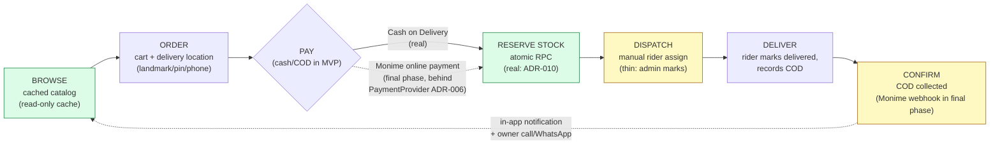
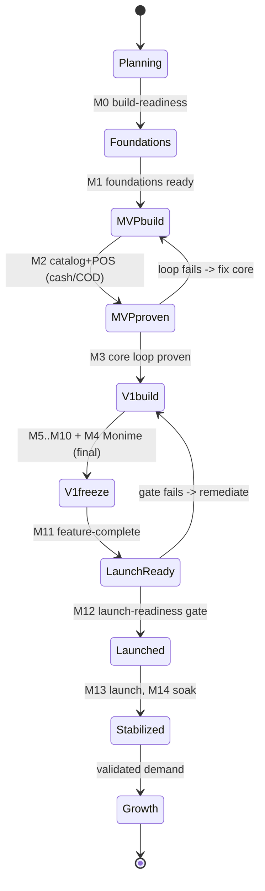
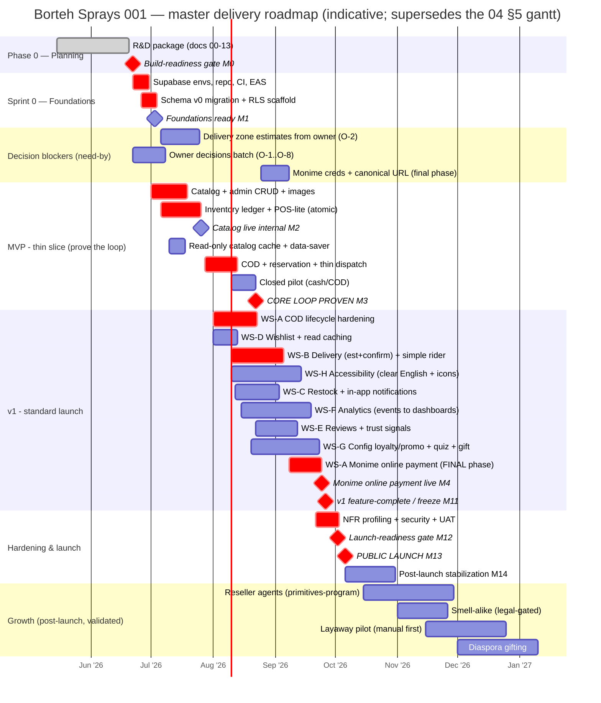
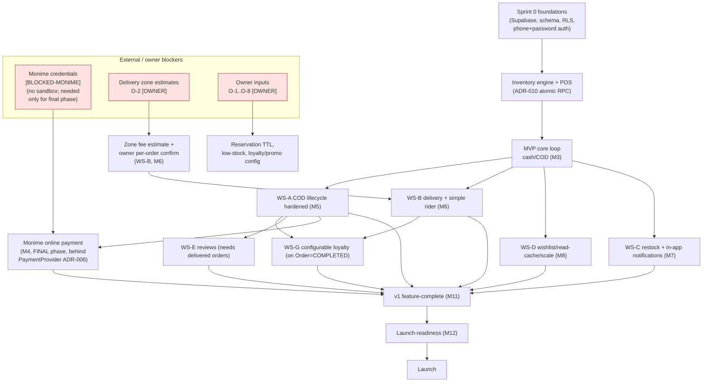
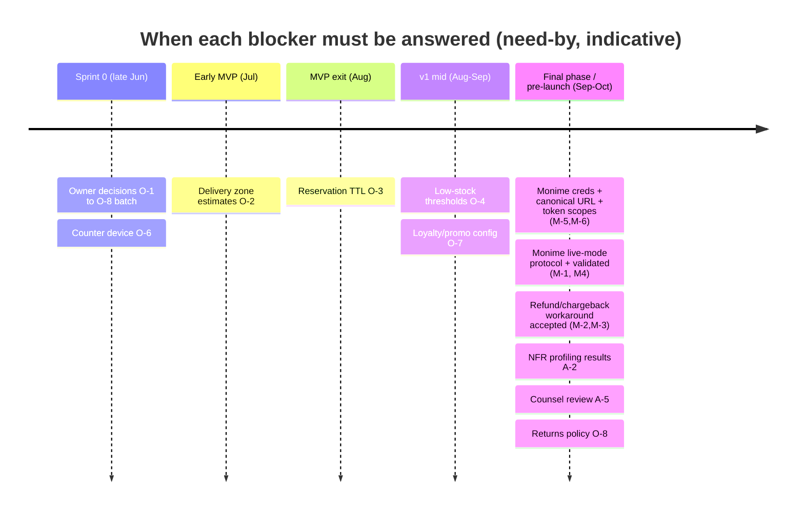
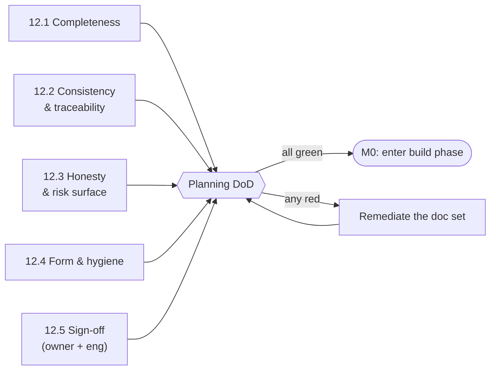
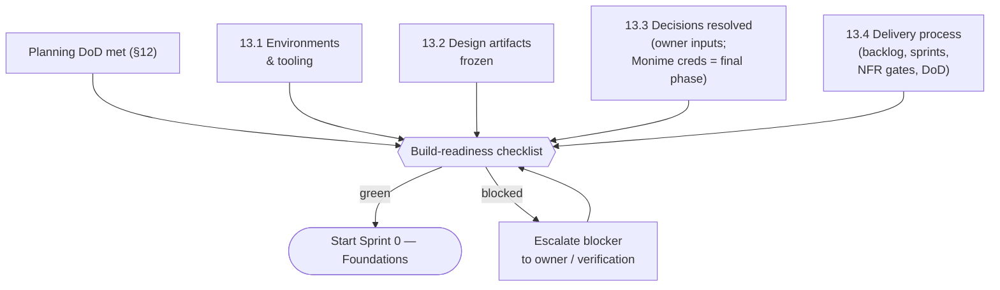

# 13 — Delivery Roadmap

> The master phased plan that takes Borteh Sprays 001 from a research-and-design package to a standard public launch and beyond — thin-slice MVP, the ~3–4 month v1, Growth — with milestones, sequencing, dependencies (the early core loop runs on cash/COD with no external payment blocker; Monime online payment is the final build phase), a Definition of Done for this planning phase, and the entry gate into the build phase.

> Part of the Borteh Sprays 001 planning set. See 00-index.md for the full set.

---

## 0. How to read this document

This is the **master schedule**. Where any sibling shows an indicative timeline — notably the stand-out-feature gantt in `04-standout-features.md` §5 and the vision horizon in `01-executive-summary.md` — *this* document is authoritative and they defer to it. The roadmap does not invent scope: it **sequences** the scope already fixed by the MoSCoW split in `03-prd.md` §4 and the feature verdicts in `04-standout-features.md` §3. Every phase boundary is a *gate* with explicit exit criteria, not a calendar wish.

### 0.1 What this document is — and is not

| It IS | It is NOT |
|---|---|
| The order in which we build, and what "done" means at each gate | A commitment of specific delivery dates (dates are indicative, see §0.4) |
| The dependency map, including external blockers (owner inputs; Monime credentials needed only for the final online-payment phase) | A staffing/HR plan or a budget (budget is locked: Supabase-only, ADR-002) |
| The Definition of Done for the **planning** phase and the entry gate for **build** | An architecture/data-model/API spec (those are `05`/`06`/`07`) |
| A traceability bridge: phase ↔ MoSCoW (`03`) ↔ standout features (`04`) | A re-prioritization — priorities are owned by `03`/`04` |

### 0.2 Confidence & status legend (consistent with `03-prd.md` §0.1)

| Tag | Meaning |
|-----|---------|
| **[Fact]** | Hard, citable, or owner-confirmed constraint. Locked. |
| **[VA]** | Validated assumption (supported by `02-market-research.md` or a battle-tested integration). |
| **[UA-H/M/L]** | Unverified assumption, confidence High/Medium/Low; carries the words "assumption to verify". |
| **[BLOCKED-MONIME]** | Cannot finalize until official Monime documentation/support confirms. Mirrored in `12-risks-assumptions.md`. |
| **[OWNER]** | Needs a decision/data point from Mr. Borteh before the dependent work can finish. |

### 0.3 Phase vocabulary (locked, from the canon and `03-prd.md` §0.2)

| Phase | What it is | External? | Rough window |
|---|---|---|---|
| **Phase 0 — Planning & Design** | This R&D package (docs `00`–`13`). No production code. | No | now (ending) |
| **Sprint 0 — Foundations** | Build kickoff: environments, repo, schema migration, CI, RLS scaffolding. | No | ~2 weeks |
| **MVP — thin slice** | Internal/pilot milestone that **proves the core loop** browse → order → cash/COD → deliver. *Not* the launch product. | Pilot only | ~Month 1–2 |
| **v1 — standard launch** | The owner's **committed** public deliverable: delivery, analytics, restock, wishlist, reviews + the v1 stand-out features. | **Yes** | ~Month 3–4 |
| **Growth** | Post-launch, demand-validated, higher-risk/ops features. | Yes | Month 4+ |

> **[Fact] anchor (from `03-prd.md` §4 and the canon):** v1 is **not** a thin MVP. The MVP here is an internal sequencing milestone; the external promise is **v1**, and v1 must include delivery, analytics, restock notifications, wishlist, and reviews.

### 0.4 On the dates in this document

All calendar dates below are **[UA-M] assumptions to verify** against actual team capacity at build kickoff. They are anchored to: (a) today = 2026-06-15; (b) the `01-executive-summary.md` vision gantt (standard v1 build = 2026-06-15 + ~120 days → public launch ≈ early-to-mid October 2026); and (c) the `04-standout-features.md` §5 gantt (MVP in July, v1 features Aug–Sep, Growth from October). **Capacity assumption [UA-M]:** a small founding team (≈2–3 engineers + the owner part-time on content/ops decisions). If capacity differs, slip the dates, not the **gate criteria**. Effort sizing reuses the S/M/L scale from `04-standout-features.md` §1. **[Note, v2]** Removing SMS-provider selection and WhatsApp/Meta verification from the critical path (OWNER DECISIONS v2 — no paid messaging APIs, no SMS-OTP; auth is phone+password; notifications are in-app) materially shortens the dependent chain and adds schedule buffer; the dates below are held but now carry slack rather than risk.

---

## 1. Roadmap at a glance

```mermaid
flowchart LR
    P0["Phase 0<br/>Planning & Design<br/>(docs 00–13, no code)"]
    G0{{"Gate M0<br/>Build-readiness<br/>(see §12–13)"}}
    S0["Sprint 0<br/>Foundations<br/>(Supabase, repo, schema,<br/>CI, RLS scaffolding)"]
    MVP["MVP — thin slice<br/>PROVE THE CORE LOOP<br/>browse → order → cash/COD → deliver<br/>(internal + closed pilot)"]
    G1{{"Gate M3<br/>Core loop proven<br/>(cash/COD)"}}
    V1["v1 — STANDARD LAUNCH<br/>delivery · analytics · restock ·<br/>wishlist · reviews · standout set"]
    G2{{"Gate M12<br/>Launch readiness<br/>(NFR + security + UAT)"}}
    L["Public Launch<br/>(M13)"]
    GR["Growth<br/>reseller · smell-alike ·<br/>layaway pilot · diaspora"]

    P0 --> G0 --> S0 --> MVP --> G1 --> V1 --> G2 --> L --> GR
    classDef gate fill:#fde7c7,stroke:#b7791f,color:#1a1a1a;
    class G0,G1,G2 gate;
```

**The spine in one sentence:** prove the *whole* value chain works on a thin slice as early as possible on **cash/COD** (which needs no external integration), then *harden and complete* that slice into the trust-first standard product the owner committed to — with **Monime online payment bolted on as the final build phase** behind the PaymentProvider abstraction (ADR-006).

| Phase | Primary goal | Audience | Headline contents | MoSCoW focus (`03` §4) |
|---|---|---|---|---|
| Sprint 0 | A buildable foundation | Team | Environments, migrations, RLS, CI, EAS, Edge-Function skeletons | enablers |
| MVP | Validate the core loop (cash/COD) | Internal + pilot | Catalog, admin CRUD, **single-source inventory + POS-lite**, phone+password auth, cart, **one thin order→cash/COD→deliver path** | Must rows 1–7 + a *minimal* cash/COD slice of 14,16,18–20 |
| v1 | Ship the trusted standard store | Public (SL) | Hardened cash/COD checkout, delivery (zone fee estimate + owner per-order confirm) + simple rider app, restock, wishlist, reviews, analytics, in-app notifications, v1 standout set, **Monime online payment (final phase)** | all **Must** + most **Should** |
| Growth | Compound the flywheel | Public | Reseller agents, smell-alike (legal-gated), layaway pilot, diaspora gifting (live rider GPS pushed to far-future) | **Could** + deferred |

---

## 2. The thin-slice MVP — proving the core loop (explicit callout)

> **The MVP exists to answer one question before we invest in the full build: *does the loop `browse → order → cash/COD → deliver` actually work, end-to-end, in Sierra Leone, on our stack?*** Everything in the MVP is in service of that proof. It is deliberately thin, partly manual, and pilot-only.

### 2.1 The core loop the MVP must prove

Legend: **green = built for real even in MVP** (the load-bearing, hard-to-retrofit part is the atomic oversell-proof inventory engine); **yellow = deliberately thin/manual in MVP**, hardened in v1.

### 2.2 What is IN the MVP (and at what fidelity)

| Capability | MVP fidelity | Why this fidelity | `03` row / story |
|---|---|---|---|
| Phone + password auth | **Real** | Identity underpins everything; phone is the unique account id, password hashed by Supabase (phone-confirmation disabled → no OTP) | row 1 / AUTH-1,4 |
| Guest catalog browse (no wall) | **Real** | Browsing must never gate on auth | row 2 / AUTH-2, CAT-1 |
| Catalog: brands/categories/variants/price/stock | **Real** | The thing being sold | row 3 / CAT-1,2,4 |
| Read-only catalog cache (data-saver) | **Real (light)** | Read-only cache (ADR-003): cold start / brief dropout is not a blank screen; refreshed when online, never queues writes | rows 9 (early) / CAT-5 |
| Admin catalog CRUD + images | **Real** | Owner must load real product data for a real pilot | row 4 / ADM-1,2 |
| Inventory: StockLedger + InventoryItem | **Real (core)** | Single source of truth, append-only ledger — never retrofit | row 5 / ADM-3,4 |
| POS-lite in-store sale (atomic, no oversell) | **Real (core)** | The oversell-prevention RPC (ADR-010) is the riskiest correctness invariant; prove it under concurrent online+in-store load now | row 6 / ADM-3 |
| Cart (persistent) | **Real** | Part of the loop | row 7 / CART-1,2 |
| Delivery location (landmark + pin + phone) | **Real, single flow** | Needed to actually deliver | row 12 / CART-3 |
| Stock reservation (time-boxed, atomic) | **Real (core)** | Same RPC family as POS; proves reserve→confirm→release | row 14 / CART-8 |
| Cash on Delivery | **Real** | The primary MVP payment path; must work day one (no online-payment integration in MVP) | row 16 / PAY-2,5 |
| Order + status history | **Real, minimal states** | The loop needs an order object and an immutable trail | row 18 / ORD-1,5 |
| Dispatch: assign rider | **Thin: manual** | Manual assignment is the *committed* path (ADR-008) — fine as-is for MVP | row 19 / DSP-1 |
| Rider marks delivered + COD | **Thin, online** | Prove the handover + reconciliation; rider actions require connectivity + retry (no queue) | rows 20 / DSP-4,5 |
| Order-status in-app notification | **Real (basic)** | In-app feed via Supabase Realtime + notification table — no SMS; the owner also calls/WhatsApps manually | row 24 / NTF-1, ORD-3 |
| One-tap call / WhatsApp deep-link contact (admin) | **Real (thin)** | `tel:`/`wa.me` click-to-chat from the admin order screen — no API, no cost | row 34 |

### 2.3 What is deliberately OUT of the MVP (lands in v1)

These are *not* gaps — they are intentionally deferred so the loop can be proven fast. Each is a v1 **Must/Should** in `03-prd.md` §4.

| Deferred to v1 | Why deferred from MVP |
|---|---|
| Delivery **zone fee estimates** (guide) + owner per-order fee confirm (ADM-7, CART-4) | MVP agrees the fee manually on the call; zone estimate text needs owner data (O-2) |
| **Rider app** dispatch board + COD reconciliation + retry UI (DSP-2,3,6,7,8) | Online happy path proves the loop; the full retry/resilience UI is v1 |
| **Restock** subscribe + fan-out (RST-1,2,3) | Needs the in-app notification feed + cron fan-out (no SMS) |
| **Wishlist**, search, filters, scent pyramid (WISH, CAT-3,6,7) | Discovery polish, not loop-critical |
| **Reviews + trust badges** (REV) | Requires delivered orders to exist first |
| **In-house analytics** dashboards (ANL) | Instrument events in MVP; build views/dashboards in v1 |
| Configurable promo/**loyalty** (ADR-012), optional FCM push, data-saver (rows 27–37) | v1 standout/polish layer |
| **Monime online payment** (hosted checkout) + **webhook verification** (PAY-1,3,4,7) | The **final v1 build phase**, behind the PaymentProvider abstraction (ADR-006); cash/COD carries every earlier phase, so online payment is added last and never gates the core loop |
| Payment **reconciliation/expiry sweeps** as hardened cron (PAY-8, ADR-011) | No online payments in MVP (cash/COD only); these land with the final Monime online-payment phase |

### 2.4 MVP payments: cash/COD only (Monime deferred to the final phase)

1. **No Monime in the MVP.** The MVP core loop runs entirely on **cash/COD**, which needs no external integration, so the MVP carries **no Monime dependency and no Monime spike**. Online payment is bolted on as the **final build phase** behind the PaymentProvider abstraction (ADR-006), leaving the proven cash/COD loop untouched.
2. **Monime live-mode test protocol (final phase, not MVP):** **[BLOCKED-MONIME]** there is no real sandbox (test tokens 401 on `/v1/*`), so the final phase validates against **live mode with tiny real amounts**, on a written test/reconciliation protocol agreed with the owner, exercising the exact webhook-signature path in `08-payments-monime.md` (HMAC-SHA256 over `t + "_" + raw_body`, replay window, two-secret rotation). Sequencing it last means Monime surprises cannot stall the core loop.

> **[v2] Gone:** the old MVP SMS-OTP / order-status-SMS interim path is removed — auth is phone+password (no OTP ever sent) and customer notifications are an in-app feed. There is no SMS dependency to retire.

### 2.5 MVP exit criteria (Gate M3 → enter v1 hardening)

- A pilot user can complete the **full loop** at least once on the **cash/COD** path and receive the item from a rider. **[Fact]**
- **Zero oversell** observed under a deliberate concurrent online-vs-POS contention test on the last unit (NFR-10, KPI-10 = 0). **[Fact]**
- Cached catalog renders on cold start and survives a brief dropout (read-only, refreshed when online) on a real low-end Android (NFR-6) — early read on NFR-2 payload size. **[UA-H] assumption to verify**
- Pilot feedback logged; the pilot learnings are written into `12-risks-assumptions.md`.

---

## 3. v1 — the standard public launch

v1 = the committed deliverable. It takes the proven-but-thin MVP loop and (a) hardens it for real customers and (b) completes the **Must** scope plus the **Should** scope that defines a "standard" store. v1 is organized as **parallel workstreams** that converge on a launch-readiness gate.

### 3.1 v1 workstreams

| WS | Workstream | Hardens / adds | MoSCoW rows (`03` §4) | Standout (`04` §3) | Lead persona |
|---|---|---|---|---|---|
| WS-A | **Payments & reconciliation** | COD lifecycle + cancellation + manual refund recording (early); then, as the **final phase**, the Monime online-payment adapter, idempotent webhook, reconciliation + expiry sweeps (cron) behind PaymentProvider (ADR-006) | 15,16,17,40; PAY-1…8 | — | Aminata / Mr. Borteh |
| WS-B | **Delivery & dispatch** | Zone fee **estimate** + owner per-order confirm, simple rider app (assigned list, drop-off details, mark picked-up/delivered, record cash), dispatch board, COD reconciliation | 13,19,20,31; DSP-1…8 | #2 cash-on-delivery, #10 status milestones | Saidu / Mr. Borteh |
| WS-C | **Restock + notifications** | RestockSubscription + 0→positive fan-out to the **in-app feed** (Realtime + notification table), low-stock alerts, one-tap **call/WhatsApp deep-link** contact, optional FCM push, prefs | 21,24,33,34,35,36; RST, NTF | #3 deep-link contact | Aminata |
| WS-D | **Wishlist + catalog scale** | Wishlist, read-only catalog cache, **data-saver**, **catalog scalability** (keyset pagination, GIN trigram/full-text search, CDN thumbnails, small payloads), clear offline/retry UI for writes | 8,9,10,11,37; WISH | #1 fast cached catalog + data-saver | Aminata |
| WS-E | **Reviews + trust** | Verified-purchase reviews, moderation, trust signals (price/ETA/track/contact) | 22,23,41; REV | trust mandate | Aminata |
| WS-F | **Analytics** | AnalyticsEvent instrumentation, SQL materialized views, free dashboard (Metabase OSS/Supabase), funnel/channel/payment mix | 25,26,32; ANL | #4 feeds loyalty | Mr. Borteh |
| WS-G | **Standout v1 set** | **Configurable loyalty + promotions (ADR-012)** + referral, fragrance quiz, decants/samples, gifting (local) | 27,28; FR-STO | #4,#5,#6,#8(local) | Aminata |
| WS-H | **Accessibility & formatting** | Clear simple-English copy, icon-first, legible UI, SL phone/`Le` formatting | 29; CAT-8, AUTH-3 | #7 simple-English + icons | Aminata |

### 3.2 v1 sequencing logic (within the phase)

1. **WS-A's COD/order-payment lifecycle starts early** — cash/COD carried the MVP loop, needs no integration, and is the early trust path; its **Monime online-payment adapter is sequenced as the final build phase** (see item 7). **WS-D is a read-caching/data-saver + wishlist + catalog-scalability item** (the offline-sync build is gone; the catalog is unlimited, so keyset pagination + search indexes + CDN thumbnails are built in early) that slots in early.
2. **WS-B has no external blocker** (no SMS, no OTP). It depends only on **owner zone-estimate data** (O-2). Start the rider app shell + dispatch board immediately; the zone-fee **estimate** display and the owner per-order fee-confirm flow slot in once O-2 lands.
3. **WS-C has no external blocker.** Restock + order-status notifications go to the in-app feed (Supabase Realtime + a notification table) and store→customer contact is one-tap `tel:`/`wa.me` deep links — no API, no cost. Build it as soon as the notification table + Realtime channel are wired.
4. **WS-E (reviews)** needs delivered orders, so it can lag slightly; **WS-F (analytics)** consumes events emitted by every other workstream, so its *instrumentation* must be agreed up front even though *dashboards* land later.
5. **WS-G configurable loyalty/promotions (ADR-012)** evaluates owner-editable promo_rule(s) plus the user loyalty_tier/card discount per loyalty_config at checkout, and posts earns/redeems to the append-only loyalty_ledger on Order=COMPLETED — it consumes WS-A/WS-B completion events, so it integrates after those stabilize.
6. **WS-H** runs throughout; clear-English copy, icon-first UI, and SL phone/`Le` formatting carry no external blocker.
7. **Monime online payment is the final build phase.** Behind the PaymentProvider abstraction (ADR-006), the Monime adapter + idempotent webhook + reconciliation/expiry sweeps are bolted onto the already-proven cash/COD loop **last**, so live-mode credentials and the live-test protocol are needed only at the very end and never gate the core build.

### 3.3 v1 exit criteria (Gate M12 → launch)

- **All `03` §4 Must rows (1–26) demonstrably done**; the agreed v1 **Should** rows (27–41, subject to §3.4) done or explicitly de-scoped with owner sign-off. **[Fact]**
- **NFR validation gates** (§11) passed on representative low-end SL devices/3G, or any miss recorded with an owner-accepted waiver. **[UA-H] assumption to verify**
- **Security review** of RLS, webhook verification, and anti-fraud passed (`09-security-threat-model.md`). **[Fact]**
- **Payment integrity**: a reconciliation run shows no "charged-but-orderless" / "ordered-but-unpaid" across the pilot+UAT corpus (NFR-11). **[Fact]**
- All **[BLOCKED-MONIME]** items have either a confirmed answer or a documented manual workaround the owner has accepted (refunds manual via dashboard + `Refund` table, etc.).

### 3.4 v1 scope-flex policy (what we cut first if we run late)

If capacity forces a cut to hold the ~3–4 month window, cut in this order (never cut a **Must**):

1. FCM opportunistic push (row 36, **Could**) — pure enhancement.
2. Optional in-app customer↔store chat (v1.5) — deferrable; the one-tap call/WhatsApp deep links cover all v1 contact.
3. Fragrance quiz (#5) and decants (#6) — high-value but standalone; can fast-follow.
4. Filters/sort + scent pyramid polish (row 30).
5. Conversion-funnel dashboard depth (keep sales + best-sellers; defer funnel/channel-mix detail).

> Configurable loyalty (#4), cash-on-delivery as a first-class payment (#2), one-tap call/WhatsApp deep-link contact (#3), clear-English + icon-first UI (#7), and fast cached catalog + data-saver (#1) are the **standout backbone** (`04` §3) and are protected — they are the differentiation the launch is *for*.

---

## 4. Growth — post-launch, demand-validated

Per `04-standout-features.md` §3/§5/§8, Growth ships the highest-ceiling but highest-risk/ops levers once v1 data and operations are real. Each carries its own gate.

| Growth item | Verdict (`04`) | Gated on |
|---|---|---|
| Reseller / social-commerce agent program (#9) | BUILD-LATER (primitives in v1) | Referral primitives live (WS-G); **[BLOCKED-MONIME]** payout/disbursement primitive; agent fraud controls (`09`); owner commission policy |
| Rider live GPS tracking (#10) | DEFER — far-future | Removed from v1/near-Growth (OWNER DECISIONS v2): the committed rider model is simple (assigned list, mark picked-up/delivered, record cash, no live GPS). Revisit only on real demand |
| Designer smell-alike / dupe finder (#11) | SOFT-VERSION ONLY (legal-gated) | **Counsel sign-off** on named-brand comparison; soft "scent twin" already in v1 via WS-G engine |
| Layaway / "pay small small" (#12) | DEFER (manual pilot first) | **[BLOCKED-MONIME]** no installment/recurring + no refund API; consumer-credit regulatory review (counsel) |
| Diaspora gifting (#8 diaspora) | BUILD-LATER | **[BLOCKED-MONIME]** international-card acceptance on Monime |
| In-app customer↔store chat (v1.5) | DEFERRABLE (Should/Could) | No external blocker — Supabase conversation+message tables + Realtime; not required for v1 (v1 contact = one-tap call/WhatsApp deep links); build only on demand |
| Reorder past order (ORD-7), assisted assignment (DSP-9), delivery-perf analytics (ANL-6), optional email/receipts (AUTH-6) | Could/Later (`03` §4 rows 42–45) | demand signal |

---

## 5. Phase ↔ MoSCoW mapping (tie to `03-prd.md` §4)

Every capability row from the PRD's MoSCoW table, placed on the master timeline. Where the PRD marks a row "MVP→v1" the table records the split.

| `03` row | Capability | MoSCoW | PRD phase | Roadmap placement | Workstream |
|---|---|---|---|---|---|
| 1 | Phone + password auth | Must | MVP | MVP → v1 (rate-limit/lockout, optional PIN/biometric) | enabler |
| 2 | Guest catalog browse | Must | MVP | MVP | foundation |
| 3 | Catalog brands/variants/price/stock | Must | MVP | MVP | foundation |
| 4 | Admin catalog CRUD + images | Must | MVP | MVP | foundation |
| 5 | Inventory ledger (single SoT) | Must | MVP | **MVP (core)** | foundation |
| 6 | POS-lite atomic, no oversell | Must | MVP | **MVP (core)** | foundation |
| 7 | Cart (persistent) | Must | MVP→v1 | MVP (basic) → v1 (server-persisted) | WS-D |
| 8 | Search (GIN trigram / full-text, keyset) | Must | v1 | v1 | WS-D |
| 9 | Fast cached catalog (read-only) | Must | v1 | **MVP read cache** → v1 data-saver UX | WS-D |
| 10 | Writes require connectivity + retry UI | Must | v1 | v1 | WS-D |
| 11 | Wishlist | Must | v1 | v1 | WS-D |
| 12 | Delivery locations | Must | v1 | MVP (single flow) → v1 | WS-B |
| 13 | Delivery zone fee **estimate** (guide) + owner per-order confirm | Must | v1 | v1 (gated on O-2) | WS-B |
| 14 | Stock reservation (atomic) | Must | v1 | **MVP core** → v1 polish | WS-A |
| 15 | Monime online checkout | Must | v1 | **v1 final phase** (behind PaymentProvider, ADR-006) | WS-A |
| 16 | Cash on Delivery | Must | v1 | MVP → v1 | WS-A |
| 17 | Webhook verification + reconciliation | Must | v1 | **v1 final phase** (with Monime) | WS-A |
| 18 | Orders + status history + tracking | Must | v1 | MVP (minimal) → v1 (full timeline) | WS-A/B |
| 19 | Dispatch: assign rider | Must | v1 | MVP (manual) → v1 (board) | WS-B |
| 20 | Rider app (assigned list, drop-off, mark picked-up/delivered, cash) | Must | v1 | MVP (thin) → v1 (simple, no GPS) | WS-B |
| 21 | Restock subscribe + in-app fan-out | Must | v1 | v1 (in-app feed, no SMS) | WS-C |
| 22 | Reviews + verified purchase | Must | v1 | v1 | WS-E |
| 23 | Trust signals | Must | v1 | v1 | WS-E |
| 24 | In-app notifications (order status, restock) | Must | MVP→v1 | MVP (basic) → v1 (full feed via Realtime) | WS-C |
| 25 | In-house analytics (sales/best-sellers) | Must | v1 | v1 (events from MVP) | WS-F |
| 26 | AnalyticsEvent instrumentation | Must | v1 | **instrument from MVP** → v1 views | WS-F |
| 27 | Configurable promotions (promo_rule, ADR-012) | Should | v1 | v1 | WS-G |
| 28 | Configurable loyalty (config/tier/ledger, ADR-012) | Should | v1 | v1 (backbone) | WS-G |
| 29 | Clear-English + icon-first a11y | Should | v1 | v1 | WS-H |
| 30 | Filters/sort, scent pyramid | Should | v1 | v1 (flex, §3.4) | WS-D |
| 31 | Dispatch board + COD reconciliation | Should | v1 | v1 | WS-B |
| 32 | Funnel / channel & payment mix | Should | v1 | v1 (flex, §3.4) | WS-F |
| 33 | Low-stock alerts | Should | v1 | v1 (gated on O-4 threshold) | WS-C |
| 34 | One-tap call/WhatsApp deep-link contact (admin) | Should | v1 | v1 (no API, deep links) | WS-C |
| 35 | Notification preferences | Should | v1 | v1 | WS-C |
| 36 | FCM opportunistic push | Could | v1 | v1 (flex, first to cut) | WS-C |
| 37 | Data-saver mode | Should | v1 | v1 | WS-D |
| 38 | Multi-store ops | Won't (v1) | Later | **deferred** — v1 is single-store, per-variant balance only (no location dimension; revisit trigger) | foundation |
| 39 | Order cancellation (pre-dispatch) | Should | v1 | v1 | WS-A |
| 40 | Refund recording (manual) | Should | v1 | v1 ([BLOCKED-MONIME] for API) | WS-A |
| 41 | Review moderation | Should | v1 | v1 | WS-E |
| 42 | Reorder past order | Could | Later | Growth | — |
| 43 | Assisted assignment suggestions | Could | Later | Growth | — |
| 44 | Delivery performance analytics | Could | Later | Growth | — |
| 45 | Optional email + receipts | Could | Later | Growth | — |
| 46–50 | Won't items | Won't | — | out of scope (`03` §7) | — |

---

## 6. Phase ↔ standout-feature mapping (tie to `04-standout-features.md` §3 & §5)

This roadmap is the master plan the `04` gantt (§5) defers to. The phases below match `04`'s verdicts exactly.

| `04` # | Standout feature | `04` verdict | `04` phase | Roadmap placement | Notes / gate |
|---|---|---|---|---|---|
| 1 | Fast cached catalog + data-saver | BUILD | MVP | **MVP read cache** → v1 data-saver UX | read-only cache; ADR-003 |
| 2 | Cash on Delivery (first-class) | BUILD | MVP→v1 | MVP (real) → v1 / WS-B | no OTP, no SMS; cash/COD carries the loop, Monime online payment added last |
| 3 | One-tap call/WhatsApp deep-link + in-app feed | BUILD | v1 | v1 / WS-C | `tel:`/`wa.me` deep links + in-app notifications; no API, no cost |
| 4 | Configurable loyalty + referral (Borteh Points) | BUILD | v1 | v1 / WS-G (backbone) | owner-editable config/rules (ADR-012); loyalty_ledger; **[OWNER]** economics |
| 5 | Fragrance-finder quiz | BUILD | v1 | v1 / WS-G (flex, §3.4) | reused by #11 soft version |
| 6 | Sample / decant purchases | BUILD | v1 | v1 / WS-G (flex, §3.4) | **[OWNER]** decant program |
| 7 | Clear simple-English + low-literacy / icon-supported UI | BUILD | v1 icons | v1 / WS-H | clear-English copy + legible, icon-first UI |
| 8 | Gifting / send-to-someone | BUILD (phased) | v1 local / Growth diaspora | v1 local / WS-G; diaspora → Growth | diaspora **[BLOCKED-MONIME]** intl cards |
| 9 | Reseller / agent program | BUILD-LATER | Growth (primitives v1) | **primitives in v1 (WS-G referral)** → Growth program | **[BLOCKED-MONIME]** payouts |
| 10 | Rider status milestones (no live GPS) | SOFT-VERSION ONLY | v1 milestones | v1 in-app status milestones / WS-B | live GPS removed → far-future only |
| 11 | Smell-alike / dupe finder | SOFT-VERSION ONLY | Growth (legal-gated); soft in v1 | v1 soft "scent twin" / WS-G → Growth named | **counsel** before named brands |
| 12 | Layaway / pay-small-small | DEFER | Growth (manual pilot) | Growth | **[BLOCKED-MONIME]** + regulatory |

---

## 7. Milestones, sequencing & gates

### 7.1 Milestone register

| ID | Milestone | Phase | Exit criteria (abridged) | Key dependencies |
|---|---|---|---|---|
| **M0** | Build-readiness gate | Phase 0 → build | Planning DoD (§12) met; owner sign-off on v1 scope + budget; build-entry checklist (§13) green | all planning docs; owner |
| **M1** | Foundations ready | Sprint 0 | Supabase envs (dev/staging/prod), repo+CI, schema v0 migration applied, RLS scaffolding, EAS, Edge-Function skeletons | M0 |
| **M2** | Catalog + inventory + POS live (internal) | MVP | Owner can load real products; POS-lite records in-store sale; ledger+InventoryItem correct; app browses live catalog | M1 |
| **M3** | **Core loop proven (MVP exit)** | MVP | §2.5 met: full loop on **cash/COD**; zero oversell under contention; cached catalog browse on real device | M2 |
| **M5** | COD payment lifecycle hardened | v1 / WS-A | COD lifecycle; cancellation; manual refund recording; idempotency consolidated (cash/COD — no online-payment integration yet) | M3 |
| **M6** | Delivery & dispatch complete | v1 / WS-B | Zone fee **estimate** + owner per-order confirm; simple rider app (assigned list, mark picked-up/delivered, cash); dispatch board; COD reconciliation | M3; **O-2** |
| **M7** | Restock + in-app notifications live | v1 / WS-C | 0→positive fan-out to in-app feed (Realtime, idempotent); low-stock alerts; one-tap call/WhatsApp deep-link contact; prefs | M3 |
| **M8** | Wishlist + read caching | v1 / WS-D | Wishlist; read-only catalog cache; data-saver; search | M3 |
| **M9** | Reviews + trust live | v1 / WS-E | Verified-purchase reviews; moderation; trust signals surfaced | M5 (delivered orders) |
| **M10** | Analytics live | v1 / WS-F | AnalyticsEvent taxonomy emitting; materialized views; free dashboard; funnel/channel/payment mix | events from all WS |
| **M4** | **Monime online payment live (final build phase)** | v1 / WS-A | Behind PaymentProvider (ADR-006): real small-amount payment completes; webhook verified/deduped/amount-checked per `08`; redirect-loss handled; reconciliation + expiry sweeps (cron) running | M5; **[BLOCKED-MONIME]** |
| **M11** | **v1 feature-complete / code freeze** | v1 | All Must done; agreed Should done/de-scoped (§3.4); standout backbone in | M4, M5–M10 |
| **M12** | **Launch-readiness gate** | v1 | §3.3 met: NFR gates (§11), security review, payment-integrity, Monime blockers resolved/waived | M11 |
| **M13** | **Public launch** | launch | Production cutover; on-call/runbook; owner trained on admin/POS + dispatch | M12 |
| **M14** | Post-launch stabilization | launch | 2–4 wk soak; KPI baselining (`03` §8); incident burn-down; perf re-profile | M13 |
| **G1+** | Growth gates | Growth | per §4, each feature's own gate | M14 + signals |

> Numbering note: **M4 (Monime online payment)** is intentionally the **final build milestone** — cash/COD carries the MVP loop and every earlier v1 milestone, so online payment is bolted on last behind the PaymentProvider abstraction (ADR-006). The IDs follow logical dependency, not numeric order.

### 7.2 Gate-to-gate state view

---

## 8. Master schedule (gantt)

> Indicative dates ([UA-M], §0.4). `crit` marks the critical path. Diamonds (`milestone`) are gates. The owner-input blocker bars show *when the answer is needed*, not effort. **Monime credentials are needed only for the final online-payment phase**, not early. The SMS-provider and WhatsApp/Meta bars are gone (OWNER DECISIONS v2 — no paid messaging APIs, no SMS-OTP).

---

## 9. Dependencies & the critical path (dependency note)

### 9.1 Dependency graph

### 9.2 Dependency note — the items that can stall the schedule

1. **What's GONE (OWNER DECISIONS v2) — the critical path is shorter.** The previously schedule-dominant **SMS-provider selection** and **WhatsApp/Meta Business verification** are **removed entirely**. Auth is **phone + password** (no SMS-OTP). Customer notifications are an **in-app feed** (Supabase Realtime + a notification table). Store→customer contact is one-tap **`tel:`/`wa.me` deep links** from the admin order screen — no API, no cost. With these external blockers deleted, the early critical path has **no external payment dependency** — cash/COD carries it; Monime credentials are needed only for the final online-payment phase (item 2).

2. **Monime online payment — `[BLOCKED-MONIME]`, sequenced LAST by design.** Cash/COD carries the MVP loop and every earlier v1 milestone, so the Monime adapter is bolted on as the **final build phase** behind the PaymentProvider abstraction (ADR-006) — it is **not** an early blocker or a core-loop gate. There is **no real sandbox** (test tokens 401 on `/v1/*`), so the final phase validates against **live mode with tiny real amounts**; the webhook-signature path (`t + "_" + raw_body`, replay window, two-secret rotation) and intent-matching/idempotency are exactly per `08-payments-monime.md`. Because it runs last, Monime surprises can never stall the core build. **Carried [BLOCKED-MONIME] items** that must be resolved or waived before M12: **no refund API as of 2026-05** (refunds manual in dashboard → recorded in `Refund`; plan manual reconciliation), no confirmed refund/chargeback webhook, Idempotency-Key TTL assumed 24h (confirm), per-action token scopes (confirm checkout+status set), webhooks do **not** follow redirects (register the exact canonical Edge Function URL). These mirror `03-prd.md` §9.2 and `12-risks-assumptions.md`.

3. **Owner data inputs (O-1…O-8, `03` §9.1).** Most are small but blocking: **delivery zone fee estimates (O-2)** gate the estimate display + owner per-order confirm (M6); **reservation TTL + login rate-limit/lockout thresholds (O-3)**, **low-stock thresholds (O-4)**, **loyalty/promo config (O-7)**, **decant program (`04` §9.1)**, and **counter device/desktop access (O-6)** each gate a slice. Batch these into an owner-decision sprint in the first two weeks.

4. **Internal sequencing dependencies (no external blocker).** The **atomic inventory engine (ADR-010)** must exist before any order can reserve stock; **payments + delivery (M5/M6)** must produce `Order=COMPLETED` before **configurable loyalty (WS-G)** can post earns; **delivered orders** must exist before **verified-purchase reviews (WS-E)**; and **AnalyticsEvent instrumentation (WS-F)** must be agreed up front because every other workstream emits into it.

### 9.3 Critical path (the longest dependent chain to launch)

`M0 → Sprint 0 foundations (M1) → inventory engine + POS (M2) → core loop proven on cash/COD (M3) → COD lifecycle hardened (M5) → delivery + simple rider (M6, gated only on owner zone-estimate data O-2) → Monime online payment (M4, FINAL phase) → v1 feature-complete (M11) → launch-readiness (M12) → launch (M13)`. The early critical path has **no external payment dependency** — cash/COD carries it. **Monime credentials are needed only at the very end (M4)**, so the one remaining external item sits at the tail of the chain, not the head; deleting the SMS-provider and WhatsApp dependencies further shortened it.

---

## 10. Decision & blocker register (consolidated, schedule-facing)

Mirrors `03-prd.md` §9 and `04-standout-features.md` §9–§10, filtered to *what blocks which milestone*.

| Ref | Item | Type | Blocks | Need-by |
|---|---|---|---|---|
| M-1 | No Monime sandbox; live-mode test protocol | [BLOCKED-MONIME] | M4 | before final Monime phase |
| M-2 | No refund API (manual dashboard + `Refund` table) | [BLOCKED-MONIME] | M4, M12 (waiver) | before M11 |
| M-3 | No confirmed refund/chargeback webhook | [BLOCKED-MONIME] | M4 (refund flow) | before M11 |
| M-4 | Idempotency-Key TTL (assumed 24h) | [BLOCKED-MONIME] | M4 idempotency design | before M11 |
| M-5 | Per-action token scopes (checkout+status set) | [BLOCKED-MONIME] | M4 | before M4 |
| M-6 | Webhooks don't follow redirects → canonical URL | [BLOCKED-MONIME] | M4 | before M4 |
| O-2 | Delivery zone fee **estimates** (guide text/range) | [OWNER] | M6 | before WS-B fee-estimate display |
| O-3 | Reservation TTL + login rate-limit/lockout thresholds | [OWNER] | M3 polish / M5 | before M5 |
| O-4 | Low-stock thresholds | [OWNER] | M7 (low-stock alerts) | before M7 |
| O-6 | Counter device + owner desktop access | [OWNER] | M2 (POS), admin use | before pilot |
| O-7 | Loyalty/promo config (rates, thresholds, caps; ADR-012) | [OWNER] | WS-G | before WS-G |
| O-8 | Returns/cancellation policy | [OWNER] | M5 (cancellation), M9 | before M11 |
| `04` 6.6 | Decant program (scents/sizes/pricing) | [OWNER] | WS-G decants (flex) | before WS-G decants |
| A-2 | NFR budgets achievable on low-end SL devices/3G | [UA-H] | M12 NFR gate | before M12 |
| A-5 | SL data-protection/consumer/KYC posture | [UA-L] | M12 (legal review) | counsel before M11 |

---

## 11. Validation gates (NFR & correctness, tie to `03-prd.md` §6)

These are checks, not features — each maps to an NFR/KPI and must pass (or be waived by the owner) at the indicated gate. Targets are **[UA-H] assumptions to verify** by profiling on representative SL devices/3G (per `03` §6 note); record results here and in `12-risks-assumptions.md`.

| Gate | Validation | Target | NFR/KPI | When |
|---|---|---|---|---|
| Oversell | Concurrent online-vs-POS contention on last unit | 0 oversell / negative balance | NFR-10, KPI-10 | M3, re-run M11 |
| Payment integrity | Reconciliation across UAT corpus | No charged-but-orderless / ordered-but-unpaid | NFR-11 | M4 (final phase), M12 |
| Cold start | App launch on mid-range Android | < 3s | NFR-1 | M12 (sampled from MVP) |
| First-screen payload | First catalog screen on 3G | < ~150 KB | NFR-2 | M3 (early), M12 |
| Session data budget | Typical browse session | < ~1 MB | NFR-3 | M12 |
| App size | Per-ABI APK | < ~25 MB | NFR-4 | M11 |
| Read latency | p95 read API on 3G | < ~800 ms | NFR-5 | M12 |
| Cached catalog | Catalog renders from read cache on cold start / brief dropout | pass on real device | NFR-6 | M3, M8, M12 |
| Resilience | Customer notifications via in-app feed (Realtime); store→customer fallback = owner call / `wa.me` deep link; writes require connectivity + clear retry UI | pass | NFR-14 | M7, M12 |
| Security/privacy | RLS per role, raw-body signature verify, anti-fraud | review passed (`09`) | NFR-12 | M12 |
| Cost discipline | No committed paid service beyond Supabase | pass | NFR-15 | continuous |
| OTA agility | JS fix shippable via EAS Update without store review | demonstrated | NFR-16 | M1, M13 |

> **Profiling device list [OWNER/team]:** agree a representative low-end + mid-range Android set (and one iOS minority device) at Sprint 0 so NFR gates measure the real target, not a developer flagship. **[UA-H] assumption to verify.**

---

## 12. Definition of Done — for THIS planning phase (Phase 0)

The planning phase (this R&D package) is **Done** when **all** of the following hold. This is the precondition for gate **M0**.

### 12.1 Completeness

- [ ] All **14 documents** exist: `00-index.md`, `01-executive-summary.md`, `02-market-research.md`, `03-prd.md`, `04-standout-features.md`, `05-system-architecture.md`, `06-data-model.md`, `07-api-design.md`, `08-payments-monime.md`, `09-security-threat-model.md`, `10-admin-analytics.md`, `11-adrs.md`, `12-risks-assumptions.md`, `13-roadmap.md`.
- [ ] Each file starts with an **H1 title, a one-line purpose, and the canon line** ("> Part of the Borteh Sprays 001 planning set. See 00-index.md for the full set.").
- [ ] `11-adrs.md` records **ADR-001…ADR-012**; no document proposes an alternative to a locked decision as the chosen path.
- [ ] `06-data-model.md` defines **every canonical entity**; all docs use the canonical names/spellings.

### 12.2 Consistency & traceability

- [ ] Every requirement traces to a **persona** and (where it embodies a locked decision) an **ADR number**; every major decision traces to an ADR.
- [ ] The **MoSCoW + phase** split (`03` §4) is internally consistent with this roadmap's §5 mapping and with `04`'s phase verdicts (§6 mapping).
- [ ] Cross-references between siblings resolve (no dangling filename references).
- [ ] **Money** is integer SLE minor units everywhere it appears (ADR-009); no floats in any sketch.

### 12.3 Honesty & risk surface

- [ ] Every market/quantitative claim carries a **confidence label** (High/Med/Low) and "assumption to verify" where it is not a hard fact; no invented statistics.
- [ ] **All `[BLOCKED-MONIME]` items** are enumerated in `12-risks-assumptions.md` (refund API absence, no sandbox, webhook/redirect, idempotency TTL, token scopes, intl cards, payouts, installments).
- [ ] **All owner decisions** (`03` §9.1, `04` §9, this doc §10) are consolidated and flagged `[OWNER]`.
- [ ] **Legal/regulatory** items (data-protection, consumer, payments/KYC) are flagged **to verify with counsel** — not asserted as fact.

### 12.4 Form & hygiene

- [ ] GitHub-flavored markdown; all diagrams are backtick-fenced **mermaid** and render; comparisons/trade-offs are tables.
- [ ] **No production code** anywhere in the package — only pseudocode, schema/DDL sketches, and interface/type definitions.
- [ ] The Monime mechanics in `08` match the canon exactly (host, version header, headers, signature underscore rule, event taxonomy, intent matching, idempotency).

### 12.5 Sign-off

- [ ] **Owner (Mr. Borteh) sign-off** on: v1 scope (the Must set), the **Supabase-only budget** posture (ADR-002), and acknowledgement of the open `[OWNER]` decisions and `[BLOCKED-MONIME]` workarounds (manual refunds, etc.).
- [ ] **Engineering sign-off** that the design is buildable as specified and the build-entry checklist (§13) can be satisfied.

---

## 13. Entry criteria for the build phase (build-readiness gate, M0)

Build (Sprint 0 onward) may begin only when the planning DoD (§12) is met **and** the following are in place. This prevents a fast start that stalls a week later on a missing credential or undecided input.

### 13.1 Environments & tooling

- [ ] **Supabase** organization + project provisioned (billing confirmed; ADR-002 is the only committed paid service); **dev / staging / prod** environment strategy agreed.
- [ ] **Monorepo** layout decided for the three surfaces: React Native + Expo app (ADR-001), Next.js admin on Vercel free tier (ADR-002), Supabase Edge Functions (Deno/TS). Single TypeScript stack confirmed.
- [ ] **CI** (lint/typecheck/test) and **Expo EAS** (build + EAS Update OTA, NFR-16) accounts ready.
- [ ] **Secrets management** plan for Supabase service keys and Monime token + space id + webhook secrets (CURRENT+PREVIOUS rotation; Monime secrets needed only for the final online-payment phase). (No SMS/WhatsApp credentials — those integrations are gone.)

### 13.2 Design artifacts frozen enough to build

- [ ] **Data model v0 (`06`)** reviewed and stable enough to generate the first migration (entities, keys, `updated_at` timestamps, append-only ledgers).
- [ ] **API contracts (`07`)** reviewed: PostgREST-vs-Edge-Function split, error model, idempotency, keyset pagination, the checkout/webhook critical path.
- [ ] **RLS policy matrix (`09`)** drafted per role (customer/staff/owner/rider) with the persona-to-surface mapping (`03` §1.5).
- [ ] **Payment spec (`08`)** is the implementation reference for the final-phase Monime build (M4) (headers, signature, event taxonomy, intent matching). The design in `08` is unchanged; only its phasing moves to the end.
- [ ] **Analytics taxonomy (`10`/`03` §8.4)** agreed so instrumentation is built in from MVP, not bolted on.

### 13.3 Decisions resolved (or explicitly owned with a date)

- [ ] **Auth:** phone + password via Supabase Auth with **phone-confirmation DISABLED** (no OTP ever sent); phone is the unique account identifier; email optional (recovery only); login **rate-limit + lockout** planned; optional in-app PIN/biometric unlock noted.
- [ ] **Monime (final phase only — not a build-start blocker):** credentials + space id, **canonical webhook Edge Function URL** (webhooks don't follow redirects, M-6), live-test protocol, per-action token scopes for checkout + status (M-5), and manual refund/reconciliation acceptance (M-2/M-3) are scheduled with an **owner-by date for the final online-payment phase**, behind the PaymentProvider abstraction (ADR-006). They do **not** gate Sprint 0 or the cash/COD core loop.
- [ ] **Owner inputs** O-2 (zone fee estimates), O-3 (reservation TTL + login rate-limit/lockout), O-4 (low-stock), O-6 (counter device + desktop), O-7 (loyalty/promo config), O-8 (returns/cancellation policy) collected or scheduled with owner-by dates.

### 13.4 Delivery process

- [ ] **Backlog created**: epics → stories from `03-prd.md` §3, with the Gherkin acceptance criteria as the test specification.
- [ ] **Sprint sequencing** drafted to the §7 milestones; the §11 NFR gates entered as recurring validation tasks; the §3.4 scope-flex order acknowledged by the owner.
- [ ] **Representative device list** agreed for NFR profiling (§11).
- [ ] **Definition of Done for build stories** agreed (code review, tests, RLS verified, AC met, no oversell/payment-integrity regressions, profiled against the relevant NFR).

---

## 14. Schedule risks (cross-ref `12-risks-assumptions.md`)

| Risk | Impact on schedule | Mitigation | Owner |
|---|---|---|---|
| Monime live-mode surprises (no sandbox, M-1…M-6) | Confined to the **final phase (M4)**; cannot affect the proven cash/COD core loop, but could slip launch payment confidence | Sequence Monime **last** behind PaymentProvider (ADR-006); validate live mode with tiny real amounts; manual refund process; status-guarded idempotent webhook per `08` | team + Monime support |
| NFR budgets unmet on low-end devices (A-2) | Could delay M12 or force OTA fixes post-launch | Profile from MVP, not at the end; Hermes + WebP + keyset + data-saver; EAS Update for fast JS fixes | team |
| Owner inputs late (O-2…O-8) | Each blocks a v1 slice | Batch owner-decision sprint in first 2 weeks; record owner-by dates | `[OWNER]` |
| Scope pressure on the 3–4 month window | Risks cutting a Must | Apply §3.4 flex order (cut Could/Should first; protect standout backbone) | team + `[OWNER]` |
| Legal/regulatory posture unverified (A-5) | Could gate launch or Growth (dupe/layaway) | Counsel review before M11; soft "scent twin" only; layaway manual pilot only | `[OWNER]`+counsel |

---

## 15. Cross-references

- **Scope & priority (the what/why):** `03-prd.md` (§4 MoSCoW is the source for §5 here; §6 NFRs feed §11; §9 owner/Monime blockers feed §10).
- **Standout phasing:** `04-standout-features.md` (§3 verdicts and §5 gantt are subsumed by §8 here; §6 mapping aligns phase-by-phase).
- **Vision & success signals:** `01-executive-summary.md` (the 6/12-month signals are what M14 begins to baseline).
- **Market reality behind the sequencing:** `02-market-research.md`.
- **The how (build references gated by §13):** `05-system-architecture.md`, `06-data-model.md`, `07-api-design.md`, `08-payments-monime.md`, `09-security-threat-model.md`, `10-admin-analytics.md`.
- **Locked decisions:** `11-adrs.md` (ADR-001…ADR-012).
- **Risks/assumptions/Monime blockers (master register):** `12-risks-assumptions.md`.

> This roadmap sequences locked scope; it does not redefine it. If a date and a gate conflict, **the gate wins** — we slip the date, never the Definition of Done or a launch-readiness criterion. No production code appears here by design (research-and-design phase).
